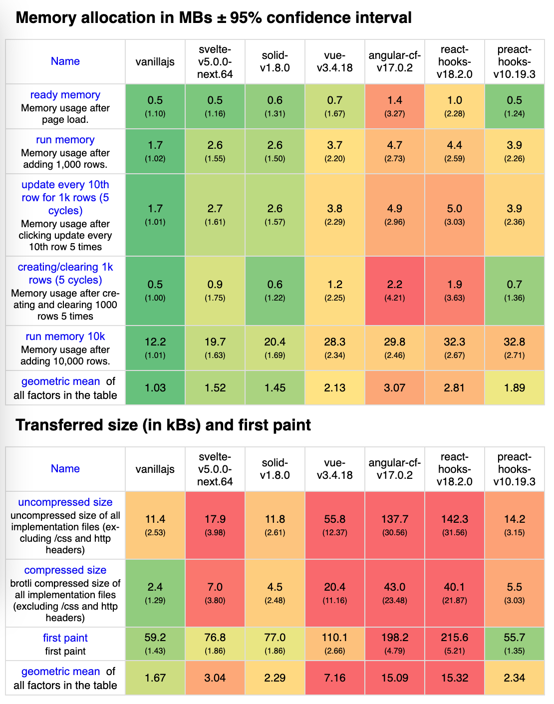
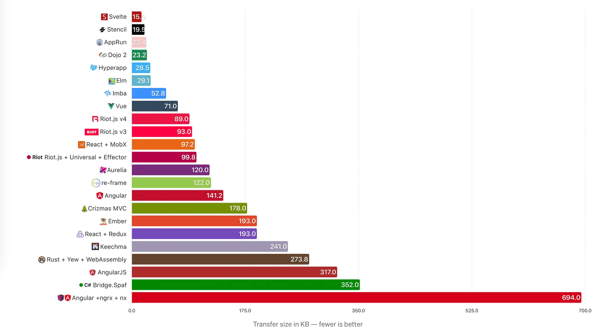
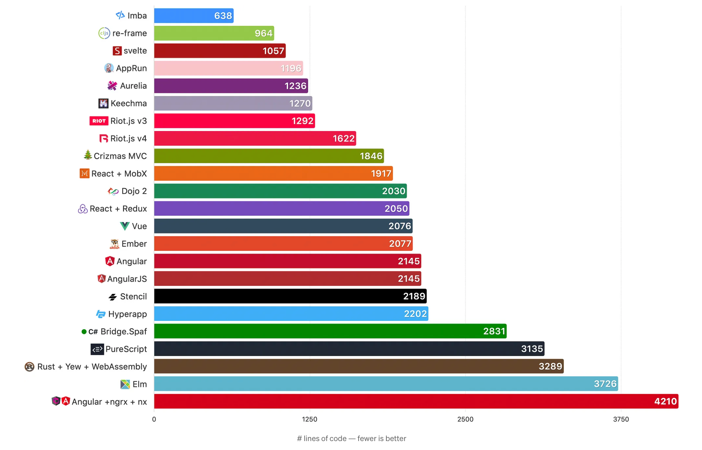
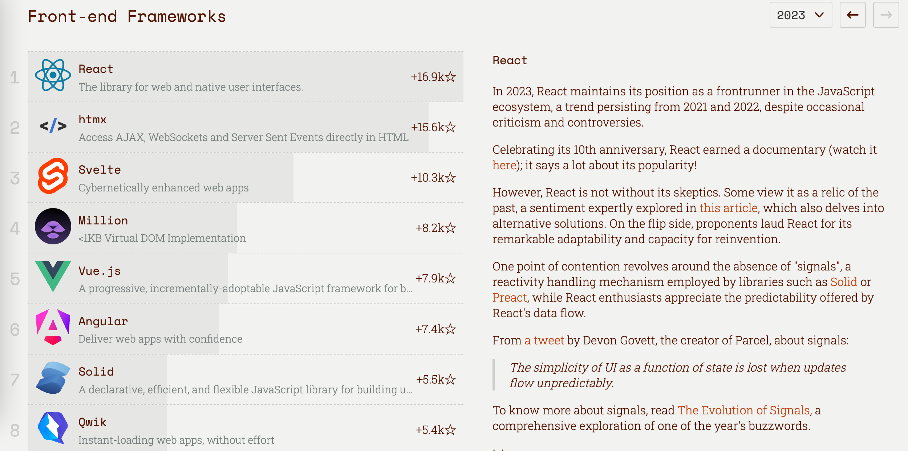
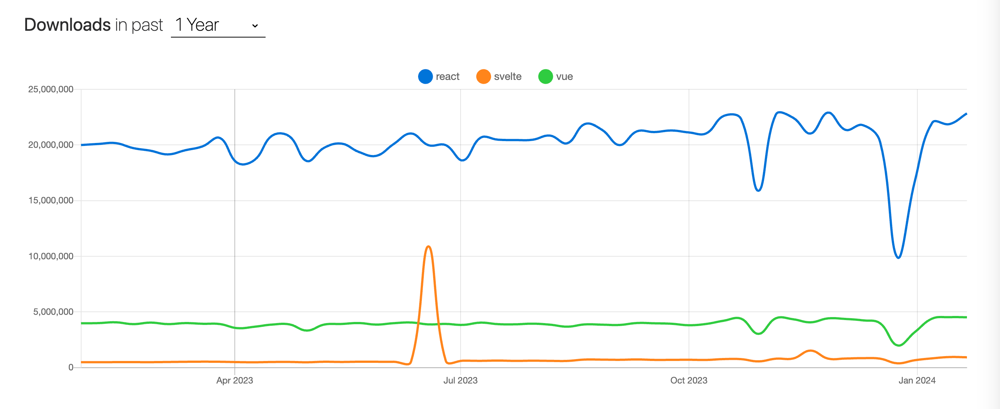

## What

From the beginning of this chapter, I will be with you to understand a different framework from React and Vue Which use virtual DOM as the core, this framework is - [Svelte](https://github.com/sveltejs/svelte).


### Author

Just as we think of [Dan Abramov](https://github.com/gaearon) when we think of `React` and [Evan You](https://github.com/yyx990803) when we think of `Vue`, [Rich Harris](https://github.com/Rich-Harris), the creator of `Svelte`, is also well known in the front-end industry. Some developers may not know who Rich Harris is, but he is the creator of `Rollup`, a packaging tool that is famous with webpack. In addition to `Rollup`, Rich Harris also developed `Reactive`, `Svelte` and many other popular open source works, and actively engaged in open source. `Svelte` is the result of Rich Harris' work at [The Guardian]((https://www.theguardian.com/international)), where he was the interactive editor of the US edition. Before joining the Guardian's UK Interactive team as a front-end developer, he worked as a financial journalist, video journalist and web producer at Citywire.


### History

`Svelte`'s predecessor was [Ractive.js](https://github.com/ractivejs/ractive), released in 2013, which came out at almost the same time as `React`. `Reactive.js` was inspired by a mashup of `Knockout` and `Angular` and a few other things at the time. After a few years of practicing, Rich Harris felt that `Reactive.js` wasn't really the right framework for the mobile internet age, and proposed his new idea for a framework - writing a compiler - with friends at the BrooklynJS meetup.

The first version of `Svelte` was basically `Reactive` with an extra compiler, and because colleagues at The Guardian were using `Reactive` at the time and there was an existing `Reactive` community, the first version of `Svelte` inherited many of the same design features from `Reactive` in order to promote `Svelte` and allow developers who had used `Reactive` to get up to speed quickly. The name `Svelte` was chosen by Rich Harris and his colleagues at The Guardian. Over time, more and more developers became aware of Svelte and became interested in it.

Then, the Svelte development team realized that some of Ractive's design decisions were wrong, so Svelte 2 actually has only a few minor improvements. For example, instead of double braces, single braces are used in the template syntax, so it's more like JSX, and some other similar modifying changes have been made. But other than that, it's pretty much the same as Svelte 1.

Version 3 was a major revision where the Svelte development team began to [rethink](https://svelte.dev/blog/svelte-3-rethinking-reactivity) the core concept of modern UI frameworks: reactivity. By 2019, Svelte has become a mature tool for building out-of-the-box web applications with [TypeScript](https://www.wbolt.com/go?_=bc24523fcaaHR0cHM6Ly93d3cudHlwZXNjcmlwdGxhbmcub3JnLw%3D%3D) support.

After 4 years, Svelte 4 was successfully released in 2023.Svelte 4 served as a transition version, which can be compared to React 17 version between React 16 and 18, and set the stage for the release of the next generation of Svelte (i.e. Svelte 5).


## How

Everything has two sides, when we want to learn a new thing, we need to consider whether this thing is worth learning, to understand its advantages and disadvantages in the current two sides, is a good entry point for the framework is also the same.

### Advantages

#### Performance

By comparing performance on [benchmark](https://github.com/krausest/js-framework-benchmark), we can see that Svelte outperforms front-end frameworks such as `React`, `Vue`, and `Angular` overall, except for being slightly behind `Solid`.


Take another look at Jacek Schae's Lighthouse runs of RealWorld in 2020 for each frame.


Rich Harris' [virtual-dom-is-pure-overhead](https://svelte.dev/blog/virtual-dom-is-pure-overhead) article points out that the virtual DOM is not a free lunch, and that it comes with a performance and memory drain. For a React component to make changes to the value of props, there are three steps:
1. Record the snapshots of the virtual DOM before and after to compare the same nodes
2. Compare all the attributes on that node, old and new, and record the changes
3. Updating the Real DOM

`Svelte`, on the other hand, eliminates the first two steps and updates the DOM directly.`Svelte` is a compiler that does not use a virtual DOM.Svelte.js compiles components at build time, resulting in highly optimized, lightweight JavaScript code. Unlike other frameworks that rely on a virtual DOM at runtime, Svelte.js completely eliminates the need for a virtual DOM, resulting in faster load times, smoother animations, and improved overall Web application performance. This is a very important advantage of Svelte over any other web framework.

#### Size

Again, Jacek Schae's frame volume analysis. Svelte is way ahead in this piece.


Svelte also performs well in terms of the number of lines of code generated by using the framework. Although business code written with Svelte generates more code after compilation, the overall code size is still relatively small for a typical small to medium sized project thanks to less runtime code.


The size shown in [npmtrends](https://npmtrends.com/react-vs-react-dom-vs-svelte-vs-vue), 2.7KB is also way ahead.


Unlike frameworks like React, Vue, Angular, etc., Svelte doesn't need to introduce runtime code at code runtime. The entire framework is compiled away during the build process, leaving optimized JavaScript code that interacts directly with the browser's native API. This is one of the reasons why Svelte has a smaller package size, consumes less memory and has better performance.

In the campaign for the advantages of code size, Evan You has raised a kind of questioning, for which a project was written to [compare Svelte and Vue](https://github.com/yyx990803/vue-svelte-size-analysis).


From the results in the article we can draw the following conclusions:
* The compiled Svelte component code is 70% heavier than the Vue 3 equivalent and 110% heavier in SSR mode
* For applications, the advantage of Svelte over Vue3 gradually decreases when written above the threshold of 19 components (13 components for SSR mode).

So we can come to a point of view, although the code of the Svelte project is smaller. But for large projects, with the advancement of business, business complexity gradually increased, the size of the project file gradually increased, the amount of compiled code increases steeply, the use of Svelte's large project volume is not smaller than React, Vue, etc., so we need to dialectically look at the issue of volume advantage.

#### Learning curve

Svelte's syntax is simple and easy to use, with a small learning curve. Any developer who has learned html, css, and javascript can get started, and Svelte allows users to use a small enough amount of code to accomplish a function, such as the simplest piece of code:
```html
<script>
  let count = 0;
</script>

<button on:click={() => count++}>add</button>
```

Svelte helps developers build user interfaces with minimal effort, improving code readability and reducing the mental load and difficulty of getting started for developers by implementing better reactivity, bindings, and top-level elements, among other things.

#### Attention
The above features of the Svelte have made it a big hit in front-end circles.

Svelte On Github, reaching a Star of 75k+.


On [risingstars](https://risingstars.js.org/2023/en#section-framework)' 2023 report. You can see that Svelte is ranked third among front-end frameworks with rising stars on Github.

  
In [stateofjs](https://2022.stateofjs.com/zh-Hans/libraries/front-end-frameworks/)' 2022 annual report (the results of the 2023 report are not yet available at the time of writing), Svelte is ranked at the top of the list for attention and satisfaction.


### Disadvantages

#### Ecologically
Released only in 2016, Svelte's ecology is clearly not up to the richness of React and Vue.

#### Code redundancy
Compiled code logic redundancy. Some readers may worry that if the complexity of the business logic, resulting in a straight line increase in the size of the code file after compilation, whether it will lead to a certain degree of performance degradation?Github on the relevant developers for this problem to analyze [svelte-it-will-scale](https://github.com/halfnelson/svelte-it-will-scale):


The article states that the inflection point is about 120KB of component source code. That is, at about 120KB, the size advantage of using the compiler over the runtime is gone. In reality, however, with judicious use of code splitting, it is unlikely that a single file will appear to be 120KB.

#### Abstraction
Because `Svelte` doesn't use virtual DOM, it naturally doesn't enjoy many of the benefits of virtual DOM, such as abstracting rendering capabilities on each end based on virtual DOM, and completing functions such as testing based on vdom.

#### Generalization

Take a look at the number of [downloads](https://npmtrends.com/react-vs-svelte-vs-vue) of the three main frameworks over the past year.


The number of downloads is still not comparable to Vue, and compared to the first tier of React, it's even more difficult to look up to it.

## Why

Why should I learn Svelte? Here I briefly give a few reasons:

* Technological Innovation. Today's front-end frameworks are dominated by virtual DOM implementations. Unlike the virtual DOM implementation, Svelte realizes the responsiveness of front-end frameworks with static compilation, which not only opens up our technical horizons, but also enhances the need for us to think and innovate in addition to embracing trends in development.
* Performance. Excellent performance in small to medium sized operations.
* Learning Curve. Easy to get started, low mental load.
* Svelte started late, some of the ecological library is not comprehensive enough, if you happen to be the reader of open source to open good, slightly barren ecological soil is a good time for you to show off.

## Brief Summary

In this chapter we learned:
- Svelte is an emerging front-end framework that differs from React, Vue, and other frameworks that have a virtual DOM at their core; Svelte analyzes the interactions between variables during the static compilation phase, and at its core, a compiler
- Svelte has advantages such as small size and ease of use, while the lack of ecology is one of its disadvantages.
