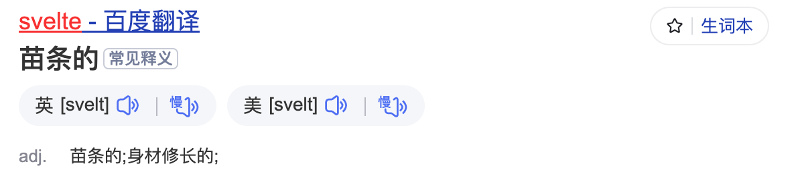

## 是什么

Svelte 苗条的意思

打包体积，鱿鱼西拿vue和svelte对比

不使用virtual dom

劣势：

安装svelte

安装vite时，建议node 版本高点

正如提到React，我们会想到Dan，提起Vue，我们会想到Evan You，而Svelte的作者又是何人？

单说Svelte的作者Rich Harris，我们可能会陌生，但如果我们翻开他的Github主页，便能看到他的另一杰作：Rollup，这款和webpack齐名的打包工具，也是出自这位大神之手。
[svelte](https://github.com/sveltejs/svelte)是来自[rollup](https://github.com/rollup/rollup)的作者 Rich Harris

## 怎么样

Rich Harris 大佬的[virtual-dom-is-pure-overhead](https://svelte.dev/blog/virtual-dom-is-pure-overhead)一文中，指出 virtual dom 并非免费的午餐，它也会带来性能和内存上的消耗。例如一个 HelloWorld 的组件，要把 `props`的值进行修改，需要三个步骤：

1. 先后两次 virtual dom 要记录下来，对相同的节点进行比较
2. 需要把该节点上所有的属性进行对比，记录下变动的内容
3. 更新真实 dom

svelte 则是省去前面两步，直接更新 dom，它是一个 compiler，对已有的组件进行预编译，最终实现的代码。

尤大大发推说 vue3 能够比 svelte 更加快

npm trends

https://npmtrends.com/svelte

https://npmtrends.com/react-vs-svelte-vs-vue

github 

https://github.com/sveltejs/svelte 

74k

stateofjs

https://2022.stateofjs.com/zh-Hans/libraries/front-end-frameworks/

优点

高性能

产物体积小

心智负担低

丰富的特性

上手简单

灵活

缺点

编译产物代码冗余

生态不够成熟

介绍一章

## 为什么

不同于虚拟dom的实现方式，开拓我们的视野。

下一章：安装和使用

官网  

repl  https://svelte.dev/repl/hello-world?version=3.53.1

## 小结
我们从什么是Svelte，Svelte和React、Vue相比有什么优劣势，以及我们为什么需要学习Svelte这三个方面，初步认识了Svelte这股前端框架新势力。在下一篇章，我们将了解如何安装svelte相关的开发环境和简单的上手使用它。
