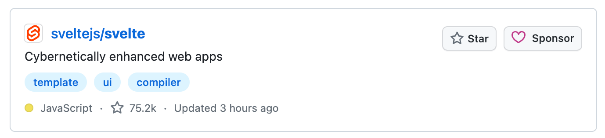
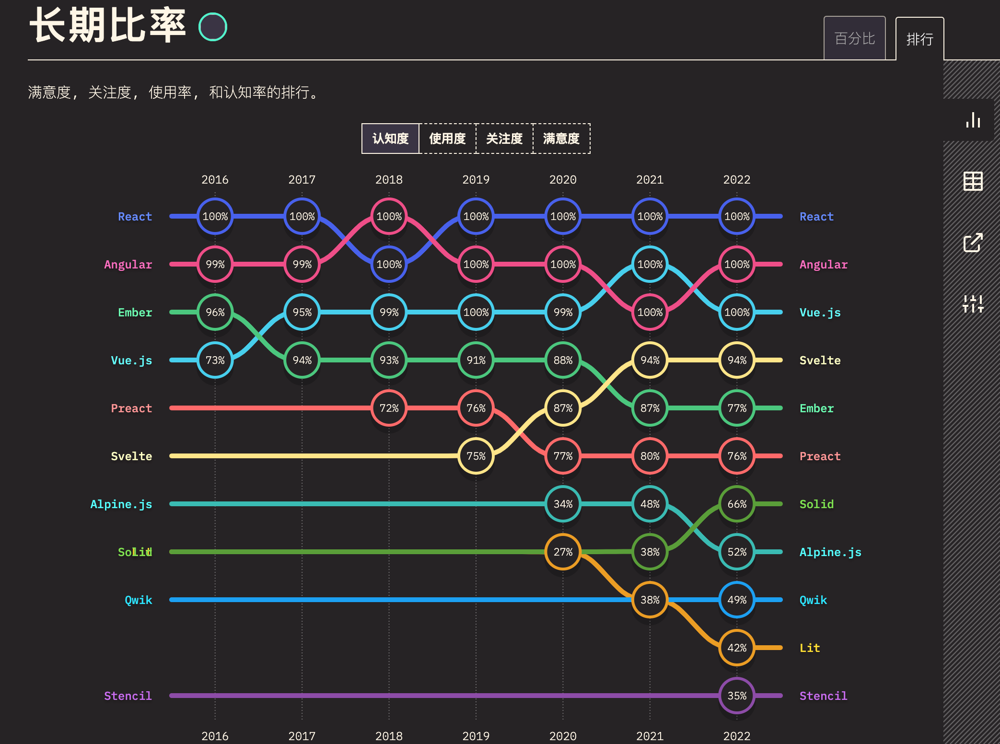
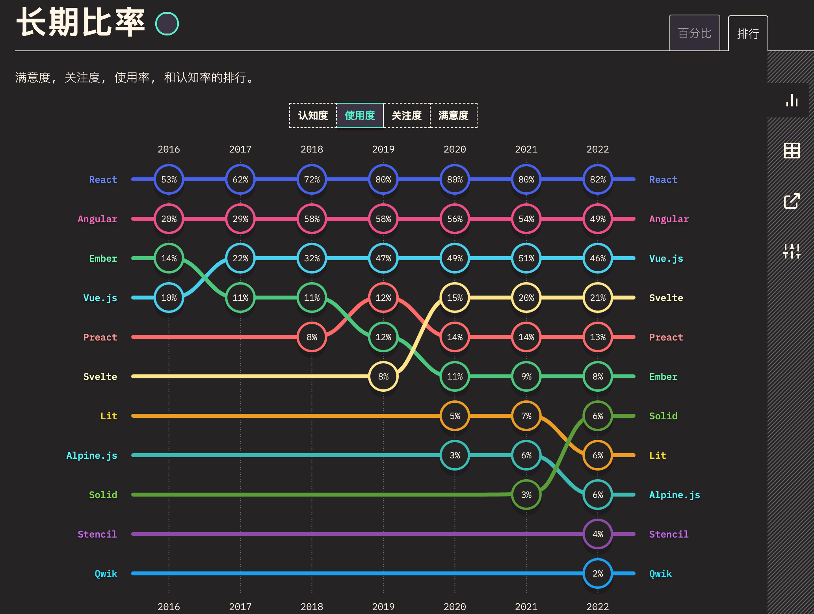
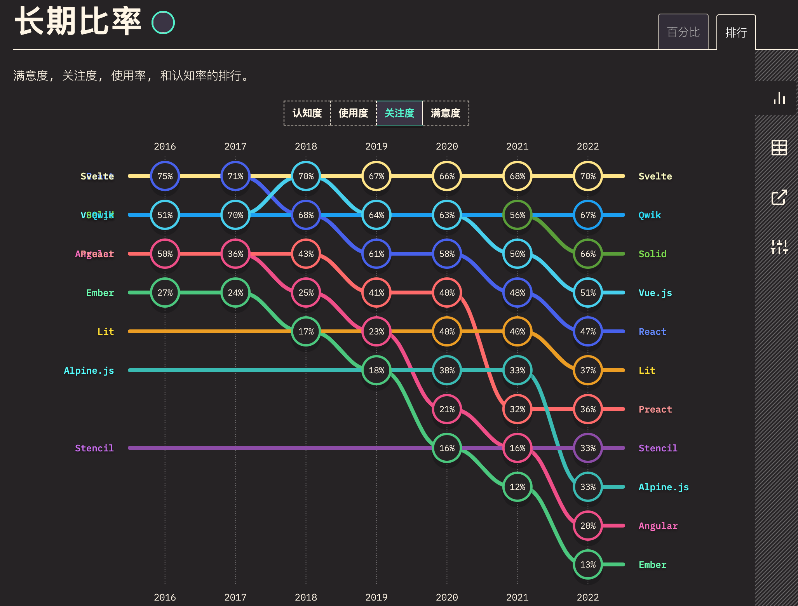
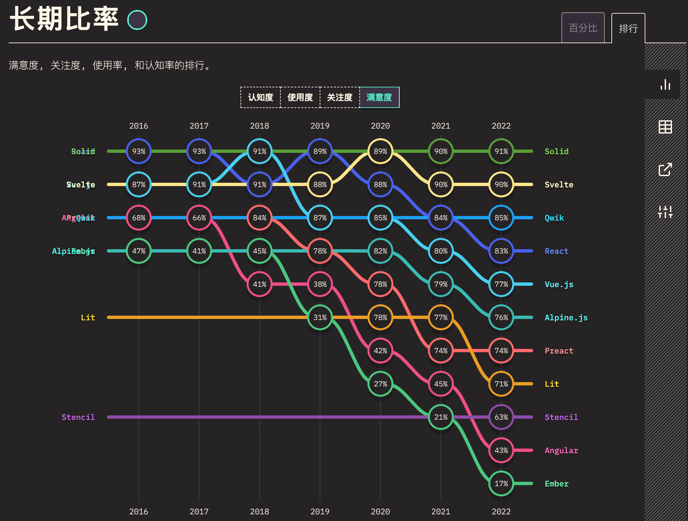

# 背景

## 是什么

Svelte在英文中具有“苗条的，身材修长的”意思，对于刚接触的开发者来说，非常容易与Java的Servlet搞混。Servlet是运行在Web服务器中的小型Java程序，其是JavaWeb的三大组件之一，而Svelte则是一个前端UI框架，更准确地说，Svelte是一个编译器。  

Svelte 苗条的意思

可不是java servlet哦

Svelte起源于[Ractive.js](https://github.com/ractivejs/ractive)，它是由Svelte的创建者自己开发的。Rich Harris。Svelte的设计是为了继承Ractive。2016年发布的Svelte的第一个版本基本上是Ractive，但有一个编译器。

Svelte “这个名字是由Rich Harris和他在《卫报》的同事们选择的。随着时间的推移，越来越多的开发者开始了解Svelte并对其产生兴趣。到2019年，Svelte已经成为一个成熟的工具，可以构建具有[TypeScript](https://www.wbolt.com/go?_=bc24523fcaaHR0cHM6Ly93d3cudHlwZXNjcmlwdGxhbmcub3JnLw%3D%3D)支持的开箱即用的Web应用程序。

Svelte在构建时将你的应用转换为理想的JavaScript，而不是在运行时解释你的应用代码

打包体积，鱿鱼西拿vue和svelte对比
https://github.com/yyx990803/vue-svelte-size-analysis

优势：

**没有虚拟DOM**。Svelte是一个编译器，不使用虚拟DOM，Svelte是一个编译器，在构建时就知道你的应用程序中的东西可能会发生变化，而不是等待在运行时做这些工作。这是Svelte相对于其他任何Web框架的一个非常重要的优势

**更少的模板** ：减少你必须编写的代码量是Svelte的一个明确目标。Svelte帮助你以最小的代价构建用户界面，通过实现更好的反应性、绑定和顶层元素等，提高了代码的可读性，我们将在本文后面讨论这些问题

容易上手，学习曲线小。如果学过html,css,javascript，即可上手

劣势：

生态不够大

编译后的代码逻辑冗余

https://svelte.dev/blog/virtual-dom-is-pure-overhead

安装svelte

安装vite时，建议node 版本高点

正如提到React，我们会想到Dan，提起Vue，我们会想到Evan You，而Svelte的作者又是何人？

单说Svelte的作者Rich Harris，我们可能会陌生，但如果我们翻开他的Github主页，便能看到他的另一杰作：Rollup，这款和webpack齐名的打包工具，也是出自这位大神之手。
[svelte](https://github.com/sveltejs/svelte)是来自[rollup](https://github.com/rollup/rollup)的作者 Rich Harris

## 怎么样

Rich Harris 大佬的[virtual-dom-is-pure-overhead](https://svelte.dev/blog/virtual-dom-is-pure-overhead)一文中，指出 virtual dom 并非免费的午餐，它也会带来性能和内存上的消耗。例如一个 HelloWorld 的组件，要把 `props`的值进行修改，需要三个步骤：

1. 先后两次 virtual dom 要记录下来，对相同的节点进行比较
2. 需要把该节点上所有的属性进行对比，记录下变动的内容
3. 更新真实 dom

svelte 则是省去前面两步，直接更新 dom，它是一个 compiler，对已有的组件进行预编译，最终实现的代码。

尤大大发推说 vue3 能够比 svelte 更加快

npm trends

https://npmtrends.com/svelte

https://npmtrends.com/react-vs-svelte-vs-vue

github

https://github.com/sveltejs/svelte

74k

stateofjs

https://2022.stateofjs.com/zh-Hans/libraries/front-end-frameworks/

优点

高性能

产物体积小

心智负担低

丰富的特性

上手简单

灵活

缺点

编译产物代码冗余

生态不够成熟

路由：svelte-spa-router, svelte-routing

状态管理： svelte/store

ssr: sveltekit

文档：svelte-docs

UI: svelte material ui, shadcn-ui

介绍一章

## 为什么

不同于虚拟dom的实现方式，开拓我们的视野。

下一章：安装和使用

官网

repl  https://svelte.dev/repl/hello-world?version=3.53.1

## 小结

我们从什么是Svelte，Svelte和React、Vue相比有什么优劣势，以及我们为什么需要学习Svelte这三个方面，初步认识了Svelte这股前端框架新势力。在下一篇章，我们将了解如何安装svelte相关的开发环境和简单的上手使用它。
