## Install

Before installing `Svelte`, we recommend you to make the following things done:

- Install [Node.js](https://nodejs.org/en) environment.
- Install Code Editor（[VSCode](https://code.visualstudio.com/) recommended）
- Know something about Html, Css and JavaScript

### Installed via Vite（recommended）

After we have installed the Node environment, we can use [Vite](https://vitejs.dev/) to install. Because the use of Vite has a higher version of Node.js requirements, so I recommend that you install a relatively new Node.js. currently I use the version for `v18.15.0`.

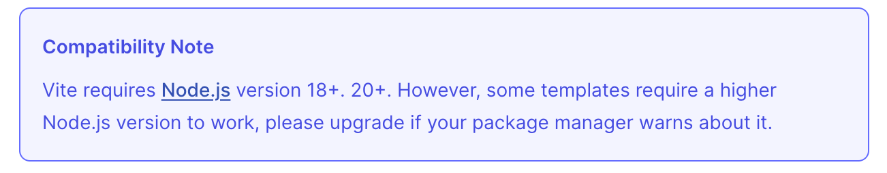

If there are different projects relying on different versions of Node, I recommend installing a node versioning tool such as [nvm](https://github.com/nvm-sh/nvm).

  
Everything is ready, the installation command is as follows, which we execute in steps：
```bash
npm create vite@latest my-svelte-project -- --template svelte
cd my-svelte-project
npm install
```

First of all when we hit the line `npm create vite@latest my-svelte-project -- --template svelte` in the command line tool, wait for a moment and we can see:
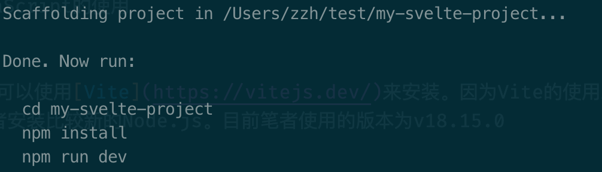

The next step is to execute each of them as shown in the figure, execute `cd my-svelte-project` and `npm install`.

`cd my-svelte-project` takes you to the directory **my-svelte-project** that we just created successfully. Once in the directory, we run `npm install` to install all the dependencies needed by the project.

If you are better at using Typescript, then you can replace `--template svelte` with `--template svelte-ts`.

What if we execute the next line command（Can you tell the difference?）
```bash
npm create vite@latest my-svelte-app
```

That's right, we don't specify a template, that is, we don't specify which front-end library's template to use, so we get the following interface:

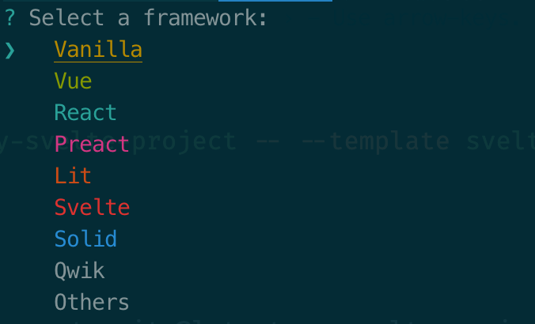

Since we are learning Svelte, then we can use the up and down arrow keys on the keyboard to check the Svelte option and enter;

In the next step, we select Javascript, and again, if you have mastered Typescript, you can select Typescript.

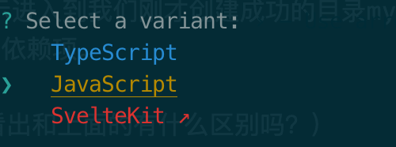

Enter and you get the same prompt you just did.

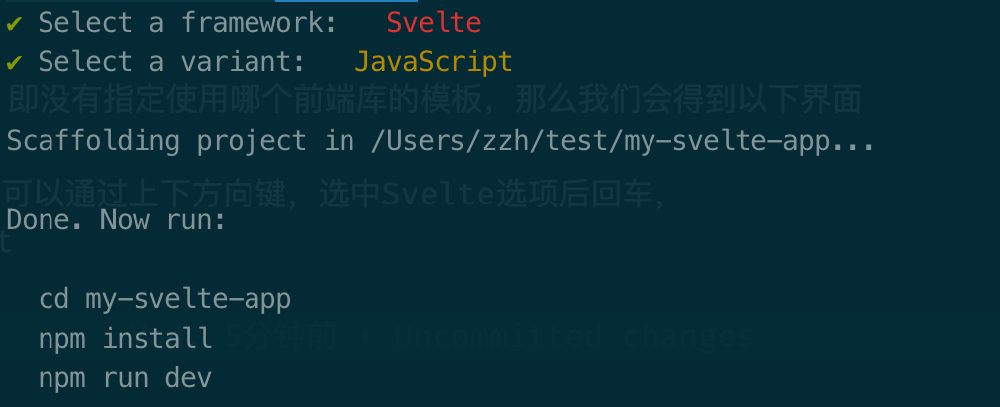

Again cd to the project directory and then execute install dependencies. After the `npm install` dependencies are installed, we run `npm run dev` to get our first Svelte project up and running.

In the code of the Github repository [create-vite](https://github.com/vitejs/vite/tree/main/packages/create-vite), we were able to find that what we downloaded is the file in the corresponding directory.

Visit `http://localhost:5173` and if you can see the same page as I did, then congratulations, you've successfully taken the first step!

### Original Installation

The original installation referred to here is actually the installation prompt that appears on the [home page](https://svelte.dev/) of the official website

```bash
npm create svelte@latest my-app
cd my-app
npm install
npm run dev -- --open
```

Run `npm create svelte@latest my-app`, it tells us to install `create-svelte`:
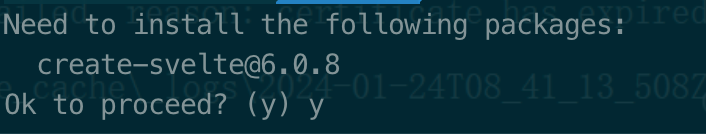

As you can see, the officially provided template is related to SvelteKit.

[SvelteKit](https://kit.svelte.dev/) is a framework for building web applications using Svelte.

The relationship between `Svelte` and `SvelteKit` is the same as `React` and `Next.js`, or `Vue` and `Nuxt.js`. The former is a UI framework, while the latter is a web framework written based on the former. Therefore, the official website recommended installation that is through the SvelteKit to install.

Let's choose one of the templates at random and enter to confirm.

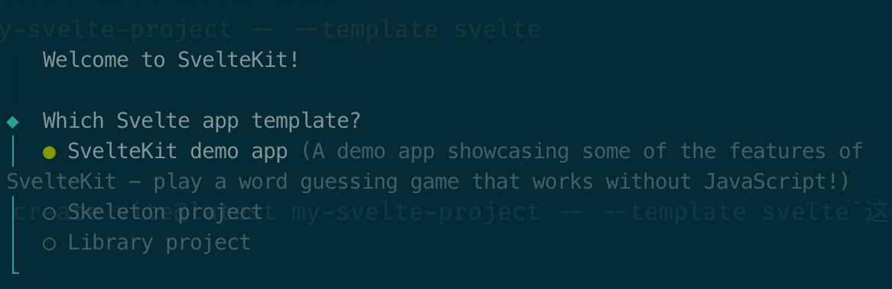

Later will continue to provide some options, according to their own preferences after the selection, we can see the following interface:
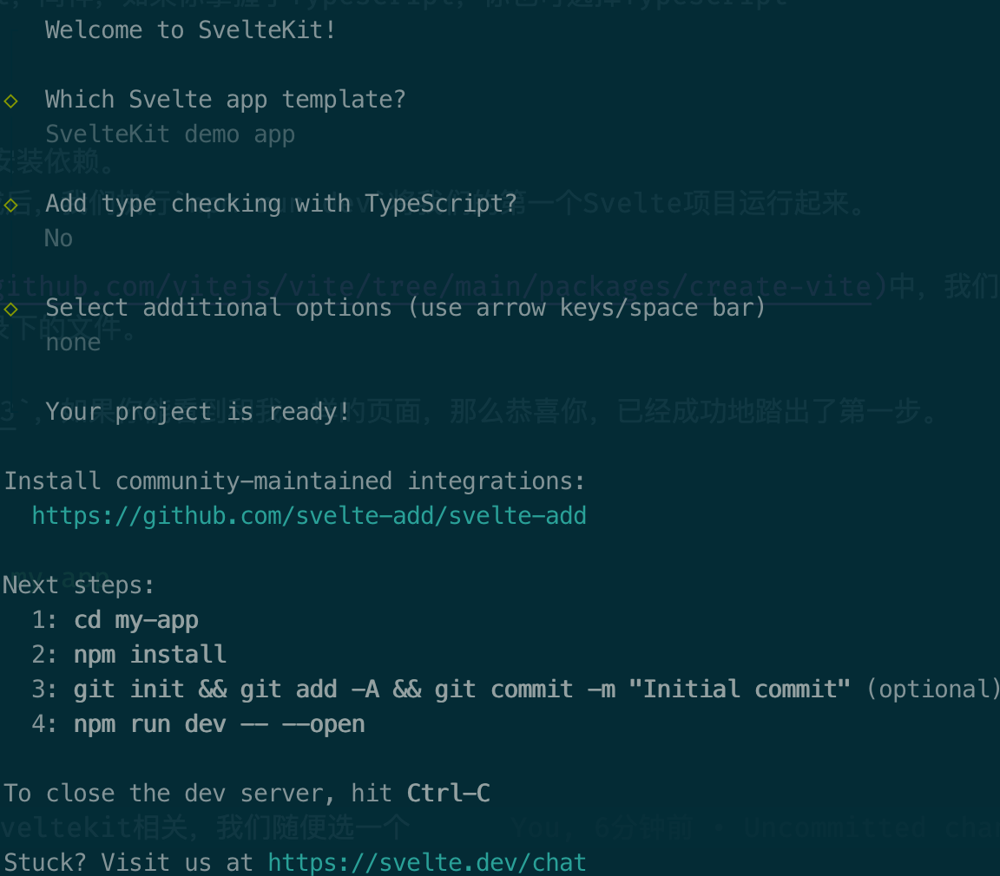


### Customized Installation

If we don't want to use Vite or SvelteKit, or if we don't have the means to use them, then we need to integrate Svelte with our own environment. In our daily development, we usually use [webpack](https://webpack.js.org/) or [Rollup](https://rollupjs.org/) as our project's module management packaging tool. Therefore, I will introduce these two environments, how to build the Svelte environment.

Here I assume that after creating a webpack demo project or rollup demo project, in the directory we can have the following file:
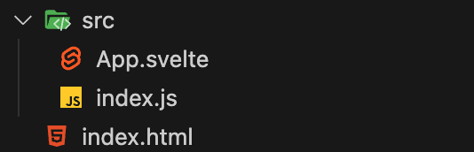

The content within App.svelte is arbitrary and conforms to the Svelte file format;

The content of the index.js file is as follows:
```javascript
import App from './App.svelte';

new App({
  target: document.querySelector('#root')
});
```

The content of index.html file is as follows:
```html
<!DOCTYPE html>
<html lang="en">
<head>
<meta charset="UTF-8">
<meta name="viewport" content="width=device-width, initial-scale=1.0">
<title>Document</title>
</head>

<body>
  <div id="root"></div>
  <script src="./dist/index.js"></script>
  </body>
</html>
```
#### webpack

Another key to using Svelte in webpack, in addition to the essential svelte, is to install the [svelte-loader](https://github.com/sveltejs/svelte-loader)

```bash
mkdir webpack-demo
cd webpack-demo

npm init -y
npm install webpack webpack-cli -D
npm install babel-loader @babel/core -D
npm install svelte svelte-loader
```

After installing the dependencies, modify the webpack configuration `webpack.config.js`:
```javascript
const path = require("path");

module.exports = {
  entry: "./src/index.js",
  output: {
    filename: "index.js",
    path: path.resolve(__dirname, "dist"),
  },
  resolve: {
    extensions: [".js", ".svelte"],
    conditionNames: ["svelte"],
  },
  module: {
    rules: [
      {
        test: /\.(js|ts)$/,
        use: [{ loader: "babel-loader" }],
      },
      {
        test: /\.(svelte)$/,
        use: [
          "babel-loader",
          {
            loader: "svelte-loader",
          },
        ],
      },
    ],
  },
};
```
If there is a build command in the `scripts` in `package.json`, try `npm run build`; or execute the `webpack` command directly from the command line, you can see that there is a package directory dist, and index.html references the index.js file in the dist directory. If you open index.html directly in your browser, you can see the content defined in App.svelte. 

#### Rollup

The key in Rollup is [rollup-plugin-svelte](https://github.com/sveltejs/rollup-plugin-svelte).

```javascript
import svelte from 'rollup-plugin-svelte';
import resolve from '@rollup/plugin-node-resolve';

export default {
  input: './src/index.js',
  output: {
    file: 'dist/index.js',
    format: 'umd'
  },
  plugins: [
    svelte(),
    resolve({
      browser: true,
      exportConditions: ['svelte'],
      extensions: ['.svelte']
    })
  ],
};
```
  
## Usage

After the above series of installation instruction, I believe that you have already discovered how to use Svelte in projects. First of all, within the index.html file, provide a node that can be mounted, which is usually as follows (you can define it by yourself):
```html
<div id="root"></div>
```

In the entry file `index.js` or `main.js`, define the following content:
```javascript
import App from './App.svelte';

new App({
  target: document.querySelector('#root')
})
```

App.svelte is our initial svelte file, and we mount the contents written in App.svelte to the defined root node.

Svelte files have `.svelte` as the file extension within the file.

```html
<script>
// logic goes here
</script>

<style>
/* styles go here */
</style>

<!-- markup (zero or more items) goes here -->
```
All three sections — script, styles and markup — are optional.

### VsCode Extension

We open the installed project in Vscode and add the Svelte extension. The extension provides us with syntax highlighting and smart detection when we write svelte files.

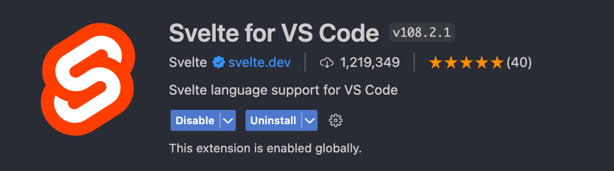

### REPL

REPL (Read-Eval-Print Loop), is a simple interactive programming environment. If you just want to simply learn the syntax of Svelte, but also feel that building a Svelte environment project is too much trouble, that Svelte official website for developers and learners to provide a [REPL](https://svelte.dev/repl/hello-world?version=4.2.11) environment, in which we can quickly write a test of Svelte's various api syntax!

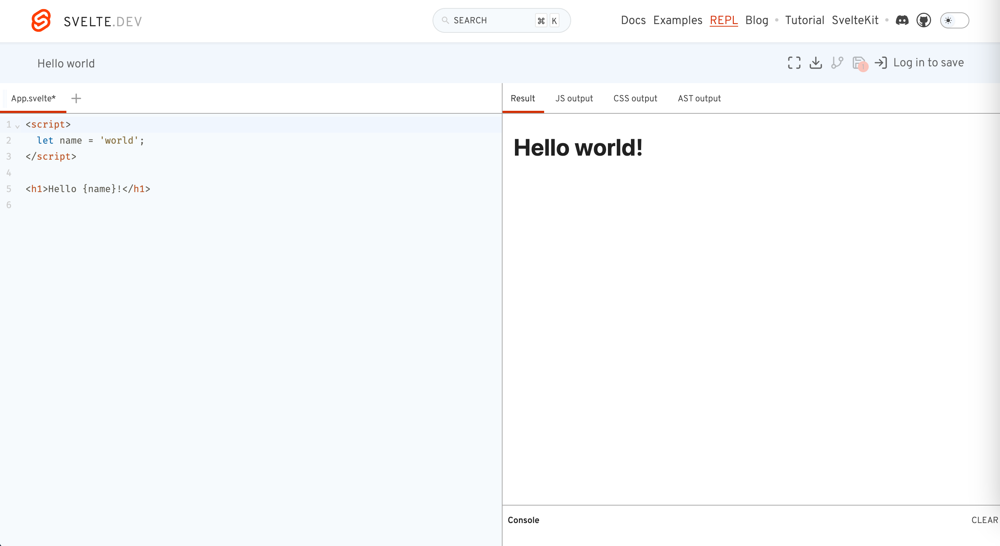

Go for a try!

## Brief Summary

In this chapter we have learned:
- Installing Svelte with Vite
- Installing Svelte with SvelteKit
- Running Svelte in a webpack project
- Running Svelte in a Rollup project
- Svelte file's content format
- Some Svelte tools: VsCode plugin, REPL runtime environment, etc.
