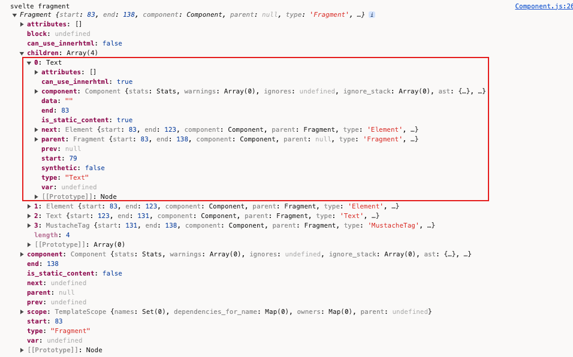

## 安装

工欲善其事，必先利其器。在安装 `Svelte`之前，笔者假定读者已完成了以下操作：

* 安装环境Node.js
* 安装代码编辑器（推荐VSCode）
* 掌握或了解Html、Css及JavaScript的使用

### 原始安装

### Vite安装（推荐）

在我们安装好Node环境后，我们可以使用[Vite](https://vitejs.dev/)来安装。因为Vite的使用对Node.js有较高的版本要求，所以笔者建议读者安装比较新的Node.js。目前笔者使用的版本为v18.15.0


如果存在不同的项目依赖不同版本的Node的情况，笔者推荐安装node版本管理工具，如[nvm](https://github.com/nvm-sh/nvm)

```shell
npm create vite@latest my-svelte-project -- --template svelte
cd my-svelte-project
npm install
```

当我们在命令行工具中敲下 `npm create vite@latest my-svelte-project -- --template svelte`这一行时，稍等片刻，便会出现如下图：

接下来便是按照图上所示，分别执行 `cd my-svelte-project`和 `npm install`。
`cd my-svelte-project`表示进入到我们刚才创建成功的目录my-svelte-project。进入目录后，我们执行 `npm install`安装项目所需要的所有依赖项。
如果笔者比较擅长使用Typescript，那可以将 `--template svelte`替换为 `--template svelte-ts`。

如果我们执行的是下面这行（能看出和上面的有什么区别吗？）

```shell
npm create vite@latest my-svelte-app
```

没错，我们没有指定template，即没有指定使用哪个前端库的模板，那么我们会得到以下界面

因为我们是学习Svelte，那我们可以通过上下方向键，选中Svelte选项后回车，
在下一步，我们选择Javascript，同样，如果你掌握了Typescript，你也可选择Typescript

回车后，同样能得到刚才的提示。

同样是cd到项目目录，然后执行安装依赖。
在 `npm install`依赖安装完成后，我们执行 `npm run dev`将我们的第一个Svelte项目运行起来。

在[create-vite](https://github.com/vitejs/vite/tree/main/packages/create-vite)中，我们能够发现我们下载的内容就是对应目录下的文件。

访问 `http://localhost:5173`，如果你能看到和我一样的页面，那么恭喜你，已经成功地踏出了第一步。

### Sveltekit安装

repl的使用
什么是repl

文件以 `.svelte`作为文件后缀名，在文件内，与vue的template语法相似

```html
<script>
    //代码文件
</script>

<style>
    /* 样式文件*/
</style>
<!-- 此处一般放置元素标签（多个或者为空） -->
```

文件内的script,style和html内容三个部分均为可选的，顺序也没有要求。关于script和style的一些差异，我们会在后续的章节中陆续讲解。

todo展示入口文件， new App()挂载。

vscode 添加extension

另一种方式是使用sveltekit
todo 演示图

### 原始安装

这里说的原始安装，其实就是[官网](https://svelte.dev/)首页中出现的安装提示。

```shell
npm create svelte@latest my-app
cd my-app
npm install
npm run dev -- --open
```


我们可以看到官网提供的模板和Sveltekit相关，我们随便选一个

后面仍有一些选项，按照自己的喜好选择完后，我们可以看到如下界面：


### 自定义安装

#### webpack

svelte-loader


```
mkdir webpack-demo
cd webpack-demo
npm init -y
npm install webpack webpack-cli -D
npm install babel-loader @babel/core -D
npm install svelte svelte-loader
```

主要是修改webpack配置，webpack.config.js

https://github.com/sveltejs/svelte-loader

```javascript
const path = require("path");

module.exports = {
  entry: "./src/index.js",
  output: {
    filename: "index.js",
    path: path.resolve(__dirname, "dist"),
  },
  resolve: {
    extensions: [".js", ".svelte"],
    conditionNames: ["svelte"],
  },
  module: {
    rules: [
      {
        test: /\.(js|ts)$/,
        use: [{ loader: "babel-loader" }],
      },
      {
        test: /\.(svelte)$/,
        use: [
          "babel-loader",
          {
            loader: "svelte-loader",
          },
        ],
      },
    ],
  },
};

```

#### rollup

tod rollup-plugin-svelte

## 使用

我们用Vscode把上一步骤中安装好的项目打开，然后我们先安装Svelte扩展。


## 小结

在本章中，我们学习了svelte常见的几种安装方式，以及相关的辅助工具，比如vscode extension和repl。
