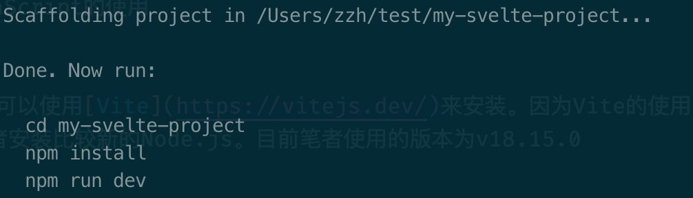
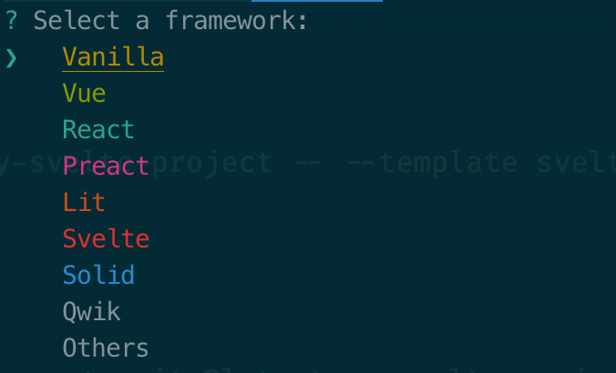

## 安装

工欲善其事，必先利其器。在安装 `Svelte`之前，笔者假定读者已完成了以下操作：

- 安装环境[Node.js](https://nodejs.org/en)

- 安装代码编辑器（推荐[VSCode](https://code.visualstudio.com/)）

- 掌握或了解Html、Css及JavaScript的使用

### Vite安装（推荐）

在我们安装好Node环境后，我们可以使用[Vite](https://vitejs.dev/)来安装。因为Vite的使用对Node.js有较高的版本要求，所以笔者建议读者安装比较新的Node.js。目前笔者使用的版本为v18.15.0


如果存在不同的项目依赖不同版本的Node的情况，笔者推荐安装node版本管理工具，如[nvm](https://github.com/nvm-sh/nvm)。

  
准备就绪后，安装命令如下，我们分步骤执行：
```bash
npm create vite@latest my-svelte-project -- --template svelte
cd my-svelte-project
npm install
```

首先当我们在命令行工具中敲下 `npm create vite@latest my-svelte-project -- --template svelte`这一行时，稍等片刻，便会出现如下图：



接着便是按照图上所示，分别执行 `cd my-svelte-project`和 `npm install`。

`cd my-svelte-project`表示进入到我们刚才创建成功的目录my-svelte-project。
进入目录后，我们执行 `npm install`安装项目所需要的所有依赖项。

如果笔者比较擅长使用Typescript，那可以将 `--template svelte`替换为 `--template svelte-ts`。

  
如果我们执行的是下面这行（能看出和上面的有什么区别吗？）
```bash
npm create vite@latest my-svelte-app
```

没错，我们没有指定template，即没有指定使用哪个前端库的模板，那么我们会得到以下界面



因为我们是学习Svelte，那我们可以通过键盘的上下方向键，选中Svelte选项后回车；

在下一步，我们选择Javascript，同样，如果你掌握了Typescript，你也可选择Typescript。


回车后，同样能得到刚才的提示。


同样是cd到项目目录，然后执行安装依赖。
在 `npm install`依赖安装完成后，我们执行 `npm run dev`将我们的第一个Svelte项目运行起来。

在Github仓库[create-vite](https://github.com/vitejs/vite/tree/main/packages/create-vite)的代码中，我们能够发现我们下载的内容就是对应目录下的文件。

访问 `http://localhost:5173`，如果你能看到和我一样的页面，那么恭喜你，已经成功地踏出了第一步。

### 原始安装

这里说的原始安装，其实就是[官网](https://svelte.dev/)首页中出现的安装提示。

```bash
npm create svelte@latest my-app
cd my-app
npm install
npm run dev -- --open
```

敲下`npm create svelte@latest my-app`命令后，首先会要求我们安装`create-svelte`


可以看到，官方提供的模板和SvelteKit有关。

[SvelteKit](https://kit.svelte.dev/)是使用 Svelte 来构建 Web 应用的框架。

`Svelte`与`SvelteKit`之间的关系，相当于`React`与`Next.js`，或者`Vue`与 `Nuxt.js`。前者是UI框架，而后者则是基于前者来编写的Web框架。因此官网推荐的安装即是通过SvelteKit来安装。

我们随便选择其中一个模板后，回车确认。


后面会继续提供一些选项，按照自己的喜好选择完后，我们可以看到如下界面：


### 自定义安装
假如我们不想使用Vite或者SvelteKit，亦或者我们没有条件使用这两者，那就需要我们自己集成Svelte的环境。在日常开发时，我们通常会使用[webpack](https://webpack.js.org/)或者[Rollup](https://rollupjs.org/)作为我们项目的模块管理打包工具。因此笔者会分别介绍这两种环境下，如何搭建Svelte的运行环境。

这里笔者假设读者朋友们，在创建了webpack demo项目或者rollup demo项目后，在目录下都能有以下文件：


App.svelte内内容随意，符合Svelte文件格式即可；

index.js的文件内容如下：
```javascript
import App from './App.svelte';

new App({
  target: document.querySelector('#root')
});
```

index.html的内容如下：
```html
<!DOCTYPE html>
<html lang="en">
<head>
<meta charset="UTF-8">
<meta name="viewport" content="width=device-width, initial-scale=1.0">
<title>Document</title>
</head>

<body>
  <div id="root"></div>
  <script src="./dist/index.js"></script>
  </body>
</html>
```
#### webpack

在webpack中使用Svelte，除了必不可少的svelte，另外一个关键则是安装[svelte-loader](https://github.com/sveltejs/svelte-loader)

```bash
mkdir webpack-demo
cd webpack-demo

npm init -y
npm install webpack webpack-cli -D
npm install babel-loader @babel/core -D
npm install svelte svelte-loader
```

安装完依赖后，修改webpack配置`webpack.config.js`：
```javascript
const path = require("path");

module.exports = {
  entry: "./src/index.js",
  output: {
    filename: "index.js",
    path: path.resolve(__dirname, "dist"),
  },
  resolve: {
    extensions: [".js", ".svelte"],
    conditionNames: ["svelte"],
  },
  module: {
    rules: [
      {
        test: /\.(js|ts)$/,
        use: [{ loader: "babel-loader" }],
      },
      {
        test: /\.(svelte)$/,
        use: [
          "babel-loader",
          {
            loader: "svelte-loader",
          },
        ],
      },
    ],
  },
};
```

如果在package.json中的scripts里约定了build命令，试着`npm run build`一下；亦或者直接在命令行中执行`webpack`命令，可以看到有个打包目录dist，index.html里引用的则是dist目录下的index.js文件。直接用浏览器打开index.html，便能看到定义在App.svelte里的内容。至于如何用`npm run dev`跑起来，以及支持热更新等操作，就留给读者朋友们自行探索了。

#### Rollup

在Rollup中的关键则是[rollup-plugin-svelte](https://github.com/sveltejs/rollup-plugin-svelte)

```javascript
import svelte from 'rollup-plugin-svelte';
import resolve from '@rollup/plugin-node-resolve';

export default {
  input: './src/index.js',
  output: {
    file: 'dist/index.js',
    format: 'umd'
  },
  plugins: [
    svelte(),
    resolve({
      browser: true,
      exportConditions: ['svelte'],
      extensions: ['.svelte']
    })
  ],
};
```
  
## 使用

经过上述一系列的安装教学，相信读者朋友们早就发现了如何在项目中使用Svelte。
首先在index.html文件内，提供一个可以挂载的节点，通常如下（读者可自行定义）：
```html
<div id="root"></div>
```

在入口文件index.js或main.js中，如下定义：
```javascript
import App from './App.svelte';

new App({
  target: document.querySelector('#root')
})
```

App.svelte则是我们初始的svelte文件，我们把App.svelte里写好的内容挂载到定义好的root节点上。

Svelte的文件以 `.svelte`作为文件后缀名，在文件内，与vue的template语法相似。

```html
<script>
//代码文件
</script>

<style>
/* 样式文件*/
</style>

<!-- 此处一般放置元素标签（多个或者为空） -->
```
文件内的script，style和html内容三个部分均为可选的，顺序也没有要求。

### VsCode Extension

我们用Vscode把安装好的项目打开，然后添加Svelte扩展。插件在我们编写svelte文件时，为我们提供语法高亮和智能检测。


### REPL

REPL（Read-Eval-Print Loop），是一个简单的交互式的编程环境。如果读者朋友们只是想简单学习下Svelte的语法，又觉得搭建一个Svelte环境项目太麻烦，那Svelte官网为开发者和学习者们提供了[REPL](https://svelte.dev/repl/hello-world?version=4.2.11)环境，在上面我们可以快速编写试验Svelte的各种api语法。


快速上手试试吧！

## 小结

在本章中，我们先学习了svelte常见的几种安装方式，我们可以通过vite、sveltekit来直接安装，也可以通过webpack和rollup等模块管理工具来自定义安装。接着我们了解了Svelte文件的内容格式，以及在使用Svelte时的一些辅助工具，如vscode插件和repl环境。