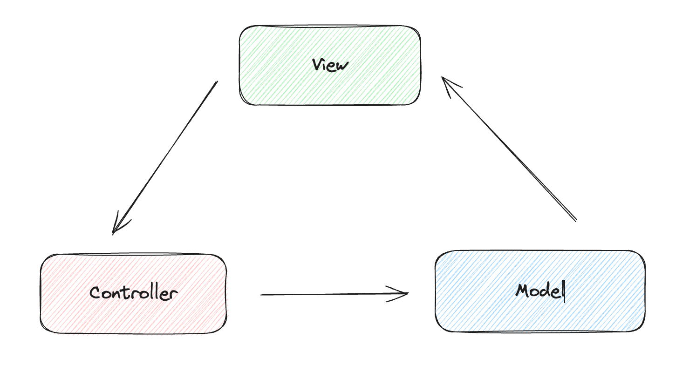
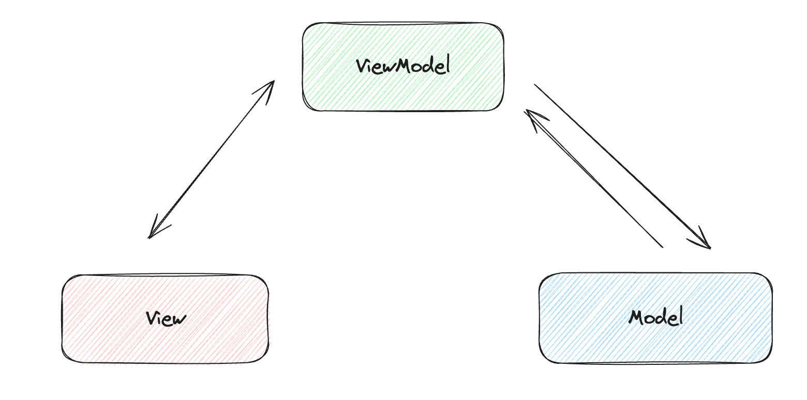

## Data Binding

Data is the most important aspect of page presentation.

In React, we can declare and store variables in `this.state`, or manipulate them with `useState`; in Vue, we can put the data in the return value of the `data()` method, or declare variables with `ref` or `reactive`; and in Svelte, we declare variables directly in script tags as normal. In Svelte, we declare variables in script tags and wrap them in html tags with `{}`.

```html
<script>
  let count = 0;
</script>

<div>count: {count}</div>
```
In addition to displaying in the tag content, we can manipulate variables in the tag attributes, for example, we often need to determine the dynamic style class.

```html
<script>
  let tab = 'hello'
</script>

<span class={tab === 'hello' ? 'active' : ''}>color text</span>

<style>
.active {
  color: blue;
}
</style>
```

## Update data

How do we update declared variables? It's also very easy:
```html
<script>
  let count = 0;

  const updateCount = () => {
    if (count >= 5) {
      return;
    }
    count++;
    setTimeout(() => {
      updateCount();
    }, 1000);
  };

  updateCount();
</script>

<span>count: {count}</span>
```

In the above code, I declared a timed update method, if you execute the above code, you can see the count in the page updated by seconds. From the code we can see that there is no difference between declaring and using methods and the way we normally write vanilla js.


### Update array and object

If you have used Vue, then you must know that in Vue, some Hack operations are required for array updates. What about in Svelte?

Here's an example:
```html
<script>
  let arr = [1];

  const updateArray = () => {
    arr.push(1);
    console.log(arr);
  };
</script>

<button on:click={updateArray}>update array</button>
<p>array: {arr.join(",")}</p>
```
In this example, if we click on the button, we see that the contents of the array are not updated at all on the page display, yet the console prints out the contents of the array after the push as normal.

Yes, updating arrays in Svelte also requires some finesse.

> Because Svelte's reactivity is triggered by assignments, using array methods like `push` and `splice` won't automatically cause updates.

This is a quote from the [official website](https://learn.svelte.dev/tutorial/updating-arrays-and-objects): the reactivity of Svelte is triggered by assignment statements. This sentence already points out the key problem: "assignment statement". So we can modify it as follows:

```diff
const updateArray = () => {
  arr.push(1);
  console.log(arr);
+ arr = arr;
}
```

or like this：
```javascript
const updateArray = () => {
  arr = [...arr, 1]
}
```

For some other methods of manipulating arrays, we can replace them along these lines
```javascript
const pushNumber = () => {
  arr = [...arr, lastNumber];
}
const popNumber = () => {
  arr = [...arr.slice(0, arr.length - 1)]
}
const unshiftNumber = () => {
  arr = [firstNumber, ...arr];
}
const shiftNumber = () => {
  arr = [...arr.slice(1, arr.length)]
}
```

There is also one thing to keep in mind when objects are updated, as an example:
```html
<script>
  let obj = {
    foo: {
      bar: "hello",
    },
  };
  let bar = obj.foo.bar;
  bar = "world";
</script>

<p>object: {obj.foo.bar}</p>
```

On the page, we still see hello, and to update it, we need to write it as follows:
```html
<script>
  let obj = {
    foo: {
      bar: "hello",
    },
  };
  obj.foo.bar = "world";
  // let bar = obj.foo.bar;
  // bar = 'world'
</script>

<p>object: {obj.foo.bar}</p>
```

The official website also carefully gives us a hint: **the name of the updated variable must appear on the left hand side of the assignment**

### Event Handlers

Each framework has its own unique way of writing event listeners. In Svelte, event listeners are bound in the following format.

```javascript
on:eventname|modifiers={handler}
```

`eventname` like `click`、`mousemove`、`keydown` and etc。

`modifiers`is an optional option with some options like：
* `preventDefault`: calls `event.preventDefault()` before running the handler. Useful for client-side form handling.
* `stopPropagation`: calls `event.stopPropagation()`, preventing the event reaching the next element.
* `passive`: improves scrolling performance on touch/wheel events
* `capture`: fires the handler during the capture phase instead of the bubbling phase
* `once`: remove the handler after the first time it runs

For example, let's write one of the most common event bindings that binds a data declaration to an event listener:

```html
<script>
  let count = 0;
  const updateCount = () => {
    count++;
  };
</script>

<div>
  count: {count}
  <button on:click={updateCount}>+1</button>
</div>
```

In the above code, We're not using event modifiers for now, let's see another example:
```html
<script>
  let count = 0;
  const sayHello = () => {
    console.log("hello");
  };

  const updateCount = () => {
    count++;
  };
</script>

<div on:click={sayHello}>
  count: {count}
  <button on:click={updateCount}>+1</button>
</div>
```

If we click on the button at this point, we will see the hello string being printed in the console. One way to stop the event from bubbling is to set `stopPropagation` in the listener method.
```javascript
const updateCount = (event) => {
  event.stopPropagation();
  count++;
}
```

Another way is to use the modifiers we just described so that we don't have to deal with the bubbling logic in our business code:

```html
<button on:click|stopPropagation={updateCount}>+1</button>
```

Event modifiers support chained calls:
```javascript
on:eventname|modifier1|modifier2|modifier3={handler}
```

Sometimes we need to get the event object in the event binding, and the way to get the event object is also divided into cases, one is the event does not accept other parameters:
```html
<script>
  const handleClick = (event) => {
    console.log(event);
  };
</script>

<button on:click={handleClick}>btn</button>
```

In the other case, we need to have the method take other parameters in addition to the event object:
```html
<script>
  const handleClick = (event, param) => {
    console.log(event, param);
  };
</script>

<button on:click={(e) => handleClick(e, "hello")}>btn</button>
```

This inline event binding can also be written as follows, with the main difference being highlighting support under certain editors:
```html
<button on:click="{e => handleClick(e, 'hello')}">btn</button>
```

## MVVM

Currently common software development architecture patterns are MVC, MVP, MVVM.   
Among them MVC (Model-View-Controller) is divided into three parts:

- M (Model): responsible for managing the application data
- V (View): mainly corresponds to the application of the user interaction page
- C (Controller): receives the data passed in from the user interface and calls the corresponding controller to update the data. When the data is updated, it will trigger the update of the page.



The other architectural pattern, MVVM, is also divided into three parts:
- M (Model)
- V (View)
- VM (ViewModel): Responsible for exposing the model's data and commands so that the view can use them.



Bidirectional data binding is where data changes drive view updates, and view updates trigger data changes; both Vue and Svelte support bidirectional data binding. In Vue, we use `v-model` to implement two-way data binding. Since Svelte is so convenient to manipulate the data, you may think that we write this code directly, and then Svelte can handle two-way binding for us.

```html
<script>
  let str = ''
</script>

<div>
  <input type="text" value={str} />
  <span>input value: {str}</span>
</div>
```

Unfortunately, the above code doesn't handle two-way binding for us, if we want to do two-way binding, we need to write it as below:
```html
<script>
  let str = ''
</script>

<div>
  <input type="text" bind:value={str} />
  <span>input value: {str}</span>
</div>
```

Notice the difference? That's right, we need to use `bind`, which has other uses besides two-way binding, and which we'll continue to use in later chapters.

#### Two-way binding in form component

```html
<script>
  let value = '';
</script>

<input type="text" value={value} />
<p>value: {value}</p>
```

If we follow the logic of Vue and write the above code directly, we will find that when we fill in the content in the input box, the output is not followed on the page.

```html
<script>
  let value = '';
</script>

<input type="text" value={value} on:input="{e => value = e.target.value}" />
<p>value: {value}</span>
```

##### `input[type="text"]`
```html
<script>
  let value = '';
</script>

<input bind:value={value} />
<p>value: {value}</p>
```

##### `input[type="number"]`
```html
<script>
  let value = 1;
</script>

<input type="number" bind:value={value} />
<input type="range" bind:value={value} min={1} max={5} />
```

##### `input[type="checkbox"]`
```html
<script>
  let checked = false;
</script>

<label>
  <input type="checkbox" bind:checked={checked} />
  select: {checked}
</label>
```

##### `input[type="radio"]`
```html
<script>
  let radioValue = "";
</script>

<label>
  <input type="radio" bind:group={radioValue} value={1} />
  1
</label>

<label>
  <input type="radio" bind:group={radioValue} value={2} />
  2
</label>

<label>
  <input type="radio" bind:group={radioValue} value={3} />
  3
</label>

<p>chosen: {radioValue}</p>
```

##### `bind:group`
```html
<script>
  let checkboxValue = [];
</script>

<label>
  <input type="checkbox" bind:group={checkboxValue} value={1} />
  1
</label>

<label>
  <input type="checkbox" bind:group={checkboxValue} value={2} />
  2
</label>

<label>
  <input type="checkbox" bind:group={checkboxValue} value={3} />
  3
</label>

<p>chosen: {checkboxValue.join(',')}</p>
```

##### `select`
```html
<script>
  let selectValue;
</script>

<select bind:value={selectValue}>
	<option value={1}>1</option>
	<option value={2}>2</option>
	<option value={3}>3</option>
</select>

<p>chosen: {selectValue}</p>
```

In addition to the components listed above that enable bidirectional binding, Svelte also supports bidirectional binding of many elements, such as textarea, media tags video, audio, etc.

#### Two-way binding in custom component
```html
<script>
  export let value;
</script>

<input bind:value={value} />
```
Here we encounter a new keyword, `export`, which we'll cover in the next chapter.

```html
<script>
  import Child from './Chapter00_Child.svelte';
  let fatherValue = ''
</script>

<Child bind:value={fatherValue} />
<input bind:value={fatherValue} />
```

## Brief Summary

In this chapter we have learned:
- Declaring data and updating data in Svelte
- Tips for updating arrays, objects in Svelte
- How to use event listeners in Svelte, and the use of modifiers in listening to events.
- Using `bind` in Svelte to implement two-way data binding for form type components.

