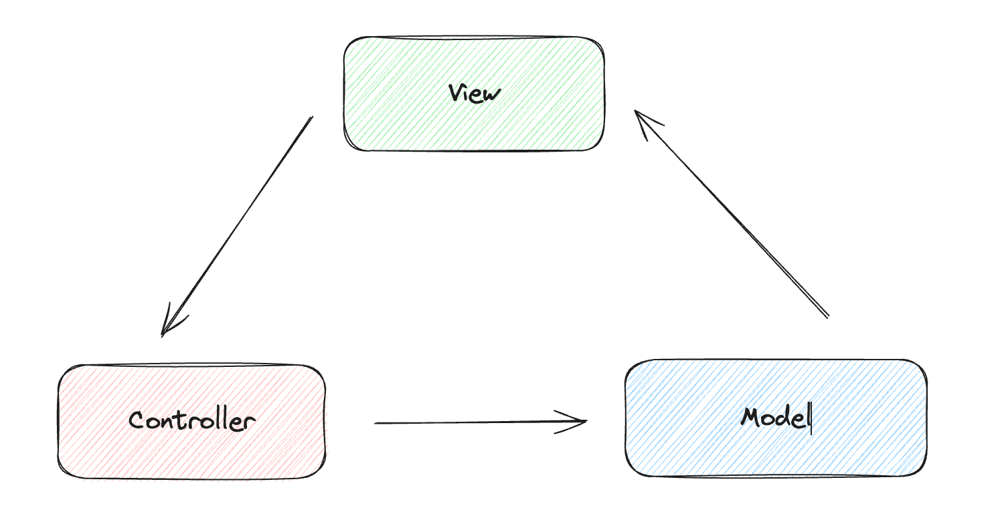
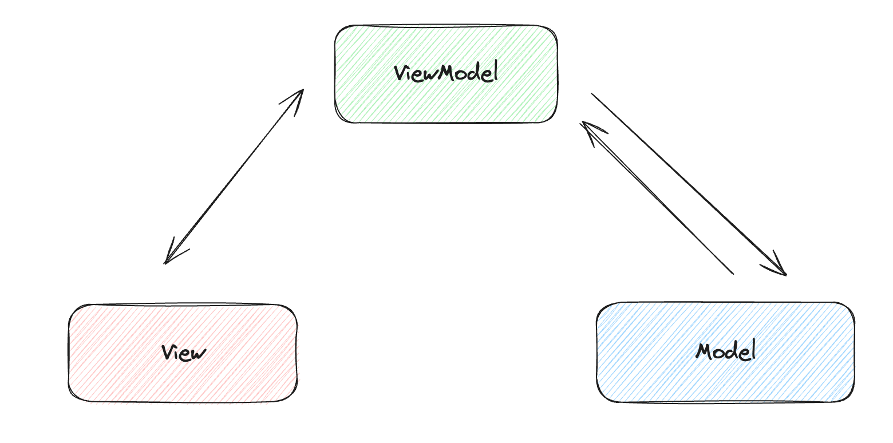

## 数据绑定

数据是页面展示中最重要的一环。

在React中，我们通过 `this.state`来对变量进行声明存储，亦或是通过 `useState`来操作；在Vue中，我们可以把数据放到 `data()`方法的返回值里，亦或者使用 `ref`、`reactive`来声明变量；而在Svelte中，我们则直接在script标签中正常声明，然后再在html标签里使用 `{}`来包裹变量。

### 直接声明

```html
<script>
  let count = 0;
</script>

<div>count: {count}</div>
```

### 属性里使用

除了在标签内容里显示，我们可以在标签属性里进行操作变量，比如我们常需要判断动态的样式class。

```html
<script>
  let tab = 'hello'
</script>

<span class={tab === 'hello' ? 'active' : ''}>color text</span>

<style>
.active {
  color: blue;
}
</style>
```

在Svelte中，active的class还有缩写，我们在介绍样式的章节会继续说明。

## 数据更新

我们在上面只演示了如何声明和使用变量，但变量最为关键的特性便是——“变”，我们要如何更新声明的变量呢？

其实也是很简单，就像普通的操作一样。
```html
<script>
  let count = 0;

  const updateCount = () => {
    if (count >= 5) {
      return;
    }
    count++;
    setTimeout(() => {
      updateCount();
    }, 1000);
  };

  updateCount();
</script>

<span>count: {count}</span>
```

在上述代码中，笔者声明了一个定时更新的方法，如果你执行上述代码，便能看到count在页面中按秒更新。从上述代码的写法中我们可以看到，声明和使用方法的方式和我们正常写原生js没有差别。


### 数组、对象的更新

如果你使用过Vue，那你一定知道在Vue中，对于数组的更新需要一些Hack操作。那在Svelte中呢？
这里笔者举个例子：
```html
<script>
  let arr = [1];

  const updateArray = () => {
    arr.push(1);
    console.log(arr);
  };
</script>

<button on:click={updateArray}>update array</button>
<p>数组：{arr.join(",")}</p>
```
在这个例子中，如果我们点击按钮，会发现数组的内容在页面展示上完全没有更新，然而控制台里却能正常的打印出push后的数组内容。

是的，在Svelte中，数组的更新同样需要一些技巧。

> Because Svelte's reactivity is triggered by assignments, using array methods like `push` and `splice` won't automatically cause updates.

这是[官网](https://learn.svelte.dev/tutorial/updating-arrays-and-objects)里的一句话：Svelte的反应性是由赋值语句触发的。这句话已经点出了关键问题：“赋值语句”。因此我们可以如下修改：

```diff
const updateArray = () => {
  arr.push(1);
  console.log(arr);
+ arr = arr;
}
```
亦或者改成：
```javascript
const updateArray = () => {
  arr = [...arr, 1]
}
```

对于其他一些数组的操作方法，我们可以按此思路来替换：
```javascript
const pushNumber = () => {
  arr = [...arr, lastNumber];
}
const popNumber = () => {
  arr = [...arr.slice(0, arr.length - 1)]
}
const unshiftNumber = () => {
  arr = [firstNumber, ...arr];
}
const shiftNumber = () => {
  arr = [...arr.slice(1, arr.length)]
}
```

对象在更新时也有一点需要注意，举个例子：
```html
<script>
  let obj = {
    foo: {
      bar: "hello",
    },
  };
  let bar = obj.foo.bar;
  bar = "world";
</script>

<p>对象：{obj.foo.bar}</p>
```

在页面上，我们看到的仍是hello，要想更新，需要如下写法：
```html
<script>
  let obj = {
    foo: {
      bar: "hello",
    },
  };
  obj.foo.bar = "world";
  // let bar = obj.foo.bar;
  // bar = 'world'
</script>

<p>对象：{obj.foo.bar}</p>
```

官网也细心地给了我们提示：**被更新的变量的名称必须出现在赋值语句的左侧**

### 事件绑定

每个框架都有自己独特的事件监听的写法，在Svelte中，按照以下格式进行事件监听的绑定。

```javascript
on:eventname|modifiers={handler}
```

`eventname`是事件名，比如我们常用的 `click`、`mousemove`、`keydown`等等。

`modifiers`修饰符，这是一个可选项，有以下选项：
* `preventDefault` ：在程序运行之前调用 `event.preventDefault()`
* `stopPropagation` ：调用 `event.stopPropagation()`, 防止事件到达下一个标签
* `passive` ：改善了touch/wheel事件的滚动表现
* `capture`：表示在 capture阶段而不是bubbling触发其程序
* `once`：表示事件只执行一次

比如我们写一个最常见的事件绑定，把数据声明和事件监听绑定起来：

```html
<script>
  let count = 0;
  const updateCount = () => {
    count++;
  };
</script>

<div>
  count: {count}
  <button on:click={updateCount}>+1</button>
</div>
```

在上述例子中，我们暂时没有用到事件修饰符。笔者再举个例子：
```html
<script>
  let count = 0;
  const sayHello = () => {
    console.log("hello");
  };

  const updateCount = () => {
    count++;
  };
</script>

<div on:click={sayHello}>
  count: {count}
  <button on:click={updateCount}>+1</button>
</div>
```

此时如果我们点击button，那在控制台便会看到hello字符串也在打印出来。
想要阻止事件冒泡，一种方式是在监听的方法里设置 `stopPropagation`。
```javascript
const updateCount = (event) => {
  event.stopPropagation();
  count++;
}
```

另一种方式就是使用刚才我们介绍的修饰符，这样我们就不用在我们的业务代码里处理冒泡逻辑。

```html
<button on:click|stopPropagation={updateCount}>+1</button>
```

事件修饰符支持链式调用：
```javascript
on:eventname|modifier1|modifier2|modifier3={handler}
```

有时我们在事件绑定中需要拿到event对象，而拿event对象的写法也分情况，一种是事件没有接受其他参数：
```html
<script>
  const handleClick = (event) => {
    console.log(event);
  };
</script>

<button on:click={handleClick}>btn</button>
```

而另一种情况是，我们除了拿event对象，还需要让方法接收其他参数：
```html
<script>
  const handleClick = (event, param) => {
    console.log(event, param);
  };
</script>

<button on:click={(e) => handleClick(e, "hello")}>btn</button>
```

这种内联的事件绑定还能按如下写，主要区别是在某些编辑器下的高亮显示支持：
```html
<button on:click="{e => handleClick(e, 'hello')}">btn</button>
```

## 双向绑定

目前常见的软件开发架构模式有MVC、MVP、MVVM。
其中MVC（Model-View-Controller）分为三部分：
- 模型（Model）：负责管理应用程序的数据
- 视图（View）：主要对应应用程序中的用户交互页面
- 控制器（Controller）：接收从用户界面传递进来的数据，调用相应的控制器来更新数据。数据更新后，会触发页面的更新。



而另一种架构模式MVVM，同样分为三部分：
- 模型（Model）
- 视图（View）
- 视图模型（ViewModel）：负责暴露模型的数据和命令，以便视图可以使用它们。



双向绑定是数据变化驱动视图更新，视图更新触发数据变化。Vue和Svelte都支持双向数据绑定。在Vue中，我们通过 `v-model`实现双向数据绑定，聪明的你可能会想，既然Svelte操作数据这么方便，那我直接写下这一段代码，那Svelte便能帮我们处理双向绑定了。

```html
<script>
  let str = ''
</script>

<div>
  <input type="text" value={str} />
  <span>input value: {str}</span>
</div>
```

很遗憾，上述代码并没有帮我们处理双向绑定，如果我们想要做双向绑定，需要按下列写法：
```html
<script>
  let str = ''
</script>

<div>
  <input type="text" bind:value={str} />
  <span>input value: {str}</span>
</div>
```

注意到区别了吗？没错，我们需要使用到 `bind`。bind除了做双向绑定外，还有其他用处，后面的章节我们会继续使用到这个指令。

#### 表单组件的双向绑定

```html
<script>
  let value = '';
</script>

<input type="text" value={value} />
<p>value: {value}</p>
```

如果我们按照vue的逻辑直接写出上述代码，会发现当我们在输入框内填写内容时，页面上并没有跟随输出。

```html
<script>
  let value = '';
</script>

<input type="text" value={value} on:input="{e => value = e.target.value}" />
<p>value: {value}</span>
```

要实现双向的数据绑定，需要用到bind指令
##### `input[type="text"]`
```html
<script>
  let value = '';
</script>

<input bind:value={value} />
<p>value: {value}</p>
```

##### `input[type="number"]`
```html
<script>
  let value = 1;
</script>

<input type="number" bind:value={value} />
<input type="range" bind:value={value} min={1} max={5} />
```

##### `input[type="checkbox"]`
```html
<script>
  let checked = false;
</script>

<label>
  <input type="checkbox" bind:checked={checked} />
  select: {checked}
</label>
```

##### `input[type="radio"]`
```html
<script>
  let radioValue = "";
</script>

<label>
  <input type="radio" bind:group={radioValue} value={1} />
  1
</label>

<label>
  <input type="radio" bind:group={radioValue} value={2} />
  2
</label>

<label>
  <input type="radio" bind:group={radioValue} value={3} />
  3
</label>

<p>选择的是：{radioValue}</p>
```

##### `bind:group`
```html
<script>
  let checkboxValue = [];
</script>

<label>
  <input type="checkbox" bind:group={checkboxValue} value={1} />
  1
</label>

<label>
  <input type="checkbox" bind:group={checkboxValue} value={2} />
  2
</label>

<label>
  <input type="checkbox" bind:group={checkboxValue} value={3} />
  3
</label>

<p>选择的是：{checkboxValue.join(',')}</p>
```

##### `select`
```html
<script>
  let selectValue;
</script>

<select bind:value={selectValue}>
	<option value={1}>1</option>
	<option value={2}>2</option>
	<option value={3}>3</option>
</select>

<p>选择的是：{selectValue}</p>
```

除了以上列举的组件能够实现双向绑定外，Svelte还支持了许多元素的双向绑定，如textarea，媒体标签video、audio等等，读者们可深入探索。

#### 自定义组件的双向绑定
```html
<script>
  export let value;
</script>

<input bind:value={value} />
```
在这里我们遇到了一个新的关键字`export`，我们会在下一章讲解。

```html
<script>
  import Child from './Chapter00_Child.svelte';
  let fatherValue = ''
</script>

<Child bind:value={fatherValue} />
<input bind:value={fatherValue} />
```

## 小结

这一章我们了解了如何在svelte文件中声明数据和更新数据，同时了解了如何在svelte文件中使用自定义函数和如何在Svelte中实现双向数据绑定。