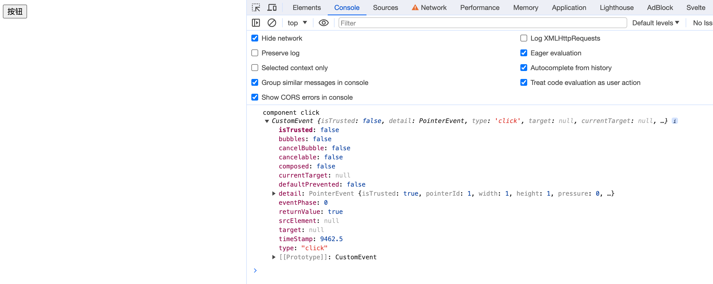
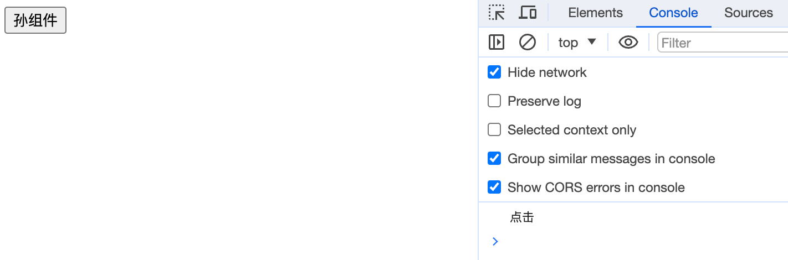

## Component-Based Development

In project development, we usually promote component-based development. The so-called component-based , that is, to extract some common logic to a file assembled into a component , when the page is useful to the function , directly call the component can be. That component in addition to maintaining their own internal logic , but also need to accept external data passed in to realize the dynamism and flexibility of the component .

## Props

Take the simplest example of todolist, we can show the list encapsulated into a component, the internal logic of the component is to show the list of data, while the external is to receive the list of data. After the page references the component, it can display different data by passing todo list or done list. The value passing is the key link here.

When we pass a value from a parent page to a child page or a component, we usually pass the state of the parent page or the method of the parent page, how to pass these two in Svelte?

### When prop is data

At the end of the previous chapter, we encountered the following code:
```javascript
<script>
  export let value;
</script>
```

We normally declare a variable in the page by `let value`;, when we add the `export` keyword in front, it is equivalent to the variable declaration marked as an external export properties, that is*prop*, in the external references to the file, you can pass the value through the form of property assignment.

```html
<!-- Father .svelte -->
<script>
  import Child from './Child.svelte';
  let value = ''
</script>

<Child value={value} />
```

#### Default Props
When we export externally within the component in the form `export let value;`:
```html
<script>
  export let value;
</script>

<div>child: {value || ''}</div>
```

while referencing this component without passing a value.


Not only will we be prompted in VsCode that we need to pass a value, but we'll also be warned accordingly in the Chrome console.

In our development, we often provide a default value for some pass parameter, because some components use a fixed state in most cases, and change the state only when encountering special circumstances. For example, in the UI component library, similar to the Alert component, there are four states: success, info, warning, and error, and most of the alerts we use are normal message alerts, that is, the info state, so you can set a default info state inside the component.

After setting a default value for prop, we can eliminate the alerts in the above demo. In Svelte, setting a default value for prop is simply a matter of assigning the value during the initial declaration.

```html
<script>
  export let value = 'hello svelte';
</script>
```

#### Keywords
In JavaScript, there are special words called keywords that are used in the syntactic structure of the programming language with specific meanings. These words cannot be used as variables.

In Svelte, we can set some keywords to prop when we set prop.

As a very common example, we define a component that has its own class style within the component, however we need the component to support customization of the class style attribute externally by the user, where the user is able to manipulate it in a form like `<Component class={} />`, and `class` is a keyword used in js to define a class. Therefore, we can write it as follows:

```html
<script> 
  let className;
  export { className as class };
</script>
```
  
#### const

Here's a question: Can a variable declared by export be a method?

```html
<!-- Child.svelte -->
<script>
  export let onChange = () => {return;}
</script>

<button on:click={onChange}>change</button>
```

```html
<script>
  import Child from './Child.svelte';
  let count = 0;
  const onChange = () => {
    count = Math.random();
  }
</script>

<Child onChange={onChange} />
<span>{count}</span>
```

The answer is YES!


Noteice that when we are exporting `function` methods, `class` classes, and `const` constants, the exported prop is immutable.

Still using the above exported method as an example, change the content of Child.svelte to the following:

```html
<script>
  export function onChange() {
    console.log('no change');
  }
</script>

<button on:click={onChange}>change</button>
```


So we want to set a variable or method to prop, try to use let or var declarations.

## Function Called

### createEventDispatcher

We learned in the previous chapter that event binding for html tags uses `on:[eventName]`. Similarly, we use this form if we want to do event binding for a component.

```html
<Component on:[eventName]={eventHandler} />
```
When binding events in a component, `eventName` needs to be implemented inside the component.

The internal implementation is as follows:
```javascript
import { createEventDispatcher } from 'svelte';

const dispatch = createEventDispatcher();

dispatch(eventName, data)
```
The first parameter of dispatch is the event name, the second parameter is used to pass data externally, if there are more than one parameter to be passed, set the second parameter to an object, in this object to store more than one data passed externally.

Here's an example:
```html
<script>
  import { createEventDispatcher } from 'svelte';

  const dispatch = createEventDispatcher();

  const onClick = (e) => {
    dispatch("click", e);
  }
</script>

<button on:click={onClick}>按钮</button>
```

```html
<script>
  import Component from './Component.svelte';

  const onClick = (e) => {
    console.log('component click', e);
  }
</script>

<Component on:click={onClick} />
```

When we click on it, we are able to see that the console outputs a data of type `CustomEvent`:



Normally we would think that the event parameter printed out in the page is the one we pass in the child component. However, I would like to draw your attention to the fact that when you use `createEventDispatcher` to pass data in Svelte, the data is put in `event.detail`. If you look closely at the above image, you will see that there is a detail key in the printed data, which holds the data passed from the subcomponent.

Perhaps the above example is not intuitive enough, so let's modify our subcomponent passes:
```html
<script>
  import { createEventDispatcher } from 'svelte';

  const dispatch = createEventDispatcher();

  const onClick = (e) => {
    dispatch("click", 123);
  }

</script>

<button on:click={onClick}>按钮</button>
```


Note that `createEventDispatcher` must be created when the component is initialized, i.e. in the top-level script scope, otherwise it will report an error.

```javascript
<script>
  import { createEventDispatcher } from 'svelte';

  const onClick = (e) => {
    const dispatch = createEventDispatcher();
    dispatch("click", 123);
  }

</script>

<button on:click={onClick}>按钮</button>
```


We can briefly look at the implementation of `createEventDispatcher`:
```javascript
export function createEventDispatcher() {
  const component = get_current_component();
  return (type, detail, { cancelable = false } = {}) => {
    const callbacks = component.$$.callbacks[type];
    if (callbacks) {
      const event = custom_event(/** @type {string} */ (type), detail, {
        cancelable,
      });
      callbacks.slice().forEach((fn) => {
        fn.call(component, event);
      });
      return !event.defaultPrevented;
    }
    return true;
  };
}

export function custom_event(
  type,
  detail,
  { bubbles = false, cancelable = false } = {}
) {
  return new CustomEvent(type, { detail, bubbles, cancelable });
}
```
It's actually just a new instance of [CustomEvent](https://developer.mozilla.org/en-US/docs/Web/API/CustomEvent), and then it puts all the data from the second pass into the detail for passing.

### Dispatch Events

Unlike DOM events, component events do not bubble in Svelte.
```html
<script>
  // GrandSon.svelte
  import { createEventDispatcher, onMount } from 'svelte';

  const dispatch = createEventDispatcher();

  const func = () => {
    dispatch('func', 'hello');
  }

  onMount(() => {
    func();
  })
</script>

<div>孙组件</div>
```

```html
<script>
  // Child.svelte
  import { createEventDispatcher } from 'svelte';
  import GrandSon from './GrandSon.svelte';

  const dispatch = createEventDispatcher();

  const func = (e) => {
    dispatch('func', e.detail);
  }

</script>

<GrandSon on:func={func}/>
```

```html
<script>
  // Father.svelte
  import Child from './Child.svelte';

  const func = (e) => {
    console.log('孙子传值：', e.detail);
  }
</script>

<Child on:func={func} />
```


I use this example here mainly want to illustrate that when some inner component wants to dispatch an event to the outermost layer, each layer of the component that passes through has to use the `createEventDispatch()` and then pass the `event.detail`. This is common when it comes to components that involve interactions such as clicks. We may add support for click events to a component, but the logic for the click event is left to the external user to define. To do this, we need to use event forwarding. 

Event forwarding is written as follows:
```javascript
on:eventName
```

Only the event name is written, the component itself does not provide the event implementation. The implementation of the event is left to the page that the outer layer wants to implement.
```html
<!-- GrandSon.svelte -->
<button on:click>孙组件</button>
```

```html
<script>
  // Child.svelte
  import GrandSon from './GrandSon.svelte';
</script>

<GrandSon on:click />
```

```html
<script>
  // Father.svelte
  import Child from './Child.svelte';

  const onClick = () => {
    console.log('点击');
  }
</script>

<Child on:click={onClick} />
```



We can dispatch custom events for components as well as native events.

When it occurs that the attribute name is the same as the value, it can be abbreviated. For example, `value={value}` can be abbreviated to `{value}`.

Here's an example:
```html
<script>
  let checked = false;
  
  const onChange = () => {
    checked = true;
  }
</script>

<input type="checkbox" {checked} />
<button on:click={onChange}>change to checked</button>
```
Originally, we needed the form `<input type="checkbox" checked={checked} />` to be written.


## `$$props`

`$$props` gets all the properties passed by the parent, both props properties and non-props properties.

```html
<script>
  // Child.svelte
  export let value;

  console.log('$$props', $$props)
</script>

<div>子组件</div>
```

```html
<script>
  // Father.svelte
  import Child from './Child.svelte';
</script>

<Child value={'hello'} a={'a'} b={'b'} />
```


## `$$restProps`
`$$props` contains both props and non-props properties, while `$$restProps` contains only non-props properties. 
Rewrite the console from the previous example:
```html
<script>
  export let value;

  console.log('$$props', $$props);
  console.log('$$restProps', $$restProps);
</script>

<div>子组件</div>
```


We could just deconstruct `$$props` and `$$restProps` to pass the values directly, it's just not a recommended way to write them as it can be confusing.
```html
<script>
  import GrandSon from './GrandSon.svelte';
  export let value;
</script>

<GrandSon {...$$props} />
```
## Breif Summary
In this chapter we learned:

- Using `export` to declare a variable as a component's external prop, and how we can set a default value for the prop
- How to declare a keyword as a prop
- Using the `createEventDispatcher` method to send events externally from within the component, so that external parties can listen for events when they refer to the component.
- Component event dispatching
- Component property assignment shorthand
- Svelte provides `$$props` and `$$restProps` properties to quickly get the corresponding prop values

