## 组件式开发

在项目开发中，我们通常推崇组件式的开发。所谓组件式，即抽离一些通用的逻辑到一个文件中组装成一个组件，当页面有用到该功能时，直接调用组件即可。那组件除了内部维持自身的逻辑之外，还需要通过接受外部传进来的数据，来实现组件的动态性和灵活性。

## 传值

举个最简单的todolist的例子，我们可以把列表展示封装成一个组件，组件的内部逻辑便是把列表数据展示出来，而对外则接收列表数据。页面引用了这个组件后，可以通过传递的是todo list还是done list来展示不同的数据。那传值在这里便是关键的一环。

当我们从父页面向子页面/组件传值时，通常传递的无非就是父页面的状态，亦或者是父页面的方法，那这两者在Svelte中该如何传递呢？

### 传递数据

在上一章的结尾处，我们遇到了如下代码：
```javascript
<script>
	export let value;
</script>
```

我们在页面中正常声明变量是`let value;`，当我们在前边添加`export`关键字时，便相当于把变量声明标记为是一个对外导出的属性，即*prop*，在外部引用该文件后，则可以通过属性赋值的形式来进行传值。
```html
<!-- Father .svelte -->
<script>
	import Child from './Child.svelte';
	let value = ''
</script>

<Child value={value} />
```

#### 默认值
当我们在组件内对外导出的形式是`export let value;`时，
```html
<script>
  export let value;
</script>

<div>child: {value || ''}</div>
```

而引用这个组件时却没有传值，
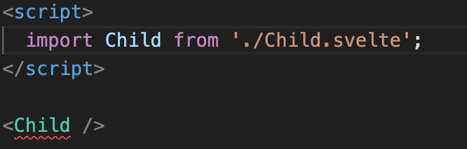
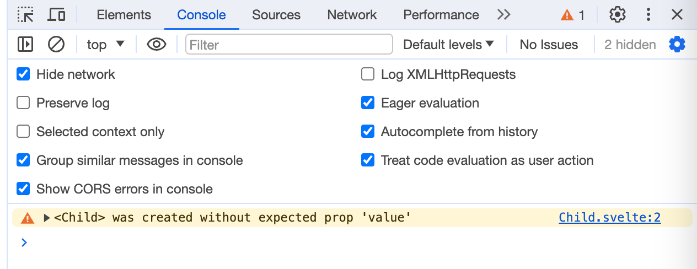

不止在VsCode中会提示我们需要传值，在Chrome控制台也会给出相应警告。

在我们开发时，往往会为某些传参提供一个默认值，因为有些组件在大部分情况下使用的是一个固定的状态，在遇到特殊情况时才会更改状态。比如在UI组件库中，类似Alert组件，有success，info，warning，error四种状态，我们在使用时大部分情况的提示都是正常的消息提示，也就是info状态，因此在组件内部便可以设置一个默认的info状态。

在为prop设置了默认值后，便可以消除我们上述演示中的告警。
在Svelte中，为prop设置默认值，只需在初始声明时进行赋值即可。
```html
<script>
	export let value = 'hello svelte';
</script>
```

#### 关键字
在JavaScript中，有一些特殊的词汇被称为关键字，它们用于编程语言的语法结构中，具有特定的含义。这些词汇不能被用作变量使用。

在Svelte中，我们在设置prop时，可以把一些关键字设置成prop。

举个非常普遍的例子，我们定义一个组件，在组件内有自己的class样式，然而我们需要组件支持在外部由用户自定义class，用户能够像`<Component class={} />`这种形式操作，而class在js中是用于定义一个类的关键字。因此，我们可以按如下写法：

```html
<script> 
  let className;
  export { className as class };
</script>
```
  
#### const

这里笔者有一个设想：export声明的变量能是一个方法吗？

```html
<!-- Child.svelte -->
<script>
  export let onChange = () => {return;}
</script>

<button on:click={onChange}>change</button>
```

```html
<script>
	import Child from './Child.svelte';
	let count = 0;
	const onChange = () => {
		count = Math.random();
	}
</script>

<Child onChange={onChange} />
<span>{count}</span>
```

答案是可以。


然而需要注意的是，当我们导出的是function、class和const 常量时，导出的prop是不可变的。

仍旧以上面的导出方法作为例子，将Child.svelte的内容改成如下：
```html
<script>
  export function onChange() {
    console.log('no change');
  }
</script>

<button on:click={onChange}>change</button>
```

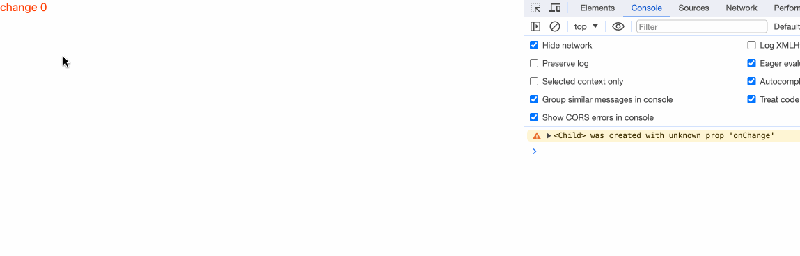

因此我们要设置一个变量或方法为prop，尽量使用let或var声明。

## 方法调用

### createEventDispatcher

我们在上一章中了解到，为html标签进行事件绑定，使用的是`on:[eventName]`的形式。同样，我们如果想为一个组件进行事件绑定，也是使用这种形式。
```html
<Component on:[eventName]={eventHandler} />
```
在组件中进行事件绑定时，`eventName`需要在组件内部进行实现。

内部实现如下：
```javascript
import { createEventDispatcher } from 'svelte';

const dispatch = createEventDispatcher();

dispatch(eventName, data)
```
dispatch的第一个参数是事件名，第二个参数是则用来对外传递数据，如果有多个参数需要传递，把第二个参数设置成一个对象，在这个对象里存放多个对外传递的数据。

这里举个例子演示：
```html
<script>
  import { createEventDispatcher } from 'svelte';

  const dispatch = createEventDispatcher();

  const onClick = (e) => {
    dispatch("click", e);
  }
</script>

<button on:click={onClick}>按钮</button>
```


```html
<script>
  import Component from './Component.svelte';

  const onClick = (e) => {
    console.log('component click', e);
  }
</script>

<Component on:click={onClick} />
```

当我们点击时，能够看到控制台输出了一个CustomEvent类型的数据：
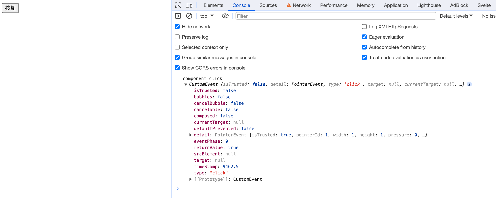
正常我们都会以为在页面中打印出的event参数，就是我们在子组件中我们进行传递的e。
然而笔者在这里需要让大家注意，在Svelte中使用createEventDispatcher进行数据传递时，数据都被放在了event.detail中。仔细观察上述图片，会发现打印出的数据里有个detail的key。里面存放的才是从子组件传递过来的数据。

也许上述例子不够直观，我们修改一下我们的子组件内的传值：
```html
<script>
  import { createEventDispatcher } from 'svelte';

  const dispatch = createEventDispatcher();

  const onClick = (e) => {
    dispatch("click", 123);
  }

</script>

<button on:click={onClick}>按钮</button>
```

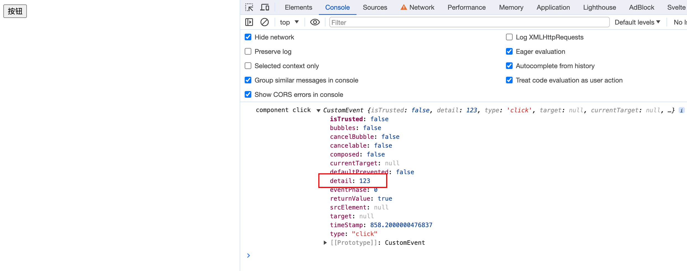

需要注意的是，createEventDispatcher必须在组件初始化的时候就创建，即在顶层script作用域中，否则会报错。
```javascript
<script>
  import { createEventDispatcher } from 'svelte';

  const onClick = (e) => {
    const dispatch = createEventDispatcher();
    dispatch("click", 123);
  }

</script>

<button on:click={onClick}>按钮</button>
```

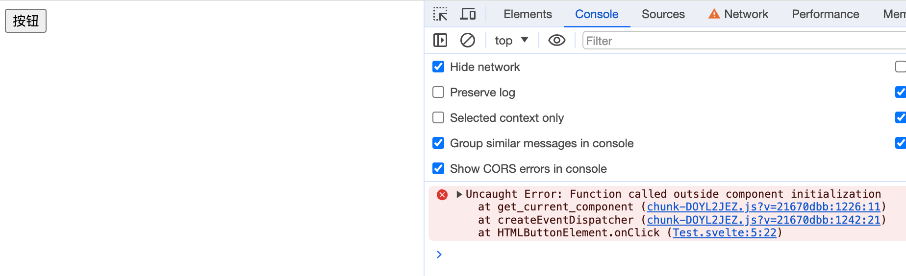


我们可以简单看下`createEventDispatcher`的实现：
```javascript
export function createEventDispatcher() {
	const component = get_current_component();
	return (type, detail, { cancelable = false } = {}) => {
		const callbacks = component.$$.callbacks[type];
		if (callbacks) {
			const event = custom_event(/** @type {string} */ (type), detail, { cancelable });
			callbacks.slice().forEach((fn) => {
				fn.call(component, event);
			});
			return !event.defaultPrevented;
		}
		return true;
	};
}

export function custom_event(type, detail, { bubbles = false, cancelable = false } = {}) {
	return new CustomEvent(type, { detail, bubbles, cancelable });
}
```
其实就是new了一个[CustomEvent](https://developer.mozilla.org/en-US/docs/Web/API/CustomEvent)的实例，然后把第二个传参的数据都放到detail里进行传值。

### 事件转发

与DOM事件不同，组件事件不会冒泡。
```html
<script>
  // 孙组件
  import { createEventDispatcher, onMount } from 'svelte';

  const dispatch = createEventDispatcher();

  const func = () => {
    dispatch('func', 'hello');
  }

  onMount(() => {
    func();
  })
</script>

<div>孙组件</div>
```

```html
<script>
  import { createEventDispatcher } from 'svelte';
  import GrandSon from './GrandSon.svelte';

  const dispatch = createEventDispatcher();

  const func = (e) => {
    dispatch('func', e.detail);
  }

</script>

<GrandSon on:func={func}/>
```

```html
<script>
  // 父组件
  import Child from './Child.svelte';

  const func = (e) => {
    console.log('孙子传值：', e.detail);
  }
</script>

<Child on:func={func} />
```

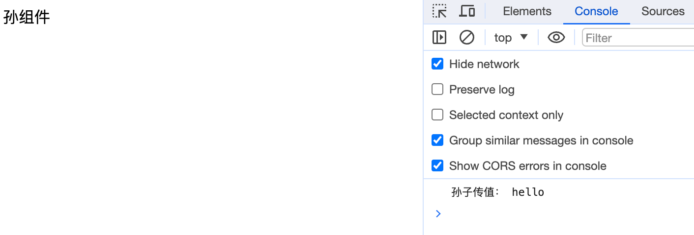
笔者这里使用这个例子主要是想说明，当某个内层组件想要对最外层派发事件时，每一层经过的组件都要使用`createEventDispatch()`然后再传递`event.detail`的步骤。
当在一些涉及到点击等交互的组件中，这种现象是常见的。我们可能会为某个组件添加点击事件的支持，但是点击事件的逻辑则交由外部用户来定义。为此，我们需要用到事件转发。
事件转发写法如下：
```
on:eventName
```
只写事件名，组件本身不提供事件实现。事件的实现交由外层想实现的页面实现。

```html
<button on:click>孙组件</button>
```

```html
<script>
  import GrandSon from './GrandSon.svelte';

</script>

<GrandSon on:click />
```

```html
<script>
  import Child from './Child.svelte';

  const onClick = () => {
    console.log('点击');
  }
</script>

<Child on:click={onClick} />
```

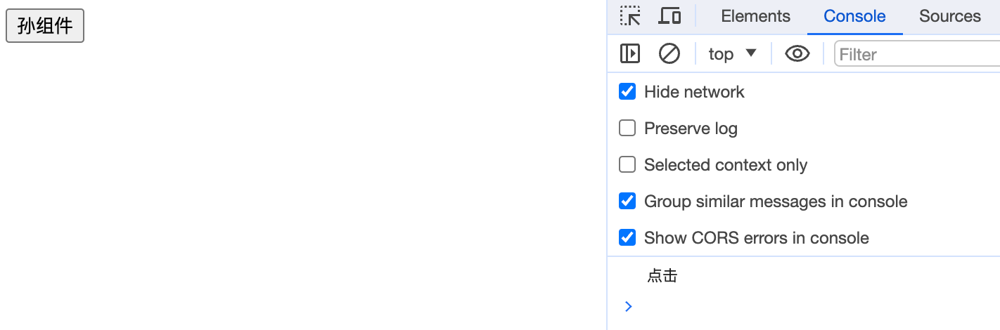

我们可以转发组件的自定义事件，也能转发原生事件。

## 简写

当出现属性名和值一样时，可以进行简写。比如`value={value}`可以简写为`{value}`。

举个例子：
```html
<script>
  let checked = false;
  
  const onChange = () => {
    checked = true;
  }
</script>

<input type="checkbox" {checked} />
<button on:click={onChange}>change to checked</button>
```
原本，我们需要`<input type="checkbox" checked={checked} />`的形式书写。
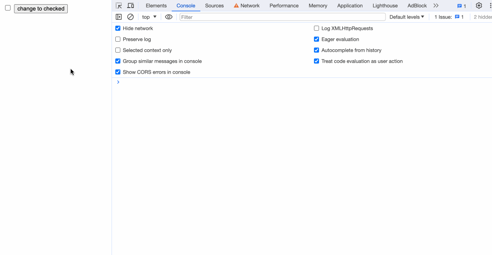

## `$$props`

`$$props`可以获取父级传递的所有属性，包括 props 属性和非props属性。

```html
<script>
  export let value;

  console.log('$$props', $$props)
</script>

<div>子组件</div>
```

```html
<script>
  import Child from './Child.svelte';
</script>

<Child value={'hello'} a={'a'} b={'b'} />
```

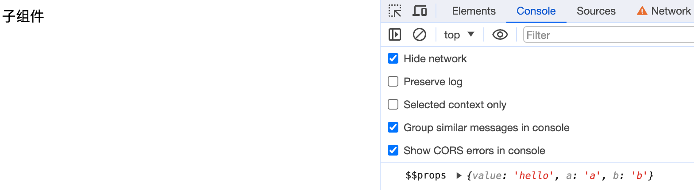

## `$$restProps`
`$$props`包含了props属性和非props属性，而`$$restProps`则只包含了非props属性。
将上个例子的console进行改写：
```javascript
<script>
  export let value;

  console.log('$$props', $$props);
  console.log('$$restProps', $$restProps);
</script>

<div>子组件</div>
```

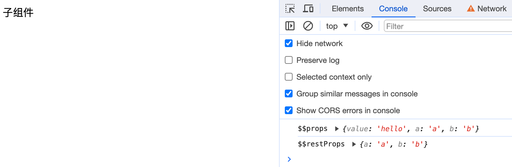

我们可以把`$$props`和`$$restProps`直接解构传值，只是不推荐这种写法，因为容易造成混淆。
```html
<script>
  import GrandSon from './GrandSon.svelte';
  export let value;
</script>

<GrandSon {...$$props} />
```
## 小结

在本章，我们学习了如何在父子组件之间传递数据。子组件通过props接收父组件传递的数据，然后通过createEventDispatcher来向父组件派发事件。