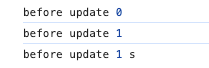
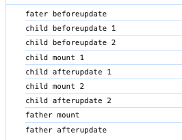
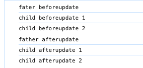
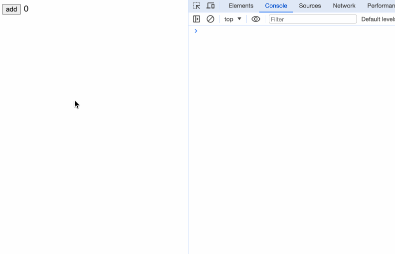
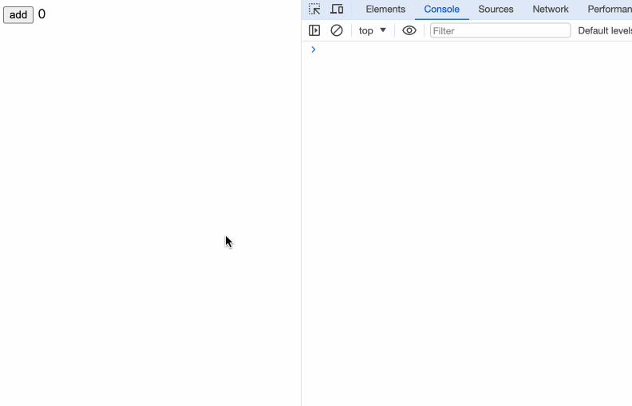

Each component has a life cycle from creation to destruction. At different life cycle stages, a component provides a method to the outside world, allowing the developer who calls the component to control the component more flexibly at each life cycle stage. Such methods are life hook functions.

Svelte's lifecycle hooks are:
  - `onMount`
  - `beforeUpdate`
  - `afterUpdate`
  - `onDestroy`
  - `tick`
  
## Call Timing

If server-side rendering (SSR) is used, the rest of the lifecycle functions will not be executed during SSR execution except for `onDestroy`.

In Svelte, lifecycle functions can only be written when the component is initialized to bind callbacks to instances of the component. Do not place lifecycle functions in asynchronous methods such as setTimeout and setInterval.

Although we need to ensure that lifecycle functions are called when the component is initialized, it doesn't matter where they are called from. For example, we can put the lifecycle in a method:

```javascript
// app.js
import { onMount,onDestroy } from 'svelte';

export const startInterval = () => {
  let timer = null;
  let count = 0;

  onMount(() => {
    console.log('onMount');
    timer = setInterval(() => {
      count++;
      console.log('count');
    }, 1000)
  });

  onDestroy(() => {
    console.log('onDestroy');
    if (timer) {
      clearInterval(timer);
    }
  })
}
```

```html
<script>
  import { startInterval } from './app.js';

  startInterval();
</script>

<div>App</div>
```
In this case, the lifecycle can still ensure that it is called when the component is initialized.

## onMount

A callback that is executed immediately after the component is mounted to the DOM.
```typescript
onMount(callback: () => void)

onMount(callback: () => () => void)
```

`onMount` receives a callback function as an argument, and if a function is returned within the callback function, it is called when the component is unloaded.

We can take a look at the source code in the Svelte project, file path is`packages/svelte/src/runtime/internal/Component.js`:

```javascript
/** @returns {void} */
export function mount_component(component, target, anchor) {
  const { fragment, after_update } = component.$$;
  fragment && fragment.m(target, anchor);
  // onMount happens before the initial afterUpdate
  add_render_callback(() => {
    const new_on_destroy = component.$$.on_mount.map(run).filter(is_function);
    // if the component was destroyed immediately
    // it will update the `$$.on_destroy` reference to `null`.
    // the destructured on_destroy may still reference to the old array
    if (component.$$.on_destroy) {
      component.$$.on_destroy.push(...new_on_destroy);
    } else {
      // Edge case - component was destroyed immediately,
      // most likely as a result of a binding initialising
      run_all(new_on_destroy);
    }
    component.$$.on_mount = [];
  });
  after_update.forEach(add_render_callback);
}
```
We can see that it will execute `onMount` method and gets a value, and then it will determine whether there is a declaration in the component `onDestroy` lifecycle hook, add to `onDestroy` array if yes, then execute this return value after `onDestroy`, if not, execute this return value directly. In React, `useEffect` hook has the same function.

```javascript
useEffect(() => {
  return () => {}
}, []);
```

We demonstrate a Svelte Example of the return value of `onMount`:
```html
<script>
  // Child.svelre
  import { onMount } from 'svelte';

  onMount(() => {
    console.log('child mount');
    return () => {
      console.log('child destroy 1');
    }
  })
</script>

<div>child</div>
```

```html
<script>
  // Father.svelte
  import Child from './Child.svelte';
  let count = 0;

  const updateCount = () => {
    count++;
  }
</script>


<button on:click={updateCount}>add</button>
{#if count == 0}
<Child />
{/if}
```
In this example, we have a variable count on the parent page, which controls the implicit value of the child component by changing the count. Executable the code, the console will output in sequence: child mount -> child destroy 1.

Then we add `onDestroy` hook:

```html
<script>
  import { onMount, onDestroy } from 'svelte';

  onMount(() => {
    console.log('child mount');
    return () => {
      console.log('child destroy 1');
    }
  })

  onDestroy(() => {
    console.log('child destroy 2');
  })
</script>

<div>child</div>
```

Executable the code, the console will print out: child mount -> child destroy 2 -> child destroy 1.

For sibling components, `onMount` is executed from top to bottom according to the order of component calls. For parent and child components, `onMount` of the child component is executed before `onMount` of the parent component is executed, that is, from inside to outside.

```html
<script>
  import { onMount } from "svelte";
  import Child from "./Child.svelte";
  import Child2 from "./Child2.svelte";

  onMount(() => {
    console.log("fahter mount");
  });
</script>

<Child />
<Child2 />
```
We define three components: a parent component and two child components. `onMount` is called separately within the three components. After execution, we can see: child mount 1 -> child mount 2 -> father mount.

## beforeUpdate

Execute before the DOM update, the first callback runs on `onMount` before initialization.

```typescript
beforeUpdate(callback: () => void)
```

An example here:
```html
<script>
  import { beforeUpdate } from "svelte";

  let count = 0;
  let str = "";

  const updateData = () => {
    count++;
    setTimeout(() => {
      str += "s";
    }, 1000);
  };

  beforeUpdate(() => {
    console.log("before update", count, str);
  });
</script>

<button on:click={updateData}>update</button>
<span>{count}</span><span>{str}</span>
```
After loading the page, we will first see the console print out `before update 0`. Click the button to update and see `before update 1` printed out, 1s later see `before update 1 s` printed out.
  


It is important to note that if components are present simultaneously `beforeUpdate` and
`onMount` for the first time. The `beforeUpdate` callback will be execute before `onMount`. If we call `onMount` hook in the above code, and then perform the same steps, we will see:


## afterUpdate

Callback executed after the component is rendered.
```typescript
afterUpdate(callback: () => void)
```

For sibling components, `beforeUpdate` and `afterUpdate` are still executed from top to bottom in the order of component calls. For parent and child components, `beforeUpdate` of the parent component is executed first, and then `beforeUpdate` of the child component is executed.

When the `beforeUpdate` of the child component is completed, the `afterUpdate` of the parent component is executed, and the `afterUpdate` of the child component is finally executed.


```html
<script>
  import { onMount, onDestroy, beforeUpdate, afterUpdate } from "svelte";
  import Child from "./Child.svelte";
  import Child2 from "./Child2.svelte";
  let count = 0;

  const updateCount = () => {
    count++;
  };

  beforeUpdate(() => {
    console.log("fater beforeupdate");
  });

  onMount(() => {
    console.log("father mount");
  });

  afterUpdate(() => {
    console.log("father afterupdate");
  });

  onDestroy(() => {
    console.log("father destroy");
  });
</script>

<button on:click={updateCount}>add</button>
{#if count <= 1}
  <Child {count} />
  <Child2 {count} />
{/if}
```

The content of the child component is as follows. Child1.svelte and Child2.svelte only have different serial numbers of the output content, and nothing else is different.
```html
<script>
  // Child.svelte
  import { onMount, onDestroy, beforeUpdate, afterUpdate } from 'svelte';

  export let count;

  beforeUpdate(() => {
    console.log('child beforeupdate 1')
  });

  onMount(() => {
    console.log('child mount 1');
  });

  afterUpdate(() => {
    console.log('child afterupdate 1');
  });

  onDestroy(() => {
    console.log('child destroy 1');
  });
</script>

<div>child</div>
{count}
```

At the time of initial execution: 


After clicking the button to update: 


## onDestroy

Callbacks to run after a component is destroyed:
```javascript
onDestroy(callback: () => void)
```

Between sibling components, `onDestroy` is still from top to bottom according to the calling order. The parent and child components are from outside to inside, and the parent component executes `onDestroy` firstly, and then execute the child component's
`onDestroy`.

The function returned by `onMount` will be executed when the component is destroyed
adn after executes `onDestroy`.

## tick

The `tick` function is unlike other lifecycle hooks in that we can call it at any time without waiting for the component to initialize for the first time. It returns a
`Promise`, which resolves immediately when any state state changes.

```typescript
promise: Promise = tick()
```

In Svelte, when a state state changes, the DOM is not updated immediately, but will wait until the next microtask to update. During the waiting period, it will continue to listen for other state state changes, and then update the DOM uniformly in this microtask, which can reduce some unnecessary work and allow the browser to process these things in batches more efficiently.

We may encounter this problem during development: a state in the component is updated, but the DOM is not updated, and I just want to get the value of dom, then the `tick` function can come in handy! (Yes, it can be regarded as $nextTick () in Vue)

```html
<script>
  let count = 0;

  const addCount = () => {
    count++;
    let countDom = document.querySelector('#count');
    if (countDom) {
      console.log('count text', countDom.innerHTML);
    }
  }
</script>

<button on:click={addCount}>add</button>

<span id="count">{count}</span>
```

  

We can see that even if the page has been updated, the value retrieved by the DOM operation is still old data.

To solve the above problems, we can:
```html
<script>
  import { tick } from 'svelte';
  let count = 0;

  const addCount = async () => {
    count++;
    await tick();
    let countDom = document.querySelector('#count');
    if (countDom) {
      console.log('count text', countDom.innerHTML);
    }
  }
</script>

<button on:click={addCount}>add</button>

<span id="count">{count}</span>
```

  

And when we use `tick`, we can get the latest value.

## Summary

In this chapter, we have learned:
- The Role of the Svelte Lifecycle Function
- The execution order of each lifecycle function when the parent and child components are rendered
- The role of tick