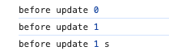
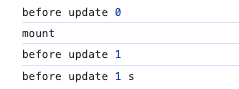
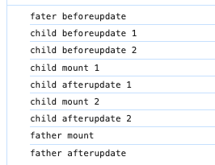
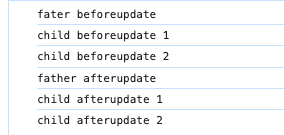
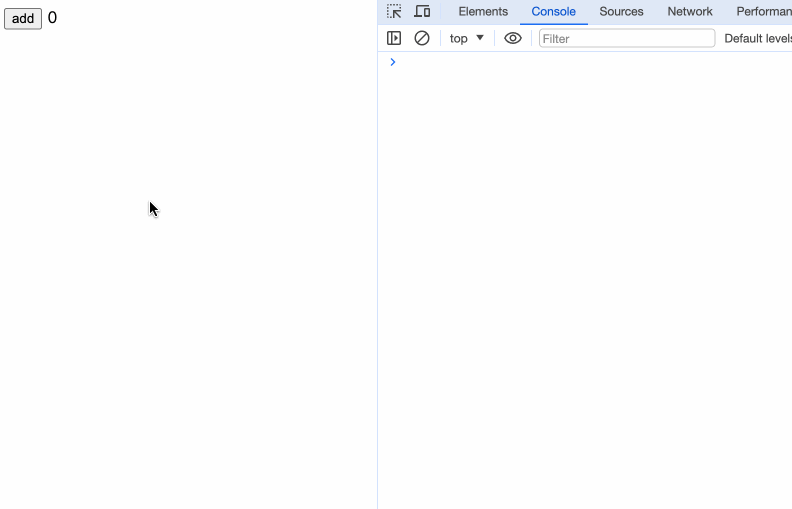
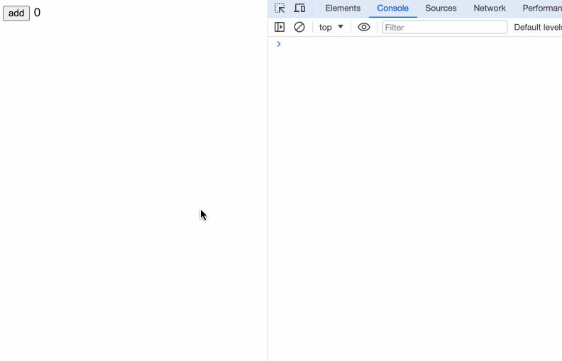

每个组件从创建开始，到销毁结束这个过程，都有一个生命周期。在不同的生命周期阶段，组件对外提供一个方法，使调用组件的开发人员能够更灵活地在每个生命周期阶段对组件进行控制，这类方法便是生命钩子函数。

  Svelte的生命周期钩子有：
  * onMount
  * beforeUpdate
  * afterUpdate
  * onDestroy
  * tick
  
## 调用时机

如果使用服务端渲染（SSR），除了onDestroy，其余生命周期函数不会在 SSR 运行期间执行。

在Svelte中生命周期函数只能在组件初始化时编写，以便将回调绑定到组件的实例，切勿将生命周期函数放在一些如setTimeout、setInterval之类的异步方法中。

虽然我们强调要确保生命周期函数是在组件初始化时被调用，但至于在何处调用生命周期则无关紧要。比如，我们可以把生命周期放到一个方法中：

```javascript
// app.js
import { onMount,onDestroy } from 'svelte';

export const startInterval = () => {
  let timer = null;
  let count = 0;

  onMount(() => {
    console.log('onMount');
    timer = setInterval(() => {
      count++;
      console.log('count');
    }, 1000)
  });

  onDestroy(() => {
    console.log('onDestroy');
    if (timer) {
      clearInterval(timer);
    }
  })
}
```

```html
<script>
  import { startInterval } from './app.js';

  startInterval();
</script>

<div>App</div>
```
这种情况下，生命周期依然能够确保在组件初始化时被调用。
## onMount

在组件挂载到DOM后立即执行的回调。
```javascript
onMount(callback: () => void)

onMount(callback: () => () => void)
```

`onMount`接收一个回调函数作为参数，如果这个回调函数内返回一个函数，则在卸载组件时调用该函数。

我们可以看下源码，在Svelte项目的`packages/svelte/src/runtime/internal/Component.js`文件内：
```javascript
/** @returns {void} */
export function mount_component(component, target, anchor) {
	const { fragment, after_update } = component.$$;
	fragment && fragment.m(target, anchor);
	// onMount happens before the initial afterUpdate
	add_render_callback(() => {
		const new_on_destroy = component.$$.on_mount.map(run).filter(is_function);
		// if the component was destroyed immediately
		// it will update the `$$.on_destroy` reference to `null`.
		// the destructured on_destroy may still reference to the old array
		if (component.$$.on_destroy) {
			component.$$.on_destroy.push(...new_on_destroy);
		} else {
			// Edge case - component was destroyed immediately,
			// most likely as a result of a binding initialising
			run_all(new_on_destroy);
		}
		component.$$.on_mount = [];
	});
	after_update.forEach(add_render_callback);
}
```
我们可以看到，会执行onMount的方法后拿到一个值，接着会判断组件内有没有声明`onDestroy`生命周期钩子，有则添加到onDestroy数组中，在执行onDestroy后执行，没有则直接执行这个返回值。在React的`useEffect`hook中，有相同的功能。

```javascript
useEffect(() => {
	return () => {}
}, []);
```

```html
<script>
  import { onMount } from 'svelte';

  onMount(() => {
    console.log('child mount');
    return () => {
      console.log('child destroy 1');
    }
  })
</script>

<div>child</div>
```

```html
<script>
  import Child from './Child.svelte';
	let count = 0;
	
	const updateCount = () => {
		count++;
	}
</script>


<button on:click={updateCount}>add</button>
{#if count == 0}
<Child />
{/if}
```

执行child mount -> child destroy 1

```html
<script>
  import { onMount, onDestroy } from 'svelte';

  onMount(() => {
    console.log('child mount');
    return () => {
      console.log('child destroy 1');
    }
  })

  onDestroy(() => {
    console.log('child destroy 2');
  })
</script>

<div>child</div>
```
执行child mount -> child destroy 2 -> child destroy 1


对于兄弟组件，onMount 会根据组件调用的顺序，从上往下执行。而对于父子组件，当子组件的 onMount 执行完毕之后，才会执行父组件的 onMount，也就是从内到外。
```html
<script>
	import { onMount } from 'svelte';
	import Child from './Child.svelte';
	import Child2 from './Child2.svelte';
	
	onMount(() => {
		console.log('fahter mount');
	})
</script>

<Child />
<Child2 />
```
我们定义三个组件：一个父组件，两个子组件。在三个组件内分别调用onMount。
执行后，我们能看到child mount 1 -> child mount 2 -> father mount

## beforeUpdate

在DOM更新之前执行，首次回调运行在`onMount`初始化之前。
```
beforeUpdate(callback: () => void)
```

```html
<script>
	import { beforeUpdate } from 'svelte';

	let count = 0;
	let str = '';
	
	const updateData = () => {
		count++;
		setTimeout(() => {
			str += 's';
		}, 1000);
	}

	beforeUpdate(() => {
		console.log('before update', count, str);
	})
</script>

<button on:click={updateData}>update</button>
<span>{count}</span><span>{str}</span>
```
加载页面后，我们会首先看到控制台打印出before update 0。点击按钮更新，看到打印出before update 1，1s后看到打印出before update 1 s。

  
需要注意的是，如果组件中同时存在beforeUpdate与onMount，首次beforeUpdate回调会在 onMount之前执行。如果我们在上述代码中调用onMount钩子，然后执行相同步骤，则看到：


## afterUpdate

在组件渲染之后执行的回调。
```
afterUpdate(callback: () => void)
```

对于兄弟组件，beforeUpdate 和 afterUpdate 依然是按照组件调用的顺序，从上往下执行。而对于父子组件，会先执行父组件的 beforeUpdate，然后执行子组件的 beforeUpdate。

当子组件的 beforeUpdate 执行完毕之后，再执行父组件的 afterUpdate，最后执行子组件的 afterUpdate。

```html
<script>
	import { onMount, onDestroy, beforeUpdate, afterUpdate } from 'svelte';
	import Child from './Chapter00_Child.svelte';
	import Child2 from './Chapter00_Child2.svelte';
	let count = 0;
	
	const updateCount = () => {
		count++;
	}

	beforeUpdate(() => {
		console.log('fater beforeupdate');
	});

	onMount(() => {
		console.log('father mount');
	});

	afterUpdate(() => {
		console.log('father afterupdate');
	});

	onDestroy(() => {
		console.log('father destroy');
	});
</script>

<button on:click={updateCount}>add</button>
{#if count <= 1}
	<Child count={count} />
	<Child2 count={count} />
{/if}

```

```html
<script>
  import { onMount, onDestroy, beforeUpdate, afterUpdate } from 'svelte';

  export let count;

  beforeUpdate(() => {
    console.log('child beforeupdate 1')
  });

  onMount(() => {
    console.log('child mount 1');
  });

  afterUpdate(() => {
    console.log('child afterupdate 1');
  });

  onDestroy(() => {
    console.log('child destroy 1');
  });
</script>

<div>child</div>
{count}
```

在初次执行时


点击按钮更新后

## onDestroy

在组件卸载后运行的回调。
```javascript
onDestroy(callback: () => void)
```

兄弟组件之间的 onDestroy 依然是根据调用顺序从上往下。而父子组件则是从外到内，先执行父组件的 onDestroy，再执行子组件的 onDestroy。
onMount 返回的函数会在组件销毁的时候执行，这个函数会在 onDestroy 之后执行。
## tick

tick函数与其他生命周期钩子不同，我们可以随时调用它，而不用等待组件首次初始化。它返回一个Promise，在任何一个state状态发生变化时立即resolve。
```
promise: Promise = tick()
```

在Svelte中，当改变一个state状态时，不会立即更新DOM，而是会等到下一个微任务时更新，在等待期间会持续监听是否有其他state状态改变，然后在这个微任务中统一更新DOM，这样可以减少一些无用功，让浏览器更有效地批量处理这些事情。

我们在开发过程中可能会遇到这种问题：组件中的某个状态更新了，但DOM没有更新，而我恰恰就想获取dom的值，这时 tick 函数便能派上用场了！（不错，可以看成是Vue中的$nextTick()）

```html
<script>
  let count = 0;

  const addCount = () => {
    count++;
    let countDom = document.querySelector('#count');
    if (countDom) {
      console.log('count text', countDom.innerHTML);
    }
  }
</script>

<button on:click={addCount}>add</button>

<span id="count">{count}</span>
```


我们可以看到，即使页面上已经更新了，操作DOM获取的值依然是旧的数据。

```html
<script>
  import { tick } from 'svelte';
  let count = 0;

  const addCount = async () => {
    count++;
    await tick();
    let countDom = document.querySelector('#count');
    if (countDom) {
      console.log('count text', countDom.innerHTML);
    }
  }
</script>

<button on:click={addCount}>add</button>

<span id="count">{count}</span>
```


而当我们使用了tick之后，能够取到最新的值。
## 小结

在这一章，我们学习了Svelte的几个生命钩子以及它们的执行时机和调用顺序。