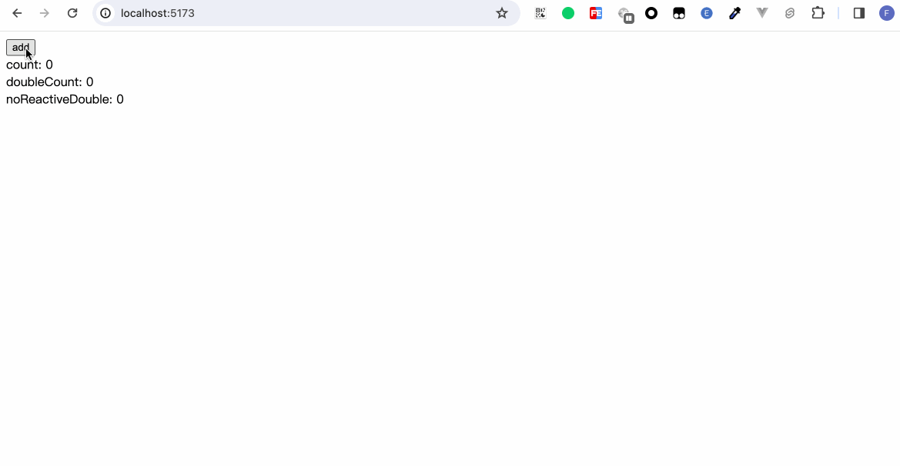
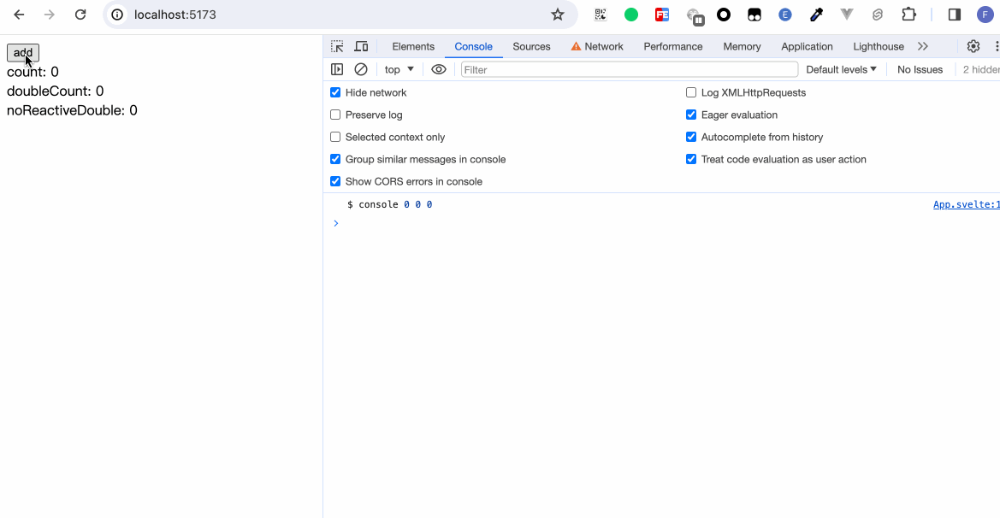
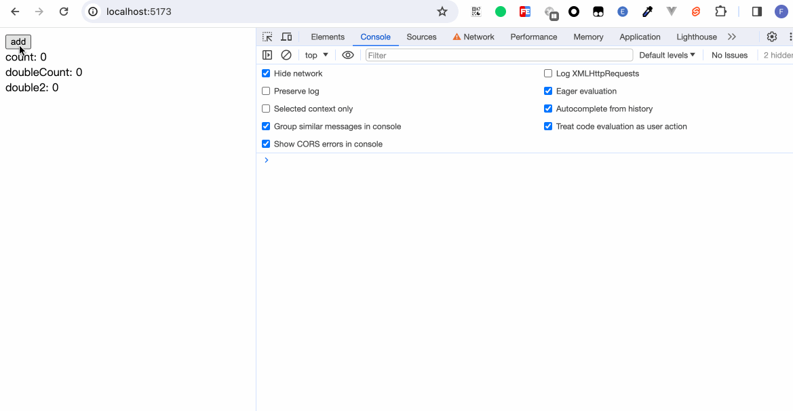

If you have used Vue or React, then must have known about APIs such as Vue's `computed`, `watch`, and React's `useMemo`, which are used to monitor certain variables and recalculate new variables or execute certain methods only after changes occur.

In Svelte, a similar functionality is also provided. Svelte calls it Reactivity. The core that triggers the responsive capability is - assignment. The specific writing is as follows:
```
$: Your logic
```

Perhaps everyone will be curious about what the `$` syntax is. In fact, it is a syntax normally supported by js, the [JS label syntax](https://developer.mozilla.org/en-US/docs/Web/JavaScript/Reference/Statements/label), but few people use it and it is equivalent to an almost obsolete syntax.

By using `$:` as a prefix, Svelte can make any statement at the top-level (that is, not inside a block or function) reactive. Whenever the values they depend on change, they will run immediately before the component is updated.


## Declaration

### `$:` syntax 

If a statement consists entirely of assignments to undeclared variables, Svelte inserts the `let` declaration for you.

```html
<script>
  let count = 0;

  $: double = count * 2;
  
  let noReactiveDouble = count * 2;

  const add = () => {
    count++;
  }
</script>

<button on:click={add}>add</button><br>
count: {count}<br>
doubleCount: {double}<br>
noReactiveDouble: {noReactiveDouble}
```



We don't need to declare `let double`. In `$: double = count * 2;`, it's equivalent to Svelte automatically declaring it for us. 

## Statement

We add a line in the above code: 
```javascript
$: console.log('$ console', count, double, noReactiveDouble);
```


The changes of each state can be observed intuitively. The variable double declared in `$:` will change with the change of count, while the variable noReactiveDouble declared outside `$:` remains 0 even if count changes because the initial count is 0. 

### The difference from beforeUpdate 

```html
<script>
  import { beforeUpdate } from 'svelte';

  let count = 0;
  let noReactiveDouble = count * 2;

  const add = () => {
    count++;
  }

  $: console.log('$ console', noReactiveDouble);

  beforeUpdate(() => {
    console.log('beforeUpdate console', noReactiveDouble)
  })
</script>

<button on:click={add}>add</button><br>
count: {count}<br>
noReactiveDouble: {noReactiveDouble}
```


When we refresh the page again, we can see that in `$`, it is executed once, and `beforeUpdate` is also executed once. Because `let noReactiveDouble = count * 2` is an assignment operation, `$: console.log('$ console', noReactiveDouble);` is triggered at the first assignment; while beforeUpdate is due to the assignment operations of the two variables `count` and `noReactiveDouble`. When we click to update, because `noReactiveDouble` is not a reactive variable, only `beforeUpdate` is triggered.

The logic within the `$` statement is only executed when the variables within the statement trigger an update. While beforeUpdate is equivalent to collecting all variable dependencies. It is executed when one of the dependencies changes. 


The statement can not only be written in a single line like `$: console.log()`, but also can be wrapped in a `{}` curly brace. 
```javascript
$: {
  // your logic
}
```

在声明章节，我们知道了Svelte能够帮我们自动声明未使用let声明的变量。`$: double = count * 2;`这一句表达式相当于以下写法：
```javascript
let double;
$: {
  double = count * 2;
}
```

因此当我们使用`{}`时，还是需要自己进行声明：
```html
<script>
  let count = 0;
  $: double = count * 2;
  let double2;

  $: {
    double2 = count * 2;
  }

  const add = () => {
    count++;
  }
</script>

<button on:click={add}>add</button><br>
count: {count}<br>
doubleCount: {double}<br>
double2: {double2}
```



## 依赖

当我们在使用`$: {}`进行一些复杂的响应式操作时，可能会遇到一种情况。我们只想要我们的代码在某个变量改变时才执行，而不是代码里的每个变量更改时都执行一次。比如：
```html
<script>
  let width = 1;
  let height = 1;

  $: area = width * height;
</script>

width: <input type="number" bind:value={width} /><br />
height: <input type="number" bind:value={height} /><br />
area: {area}
```
每当width或height改变时，`area = width * height`都会执行。

那有没有什么方法让我只在width更改时执行，height更改时不执行？其实技巧就在于把不想监听的依赖移出`$:`之外。

```html
<script>
  let width = 1;
  let height = 1;

  function setArea(width) {
    return width * height;
  }

  $: area = setArea(width);
</script>

width: <input type="number" bind:value={width} /><br />
height: <input type="number" bind:value={height} /><br />
area: {area}
```


在`$:`之内，只有width变量，当width变化时会执行`setArea()`，而height没有在`$:`之内，即使height变化了，也没有执行响应式更新。

## 小结
本章我们学习了：
- Svelte中`$`语法的使用，通过`$`我们可以实现计算属性，也可以监听变量更新，从而执行一些操作
- `$`和`beforeUpdate`生命周期函数的区别
