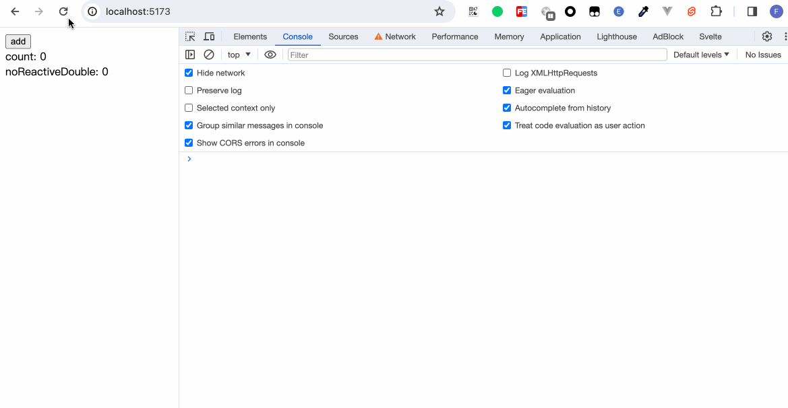
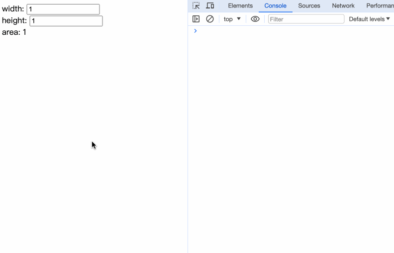

If you have used Vue or React, then must have known about APIs such as Vue's `computed`, `watch`, and React's `useMemo`, which are used to monitor certain variables and recalculate new variables or execute certain methods only after changes occur.

In Svelte, a similar functionality is also provided. Svelte calls it Reactivity. The core that triggers the responsive capability is - assignment. The specific writing is as follows:
```
$: Your logic
```

Perhaps everyone will be curious about what the `$` syntax is. In fact, it is a syntax normally supported by js, the [JS label syntax](https://developer.mozilla.org/en-US/docs/Web/JavaScript/Reference/Statements/label), but few people use it and it is equivalent to an almost obsolete syntax.

By using `$:` as a prefix, Svelte can make any statement at the top-level (that is, not inside a block or function) reactive. Whenever the values they depend on change, they will run immediately before the component is updated.


## Declaration

### `$:` syntax 

If a statement consists entirely of assignments to undeclared variables, Svelte inserts the `let` declaration for you.

```html
<script>
  let count = 0;

  $: double = count * 2;
  
  let noReactiveDouble = count * 2;

  const add = () => {
    count++;
  }
</script>

<button on:click={add}>add</button><br>
count: {count}<br>
doubleCount: {double}<br>
noReactiveDouble: {noReactiveDouble}
```


We don't need to declare `let double`. In `$: double = count * 2;`, it's equivalent to Svelte automatically declaring it for us. 

## Statement

We add a line in the above code: 
```javascript
$: console.log('$ console', count, double, noReactiveDouble);
```


The changes of each state can be observed intuitively. The variable double declared in `$:` will change with the change of count, while the variable noReactiveDouble declared outside `$:` remains 0 even if count changes because the initial count is 0. 

### The difference from beforeUpdate 

```html
<script>
  import { beforeUpdate } from 'svelte';

  let count = 0;
  let noReactiveDouble = count * 2;

  const add = () => {
    count++;
  }

  $: console.log('$ console', noReactiveDouble);

  beforeUpdate(() => {
    console.log('beforeUpdate console', noReactiveDouble)
  })
</script>

<button on:click={add}>add</button><br>
count: {count}<br>
noReactiveDouble: {noReactiveDouble}
```



When we refresh the page again, we can see that in `$`, it is executed once, and `beforeUpdate` is also executed once. Because `let noReactiveDouble = count * 2` is an assignment operation, `$: console.log('$ console', noReactiveDouble);` is triggered at the first assignment; while beforeUpdate is due to the assignment operations of the two variables `count` and `noReactiveDouble`. When we click to update, because `noReactiveDouble` is not a reactive variable, only `beforeUpdate` is triggered.

The logic within the `$` statement is only executed when the variables within the statement trigger an update. While beforeUpdate is equivalent to collecting all variable dependencies. It is executed when one of the dependencies changes. 


The statement can not only be written in a single line like `$: console.log()`, but also can be wrapped in a `{}` curly brace. 
```javascript
$: {
  // your logic
}
```

在声明章节，我们知道了Svelte能够帮我们自动声明未使用let声明的变量。`$: double = count * 2;`这一句表达式相当于以下写法：
We have learned that Svelte can automatically declare variables that are not declared using the let statement. The expression `$: double = count * 2;` is equivalent to the following writing.:
```javascript
let double;
$: {
  double = count * 2;
}
```

Therefore, when we use `{}`, we still need to declare it ourselves: 
```html
<script>
  let count = 0;
  $: double = count * 2;
  let double2;

  $: {
    double2 = count * 2;
  }

  const add = () => {
    count++;
  }
</script>

<button on:click={add}>add</button><br>
count: {count}<br>
doubleCount: {double}<br>
double2: {double2}
```


## Dependency

When we are using `$: {}` for some complex reactive operations, a situation may arise. We only want our code to execute when a certain variable changes, rather than every time any variable in the code changes. For example: 
```html
<script>
  let width = 1;
  let height = 1;

  $: area = width * height;
</script>

width: <input type="number" bind:value={width} /><br />
height: <input type="number" bind:value={height} /><br />
area: {area}
```
Whenever the width or height changes, `area = width * height` is executed. Is there any way to execute only when the width changes and not when the height changes? 

In fact, the trick lies in moving the dependencies that you don't want to listen to out of `$:`. 

```html
<script>
  let width = 1;
  let height = 1;

  function setArea(width) {
    return width * height;
  }

  $: area = setArea(width);
</script>

width: <input type="number" bind:value={width} /><br />
height: <input type="number" bind:value={height} /><br />
area: {area}
```


Within `$:`, there is only the width variable. When the width changes, `setArea()` is executed. However, the height is not within `$:`. Even if the height changes, no reactive update is performed. 

## Summary

In this chapter, we have learned:

- The use of the `$ `syntax in Svelte. Through `$`, we can implement computed properties and also listen for variable updates to perform certain operations.
- The difference between `$` and `beforeUpdate` lifecycle functions 
