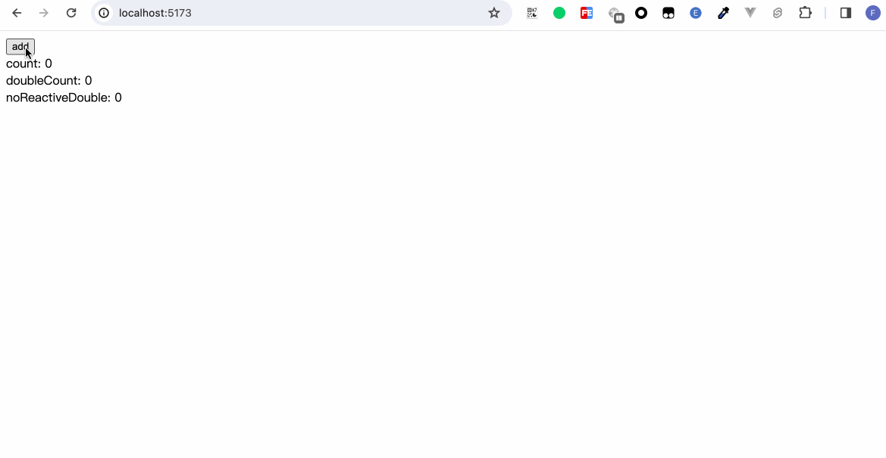
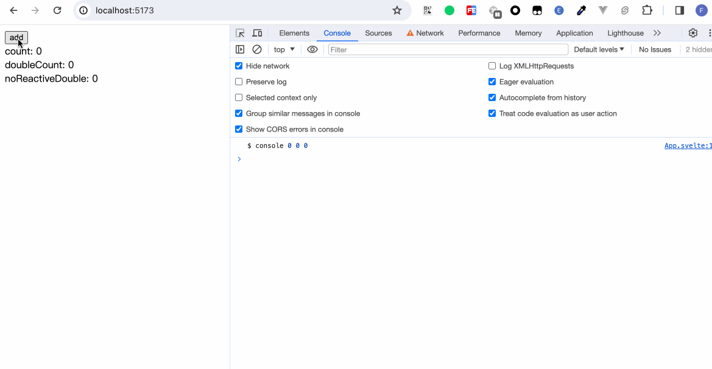
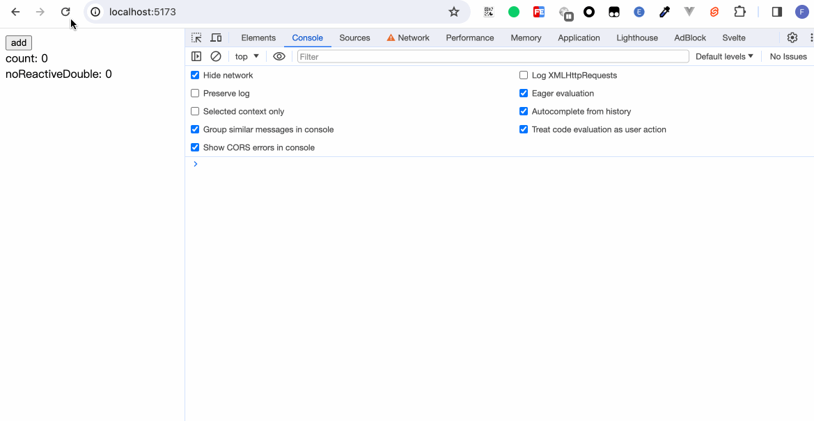
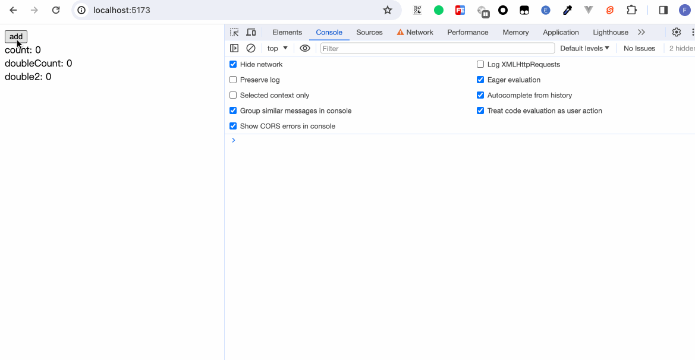
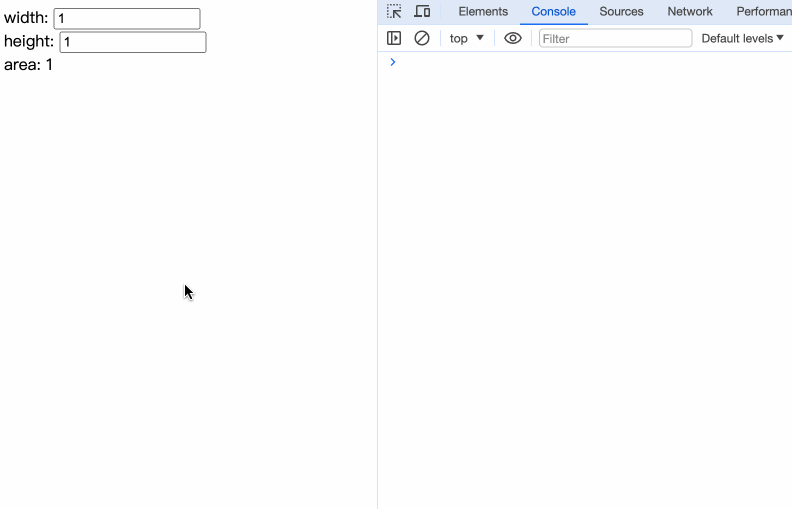

如果读者接触过Vue或者React，那么必然了解过像Vue的`computed`、`watch`和React的`useMemo`等用于监听某些变量发生更改后才重新计算出新的变量或执行某些方法的Api。

在Svelte中，同样提供了类似的功能。Svelte称之为Reactivity，中文翻译为“反应性”，不过笔者更喜欢称其为响应式能力，触发响应式能力的核心则是——赋值，这个我们在《数据与方法》章节已经简单演示过了。具体写法如下：
```javascript
$: 你的逻辑
```

可能大家会好奇`$`是什么语法，其实它是js正常支持的语法[JS label 语法](https://developer.mozilla.org/en-US/docs/Web/JavaScript/Reference/Statements/label)，只是少有人用，相当于一个几乎废弃的语法。
  
Svelte通过使用 `$:` 作为前缀，可以让任何位于top-level的语句（即不在块或函数内部）具有反应性。每当它们依赖的值发生更改时，它们都会在组件更新之前立即运行。

## 声明

### `$:`语法

如果语句完全由未声明变量的赋值组成，则Svelte替你将 `let`插入声明
```html
<script>
  let count = 0;

  $: double = count * 2;
  
  let noReactiveDouble = count * 2;

  const add = () => {
    count++;
  }
</script>

<button on:click={add}>add</button><br>
count: {count}<br>
doubleCount: {double}<br>
noReactiveDouble: {noReactiveDouble}
```



我们不用声明`let double`，在`$: double = count * 2;`中相当于Svelte自动帮我们声明了。

## 语句

我们在上述代码中添加一行：
```javascript
$: console.log('$ console', count, double, noReactiveDouble);
```


可以直观地观察到各状态的变更。在`$:`里声明的变量double会随着count的改变而改变，而在`$:`之外声明的变量noReactiveDouble则由于初始的count是0，而即使count改变了，noReactiveDouble仍旧是0。

### 与beforeUpdate的区别

```html
<script>
  import { beforeUpdate } from 'svelte';

  let count = 0;
  let noReactiveDouble = count * 2;

  const add = () => {
    count++;
  }

  $: console.log('$ console', noReactiveDouble);

  beforeUpdate(() => {
    console.log('beforeUpdate console', noReactiveDouble)
  })
</script>

<button on:click={add}>add</button><br>
count: {count}<br>
noReactiveDouble: {noReactiveDouble}
```


当我们重新刷新页面时，可以看到`$`里执行了一次，beforeUpdate也执行了一次。因为`let noReactiveDouble = count * 2`是赋值操作，触发了`$: console.log('$ console', noReactiveDouble);`；而beforeUpdate则是由于`count`和`noReactiveDouble`这两个变量有赋值操作。
当我们点击更新时，因为`noReactiveDouble`不是响应性的变量，因此只会触发beforeUpdate。

`$`语句内的逻辑只有在语句内的变量触发更新时才会执行。而beforeUpdate则相当于收集了所有变量依赖。当其中的一个依赖变化时则执行。

### 声明

语句除了能像`$: console.log()`这样单行写，也可以包裹在一个`{}`花括号中。
```javascript
$: {
	// 执行逻辑
}
```

在声明章节，我们知道了Svelte能够帮我们自动声明未使用let声明的变量。`$: double = count * 2;`这一句表达式相当于以下写法：
```javascript
let double;
$: {
  double = count * 2;
}
```

因此当我们使用`{}`时，还是需要自己进行声明。

```html
<script>
  let count = 0;
  $: double = count * 2;
  let double2;

  $: {
    double2 = count * 2;
  }

  const add = () => {
    count++;
  }
</script>

<button on:click={add}>add</button><br>
count: {count}<br>
doubleCount: {double}<br>
double2: {double2}
```



## 依赖

当我们在使用`$: {}`进行一些复杂的响应式操作时，可能会遇到一种情况。我们只想要我们的代码在某个变量改变时才执行，而不是代码里的每个变量更改时都执行一次。比如：
```html
<script>
  let width = 1;
  let height = 1;

  $: area = width * height;
</script>

width: <input type="number" bind:value={width} /><br />
height: <input type="number" bind:value={height} /><br />
area: {area}
```
每当width或height改变时，`area = width * height`都会执行。

那有没有什么方法让我只在width更改时执行，height更改时不执行？其实技巧就在于把不想监听的依赖移出`$:`之外。

```html
<script>
  let width = 1;
  let height = 1;

  function setArea(width) {
    return width * height;
  }

  $: area = setArea(width);
</script>

width: <input type="number" bind:value={width} /><br />
height: <input type="number" bind:value={height} /><br />
area: {area}
```


在`$:`之内，只有width变量，当width变化时会执行`setArea()`，而height没有在`$:`之内，即使height变化了，也没有执行响应式更新。
## 小结

本章我们了解了`$:`的使用方法，这个符号能够帮助我们追踪依赖，当依赖更新时，进行一些响应式更改的操作。当我们在进阶篇讲解store时，会继续遇到`$`，只是那时，又是另一番天地了。