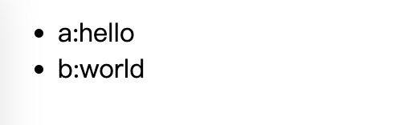
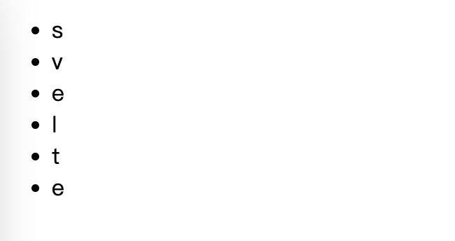
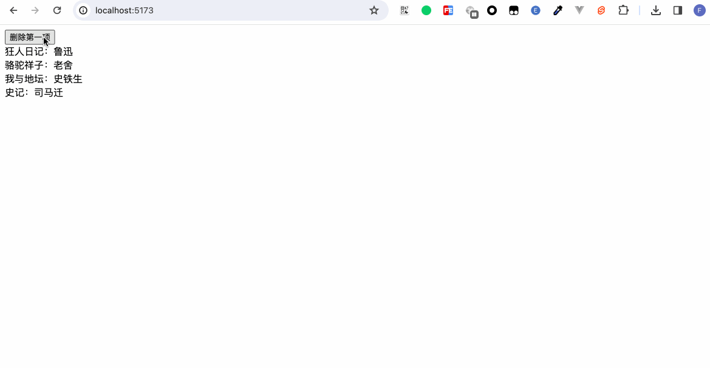

It is not only about the storage and update of data when programming, update and display data are important too. In this chapter, we will understand how to display or hide page content through conditional judgment and how to display array content through list loops. 

## If

By using `{#if}`, `{:else if}`, `{:else}`, `{/if}` within the template syntax to control the displayed content: 

```javascript
{#if condition}
  code
{:else if condition}
  code
{:else condition}
  code
{/if}
```

`condition` is the conditional expression we need to write, `code` is the display content of the page. Among them, `{:else if}` and `{:else}` are optional.

```html
<script>
  let score = 0;
</script>

<input type="range" min="0" max="100" bind:value={score} />
分数{score}：
{#if score>=0 && score< 60}
  不及格
{:else if score>=60 && score < 80}
  良好
{:else}
  优秀
{/if}
```


## each

Use `{#each}`, `{:else}`, `{/each}` to loop and display the content. 

```javascript
{#each list as item, index (key))}
  code
{:else}
  code
{/each}
```

`{:else}` is optional. If meet `else` logic indicates that the array used for the loop is an empty array.

```html
<script>
  let arr = [];

  const onAdd = () => {
    arr = [...arr, 1];
  }

  const onRemove = () => {
    arr.pop();
    arr = arr;
  }
</script>

<button on:click={onAdd}>add</button>
<button on:click={onRemove}>remove</button>
<ul>
  {#each arr as item}
    <li>{item}</li>
    {:else}
      No Data
  {/each}
</ul>
```


In addition to displaying normal arrays, it can also display data that inherits the Iterable interface.

Traverse Entry objects: 
```html
<script>
  let map = {
    a: 'hello',
    b: 'world'
  }
  let list = Object.entries(map)
</script>

<ul>
{#each list as item}
  <li>{item[0]}:{item[1]}</li>
{/each}
</ul>
```


Traverse the string: 
```html
<script>
  let list = 'svelte';
</script>

<ul>
{#each list as item}
  <li>{item}</li>
{/each}
</ul>
```


### Deconstruction

The deconstruction assignment can be performed for each item of the array. 

```html
<script>
  let arr = [{
    name: 'Bob',
    age: 18
  }, {
    name: 'Carter',
    age: 19
  }]
</script>

{#each arr as { name, age }}
  <p>
    姓名：{name}，年龄：{age}
  </p>
{/each}
```


### key

Whether in React, Vue or Svelte, when traversing arrays, we can see that it is required as much as possible to attach the key attribute to the traversal items. Why is this? 

First, let's take an example: 
```html
<script>
  // Child.svelte
  export let bookName;

  const authors = {
    狂人日记: "鲁迅",
    骆驼祥子: "老舍",
    我与地坛: "史铁生",
    史记: "司马迁",
  };

  const author = authors[bookName];
</script>

<div>{bookName}：{author}</div>
```

Then we use this Child component:
```html
<script>
  import Book from "./Child.svelte";

  let books = [{
      id: 1,
      name: "狂人日记",
    },{
      id: 2,
      name: "骆驼祥子",
    },{
      id: 3,
      name: "我与地坛",
    },{
      id: 4,
      name: "史记",
    },
  ];

  const deleteBook = () => {
    books = books.slice(1);
  };
</script>

<button on:click={deleteBook}>删除第一项</button>

{#each books as item}
  <Book bookName={item.name} />
{/each}
```

When we click to delete, we will be surprised to see that the author and the book title do not match! 


If you're interested, the operation of deleting the first item can be changed to adding a new item to the first item of the array, and this kind of phenomenon still exists.

At this time, it is the turn of our `key` to come into play. 

```javascript
{#each list as item, index (key)}
或
{#each list as item (key)}
```

Change the example code:
```html
...

{#each books as item (item.id)}
  <Book bookName={item.name} />
{/each}
```



When we use the `key`, it is necessary to ensure the uniqueness of the key value: When we use the key, in fact, we are telling Svelte to map each rendering block to this key. When the key no longer exists, the corresponding display block is deleted and removed from the DOM. However, if we do not specify the key, Svelte will use the index of the list as the key. If we delete the block from the list, the key value does not change. If the key remains unchanged and the props change, only the props will be updated instead of recreating the block. 

## Summary

In this chapter, we have learned:
- Conditional judgment in Svelte. The display content is switched through `{#if}{:else if}{:else}{/if}`.
- Loop judgment in Svelte. The list content is displayed through `{#each}{:else}{/each}`. 
- The role of the `key` in the loop.
- The statements of conditional judgment and loop judgment are placed in a special tag language. Maybe readers will get confused when remembering these tags at the beginning. Here, I summarize the rules for everyone. The tags start with `#`, middle part has `:`, and end with `/`. Isn't it much easier to remember? 
