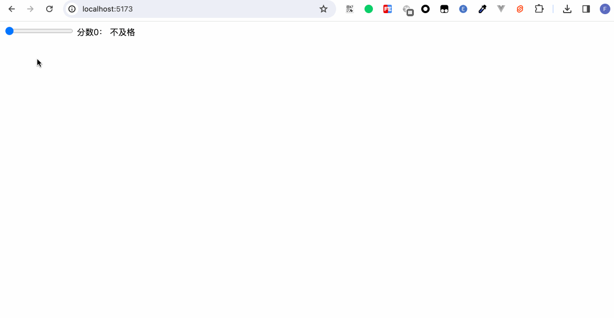
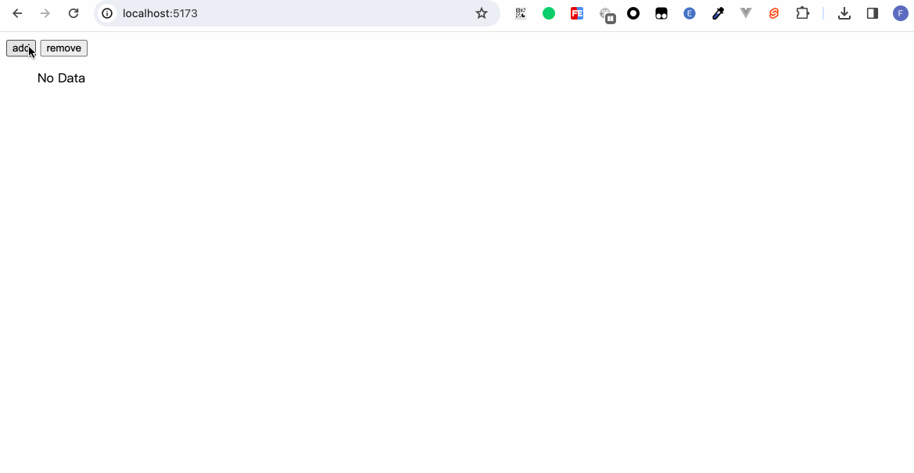
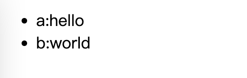
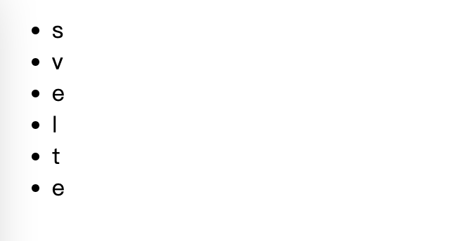
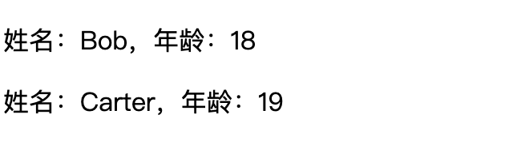
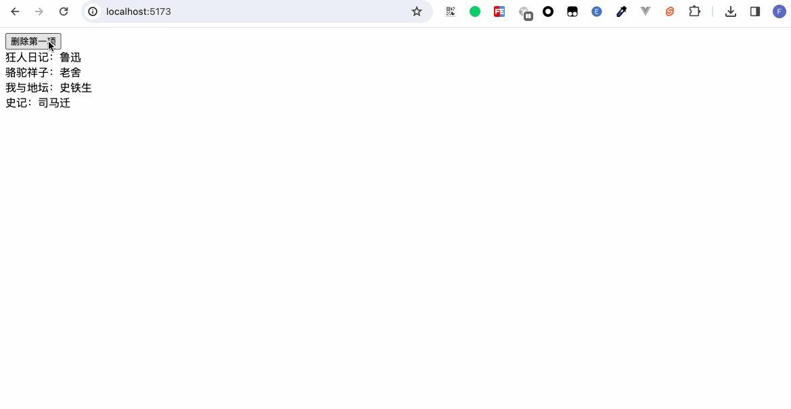

在程序语言中，当然不止数据的存储和更新，同样重要的还有如何更新和展示这些数据。本章中，笔者将与读者们一起了解如何通过条件判断来展示或隐藏页面内容，如何通过列表循环来展示数组内容。

## 条件判断

通过在模板语法内使用`{#if}`、`{:else if}`、`{:else}`、`{/if}`来控制展示内容：
```javascript
{#if condition}
  code
{:else if condition}
  code
{:else condition}
  code
{/if}
```

condition是我们要写的条件表达式，code则是页面的展示内容。其中`{:else if}`和`{:else}`是可选的。

```html
<script>
  let score = 0;
</script>

<input type="range" min="0" max="100" bind:value={score} />
分数{score}：
{#if score>=0 && score< 60}
  不及格
{:else if score>=60 && score < 80}
  良好
{:else}
  优秀
{/if}
```


## 循环判断

使用`{#each}`、`{:else}`、`{/each}`来循环展示内容。
```javascript
{#each list as item, index (key))}
  code
{:else}
  code
{/each}
```

其中`{:else}`可选。else命中表示用于循环的数组为空数组。
```html
<script>
  let arr = [];

  const onAdd = () => {
    arr = [...arr, 1];
  }

  const onRemove = () => {
    arr.pop();
    arr = arr;
  }
</script>

<button on:click={onAdd}>add</button>
<button on:click={onRemove}>remove</button>
<ul>
  {#each arr as item}
    <li>{item}</li>
    {:else}
      No Data
  {/each}
</ul>
```



除了展示正常的数组外，还能展示继承了Iterable接口的数据。  

遍历Entry对象：
```html
<script>
  let map = {
    a: 'hello',
    b: 'world'
  }
  let list = Object.entries(map)
</script>

<ul>
{#each list as item}
  <li>{item[0]}:{item[1]}</li>
{/each}
</ul>
```


遍历字符串：
```html
<script>
  let list = 'svelte';
</script>

<ul>
{#each list as item}
  <li>{item}</li>
{/each}
</ul>
```


### 解构
可以对数组的每一项进行解构赋值。
```html
<script>
  let arr = [{
    name: 'Bob',
    age: 18
  }, {
    name: 'Carter',
    age: 19
  }]
</script>

{#each arr as { name, age }}
  <p>
    姓名：{name}，年龄：{age}
  </p>
{/each}
```


### key

不管是在React、Vue还是在Svelte中，数组遍历时，我们都能看到会尽可能地要求为遍历项带上key属性。这是为什么呢？

首先我们看一个例子：
```html
<script>
  // Child.svelte
  export let bookName;

  const authors = {
    狂人日记: "鲁迅",
    骆驼祥子: "老舍",
    我与地坛: "史铁生",
    史记: "司马迁",
  };

  const author = authors[bookName];
</script>

<div>{bookName}：{author}</div>
```

然后我们引用这个子组件：
```html
<script>
  import Book from "./Child.svelte";

  let books = [{
      id: 1,
      name: "狂人日记",
    },{
      id: 2,
      name: "骆驼祥子",
    },{
      id: 3,
      name: "我与地坛",
    },{
      id: 4,
      name: "史记",
    },
  ];

  const deleteBook = () => {
    books = books.slice(1);
  };
</script>

<button on:click={deleteBook}>删除第一项</button>

{#each books as item}
  <Book bookName={item.name} />
{/each}
```

当我们点击删除时，便会惊讶地看到，作者和书名对不上了！

如果读者感兴趣，可以把删除第一项的操作，改为往数组的第一项添加新项目，此类现象仍旧存在。

这时候便轮到我们的key派上用场。
```javascript
{#each list as item, index (key)}
或
{#each list as item (key)}
```

修改上述例子的代码
```html
...

{#each books as item (item.id)}
  <Book bookName={item.name} />
{/each}
```



当我们使用key时，需要确保**key值的唯一**：当我们使用key时，实际上是在告诉Svelte将每个渲染block映射到该key。当key不再存在时，删除对应展示block并将其从DOM中删除。但是，如果我们不指定key时，Svelte将使用列表的索引作为key。如果我们从列表中删除block，key值并没有变化。如果key保持不变并且props发生变化，将会只更新props而不是重新创建block。

## 小结

本章我们学习了程序语言中非常重要的两大结构：条件判断与循环判断。在循环判断中，我们演示了key值的作用。
条件判断与循环判断的语句都放在特殊的标签语言当中。可能刚开始读者朋友们记这些标签会偶尔搞混，这里笔者给大家总结了规律。标签以`#`开头，中间部分`:`，以`/`结尾，这样是不是好记多了。