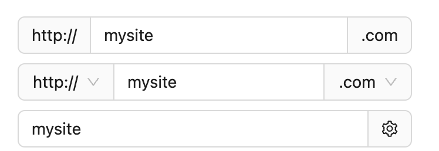
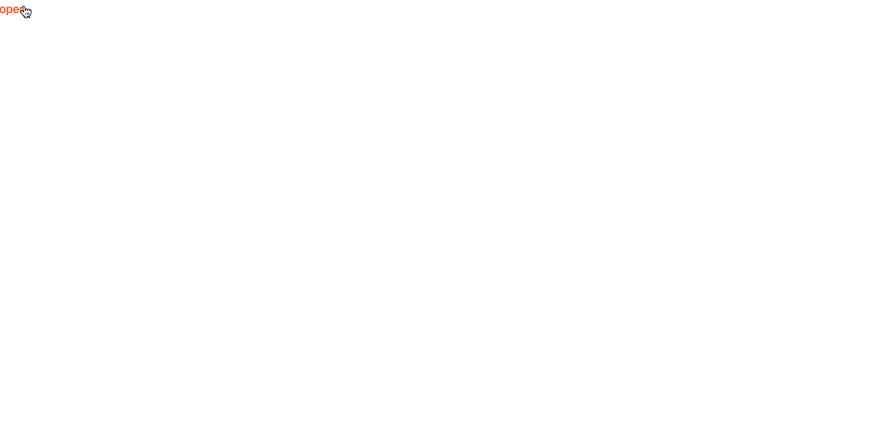

When we encapsulate a function into a component and reference it, the usual way of writing is as follows: 
```html
<Component />
```

However, in some cases, we hope that our components can support the following functions: 
```html
<Component>My custom content</Component>
```

One of the most common scenarios is the Modal pop-up component in UI components. Modal's visible and hidden are universal, but the content inside the Modal is diverse and completely defined by the user. And this module that can insert custom content into the component is called a "slot". 

## Default slot

In Vue, the slot tag is used to indicate that this is a slot. In React, due to the use of JSX syntax, everything can be written as js, so there is no specific tag like in Vue. The interpolation of the component can be obtained directly from `props.children`. And Svelte provides a specific tag `slot` to place the slot content just like Vue. 

The writing method is as follows: 
```html
<slot><!-- Optional content --></slot>
```

We declare two components Child.svelte and Father.svelte:

```html
<!-- Child.svelte -->
<slot>child content</slot>
```
  
```html
<!-- Father.svelte -->
<script>
  import Child from './Child.svelte';
</script>

<Child></Child>
```

On the page we can see string content "child content". Because if there is content inside `<slot>`, when we do not use the slot externally, this part of the content will be displayed as the default value.

If we add the following content to the Child component: 
```html
<Child>
  father content
</Child>
```
Then we will see that the default content provided within the slot has been replaced by the content of the external component "father content". 


## Named slot

Sometimes we only hope that users can replace a certain part of the component's functionality, such as using an input box, we allow users to replace the prefix and suffix: 



Or it could be a Modal modal component, we allow users to use the pre-written header and footer, and also allow users to customize the header and footer. Then we need to use named slots. 

```html
<slot name="x"><!-- Optional --></slot>
```

For example:
```html
<script>
  // Child.svelte
  import { createEventDispatcher } from "svelte";

  const dispatch = createEventDispatcher();

  export let show;

  let dialogRef;

  $: if (dialogRef && show) {
    dialogRef.showModal();
  }
  
  $: if (dialogRef && !show) {
    dialogRef.close();
  }
  
  const onClose = () => {
    dialogRef.close();
    show = false;
  };
</script>

<dialog bind:this={dialogRef}>
  <header>
    <slot name="header">
      header
      <span on:click|stopPropagation={onClose}>close</span>
    </slot>
  </header>
  <main>
    <slot>body</slot>
  </main>

  <footer><slot name="footer">footer</slot></footer>
</dialog>

<style>
  dialog {
    width: 300px;
    height: 250px;
    border: 1px solid black;
  }

  header {
    height: 50px;
    display: flex;
    align-items: center;
    justify-content: space-between;
  }
  main {
    height: 150px;
  }

  footer {
    height: 50px;
  }

  dialog::backdrop {
    background-image: linear-gradient(
      45deg,
      magenta,
      rebeccapurple,
      dodgerblue,
      green
    );
    opacity: 1;
  }
</style>
```
  
```html
<script>
  import Modal from './Child.svelte';
  let show = false;

  const onOpen = () => {
    show = true;
  }
</script>

<Modal bind:show={show}>
</Modal>
<button on:click={onOpen} >open</button>
```

We can see: 


When we customize slot content:
```html
<script>
  import Modal from './Child.svelte';
  let show = false;

  const onOpen = () => {
    show = true;
  }

  const onClose = () => {
    show = false;
  }
</script>

<Modal bind:show={show}>
  <div on:click={onClose} slot="header"> custom header </div>
  <div slot="footer">custom footer</div>
  custom body content
</Modal>
<button on:click={onOpen} >open</button>
```

Then we can see:


## slot props

The value is passed back to the parent level through the prop attribute, and the parent level uses the `let:` directive to expose the value to the slot template. 

```html
<slot prop={value}></slot>
```

A very classic example: In the table cell, obtain the value of the corresponding data item. 

Since [dynamic slot](https://svelte-5-preview.vercel.app/docs/snippets#passing-snippets-to-components) is supported only in Svelte 5, therefore, to implement the passing of values in the table, we can only write as follows: 

```html
<script>
  // Child.svelte
  export let columns = [];
  export let data = [];
</script>

<table >
  <thead>
    <tr>
    {#each columns as column}
      <th>{column.name}</th>
    {/each}
    </tr>
  </thead>
  <tbody>
    {#each data as row}
      <tr>
        <slot {row}></slot>
      </tr>
    {/each}
  </tbody>
</table>

<style>
  table, th {
    border: 1px solid black;
  }
  :global(td) {
    border: 1px solid black;
  }
</style>
```

```html
<script>
  // Father.svelte
  import Table from "./Child.svelte";

  let columns = [
    {
      key: "id",
      name: "id",
    },
    {
      key: "name",
      name: "姓名",
    },
    {
      key: "age",
      name: "年龄",
    },
  ];

  let data = [
    {
      id: 1,
      name: "张三",
      age: 18,
    },
    {
      id: 2,
      name: "李四",
      age: 19,
    },
  ];
</script>

<Table {data} {columns}>
  <svelte:fragment let:row>
    <td>{row.id}</td>
    <td>{row.name}</td>
    <td>{row.age}</td>
  </svelte:fragment>
</Table>

```


The generally applicable shorthand rules: `let:item` is equivalent to `let:item={item}`, and `<slot {item}>` is equivalent to `<slot item={item}>`. 

## `$$slots`

`$$slots` is an object whose keys are the names of the slots passed from the parent to the component. If the parent does not pass a slot with a specific name, then that name will not appear in `$$slots`. We can use this feature to determine whether the parent has passed the slot content with a specific name: 

```html
{#if $$slots.header}
  <slot name="header"></slot>
{/if}
```

Continue with the above Modal component as an example. We try to print out `$$slots` within the component: `console.log('$$slots', $$slots, $$props);`


We can see that `$$slots` is an object. `default` can represent the default slot, and other keys represent other named slots. If the corresponding slot is used, the value of the corresponding key is true; otherwise, it is false. Therefore, if we want to hijack the content of slots and redefine it like React and Vue, it is impossible.

For example, the Space component of Antd is used to separate the child elements wrapped by it. The core of its implementation is to add child element styles to the content of the slot, and these styles can add spacing.

The [source code](https://github.com/ant-design/ant-design/blob/4.24.15/components/space/index.tsx) content of the Space component of Ant-Design: 

```javascript
const childNodes = toArray(children, { keepEmpty: true });

const nodes = childNodes.map((child, i) => {
  if (child !== null && child !== undefined) {
    latestIndex = i;
  }

  const key = (child && child.key) || `${itemClassName}-${i}`;

  return (
    <Item
      className={itemClassName}
      key={key}
      direction={direction}
      index={i}
      marginDirection={marginDirection}
      split={split}
      wrap={wrap}
    >
      {child}
    </Item>
  );
});
```

The [source code](https://github.com/vueComponent/ant-design-vue/blob/4.1.2/components/space/index.tsx) content of the Space component of Ant-Design-Vue: 

```javascript
const children = slots.default?.();
const items = filterEmpty(children);
const len = items.length;

const itemClassName = `${prefixCls.value}-item`;
const horizontalSizeVal = horizontalSize.value;
const latestIndex = len - 1;
return (
  <div>
    {items.map((child, index) => {}
  </div>
)
```

Then if Svelte wants to achieve such functions, how should it operate? We will explain it in the later part. 

## Summary

In this chapter, we have learned:

- The concept of slots. Through `<slot></slot>`, page content passed externally can be received.
- Specified name slots. When defining, the specific name slot is specified through `<slot name="x">`, and when using, it is called in the form of adding the `slot `attribute within the html tag (`<div slot="x">`).
- The value passing of slots. The value is passed back to the parent through the prop attribute, and the parent exposes the value to the slot template using the `let: `directive.
- The built-in attribute `$$slots` provided by Svelte 
