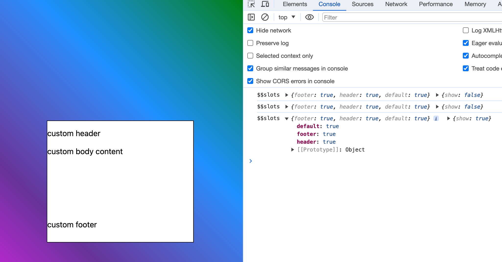

当我们将功能封装成一个组件并引用时，通常的写法如下：
```html
<Component />
```

然而一些情况下，我们希望我们的组件可以支持如下功能：
```html
<Component>我的自定义内容</Component>
```
一个最常见的场景便是UI组件中的Modal弹窗组件。弹窗的弹出隐藏是通用的，但是弹窗内的内容则是五花八门，完全由用户自己定义，而这种能够往组件内部插入自定义内容的模块，我们称之为“插槽”。

### 默认插槽

在Vue中，使用 `slot`标签来表示这是一个插槽。在React当中，由于使用jsx语法，万物都可当成js来写，所以没有像Vue一样的特定标签，可以直接从 `props.children`拿到组件的插值。而Svelte和Vue一样，提供了特定的标签 `slot`来放置插槽内容。

写法如下：

```html
<slot><!-- 可选回调 --></slot>
```

我们声明两个组件Child.svelte和Father.svelte

```html
<!-- Child.svelte -->
<slot>child content</slot>
```
  

```html
<!-- Father.svelte -->
<script>
	import Child from './Child.svelte';
</script>

<Child></Child>
```

此时页面上我们看见的是“child content”这个字符串内容。因为如果`<slot>`内部有内容，当我们没有在外部没有使用到slot时，这部分内容便会作为默认值展示。

如果我们往Child组件内添加一下内容，
```html
<Child>
	father content
</Child>
```
那么我们会看到，原来slot内提供的默认内容已被替换成了外部组件的内容“father content”。


### 具名插槽

有时候我们只希望用户能够替换组件功能的某一部分内容，比如一个input输入框，我们允许用户替换prefix和suffix，


亦或者是一个Modal模态框，我们允许用户使用组件写好的header和footer，也允许用户自定义头部和底部，那么这时候，我们便需要使用到带名字的插槽，即具名插槽。

```html
<slot name="x"><!-- 可选回调 --></slot>
```

  举个例子：
```html
  <script>
  import { createEventDispatcher } from "svelte";

  const dispatch = createEventDispatcher();

  export let show;

  let dialogRef;

  $: if (dialogRef && show) {
    dialogRef.showModal();
  }
  
  $: if (dialogRef && !show) {
    dialogRef.close();
  }
  
  const onClose = () => {
    dialogRef.close();
    show = false;
  };
</script>

<dialog bind:this={dialogRef}>
  <header>
    <slot name="header">
      header
      <span on:click|stopPropagation={onClose}>close</span>
    </slot>
  </header>
  <main>
    <slot>body</slot>
  </main>

  <footer><slot name="footer">footer</slot></footer>
</dialog>

<style>
  dialog {
    width: 300px;
    height: 250px;
    border: 1px solid black;
  }

  header {
    height: 50px;
    display: flex;
    align-items: center;
    justify-content: space-between;
  }
  main {
    height: 150px;
  }

  footer {
    height: 50px;
  }

  dialog::backdrop {
    background-image: linear-gradient(
      45deg,
      magenta,
      rebeccapurple,
      dodgerblue,
      green
    );
    opacity: 1;
  }
</style>
```
  
```html
<script>
	import Modal from './Chapter00_Child.svelte';
	let show = false;

	const onOpen = () => {
		show = true;
	}
</script>

<Modal bind:show={show}>
</Modal>
<button on:click={onOpen} >open</button>```


当我们自定义slot内容时
```html
<script>
	import Modal from './Chapter00_Child.svelte';
	let show = false;

	const onOpen = () => {
		show = true;
	}

	const onClose = () => {
		show = false;
	}
</script>

<Modal bind:show={show}>
	<div on:click={onClose} slot="header"> custom header </div>
	<div slot="footer">custom footer</div>
	custom body content
</Modal>
<button on:click={onOpen} >open</button>
```


## 传值

通过prop属性将值传回父级,父级使用 `let:`指令将值暴露到slot模板。
```html
<slot prop={value}></slot>
```


一个非常经典的例子：表格单元格，以及插槽传值。

Svelte5中方能支持[动态slot](https://svelte-5-preview.vercel.app/#H4sIAAAAAAAACo1Ry07DMBD8lZVBcitFiYBbSKpy54B6bXpI0w1YOLZlbxCVlX9HdkIgvMRt1zuz65nxrBUSHcv3nqm6Q5azO2NYwuhsQuNeUBKyhDnd2ya8FK6xwtCmUhWJzmhLcC8cQWt1BzzNQpOONH4bQBIJBGHnoIRLRzXhah_eK_IQruTAm96R7ngCz3jOgbda8wQIXykHHqhXfEj-phxru6Rcf6cobbtaLmE3fAiow7pSRfahTBVRk4__HqJWf-GUMAYJWq1XYbAexgM7VCe0Qj2GychJw4k49tlEG5ZLjrX9Zcmxtn8tKaLDG5awTp9EK_DEcrI9DsmcYAD8N8KQjh_zSSBNUyc1PVhtHAwhLxPK1fr2qz29nEzBunma4q1dLCZB_kK0MMo4G4SyLOfQJkRFftto5Qjej0I5l24fuc94PszwQoqN39ro1AycXCwyKTbT5RylwwVrh4-9XPr6mZCJdvI5yIkm9_IHiw_DGxgyf_gwAwAA)
<slot prop={value}></slot>


通常适用的速记规则：`let:item` 等效于 `let:item={item}`，并且 `<slot {item}>` 等效于 `<slot item={item}>`


```html
<script>
  export let columns = [];
  export let data = [];
</script>

<table >
  <thead>
    <tr>
    {#each columns as column}
      <th>{column.name}</th>
    {/each}
    </tr>
  </thead>
  <tbody>
    {#each data as row}
      <tr>
        <slot {row}></slot>
      </tr>
    {/each}
  </tbody>
</table>

<style>
  table, th {
    border: 1px solid black;
  }
  :global(td) {
    border: 1px solid black;
  }
</style>
```

```html
<script>
	import Table from './Chapter00_Child.svelte';

	let columns = [{
		key: 'id',
		name: 'id'
	}, {
		key: 'name',
		name: '姓名'
	}, {
		key: 'age',
		name: '年龄'
	}];

	let data = [{
		id: 1,
		name: '张三',
		age: 18
	}, {
		id: 2,
		name: '李四',
		age: 19
	}]
</script>

<Table {data} {columns}>
	<svelte:fragment let:row>
		<td>{row.id}</td>
		<td>{row.name}</td>
		<td>{row.age}</td>
	</svelte:fragment>
</Table>
```


## `$$slots`
`$$slots``$$slots`是一个对象，其键是父级传递到组件中的插槽的名称。如果父级没有传入具有特定名称的槽，则该名称将不会出现在`$$slots`. 这允许组件仅在父级提供插槽时才渲染插槽。TODO重写前面这段话。


仍旧以上面的Modal组件为例，我们在组件内试着打印出`$$slots`： `console.log('$$slots', $$slots, $$props);`

我们可以看到，`$$slots`是一个对象，default可以表示默认的slot，其他key表示其他具名插槽。如果使用了对应的slot，对应的key的值便是true，反之则为false。因此，如果我们想像React和Vue那样劫持slots的内容并重新定义，那是不可能了。

比如Antd的Space组件，作用是把被其包裹的子元素间隔开。其实现核心就是对slot的内容添加子元素样式，这些样式能够添加间距。

Ant-Design的Space组件的[源码](https://github.com/ant-design/ant-design/blob/4.24.15/components/space/index.tsx)内容：
```javascript
const childNodes = toArray(children, { keepEmpty: true });

const nodes = childNodes.map((child, i) => {
    if (child !== null && child !== undefined) {
      latestIndex = i;
    }

    const key = (child && child.key) || `${itemClassName}-${i}`;

    return (
      <Item
        className={itemClassName}
        key={key}
        direction={direction}
        index={i}
        marginDirection={marginDirection}
        split={split}
        wrap={wrap}
      >
        {child}
      </Item>
    );
});
```

Ant-Design-Vue的Space组件的[源码](https://github.com/vueComponent/ant-design-vue/blob/4.1.2/components/space/index.tsx)内容：
```javascript
const children = slots.default?.();
  const items = filterEmpty(children);
  const len = items.length;

  const itemClassName = `${prefixCls.value}-item`;
  const horizontalSizeVal = horizontalSize.value;
  const latestIndex = len - 1;
  return (
	<div>
	  {items.map((child, index) => {}
	</div>
)
```

那如果Svelte想要实现此类功能应该如何操作？我们留到后文《指令》中进行讲解。

## 小结

本章我们了解了“插槽”的概念。