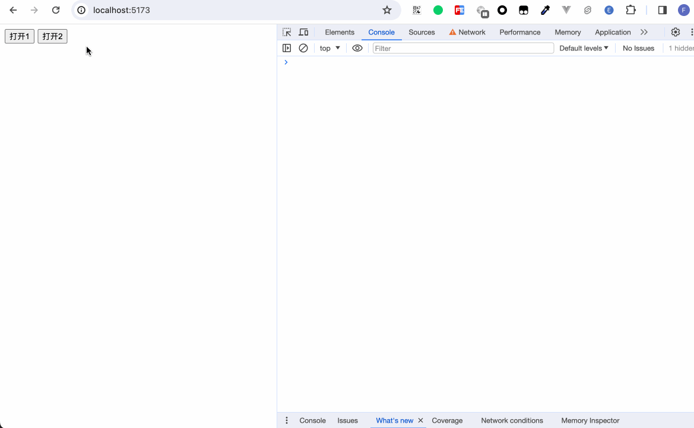
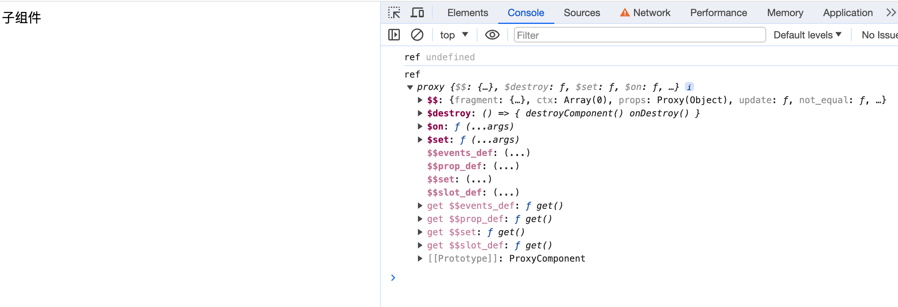
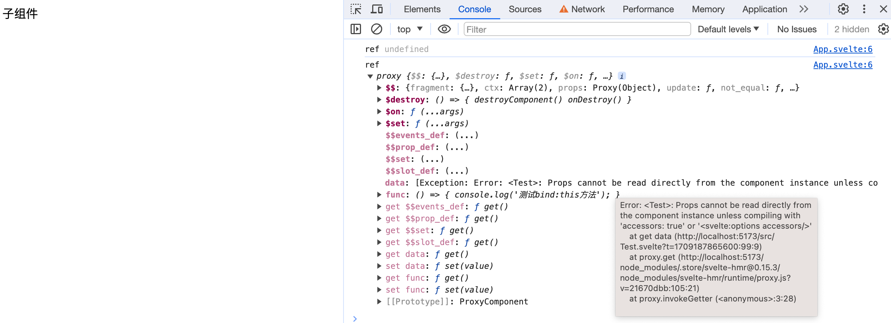
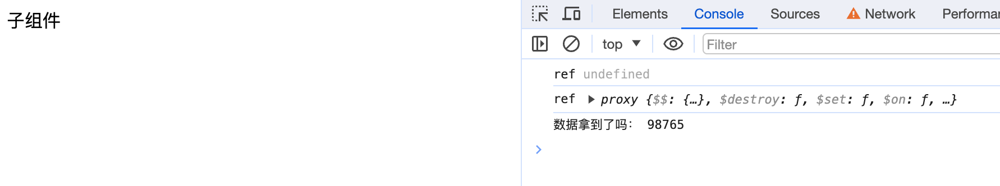
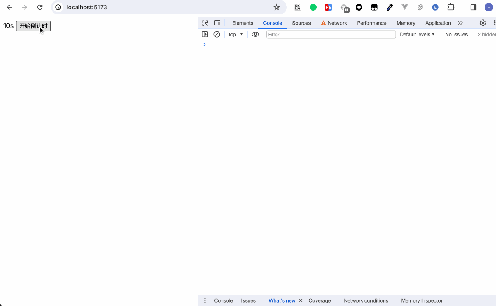
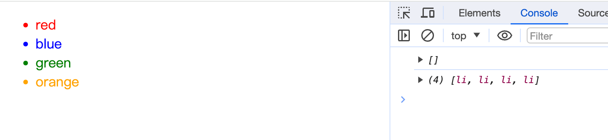

即使当今的主流开发模式提倡的是数据驱动视图，然而我们仍旧无法完全摆脱对dom的操作，我们也不能摆脱。这里笔者可以随便举几个例子：input输入框的`focus`和`blur`方法的触发、使用`<input type="file" />`来自定义实现上传时的手动`click`等。

无论是在React还是在Vue中，都有提供对dom的引用的api操作，而这种对dom的引用通常称为Ref。那在Svelte中，我们要如何拿到我们的Ref呢？

## bind:this

在《数据与方法》一章，我们在使用双向绑定功能时，用到了`bind:value={value}`的方式。而如果想要访问真实的dom，同样需要使用到`bind`。

```javascript
bind:this={dom_node}
```

### dom
我们看一个例子：
```html
<script>
  let dialogDom;
  let dialogRef;

  const open1 = () => {
    dialogDom = document.querySelector('dialog');
    console.log('dom', [dialogDom]);
    if (dialogDom) {
      dialogDom.showModal();
    }
  }

  const open2 = () => {
    console.log('ref', [dialogRef]);
    if (dialogRef) {
      dialogRef.showModal();
    }
  }

  const close = () => {
    dialogDom && dialogDom.close();
    dialogRef && dialogRef.close();
  }
</script>

<button on:click={open1}>打开1</button>
<button on:click={open2}>打开2</button>
<dialog bind:this={dialogRef}>
  dialog content <span on:click={close}>close</span>
</dialog>
```
笔者用两种方式实现了打开dialog的逻辑。open1使用原生dom来操作，open2使用到了`bind:this`。这里笔者将`bind:this`绑定到正常的html标签dialog上，然后我们能够看到，通过`bind:this`得到的数据和使用原声dom api操作得到的数据并无差异。


### 组件
`bind:this`除了能够绑定html标签上，也能够绑定到组件上。

### export
在某些特定场合下，我们可能希望直接操作子组件内的数据和方法。

假设我们有一个子组件：
```html
<script>
  let data = '测试bind:this数据';

  const func = () => {
    console.log('测试bind:this方法');
  }
</script>
```

此时我们外部引用这个组件，并打印出这个组件的实例
```html
<script>
  import Child from './Child.svelte';

  let ref;

  $: console.log('ref', ref);
</script>

<Child bind:this={ref} />
```


此时我们并不能拿到子组件的数据和方法。要想拿到子组件的数据和方法，我们需要使用到`export`。
```html
<script>
  export let data = '测试bind:this数据';

  export const func = () => {
    console.log('测试bind:this方法');
  }
</script>
```

我们可以看到，数据与方法都正常导出了。然而因为使用了`export`，原来的数据变成了一个prop属性，Svelte并不允许我们直接拿到这个属性。我们要么在`<svelte:options>`中做一些配置，要么就是我们在子组件内定义一个专门取数据的方法。
```html
<script>
// Child.svelte
  export let data = '测试bind:this数据';

  export const func = () => {
    console.log('测试bind:this方法');
  }
  
  export const getData = () => {
    return data;
  }
</script>
```

```html
<script>
  import Child from './Child.svelte';

  let ref;

  $: console.log('ref', ref);

  $: {
    if (ref) {
      let data = ref.getData();
      console.log('数据拿到了吗：', data);
    }
  }
</script>

<Child bind:this={ref} data={'98765'} />
```


我们以真实场景来举个例子。  
我们封装了一个倒计时组件，倒计时内部有启动倒计时的功能。而何时触发倒计时则由外部引用的页面决定：
```html
<script>
  // Countdown.svelte
  import { onDestroy, createEventDispatcher } from 'svelte';

  const dispatch = createEventDispatcher();

  export let countdown = 60;
  export let unit = 's';

  let timer = null;

  const clearTimer = () => {
    timer && clearInterval(timer);
  }

  const initTimer = () => {
    clearTimer();
    timer = window.setInterval(() => {
        countdown--;
        if (countdown < 1) {
          clearTimer();
          end();
        }
      }, 1000);
  }

  const end = () => {
    dispatch('end');
  }

  export const start = () => {
    initTimer();
  }

  onDestroy(() => {
    clearTimer();
  })
</script>

<span>{ countdown }{ unit }</span>
```
首先我们实现了一个Countdown组件，这个组件对外暴露了一个start方法，方便外层手动控制计时器的开始。

```html
<script>
  import Countdown from "./Countdown.svelte";

  let ref;

  const onCountdownEnd = () => {
    console.log("倒计时结束！");
  };

  const onCountdownStart = () => {
    if (ref) {
      ref.start();
    }
  };
</script>

<Countdown bind:this={ref} countdown={10} on:end={onCountdownEnd} />
<button on:click={onCountdownStart}>开始倒计时</button>
```
外层`bind:this`绑定到Countdown组件，在点击按钮时，调用倒计时组件实例的start方法。



## 数组

当我们想在`{#each}`中使用`bind:this`时，使用数组来存储绑定的值。

```html
<script>
  let arr = ['red', 'blue', 'green', 'orange']
  let refArr = [];

  $: {
    console.log(refArr);
    refArr.forEach(li => {
      li.setAttribute('style', `color: ${li.innerText};`)
    })
  }
</script>

<ul>
{#each arr as item, index}
  <li bind:this={refArr[index]}>{item}</li>
{/each}
</ul>
```



## 小结

本章我们学习了：
- 使用`bind:this`绑定到html标签，用来获取真实DOM节点
- 使用`bind:this`绑定到组件上，用来获取组件实例
- 组件如何对外暴露自身方法
- 在循环列表中使用`bind:this`
