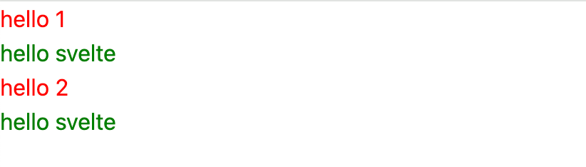
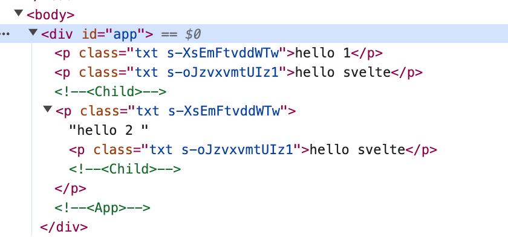
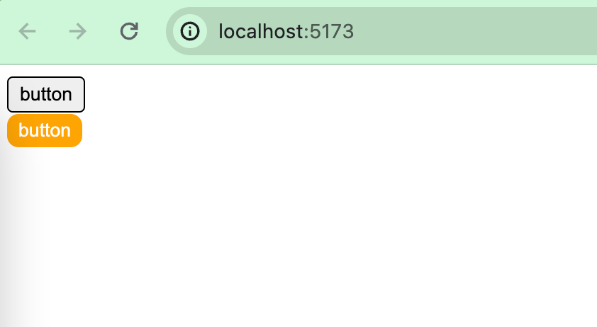
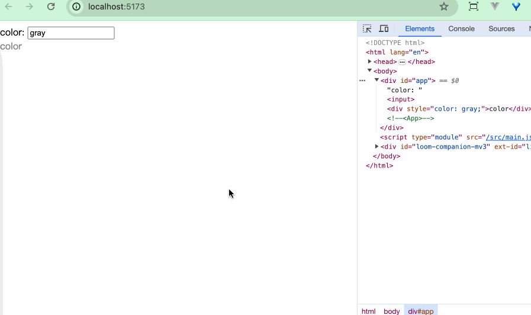
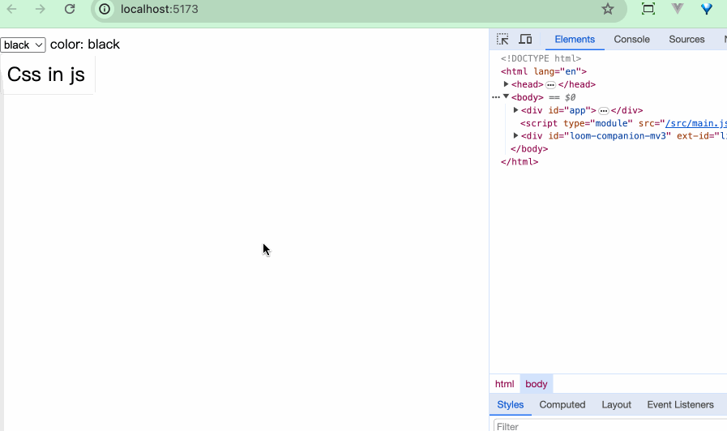

## style标签

### scoped

Styles written within `<style></style>` are scoped by default, effective within the component.

```html
<!-- Child.svelte -->
<p class="txt">hello svelte</p>

<style>
  .txt {
    color: green;
  }
</style>
```

```html
<script>
// App.svelte
  import Child from './Child.svelte';
</script>

<p class="txt">hello 1</p>
<Child />

<p class="txt">
  hello 2
  <Child />
</p>

<style>
.txt {
  color: red;
}
</style>
```



In the above example, I wrote a component with a green font, and you can see that even though the external fonts are all set to red, it doesn't affect the internal style of the component.



As you can see from the compiled html content, a separate s-xxx selector is added to the style class of each node.


### global

In some cases, we need to make our styles effective in more than just the component, and the most common scenario is to modify the style of a UI component.The most common scenario is modifying the style of a UI component. A UI component library usually has its own fixed style, and when we refer to the UI component library, we often need to re-modify the original style to fit the business.


```html
<!-- Button.svelte -->
<button class="svelte-button">button</button>

<style>
  .svelte-button {
    border: 1px solid black;
    border-radius: 4px;
    padding: 4px 8px;
  }
</style>
```

```html
<script>
  // App.svelte
  import Button from './Button.svelte';
</script>

<Button />

<div class="button-wrapper">
<Button />
</div>

<style>
:global(.button-wrapper .svelte-button) {
  border: none;
  background-color: orange;
  border-radius: 8px;
  color: white;
}
</style>
```



We set up a Button.svelte to serve as an example of a UI component. When App.svelte introduces this component normally, its original styles are displayed, and with `:global()` we are able to override the styles within the component normally.


## Preprocessor

CSS can be used to modify the style and appearance of web pages, but strictly speaking, CSS is not a programming language, can not use it to program.CSS is not like other programming languages can be as complex program logic operations, and write a very laborious, difficult to organize and maintain the code.CSS preprocessor came into being.

CSS preprocessor function is through the variables, nesting, functions and other logical features, so that CSS has some programmable features to improve the development efficiency of developers.

Currently the mainstream CSS preprocessors are Sass, Less, Stylus, PostCSS.


### Less
```bash
npm install svelte-preprocess-less less -D
```

```javascript
// vite.config.js
import { defineConfig } from 'vite'
import { svelte } from '@sveltejs/vite-plugin-svelte'
import { less } from 'svelte-preprocess-less';

// https://vitejs.dev/config/
export default defineConfig({
  plugins: [svelte({
    preprocess: {
      style: less()
    }
  })],
})
```

```less
// component.less
.wrap {
  header {
    color: aquamarine;
  }
  .content {
    font-size: 24px;
    font-weight: bold;
  }
}
```

```html
<!-- Component.svelte -->
<div class="wrap">
  <header>hello world</header>
  <div class="content">content</div>
</div>

<style lang="less">
@import "./component.less";
</style>
```


### Sass

```bash
npm install svelte-preprocess-sass sass -D
```

```javascript
// vite.config.js
import { defineConfig } from 'vite'
import { svelte } from '@sveltejs/vite-plugin-svelte'
import { sass } from 'svelte-preprocess-sass';

// https://vitejs.dev/config/
export default defineConfig({
  plugins: [svelte({
    preprocess: {
      style: sass()
    }
  })],
})
```

```html
<div class="wrap">
  <header>hello world</header>
  <div class="content">content</div>
</div>

<style lang="sass">
@import ./component.sass
</style>
```

```scss
// component.sass
.wrap 
  header 
    color: aquamarine
  .content 
    font-size: 24px
    font-weight: bold
```

### Stylus

```bash
npm install svelte-preprocess stylus -D
```

Stylus needs to be configured in svelte.config.js in addition to vite.config.js.

```javascript
// vite.config.js
import { defineConfig } from 'vite'
import { svelte } from '@sveltejs/vite-plugin-svelte'

// https://vitejs.dev/config/
export default defineConfig({
  plugins: [svelte()],
})
```

```javascript
// svelte.config.js
import { vitePreprocess } from '@sveltejs/vite-plugin-svelte'
import * as sveltePreprocess from 'svelte-preprocess';

const { stylus } = sveltePreprocess.default;

export default {
  // Consult https://svelte.dev/docs#compile-time-svelte-preprocess
  // for more information about preprocessors
  preprocess: vitePreprocess({
    preprocess: [
      stylus()
    ]
  }),
}
```

```stylus
// component.styl
.wrap 
  header 
    color aquamarine
  .content 
    font-size 24px
    font-weight bold
```

```html
<div class="wrap">
  <header>hello world</header>
  <div class="content">content</div>
</div>

<style lang="stylus">
@import "./component.styl"
</style>
```
## Inline Style

### Expression

We can use variables or expressions inside `{}` in in-line styles.

```html
<script>
  let color = 'gray'
</script>

color: <input bind:value={color} />

<div style="color: {color};">color</div>
```


```html
<script>
  let color = "gray";
</script>

color: <input bind:value={color} />

<div style="color: {color}; {color === 'red' ? 'font-size: 32px;' : ''}">
  color
</div>
```


In this example, we can make expressions within `{}` to dynamically load some styles.

### Directive

In-line styles can be manipulated in the form of `style:property={value}`.

```html
<script>
  let color = "gray";
</script>

color: <input bind:value={color} />

<div
  style:color
  style:font-size={color === "red" ? '32px' : ''}>
  color
</div>
```
The code in the example also achieves the effect shown above

Unfortunately, unlike React, we can't pass an object-type value to the style attribute, and Svelte currently doesn't support object-type style values.We can use some conversion libraries such as [style-object-to-css-string](https://www.npmjs.com/package/style-object-to-css-string), or we can define our own conversions.

```javascript
export const styleToString = (style: Record<string, string | number>): string => {
  return Object.keys(style).reduce((str, key) => {
    const value = style[key];
    return str + `${key}: ${value};`;
  }, '');
}
```

```html
<script>
  let color = "red";
  $: style = {
    color: color,
    "font-size": "32px",
  };

  const styleToString = (style) => {
    return Object.keys(style).reduce((str, key) => {
      const value = style[key];
      return str + `${key}: ${value};`;
    }, "");
  };

  $: styleStr = styleToString(style);
</script>

color: <input bind:value={color} />

<div style={styleStr}>color</div>
```


## class attribute

### simplified form

```html
<!-- different writing style -->
<div class="{active ? 'active' : ''}">...</div>
<div class:active={active}>...</div>

<div class:active>...</div>

<div class:active class:inactive={!active}>...</div>
```

### Atomistic
In Svelte, you can also use some popular atomistic CSS frameworks, such as [Tailwind CSS](https://tailwindcss.com/), [UniCSS](https://unocss.dev/), etc. Svelte's many UI libraries, have chosen to use Tailwind and other atomistic frameworks to deal with styles, such as: [shadcn-svelte](https://www.shadcn-svelte.com/), [melt-ui](https://melt-ui.com/).

## Variable
#### css variable

The style in style follows the variables
```html
<script>
  let color = "red";
</script>

文案颜色：<input bind:value={color} />
<span class="text" style="--color: {color}">hello world</span>


<style>
  .text {
    color: var(--color);
    border: 1px solid var(--color);
    padding: 3px;
  }
</style>
```


CSS variables break the local scoping properties of Svelte components.

### CSS-in-Js

We can use some cssinjs libraries in conjunction with Svelte.Take [Emotion](https://emotion.sh/docs/introduction) for example:

```html
<script>
  import { css } from '@emotion/css';

  let color = 'black';

  $: style = css`
    width: 100px;
    padding: 8px;
    border: 1px solid #eee;
    font-size: 24px;
    border-radius: 4px;
    color: ${color};
    &:hover {
      box-shadow: 5px 10px 20px ${color};
    }
  `;
  
</script>

<select bind:value={color}>
  <option value="black">black</option>
  <option value="red">red</option>
  <option value="green">green</option>
</select>
color: {color}
<div class={style}>
  Css in js
</div>
```



## Summary

In this chapter, we have learned:
- Using CSS styles in Svelte files, styles within `<style></style>` tags are by default in effect within the component
- Defining global styles within `<style>` tags via `:global()`
- Use CSS preprocessors in Svelte, e.g. Less, Sass, Stylus, etc.
- The value of an in-line style in Svelte is a string, so if you want to pass it using an object type, you need to define your own conversion methods
- The `style:property={value}` directive manipulates in-line styles.
- Short form of the clss style attribute in Svelte
- How to control css style changes in the form of variables


