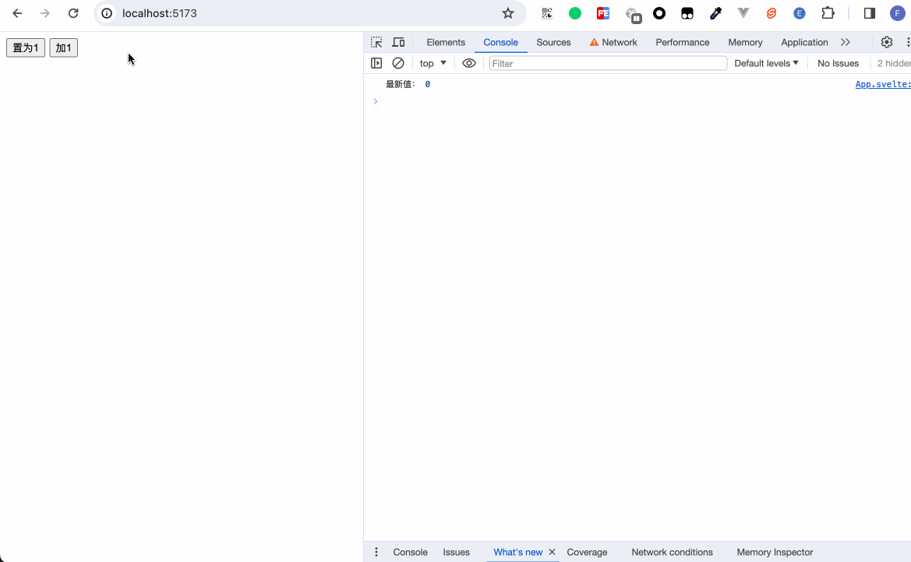
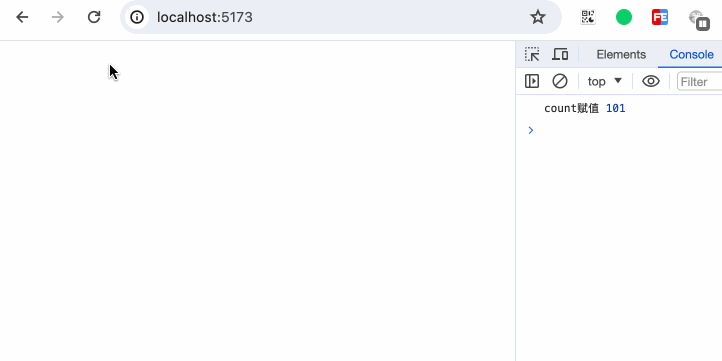
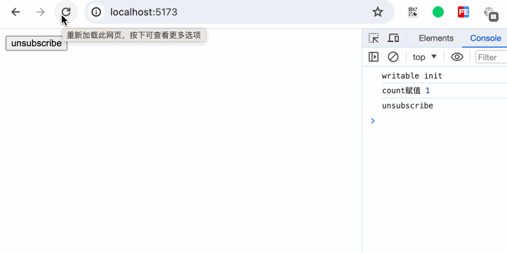

When the business logic is simple, we can place all variables within their respective components or pages. However, in real development scenarios, our business logic will become increasingly complex. The data carried by pages, or the common states between pages will become increasingly massive. At this time, how to handle and maintain the state of the system will become particularly crucial.

## svelte/store

When managing data, we can use Redux in React, or use Vuex and Pinia in Vue. But Svelte directly provides `svelte/store` internally to manage states.

`svelte/store` export three functions: `writable`, `readable` and `derived`.

### writable

The usage of `writable` is as follows:
```typescript
function writable<T>(
  value?: T | undefined,
  start?: StartStopNotifier<T> | undefined
): Writable<T>;
```
The first parameter of `writable` represents the initial value of the data. The second parameter is a method, and inside this method, another method can be returned.

```typescript
export type StartStopNotifier<T> = (
  set: (value: T) => void,
  update: (fn: Updater<T>) => void
) => void | (() => void);
```

When a store is a `writable` store, in addition to having the `subscribe` method, this store also has the `set` and `update` methods.

Example 1：
```javascript
// store.js
import { writable } from 'svelte/store';
export const count = writable(0);
```

```html
<script>
  // App.svelte
  import { count } from './store';

  count.subscribe(c => {
    console.log('最新值：', c);
  })

  const onSet = () => {
    count.set(1);
  }

  const onUpdate = () => {
    count.update(c => c + 1);
  }
</script>

<button on:click={onSet}>置为1</button>
<button on:click={onUpdate}>加1</button>
```



If we directly write `{count}`, it is displayed on the page as follows:

 
Obviously, count is no longer a simple variable. Try to print out count `$: console.log('count', count)`.
 
At this time, count is an object with methods `set`, `subscribe`, and `update` inside. 

#### subscribe
How do we use a `writable` store in a page?

A clever way is that we declare a variable inside the page, and then when the subscribe detects a state change, assign the latest change to the variable we declared.

```html
<script>
let _count;

const unsubscribe = count.subscribe(c => {
  _count = c;
});
</script>

{_count}
```


#### unsubscribe

Still using the code logic of Example 1, we move the original logic in App.svelte into Child.svelte, and then import Child.
```html
<script>
  import Child from './Child.svelte';
  import { count } from './store';
  
  let countValue = 0;

  count.subscribe(value => {
    countValue = value;
  })

  const onUpdate = () => {
    count.update(c => c + 1);
  }
</script>

{#if countValue < 5}
  <Child />
{/if}

<button on:click={onUpdate}>father update</button>
```


It can be seen that both App.svelte and Child.svelte can update count. However, after Child.svelte is destroyed because the if condition is not met, the internal `subscribe` is still executing, which is obviously not what is expected. Imagine if we have thousands of components with show/hide functions that all perform `subscribe`. Whenever these components are destroyed, these listening events are still retained. Over time, there will be a risk of memory overflow. Therefore, whenever we execute `subscribe`, remember to destroy it at an appropriate time.
After `subscribe` is executed, a method is returned, and this method is used to unsubscribe.

Modify the code of Child.svelte:
```html
<script>
  import { onDestroy } from 'svelte';
  import { count } from './store';

  const unsubscribe = count.subscribe(c => {
    console.log('最新值：', c);
  })

  const onSet = () => {
    count.set(1);
  }

  const onUpdate = () => {
    count.update(c => c + 1);
  }

  onDestroy(unsubscribe);
</script>

<button on:click={onSet}>置为1</button>
<button on:click={onUpdate}>加1</button>
```


#### Second parameter

At the beginning, we have already introduced the meanings of the two parameters of `writable`. Now let's demonstrate the use of the second parameter. The second parameter accepts a method. This method receives two parameters, `set` and `update`.

##### set

```html
<script>
  import { count } from './store';

  count.subscribe(val => {
    console.log('count赋值', val);
  })
</script>
```

```javascript
import { writable } from 'svelte/store';

export const count = writable(1 ,(set, update) => {
  set(100);
});
```

  
It is equivalent to calling `set` when initializing data.

##### update

```javascript
import { writable } from 'svelte/store';

export const count = writable(1 ,(set, update) => {
  update(value => value + 100);
});
```

  
It is equivalent to calling `update` when initializing data.

##### return () => void
```javascript
// store.js
import { writable } from 'svelte/store';

export const count = writable(1 ,(set, update) => {
  console.log('writable init');
  return () => {
    console.log('unsubscribe');
  }
});
```

```html
<script>
// App.svelte
  import { count } from './store';

  const unsubscribe = count.subscribe(val => {
    console.log('count赋值', val);
  });
</script>

<button on:click={unsubscribe}>unsubscribe</button>
```



### readable

```typescript
function readable<T>(
  value?: T | undefined,
  start?: StartStopNotifier<T> | undefined
): Readable<T>;
```

Used to set some states that cannot be changed from the outside.
```javascript
import { readable } from 'svelte/store'

export const count = readable(0);
```

```html
<script>
  import { count } from './store';

  count.subscribe(value => {
    console.log('readable count subscribe', value);
  });

  console.log('store', count);
</script>
```
  
After we print out the `readable` store, we can see that it is also an object. However, this object only has the `subscribe` method. The function of the second parameter of the readable state is the same as that of the writable state. This parameter is a method for data update. Although we cannot change the state from the outside, we can call `set` or `update` inside this method to update the data; after executing the `subscribe` method, we also get a method for unsubscribing.

```javascript
// store.js
import { readable } from 'svelte/store'

export const count = readable(0, (set, update) => {
  let interval = null;

  setInterval(() => {
    update(val => val + 2);
  }, 1000);

  return () => {
    clearInterval(interval);
    console.log('stop!!!');
  }
});
```

```html
<script>
// App.svelte
  import { count } from './store';

  let _count;

  const stop = count.subscribe(value => {
    console.log('count', value);
    _count = value;
  });

</script>

<button on:click={stop}>stop</button>
{_count}
```


### derived

#### derived from single state
If you are familiar with React or Vue, then `derived` can be regarded as React's `useMemo` and Vue's `computed`. Simply put, it is to convert and calculate one state into another state. For example, we can turn 1 into 2, turn a cat into a dog... As long as we want to change it, we can derive another new state without changing the original state. Moreover, this new state will be updated according to the set logic every time your original state is updated.

For example:
```javascript
// store.js
import { writable, derived } from 'svelte/store'

export const count = writable(0);

export const double = derived(count, (value) => {
  console.log('value params', value);
  return value * 2;
});
```

```html
<script>
  // App.svelte
  import { count, double } from './store';

  double.subscribe(val => {
    console.log('double', val);
  });

  console.log('derived store', double);
</script>

<button on:click={() => count.update(val => val + 1)}>add</button>
```

  
We can see that the `derived` store is also a store in a readable state. There is only the `subscribe` property exposed externally.

Let's take a look at the type definitions:
```typescript
function derived<S extends Stores, T>(
  stores: S,
  fn: (
    values: StoresValues<S>,
    set: (value: T) => void,
    update: (fn: Updater<T>) => void
  ) => Unsubscriber | void,
  initial_value?: T | undefined
): Readable<T>;
```

```typescript
function derived<S extends Stores, T>(
  stores: S,
  fn: (values: StoresValues<S>) => T,
  initial_value?: T | undefined
): Readable<T>;
```
That is to say, `derived` receives two or three parameters. The first parameter is the store we declared. The second parameter is a method. The first parameter of the method is the value of the store. We can see from the printing result in the above figure that the 'value params' prints out an ordinary value. The remaining `set` and `update` parameters are the same as always. They are methods used for data update.

#### derived from multiple state
How can we derive unique states from multiple different stores? It's very simple. The first parameter of derived receives an array, and then in the parameter of the second parameter method, the values are destructured in the form of an array.

Still, giving an example is more intuitive:
```javascript
import { writable, derived } from 'svelte/store'

export const children = writable([
  {
    id: 1,
    name: '小明',
  }, {
    id: 2,
    name: '小红',
  }, {
    id: 3,
    name: '小刚',
  }, {
    id: 4,
    name: '小丽',
  }
]);

export const todos = writable([2, 3, 4]);

export const status = derived([children, todos], ([c, t], set) => {
  const newChildren = c.map(item => {
    if (t.includes(item.id)) {
      return {
        ...item,
        status: 'todo'
      }
    }
    return {
      ...item,
      status: 'done'
    }
  });
  set(newChildren);
});
```

```html
<script>
  import { status } from './store';

  let list = [];

  status.subscribe(val => {
    list = val;
  })
</script>

<ul>
  {#each list as item}
    <li>{item.name}: {item.status}</li>
  {/each}
</ul>
```

  
In this example, we have two stores. One is specifically used to store name information, and the other records which people are in a to-do state. Through derivation, we can obtain a new data with complete status data.

## auto subscribe

When introducing writable and readable states, we learned how to use stores and unsubscribe from store updates. However, manually performing assignment update operations and constantly paying attention to unsubscribing behavior is really too cumbersome. If you follow and operate all the examples above, they will find that when I updates data on the page, it is all placed in the subscribe data for assignment update. This is set by me intentionally.

To handle this cumbersome operation, Svelte provides a quick way to handle this problem: Whenever referring to a store, you can access the value of the store inside the component by adding the `$` character in front of the store variable, and automatically unsubscribe at the appropriate time.

```javascript
import { writable } from 'svelte/store';

export const count = writable(0);
```

```html
<script>
  import { count } from './store';
</script>

<button on:click={() => count.update(value => value + 1)}>add</button>
{$count}
```


It should be noted that the use of `$` here and the use of `$: statement or expression` are two different concepts. Kind remind: To prevent variables with `$` from being confused with normal variables, we'd better represent the store variables we declared in a fixed format. For example:

```javascript
import { writable } from 'svelte/store';

export const countStore = writable(0);
```

```html
<script>
  import { countStore } from './store';
</script>

<button on:click={() => countStore.update(value => value + 1)}>add</button>
{$countStore}
```

In this way, whenever we encounter a variable in the xxxStore format, we can directly use the shortcut of `$store`, and it is not easy to be confused with other variables on the page.

## custom store

As long as an object can correctly implement the subscribe method, it is a store. Other than that, anything goes.

First, we use `writable` to encapsulate our store.
```javascript
// store.js
import { writable } from 'svelte/store';

const createCountStore = () => {
  const { subscribe, update } = writable(0);

  return {
    subscribe,
    add: () => update(v => v + 1),
    sub: () => update(v => v - 1),
  }
}

export const countStore = createCountStore();
```

```html
<script>
  import { countStore } from './store';
</script>

<button on:click={countStore.add}>add</button>
<button on:click={countStore.sub}>sub</button>
count: {$countStore}
```


We directly implement a store through customization:
```javascript
// store.js
class Store {
  constructor(initialValue = null) {
    this.value = initialValue;
    this.callbacks = [];
  }
  subscribe(callback) {
    callback(this.value);
    this.callbacks.push(callback);
    return () => this.unsubscribe(callback)
  }

  unsubscribe(callback) {
    this.callbacks = this.callbacks.filter(cb => cb !== callback);
  }

  set(value) {
    this.value = value;

    for (const callback of this.callbacks) {
      callback(this.value);
    }
  }

  update(fn) {
    this.value = fn(this.value);

    for (const callback of this.callbacks) {
      callback(this.value);
    }
  }
}

export const store = new Store(0);
```

```html
<script>
  import { store } from './store';

  const onAdd = () => {
    store.update(val => val + 1);
  }

  const onReset = () => {
    store.set(0);
  }
</script>

<button on:click={onAdd}>add</button>
<button on:click={onReset}>reset</button>
count: {$store}
```


## Third part library

### RxJS
[RxJS](https://rxjs.dev/) is a library for reactive programming using `Observables`, making it easier to write asynchronous or callback-based code.

Objects declared using [Observables](https://rxjs.dev/guide/observable) in RxJS have a `subscribe` method, and Svelte's store also has a `subscribe` method, which makes it very suitable for integration with RxJS. In short, we can use the entire RxJS ecosystem and API to operate Svelte's data flow.

```bash
npm install rxjs
```

```javascript
// store.js
import { readable } from 'svelte/store';

export default readable({x:0, y:0}, (set) => {
	document.body.addEventListener("mousemove", move);
	
	function move(event) {
		set({
			x: event.clientX,
			y: event.clientY,
		});
	}
	
	return () => {
		document.body.removeEventListener("mousemove", move);
	}
});
```

```html
<script>
  import { fromEvent, Observable, zip } from "rxjs";
  import { map, pluck } from "rxjs/operators";

  import mousePositionStore from "./store";

  const mousePosition = fromEvent(document, "mousemove").pipe(
    map((event) => ({ x: event.clientX, y: event.clientY }))
  );

  function toObservable(store) {
    let unsub;
    const obs = new Observable((observer) => {
      unsub = store.subscribe((value) => observer.next(value));
      return () => {
        unsub();
      };
    });
    return obs;
  }

  const x$ = toObservable(mousePositionStore).pipe(pluck("x"));
  const y$ = toObservable(mousePositionStore).pipe(pluck("y"));
  const sumOfXAnadY = zip(x$, y$).pipe(map(([x, y]) => x + y));

</script>

{JSON.stringify($mousePosition)}
{$sumOfXAnadY}

<style>
  :global(body) {
    width: 100vw;
    height: 100vh;
  }
</style>
```
Through the custom `toObservable` method, convert svelte/store into an `Observable` object. After that, you can call the RxJS API normally.


### Immer
[Immer](https://immerjs.github.io/immer/) is an `immutable` library. The core implementation is to use ES6's proxy to achieve an immutable data structure in JavaScript. It is simple and easy to use and has a small size. It can well meet the developer's needs for an immutable data structure in JavaScript.

```bash
npm install immer
```

```javascript
import { writable } from "svelte/store";
import { produce } from "immer";

const immerStore = (value) => {
  const store = writable(value);

  function set(new_value) {
    if (new_value !== value) {
      store.set((value = new_value));
    }
  }

  return {
    set,
    update: (fn) => set(produce(value, fn)),
    subscribe: store.subscribe,
  };
};

export const store = immerStore({ visible: true, count: 0 });
```

```html
<svelte:options immutable={true} />

<script>
  import { store } from "./store";

  function toggleVisibility(isVisible) {
    store.update(($state) => {
      $state.visible = isVisible;
    });
  }
  function changeCount(count) {
    store.update(($state) => {
      $state.count += count;
    });
  }

</script>

<div class="buttons">
  <button on:click={() => toggleVisibility(true)}>Show</button>
  <button on:click={() => toggleVisibility(false)}>Hide</button>
</div>
<div class="buttons">
  <button on:click={() => changeCount(1)}>+</button>
  <button on:click={() => changeCount(-1)}>-</button>
</div>

count: {$store.count}
{#if $store.visible}
  <p>Hello world</p>
{/if}

<style>
  button {
    width: 80px;
    height: 35px;
    text-align: center;
  }
</style>
```


### XState

[XState](https://xstate.js.org/) is a lightweight state management library used to describe and control various states. Strictly speaking, XState is the real state management tool. Developers need to control the change of data through state transitions.
 
```bash
npm i xstate @xstate/svelte
```

The version of `@xstate/svelte` I use is: "^3.0.2"

```html
<script>
  import { useMachine, useSelector } from '@xstate/svelte';
  import { countMachine } from './store';
  
  const { send, actorRef } = useMachine(countMachine);

  const state = useSelector(actorRef, (selector) => {
    return selector.context;
  });
</script>


<button on:click={() => send({ type: 'ADD' })}>
  ADD
</button>
<button on:click={() => send({ type: 'SUB' })}>
  SUB
</button>

{$state.count}
```

```javascript
import { createMachine, assign } from "xstate";

export const countMachine = createMachine({
  id: "counter",
  context: {
    count: 0
  },
  initial: 'active',
  states: {
    active: {
      on: {
        ADD: {
          actions: assign({
            count: ({ context }) => context.count + 1
          })
        },
        SUB: {
          actions: assign({
            count: ({ context }) => context.count - 1
          })
        }
      }
    }
  },
});
```


## Summary

In this chapter, we have learned:
- The usage of the three methods `writable`, `readable`, and `derived` of `svelte/store`.
- The differences between the methods `subscribe`, `set`, and `update` on store values.
- When we use the `subscribe` of the store to subscribe to updates, we should unsubscribe in time when the component is destroyed.
- Using the form of `$store` helps us to automatically subscribe to updates and unsubscribe quickly and conveniently.
- How can we simulate and implement a store with custom code?
- The combined use of `svelte/store` and third - party libraries such as Rxjs, Immer, XState, etc.
- `readonly` and `get` are not demonstrated in this chapter. Interested readers can learn about them on their own.