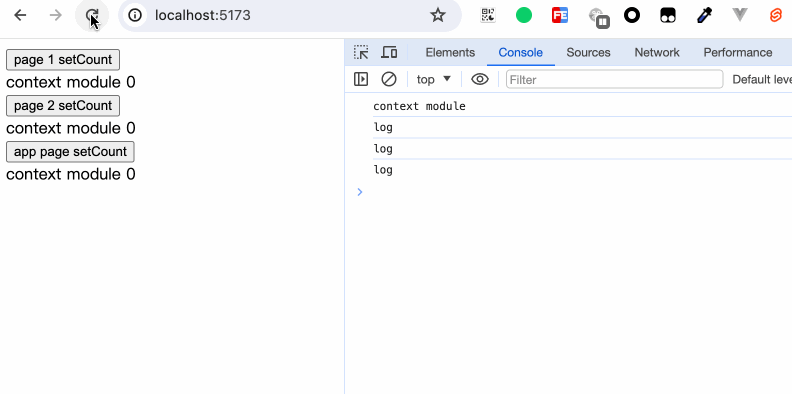

In previous chapter, we have learned about the ways of value-passing communication between parent and child components. However, this is far from enough in normal development. We may encounter the situation where the state of the topmost component needs to be passed to the innermost component. The most common requirement is the switching of the system theme color. If we use the method of passing values between parent and child components layer by layer, it will obviously be too cumbersome. Here, we expect that the data can be directly passed from one component to another, regardless of where this component is.

Svelte provides us with `setContext` and `getContext` to help us achieve this capability.

## context="module"
Before getting to know `setContext` and `getContext`, let's take a look at `context="module"`.

```html
<script context="module">
  console.log('context module');
</script>

<script>
  console.log('log');
</script>

<div>context module</div>
```

We have defined a component with the content as shown above. Then we define two pages, each of which references this component. After that, we define another page that references these two pages and this one component. The structure is as follows:
```
App.svelte
  Page1.svelte
    Context.svelte
  Page2.svelte
    Context.svelte
  Context.svelte
```


It can be seen that the content within `context="module"` is executed only once. Because the content of the script with `context="module"` will only run when the component is executed for the first time, and will not be executed each time the component is referenced.

We can export some common constants or common methods in this module. However, it should be noted that `export default` must not be used, because what `export default` exports is always the component itself. Meanwhile, the variables defined in `context="module"` are not reactive.

Modify the above example again:
```html
<script context="module">
  // Context.svelte
  console.log('context module');
  let count = 0;

  export function setCount(val) {
    count = val;
    console.log('setCount called', count);
  }
</script>

<script>
  console.log('log');

</script>

<div>context module {count}</div>
```

```html
<script>
// Page1.svelte or Page2.svelte
  import Context, { setCount } from "./Context.svelte";
</script>

<button on:click={() => setCount(2)}>page 1 setCount</button> <Context />
```

```html
<script>
// App.svelte
  import Page1 from './Page1.svelte';
  import Page2 from './Page2.svelte';
  import Context, {setCount} from './Context.svelte';
</script>

<Page1 />
<Page2 />
<button on:click={() => setCount(10)}>app page setCount</button><Context />
```

  
We can see that although the count is updated, the page will not be updated.

## context

Svelte provides `setContext` and `getContext` to achieve the ability of value passing between components across different levels. Among them, `setContext` is used to store the data that needs to be passed across components, and `getContext` is used to obtain the corresponding data.

### setContext

```typescript
function setContext<T>(key: any, context: T): T;
```
`setContext` accepts two parameters. The first parameter, `key`, can use any type of value as the key, and the second parameter is the data that is prepared to be passed.

```html
<script>
  // Father.svelte
  import { setContext } from 'svelte';
  import Child from './Child.svelte';

  export const numContext = setContext(1, 1);
  export const strContext = setContext('svelte', 1);
  export const boolContext = setContext(false, 1);
  export const objContext = setContext({}, 1);
  export const funcContext = setContext(function() {}, 1);
  export const symbolContext = setContext(Symbol(), 1);
</script>

<Child />
```

```html
<script>
  // Child.svelte
  import GrandSon from "./GrandSon.svelte";
</script>

<GrandSon />
```

```html
<script>
  // GrandSon.svelte
  import { getContext } from 'svelte';

  export const numContextValue = getContext(1);
  export const strContextValue = getContext('svelte');
  export const boolContextValue = getContext(false);
  export const objContextValue = getContext({});
  export const funcContextValue = getContext(function() {});
  export const symbolContextValue = getContext(Symbol());
</script>

<div>孙组件</div>
<ul>
  <li>number key: {numContextValue}</li>
  <li>string key: {strContextValue}</li>
  <li>boolean key: {boolContextValue}</li>
  <li>object key: {objContextValue}</li>
  <li>function key: {funcContextValue}</li>
  <li>symbol key: {symbolContextValue}</li>
</ul>
```

   
However, what we get is that the keys declared with objects, methods, and `Symbol` didn't get the values. Why?

If you have known the basic types and reference types in JavaScript, you can immediately think of this: `{}` is equivalent to redeclaring an object, and the same is true for the declaration of `function() {}`. Although they may look the same, they are already "things are still there but people have changed". As for `Symbol`, due to its uniqueness, it is used to declare a unique value.


### getContext
```typescript
function getContext<T>(key: any): T;
```

How can we make the keys of object, method, and `Symbol` types also work? For these values that are defined and will not change anymore, we can use the `context="module"` explained at the beginning.

Modify the logic:
```html
<script context="module">
  // App.svelte
  export let objKey = {};
  export let funcKey = function() {};
  export let symbolKey = Symbol();
</script>

<script>
  import { setContext } from 'svelte';
  import Child from './Child.svelte';

  export const numContext = setContext(1, 1);
  export const strContext = setContext('svelte', 1);
  export const boolContext = setContext(false, 1);
  export const objContext = setContext(objKey, 1);
  export const funcContext = setContext(funcKey, 1);
  export const symbolContext = setContext(symbolKey, 1);
</script>

<Child />
```

```html
<script>
  // GrandSon.svelte
  import { objKey, funcKey, symbolKey } from './App.svelte';
  import { getContext } from 'svelte';

  export const numContextValue = getContext(1);
  export const strContextValue = getContext('svelte');
  export const boolContextValue = getContext(false);
  export const objContextValue = getContext(objKey);
  export const funcContextValue = getContext(funcKey);
  export const symbolContextValue = getContext(symbolKey);
</script>

<div>孙组件</div>
<ul>
  <li>number key: {numContextValue}</li>
  <li>string key: {strContextValue}</li>
  <li>boolean key: {boolContextValue}</li>
  <li>object key: {objContextValue}</li>
  <li>function key: {funcContextValue}</li>
  <li>symbol key: {symbolContextValue}</li>
</ul>
```


### Reactivity
The context itself is not reactive. If we need to make the values within the context reactive, we need to pass the store into the context.

Now, I will show an example that combines multiple knowledge points.
```html
<script context="module">
  // App.svelte
  export let ColorContextKey = Symbol();
</script>

<script>
  import { setContext } from 'svelte';
  import { colorStore } from './store';
  import Child from './Child.svelte';

  setContext(ColorContextKey, colorStore); // 传值是一个store
</script>

<Child />

切换颜色
<select bind:value={$colorStore}>
  <option value="gray">灰色</option>
  <option value="red">红色</option>
  <option value="yellow">黄色</option>
  <option value="orange">橙色</option>
</select>
```

```html
<script>
  // Child.svelte
  import Rect from './Rect.svelte';
  import Circle from './Circle.svelte';
</script>

<section>
  <h2>方形组件</h2>
  <Rect />
</section>
<section>
  <h2>圆形组件</h2>
  <Circle />
</section>
```

```html
<script>
  // Rect.svelte
  import { getContext } from 'svelte';
  import { ColorContextKey } from './App.svelte';

  let colorStore = getContext(ColorContextKey);
  $: style = `background-color: ${$colorStore}`;
</script>

<div class="rect" {style}></div>

<style>
  .rect {
    width: 100px;
    height: 100px;
  }
</style>
```

```html
<script>
  // Circle.svelte
  import { getContext } from 'svelte';
  import { ColorContextKey } from './App.svelte';

  let colorStore = getContext(ColorContextKey);
  $: style = `background-color: ${$colorStore}`;
</script>

<div class="circle" {style}></div>

<style>
  .circle {
    width: 100px;
    height: 100px;
    border-radius: 50%;
  }
</style>
```
In our App.svelte, there are methods to control the color switching of components. Each component receives the store value of the context, listens to the changes of the store, and then modifies the inline styles of the component.


In this example, we have used knowledge points such as `getContext`, `setContext`, `$:`, `context="module"`, and shorthand for property assignment.

## Summary

In this chapter,we have learned:
- The usage of `context="module"`
- The `setContext` and `getContext` provided by Svelte can help us achieve the ability to transfer static values across different levels. When combined with `svelte/store`, dynamic variables can also be transferred.
