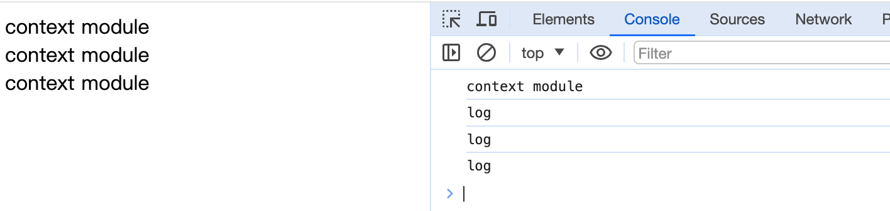
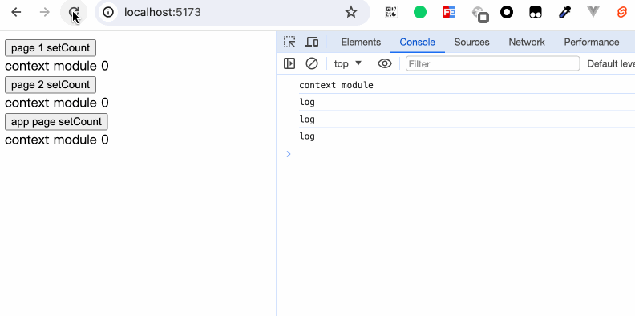
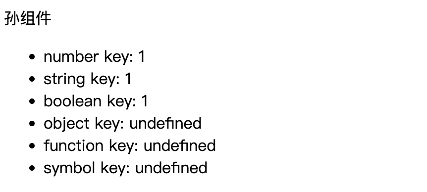
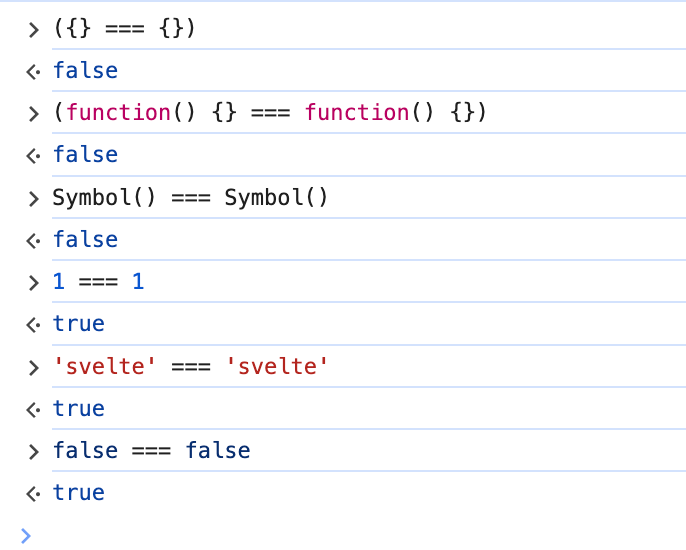
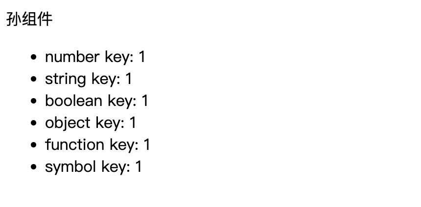
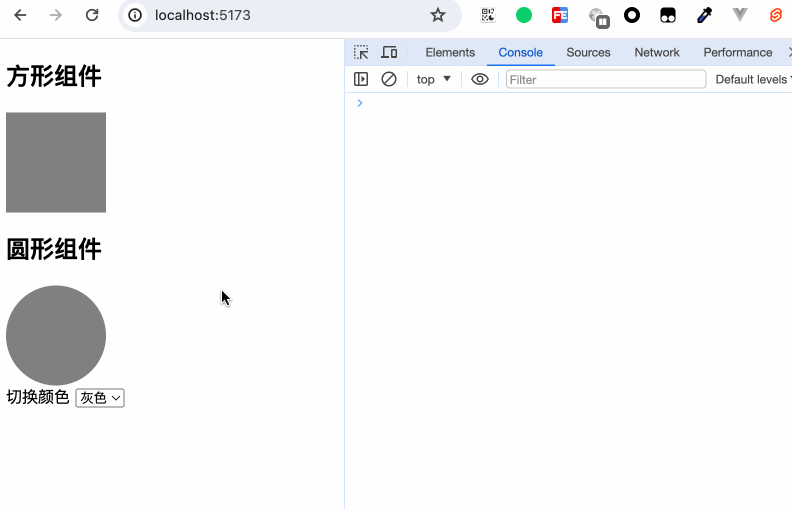

在《组件与属性》一章中，我们了解了父子组件之间的传值通信方式。然而这在正常的开发中远远不够，我们可能会遇到在最顶部的组件的状态传递给最里层的组件，最常见的需求便是系统主题颜色的切换。如果使用父子传值的方式来层层传递，显然过于累赘。这里，我们期望数据能够从一个组件中直接传递到另一个组件当中，不管这个组件在哪。Svelte为我们提供了`setContext`和`getContext`来帮助我们实现这一能力。

## context="module"
在了解`setContext`和`getContext`之前，我们来了解一下`context="module"`。

```html
<script context="module">
  console.log('context module');
</script>

<script>
  console.log('log');
</script>

<div>context module</div>
```

我们定义了一个组件，内容如上。我们再定义两个页面，分别引用这个组件。再定义一个页面，引用这两个页面和这一个组件。结构如下：
```
App.svelte
  Page1.svelte
    Context.svelte
  Page2.svelte
    Context.svelte
  Context.svelte
```

可以看到，`context="module"`内的内容只执行了一次。因为`context="module"`的script的内容只会在组件第一次执行的时候运行，而不会在组件每次被引用时执行。
我们可以在这个模块中导出一些通用常量或通用方法，但是要注意，切勿使用`export default`，因为`export default`的永远是组件本身。同时定义在`context="module"`里的变量不是响应性的。

重新修改上述例子：
```html
<script context="module">
  // Context.svelte
  console.log('context module');
  let count = 0;

  export function setCount(val) {
    count = val;
    console.log('setCount called', count);
  }
</script>

<script>
  console.log('log');

</script>

<div>context module {count}</div>
```

```html
<script>
// Page1.svelte or Page2.svelte
  import Context, { setCount } from "./Context.svelte";
</script>

<button on:click={() => setCount(2)}>page 1 setCount</button> <Context />
```

```html
<script>
// App.svelte
  import Page1 from './Page1.svelte';
  import Page2 from './Page2.svelte';
  import Context, {setCount} from './Context.svelte';
</script>

<Page1 />
<Page2 />
<button on:click={() => setCount(10)}>app page setCount</button><Context />
```

  
可以看到，虽然count有被更新，但页面是不会更新的。

## context

Svelte提供了`setContext`和`getContext`来实现跨层级的组件传值能力。其中`setContext`用于存储需要跨组件传值的数据，`getContext`则用于获取对应的数据。

### setContext

```typescript
function setContext<T>(key: any, context: T): T;
```
`setContext`接收两个参数，第一个参数key可以使用任何类型的值作为键，第二个参数则是准备用于传递的数据。

```html
<script>
  // Father.svelte
  import { setContext } from 'svelte';
  import Child from './Child.svelte';

  export const numContext = setContext(1, 1);
  export const strContext = setContext('svelte', 1);
  export const boolContext = setContext(false, 1);
  export const objContext = setContext({}, 1);
  export const funcContext = setContext(function() {}, 1);
  export const symbolContext = setContext(Symbol(), 1);
</script>

<Child />
```

```html
<script>
  // Child.svelte
  import GrandSon from "./GrandSon.svelte";
</script>

<GrandSon />
```

```html
<script>
  // GrandSon.svelte
  import { getContext } from 'svelte';

  export const numContextValue = getContext(1);
  export const strContextValue = getContext('svelte');
  export const boolContextValue = getContext(false);
  export const objContextValue = getContext({});
  export const funcContextValue = getContext(function() {});
  export const symbolContextValue = getContext(Symbol());
</script>

<div>孙组件</div>
<ul>
  <li>number key: {numContextValue}</li>
  <li>string key: {strContextValue}</li>
  <li>boolean key: {boolContextValue}</li>
  <li>object key: {objContextValue}</li>
  <li>function key: {funcContextValue}</li>
  <li>symbol key: {symbolContextValue}</li>
</ul>
```

  
然而我们得到却是，用对象、方法和`Symbol`来声明的key没有拿到值。这是为什么呢？  
如果接触过javascript的基本类型和引用类型的读者，马上便能想到：`{}`相当于重新声明了一个对象，`function() {}`的声明亦是如此，虽然他们看上去一样，但早已“物是人非”。而`Symbol`则是由于它的独特性，用来声明一个独一无二的值。



### getContext
```typescript
function getContext<T>(key: any): T;
```

如何让对象、方法、`Symbol`类型的key也生效呢？对于这些定义好了就不再改变的值，我们可以使用到开篇讲解的`context="module"`了。
修改代码逻辑：
```html
<script context="module">
  // App.svelte
  export let objKey = {};
  export let funcKey = function() {};
  export let symbolKey = Symbol();
</script>

<script>
  import { setContext } from 'svelte';
  import Child from './Child.svelte';

  export const numContext = setContext(1, 1);
  export const strContext = setContext('svelte', 1);
  export const boolContext = setContext(false, 1);
  export const objContext = setContext(objKey, 1);
  export const funcContext = setContext(funcKey, 1);
  export const symbolContext = setContext(symbolKey, 1);
</script>

<Child />
```

```html
<script>
  // GrandSon.svelte
  import { objKey, funcKey, symbolKey } from './App.svelte';
  import { getContext } from 'svelte';

  export const numContextValue = getContext(1);
  export const strContextValue = getContext('svelte');
  export const boolContextValue = getContext(false);
  export const objContextValue = getContext(objKey);
  export const funcContextValue = getContext(funcKey);
  export const symbolContextValue = getContext(symbolKey);
</script>

<div>孙组件</div>
<ul>
  <li>number key: {numContextValue}</li>
  <li>string key: {strContextValue}</li>
  <li>boolean key: {boolContextValue}</li>
  <li>object key: {objContextValue}</li>
  <li>function key: {funcContextValue}</li>
  <li>symbol key: {symbolContextValue}</li>
</ul>
```


### 响应性
context本身并不具有响应性。如果我们需要让在context中的值具有响应性，我们需要将store传递到context中。

接下来笔者将演示一个结合多个知识点的例子：
```html
<script context="module">
  // App.svelte
  export let ColorContextKey = Symbol();
</script>

<script>
  import { setContext } from 'svelte';
  import { colorStore } from './store';
  import Child from './Child.svelte';

  setContext(ColorContextKey, colorStore); // 传值是一个store
</script>

<Child />

切换颜色
<select bind:value={$colorStore}>
  <option value="gray">灰色</option>
  <option value="red">红色</option>
  <option value="yellow">黄色</option>
  <option value="orange">橙色</option>
</select>
```

```html
<script>
  // Child.svelte
  import Rect from './Rect.svelte';
  import Circle from './Circle.svelte';
</script>

<section>
  <h2>方形组件</h2>
  <Rect />
</section>
<section>
  <h2>圆形组件</h2>
  <Circle />
</section>
```

```html
<script>
  // Rect.svelte
  import { getContext } from 'svelte';
  import { ColorContextKey } from './App.svelte';

  let colorStore = getContext(ColorContextKey);
  $: style = `background-color: ${$colorStore}`;
</script>

<div class="rect" {style}></div>

<style>
  .rect {
    width: 100px;
    height: 100px;
  }
</style>
```

```html
<script>
  // Circle.svelte
  import { getContext } from 'svelte';
  import { ColorContextKey } from './App.svelte';

  let colorStore = getContext(ColorContextKey);
  $: style = `background-color: ${$colorStore}`;
</script>

<div class="circle" {style}></div>

<style>
  .circle {
    width: 100px;
    height: 100px;
    border-radius: 50%;
  }
</style>
```
我们的App.svelte中具有控制组件切换颜色的方法，每个组件接收context的store值，监听store的变换，然后更改组件的行内样式。


这个例子里，我们使用了`getContext`、`setContext`、`$:`、`context="module"`、属性赋值简写等知识点。

## 小结

本章我们学习了：
- `context="module"`的作用
- 使用Svelte提供的`setContext`和`getContext`帮助我们实现跨层级传静态值的能力。再结合`svelte/store`使用，可以传递动态变量。
