Good-looking animations often add a finishing touch to web pages. They can not only enhance the user experience but also improve the aesthetic appeal of the pages. Behind the smooth and silky animation effects, apart from the burst of inspiration during development, strong mathematical knowledge is also required. Svelte integrates several methods that serve the animation effects: 

- `svelte/motion`
- `svelte/easing`
- `svelte/transition`
- `svelte/animation`


## Motion

`svelte/motion`exports two functions: `tweened` and `spring`。The values obtained by using these two methods are stores in a writable state.
  
### Tweened

Tween (derived from [in-between](https://en.wikipedia.org/wiki/Inbetweening)) is a concept that enables users to change the properties of an object in a smooth manner. All we need to do is tell it which properties are to be changed, what the final values they should have when the tween finishes running, and how long this should take. The tween engine will be responsible for calculating the values from the starting point to the ending point. The state of the tween animation continuously updates its values at fixed time intervals. 

For example, when we set CSS, we define the starting and ending points of an element, and it is the computer that determines how the element moves during the process.

```html
<!DOCTYPE html>
<html lang="en">
  <head>
    <meta charset="UTF-8" />
    <meta name="viewport" content="width=device-width, initial-scale=1.0" />
    <title>Document</title>
    <style>
      .box {
        width: 100px;
        height: 100px;
        border: 1px solid orange;
        transition: all 1s ease-in-out;
      }

      .move {
        transform: translate(100px, 100px);
      }
    </style>
  </head>
  <body>
    <button>move</button>
    <div class="box"></div>
    
    <script>
      let button = document.querySelector('button');
      let boxRef = document.querySelector(".box");
      
      button.addEventListener('click', onMove);

      function onMove() {
        if (boxRef) {
          boxRef.classList.add("move");
        } 
      };
    </script>
  </body>
</html>
```

  
We only set the starting and ending positions, and specify that it takes 1 second for the movement from the start to the end. The underlying system is then responsible for handling the motion process in-between. This way of setting is very common not only when setting up PPT animations but also when creating video clips. 

First I will show an example without animation:
```html
<script>
  import { writable } from "svelte/store";

  const progress = writable(0);
</script>

<progress value={$progress}></progress>

{#each [0, 0.25, 0.5, 0.75, 1] as p}
  <button on:click={() => ($progress = p)}>
    {p * 100}%
  </button>
{/each}

<style>
  progress {
    display: block;
    width: 100%;
  }
</style>
```


When we use tween animation:
```html
<script>
  import { tweened } from "svelte/motion";
  import { cubicOut } from 'svelte/easing';

	const progress = tweened(0, {
		duration: 300,
		easing: cubicOut
	});
</script>

<progress value={$progress}></progress>

{#each [0, 0.25, 0.5, 0.75, 1] as p}
  <button on:click={() => ($progress = p)}>
    {p * 100}%
  </button>
{/each}

<style>
  progress {
    display: block;
    width: 100%;
  }
</style>
```
Since the return value is a store, we can use `$store` in the same way as we use a normal store.


Take a look at the parameters accepted by `tweened`:
```typescript
function tweened<T>(
  value?: T | undefined,
  defaults?: TweenedOptions<T> | undefined
): Tweened<T>;
```
The first parameter accepts an initial value. The second parameter is a bit more complex. It is an object that can accept the following parameters:
- delay: How many milliseconds should the tweening be delayed before it starts
- duration: The duration of the tweening effect (in milliseconds)
- easing: This will be explained in detail in the next section.
- interpolate: A custom `(starting, target) => t => value` function for interpolating between arbitrary values. Here, `starting` is the initial value, `target` is the target value, `t` is a number between 0 and 1, and `value` is the returned result.

#### interpolate

“Interpolate” means "to find an intermediate value". By default, Svelte will interpolate between numbers, dates, and arrays and objects of the same shape (as long as they contain only numbers, dates, or other valid arrays and objects). If we want to interpolate color strings or transformation matrices, we need to provide our own custom interpolators.

For example, we convert an array:
```html
<script>
  import { tweened } from "svelte/motion";
  import { cubicOut } from 'svelte/easing';

	const arr = tweened([1, 2, 3, 4, 5], {
		duration: 500,
		easing: cubicOut
	});
</script>

<button on:click={() => $arr = [6, 7, 8, 9, 10]}>change</button>

{#each $arr as item}
  <div>{item}</div>
{/each}
```
  
  
Due to the frame rate issue, only a few changes can be seen in this GIF image. However, the actual change frequency of our page is much higher.

For another example, if we need to create a tween animation for color changes, we will use [d3-interpolate](https://d3js.org/d3-interpolate):
```html
<script>
  import { tweened } from "svelte/motion";
  import { cubicInOut } from 'svelte/easing';
  import { interpolate } from "d3-interpolate";

  let colors = ['red', 'blue', 'green', 'pink'];
  let color = tweened('red', {
    duration: 1000,
    easing: cubicInOut,
    interpolate: interpolate,
  });

  const changeColor = (c) => {
    $color = c;
  }
</script>

{#each colors as color}
  <button on:click={() => changeColor(color)}>{color}</button>  
{/each}
<h2 style="color: {$color}">{$color}</h2>
```


The requirement for `interpolate` must be a function in the format of `(a, b) => t => value`. Let's briefly look at the meaning of each parameter:
```html
<script>
  import { tweened } from "svelte/motion";
  import { cubicOut } from 'svelte/easing';

	const value = tweened(0, {
		duration: 500,
		easing: cubicOut,
    interpolate: (a, b) => {
      console.log('a,b', a, b)
      return (t) => {
        console.log('t', t);
        return t;
      }
    }
	});
</script>

<button on:click={() => $value = 100}>change</button>
<h1>{$value}</h1>
```
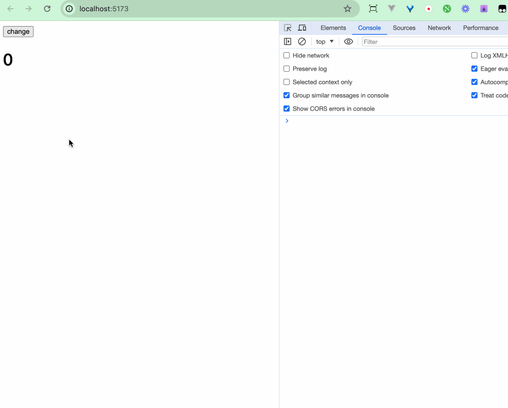
From the printed results, we can infer that `a` is the initial value, `b` is the value for the next change, and `t` is the percentage. The key lies in `t`.
Through the change of `t`, we can smoothly modify our varying value, and the final value cannot exceed `b`.

```diff
<script>
  import { tweened } from "svelte/motion";
  import { cubicOut } from 'svelte/easing';

	const value = tweened(0, {
		duration: 500,
		easing: cubicOut,
    interpolate: (a, b) => {
      console.log('a,b', a, b)
      return (t) => {
        console.log('t', t);
-       return t;
+       return (b - a) * t;
      }
    }
	});
</script>

<button on:click={() => $value = 100}>change</button>
<h1>{$value}</h1>
```


If you're interested, take a look at [interpolation](https://paulbourke.net/miscellaneous/interpolation/)。

#### tween.js

We can use other tween animation libraries such as [tween.js](https://github.com/tweenjs/tween.js/tree/main) to create tween animations.

```html
<script>
  import { tweened } from "svelte/motion";
  import { cubicOut } from "svelte/easing";

  const size = tweened(1, {
    duration: 400,
    easing: cubicOut,
  });

  const scale1 = () => {
    $size += 1;
  };
</script>

<button on:click={scale1}> scale </button>
<div class="box" style="transform: scale({$size}); transform-origin: 0 0"></div>

<style>
  .box {
    width: 100px;
    height: 100px;
    background: red;
    border-radius: 50%;
    margin-bottom: 100px;
  }
</style>
```
  
This is an example of using Svelte's tween normally. If we want to achieve the same effect with tween.js, we need to:
```html
<script>
  import * as TWEEN from "@tweenjs/tween.js";
  
  let size2 = 1;
  let size2Tweened = size2;

  const scale2 = () => {
    let oldSize2 = size2;
    size2 += 1;
    new TWEEN.Tween({
      value: oldSize2,
    })
      .to({ value: size2 }, 400)
      .easing(TWEEN.Easing.Cubic.Out)
      .start().onUpdate(({value}) => {
        size2Tweened = value;
      });
  };

  animate();

  function animate(time) {
    TWEEN.update(time);
    requestAnimationFrame(animate);
  }
</script>

<button on:click={scale2}> scale2 </button>
<div
  class="box"
  style="transform: scale({size2Tweened}); transform-origin: 0 0"
></div>
```

### Spring

Spring elastic animations can make UI interactions more in tune with our daily lives. Compared to the programmatic and smooth changes in tween animations, elastic animations can utilize the physical properties of elasticity, making the movement of objects appear more natural and vivid. 

Here's spring's parameters:
```typescript
function spring<T = any>(
  value?: T | undefined,
  opts?: SpringOpts | undefined
): Spring<T>;
```

Similarly, the parameter `value` is the initial value, and `opts` is an object that has the following properties:
- `stiffness`: The value ranges between 0 and 1, with a default of 0.15. The higher the value, the tighter the spring is, and the faster it moves from the initial value to the target value
- `damping`: The value ranges from 0 to 1, with a default of 0.8. The lower the value, the smaller the bounce damping is, and the more obvious the bouncing effect will be.
- `precision`: the threshold at which the bounce is considered to be at rest. The lower this value, the more precise it is

Both `tweened()` and `spring()` have the same `set()` and `update()` methods as a store. In fact, `tweened()` and `spring()` are the custom stores introduced in the "Manage State" chapter.

#### stifiness

```html
<script>
  import { spring } from 'svelte/motion';

  let springStore1 = spring(0, {
    stiffness: 0.15 // 默认
  });
  let springStore2 = spring(0, {
    stiffness: 0.5
  })
  let springStore3 = spring(0, {
    stiffness: 0.8
  })

  const change = () => {
    $springStore1 += 500;
    $springStore2 += 500;
    $springStore3 += 500;
  }

  $: style1 = `transform:translateX(${$springStore1}px)`;
  $: style2 = `transform:translateX(${$springStore2}px)`;
  $: style3 = `transform:translateX(${$springStore3}px)`;
</script>

<button on:click={change}>move</button>
<div class="ball red" style={style1}></div>
<div class="ball blue" style={style2}></div>
<div class="ball green" style={style3}></div>

<style>
  .ball {
    width: 50px;
    height: 50px;
    border-radius: 50%;
  }
  .red {
    background: tomato;
  }
  .blue {
    background: aqua;
  }
  .green {
    background: greenyellow;
  }
</style>
```
  
The stiffness of the first ball is the default 0.15, so it reaches the finish line the slowest. The third ball has the greatest stiffness and reaches the finish line the fastest.

#### damping

Make slight modifications to the code of the previous example:
```javascript
let springStore1 = spring(0, {
  damping: 0.8 // 默认
});
let springStore2 = spring(0, {
  damping: 0.5
})
let springStore3 = spring(0, {
  damping: 0.2
})
```
  
The third one has the least damping, so the shaking is the most obvious.

#### precision

```javascript
let springStore1 = spring(0, {
  precision: 0.01, // 默认
  damping: 0.2
});
let springStore2 = spring(0, {
  precision: 10,
  damping: 0.2
});
let springStore3 = spring(0, {
  precision: 100,
  damping: 0.2
});
```

  
When the precision we set is higher, the shaking effect of the spring will enter a stable state more quickly.

## Easing

In CSS, we usually set properties like `transition: all 1s ease`, `animation: animationEffect 0.5s ease` to achieve transition or animation effects. In the `tweened` method of `svelte/motion`, we also come across a parameter `easing`. In this section, let's learn about the "timing-function". 

In CSS, `<timing-function>` is a (mathematical) function used to specify the speed at which an object transitions from one value to another over time. It describes how a transition or animation will progress over one cycle of its duration. The timing-function is also known as the [easing-function](https://developer.mozilla.org/en-US/docs/Web/CSS/easing-function).

Timing functions are typically used as values for the [transition-timing-function](https://developer.mozilla.org/en-US/docs/Web/CSS/transition-timing-function) property and the [animation-timing-function](https://developer.mozilla.org/en-US/docs/Web/CSS/animation-timing-function) property.

In CSS, three ways are supported to define the timing function:
- Use predefined keywords
- Use step functions
- Use Cubic Bezier curve function

```
<timing-function> = ease | linear | ease-in | ease-out | ease-in-out |
step-start | step-end | steps(<integer>[, [ start | end ] ]?) |
cubic-bezier(<number>, <number>, <number>, <number>)
```

that is we can use the following syntax:
```css
transition: all 1s ease;
transition: all 1s steps();
transition: all 1s cubic-bezier()
```

### cubic-bezier

We can customize cubic Bezier curves to create custom easing effects or even bouncing effects. Study the implementation of [Bézier curves](https://en.wikipedia.org/wiki/B%C3%A9zier_curve) if you're interested.


#### Predefined Keywords

The predefined keyword timing-functions in CSS are: `ease | linear | ease-in | ease-out | ease-in-out`. In fact, they are all specific implementations of Bezier curves.
```css
ease: cubic-bezier(0.25, 0.1, 0.25, 1.0)
linear: cubic-bezier(0.0, 0.0, 1.0, 1.0)
ease-in: cubic-bezier(0.42, 0, 1.0, 1.0)
ease-out: cubic-bezier(0, 0, 0.58, 1.0)
ease-in-out: cubic-bezier(0.42, 0, 0.58, 1.0)
```

```html
<script>
  let animating = false;
  const startMove = () => {
    animating = true;
  }
</script>

<button on:click={startMove}>animate</button>
<div class="ball red-ball" class:ease={animating}></div>
<div class="ball red-ball" class:ease-cubic={animating}></div>
<div class="ball green-ball" class:linear={animating}></div>
<div class="ball green-ball" class:linear-cubic={animating}></div>

<style>
  .ball {
    width: 50px;
    height: 50px;
    border-radius: 50%;
  }
  .red-ball {
    background-color: red;
  }
  .green-ball {
    background-color: aquamarine;
  }

  .ease {
    animation: moveEffect 2s ease;
    animation-iteration-count: infinite;
  }
  .ease-cubic {
    animation: moveEffect 2s cubic-bezier(0.25, 0.1, 0.25, 1.0);
    animation-iteration-count: infinite;
  }
  .linear {
    animation: moveEffect 2s linear;
    animation-iteration-count: infinite;
  }
  .linear-cubic {
    animation: moveEffect 2s cubic-bezier(0.0, 0.0, 1.0, 1.0);
    animation-iteration-count: infinite;
  }

  @keyframes moveEffect {
    0% {
      transform: translateX(0);
    }
    50% {
      transform: translateX(200px);
    }
    100% {
      transform: translateX(0);
    }
  }
</style>
```

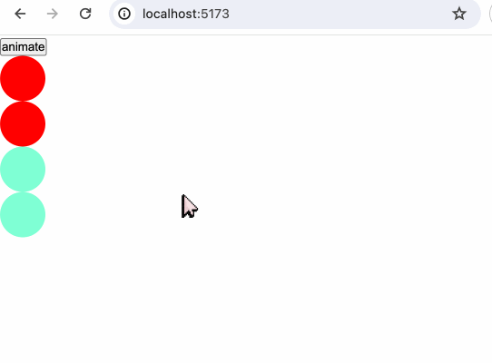

#### Tools

We can check the conversion between keywords and Bezier curves on [easings.net](https://easings.net/).

For example, if we choose[easeOutCirc](https://easings.net/#easeOutCirc)：


The corresponding formula is as follows:
```javascript
function easeOutCirc(x: number): number {
  return Math.sqrt(1 - Math.pow(x - 1, 2));
}
```

Take a look at `packages/svelte/src/runtime/easing/index.js`:
```javascript
export function circOut(t) {
	return Math.sqrt(1 - --t * t);
}
```
We found that there is no different from the implementation on easings.net.

Apart from easings.net, there are numerous convenient Bezier curve tool websites on the Internet, such as [cubic-bezier.com](https://cubic-bezier.com/#.17,.67,.83,.67) and [ceaser](https://matthewlein.com/tools/ceaser). You can explore them on your own.

### svelte/easing
In Svelte, lots of easing effects are implemented in `svelte/easing`:
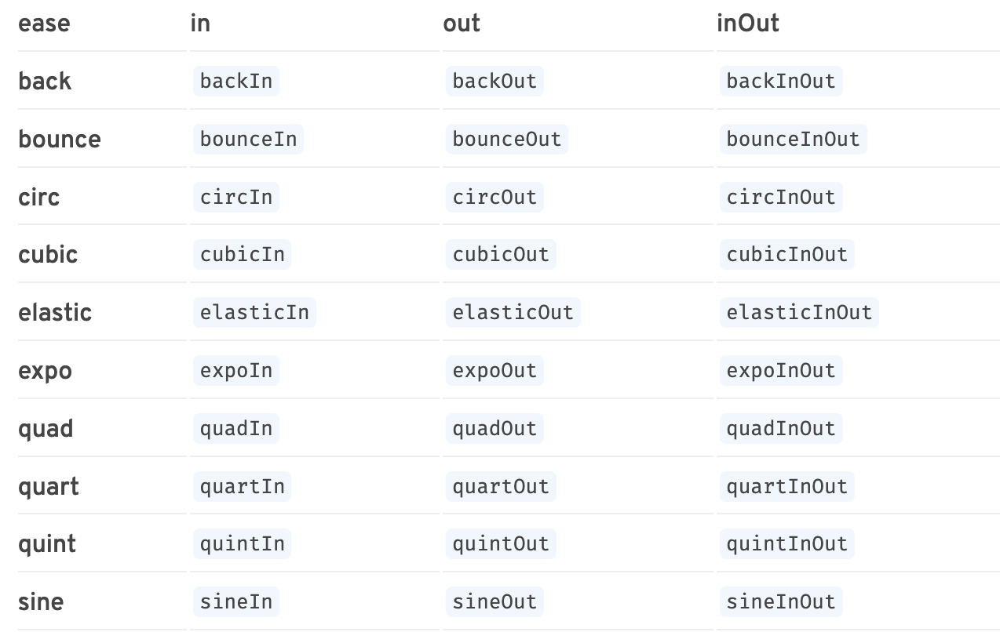

  
If we look at the source code, we can see that the implementation of the easing functions reuses the [eases](https://github.com/mattdesl/eases) library. The inspiration for this library comes from [Robert Penner's easing equations](http://robertpenner.com/easing/) and [glsl-easings](https://github.com/glslify/glsl - easings). 

## Transition

### svelte/transition

`svelte/transition`:
- fade
- blur
- fly
- slide
- scale
- draw
- crossfade

The methods exported by `svelte/transition` can be used in combination with the `transition:fn` directive.

#### fade
`fade` types definition:
```typescript
function fade(
	node: Element,
	{ delay, duration, easing }?: FadeParams | undefined
): TransitionConfig;
```

Example:
```html
<script>
  import { fade } from "svelte/transition";
  import { cubicInOut } from "svelte/easing";

  let show = true;
</script>

<button on:click={() => (show = !show)}>toggle</button>

{#if show}
  <div
    class="ball"
    transition:fade={{
      easing: cubicInOut,
      duration: 1000,
    }}
  ></div>
{/if}

<style>
  .ball {
    width: 50px;
    height: 50px;
    border-radius: 50%;
    background-color: tomato;
  }
</style>
```


The fade animation achieves its effect by modifying the opacity of the element node.
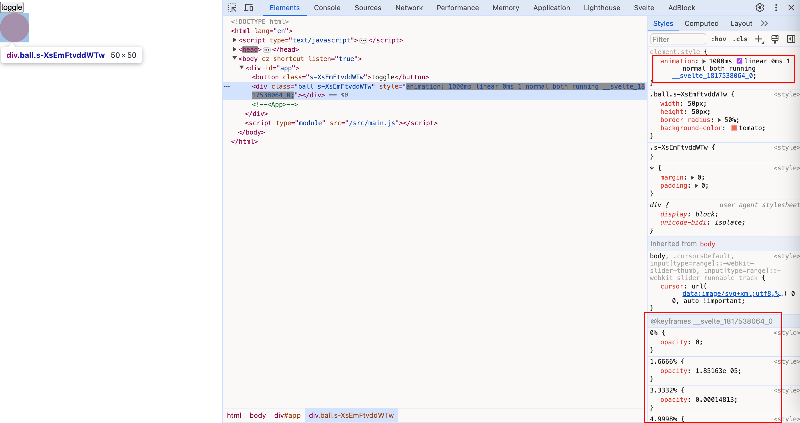  

When using the `transition` directive, we can also pass no parameters directly, like `<div transition:fade></div>`, because the methods have default values. For example, in the `fade` method, the `delay` defaults to 0, the `duration` defaults to 400ms, and the `easing` defaults to `linear`.

#### blur

`blur` types definition:
```typescript
function blur(
	node: Element,
	{
		delay,
		duration,
		easing,
		amount,
		opacity
	}?: BlurParams | undefined
): TransitionConfig;
```

- opacity: The value of the node at which the transparency starts to show or is about to end. For example, if we set the opacity to 0.5, then the animation will directly start from 0.5 to 1 and end from 1 to 0.5. There is no easing effect for the change in the range from 0 to 0.5.
- amount: The degree of blur in blur. The default value is 5. The larger the value, the more blurred it will be.

```html
<script>
  import { blur } from "svelte/transition";
  import { cubicInOut } from "svelte/easing";

  let show = true;
</script>

<button on:click={() => (show = !show)}>toggle</button>

{#if show}
  <div
    class="ball"
    transition:blur={{
      easing: cubicInOut,
      duration: 1000,
    }}
  ></div>
{/if}
```


When we set `amount`和`opacity`:
```html
{#if show}
  <div
    class="ball"
    transition:blur={{
      easing: cubicInOut,
      duration: 1000,
      amount: 10,
      opacity: 0.5,
    }}
  ></div>
{/if}
```

  
The `blur` method adds a blur filter while toggling the transparency.


#### fly
`fly` types definition:
```typescript
function fly(
	node: Element,
	{
		delay,
		duration,
		easing,
		x,
		y,
		opacity
	}?: FlyParams | undefined
): TransitionConfig
```

- opacity: It has been explained in "blur".
- x: The distance that the element moves horizontally. A positive value of x indicates that the element is translated to the right.
- y: The distance the element moves in the vertical direction. A positive value of y indicates that the element is translated downwards.

The `fly` method can control the movement of an element while setting the transparency animation of the element node.

```html
{#if show}
  <div
    class="ball"
    transition:fly={{
      easing: cubicInOut,
      duration: 1000,
      x: 200,
      y: 200
    }}
  ></div>
{/if}
```

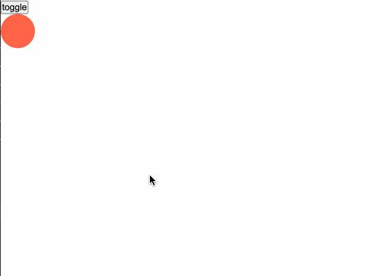

In addition to setting the opacity for the animation effect, the `transform: translate()` is also set.


#### slide
`slide` types definition:
```typescript
function slide(
	node: Element,
	{
		delay,
		duration,
		easing,
		axis
	}?: SlideParams | undefined
): TransitionConfig;
```

- axis: Accepts `x` or `y` as values, with `y` being the default. Sets the direction from which the sliding occurs.

```html
{#if show}
  <div
    class="ball"
    transition:slide={{
      easing: cubicInOut,
      duration: 1000
    }}
  ></div>
{/if}
```

Default behavior:
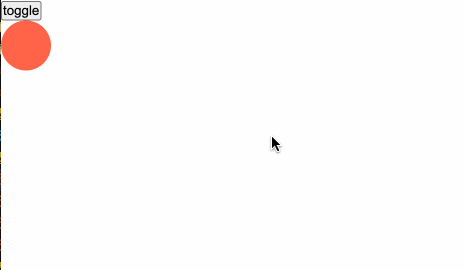

```diff
{#if show}
  <div
    class="ball"
    transition:slide={{
      easing: cubicInOut,
      duration: 1000,
+      axis: 'x'
    }}
  ></div>
{/if}
```
Set axis to `x`:
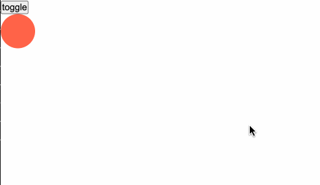

In addition to setting the opacity, the `slide` also achieves the animation effect by setting the width and height.

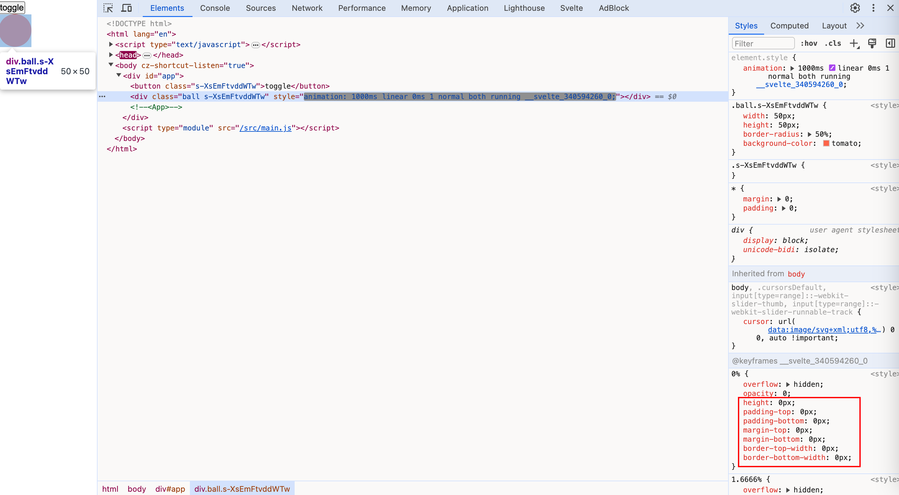

This also explains why when an element gradually disappears, if it is in the vertical direction, the change occurs from top to bottom, and if it is in the horizontal direction, the change occurs from right to left.

#### scale
`scale` types definition:
```typescript
function scale(
	node: Element,
	{
		delay,
		duration,
		easing,
		start,
		opacity
	}?: ScaleParams | undefined
): TransitionConfig;
```

- start: Similar to the function of setting opacity, it is used to set a value. There is a transition effect between this value and 1, while there is no transition effect between 0 and this value.

```html
<script>
  import { scale } from "svelte/transition";
  import { cubicInOut } from "svelte/easing";

  let show = true;
</script>

<button on:click={() => (show = !show)}>toggle</button>


{#if show}
  <div
    class="ball"
    transition:scale={{
      easing: cubicInOut,
      duration: 1000,
    }}
  ></div>
{/if}
```


In addition to setting the opacity, the `scale` method also sets `transform: scale()`.


#### draw

An animation method specifically designed for drawing SVGs. The type definition of the `draw` method is as follows:
```html
<script>
  import { draw } from "svelte/transition";
  import { cubicInOut } from "svelte/easing";

  let show = true;
</script>

<button on:click={() => (show = !show)}>toggle</button>

<svg viewBox="0 0 50 50" xmlns="http://www.w3.org/2000/svg">
	{#if show}
		<path
			transition:draw={{ duration: 5000, delay: 500, easing: cubicInOut }}
			d="M25 1 L32 18 L50 18 L36 29 L40 46 L25 36 L10 46 L14 29 L1 18 L18 18 Z"
			fill="none"
			stroke="tomato"
			stroke-width="1px"
			stroke-linejoin="round"
		/>
	{/if}
</svg>
```


#### crossfade
Won't explain them one by one. You can explore on your own.

### Directives

The methods exported by `svelte/transition` can also be used in combination with the `in:fn` and `out:fn` directives. The difference between `in:fn`, `out:fn` and `transition:fn` lies in that they break down the time points at which the transitions occur. In the life cycle of a transition effect, it can be divided into two periods: in and out. 


When an element transitions from being visible to hidden, we call this stage "out". When an element transitions from being hidden to visible, we call this "in".

```html
<script>
  import { scale, fly } from "svelte/transition";
  import { cubicInOut } from "svelte/easing";

  let show = true;
</script>

<button on:click={() => (show = !show)}>toggle</button>


{#if show}
  <div
    class="ball"
    in:scale={{
      easing: cubicInOut
    }}
    out:fly={{
      x: 200,
      y: 200,
      easing: cubicInOut
    }}
  ></div>
{/if}
```

When the ball is about to disappear, we use the `out:fly` effect. And when the ball is about to appear, we use the `in:scale` effect.
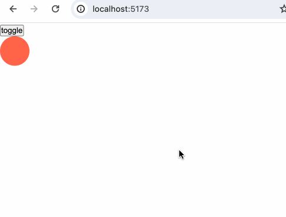

Like the `transition` directive, the `in` and `out` directives can be used directly as `in:fn` and `out:fn` without passing parameters.

### Custom transition

API for custom transition methods:
```javascript
transition = (node: HTMLElement, params: any) => {
  delay?: number,
  duration?: number,
  easing?: (t: number) => number,
  css?: (t: number, u: number) => string,
  tick?: (t: number, u: number) => void
}
```

For example, let's implement a transition effect with rainbow-colored changes:
```html
<script>
  import { cubicInOut } from "svelte/easing";

  let show = false;

  function rainbow(node) {
    const colors = [
      "rgba(255, 0, 0, 1)",
      "rgba(255, 154, 0, 1)",
      "rgba(208, 222, 33, 1)",
      "rgba(79, 220, 74, 1)",
      "rgba(63, 218, 216, 1)",
      "rgba(47, 201, 226, 1)",
      "rgba(28, 127, 238, 1)",
      "rgba(95, 21, 242, 1)",
      "rgba(186, 12, 248, 1)",
      "rgba(251, 7, 217, 1)",
      "rgba(255, 0, 0, 1)",
    ];
    return {
      duration: 3500,
      easing: cubicInOut,
      css: (t, v) => {
        return `
          background: ${colors[((t * 10) | 0) - 1]}
        `;
      },
    };
  }
</script>

<button
  on:click={() => {
    show = !show;
  }}>toggle</button
>

{#if show}
  <div class="rainbow-box" transition:rainbow></div>
{/if}

<style>
  .rainbow-box {
    width: 80vw;
    height: 200px;
    border-radius: 5px;
    border: 1px solid black;
  }
</style>
```

The colors in the array are as follows:
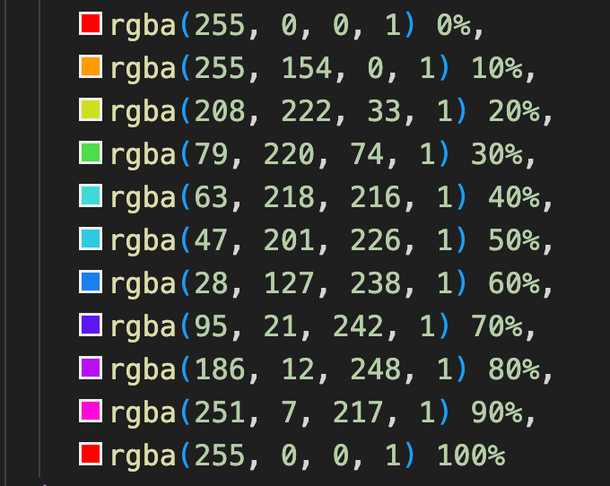
We implement a transition effect with a rainbow-like gradient:


### transition events

We can listen to the events of the following transition effects:
- introstart
- introend
- outrostart
- outroend

```html
<script>
  import { scale, fly } from "svelte/transition";
  import { cubicInOut } from "svelte/easing";

  let show = true;

  const onIntroStart = () => {
    console.log("intro start");
  };
  const onIntroEnd = () => {
    console.log("intro end");
  };
  const onOutroStart = () => {
    console.log("outro start");
  };
  const onOutroEnd = () => {
    console.log("outro end");
  };
</script>

<button on:click={() => (show = !show)}>toggle</button>

{#if show}
  <div
    class="ball"
    in:scale={{
      easing: cubicInOut,
      duration: 2000,
    }}
    out:fly={{
      x: 200,
      y: 200,
      duration: 2000,
      easing: cubicInOut,
    }}
    on:introstart={onIntroStart}
    on:introend={onIntroEnd}
    on:outrostart={onOutroStart}
    on:outroend={onOutroEnd}
  ></div>
{/if}
```

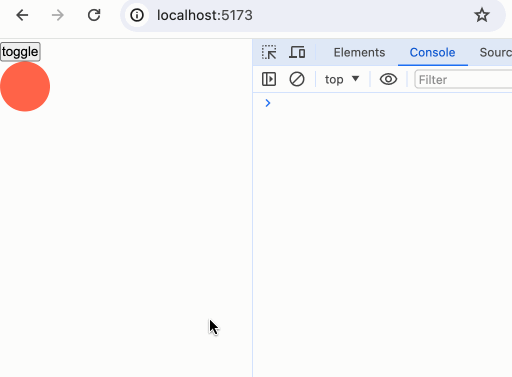

In the various demonstrations above, we've learned that `svelte/transition` actually achieves transitions by controlling CSS animations. Therefore, we can also listen to the JavaScript `animationstart` and `animationend` events to perform certain operations at the start and end of the animation.

```html
<script>
  import { scale, fly } from "svelte/transition";
  import { cubicInOut } from "svelte/easing";

  let show = true;

  const onIntroStart = () => {
    console.log("intro start");
  };
  const onIntroEnd = () => {
    console.log("intro end");
  };
  const onOutroStart = () => {
    console.log("outro start");
  };
  const onOutroEnd = () => {
    console.log("outro end");
  };

  const start = () => {
    console.log("animation start");
  };
  const end = () => {
    console.log("animation end");
  };
</script>

<button on:click={() => (show = !show)}>toggle</button>

{#if show}
  <div
    class="ball"
    in:scale={{
      easing: cubicInOut,
      duration: 2000,
    }}
    out:fly={{
      x: 200,
      y: 200,
      duration: 2000,
      easing: cubicInOut,
    }}
    on:introstart={onIntroStart}
    on:introend={onIntroEnd}
    on:outrostart={onOutroStart}
    on:outroend={onOutroEnd}
    on:animationstart={start}
    on:animationend={end}
  ></div>
{/if}
```


## Animation

Currently, only one method `flip` is exported in `svelte/animation`.

## Summary

In this chapter, we learned about:
- There are two kinds of motion effects exported in `svelte/motion`: tween interpolation and spring elasticity. And some third-party libraries that can provide the same effects.
- CSS's timing-function, easing functions, and Bezier curves function.
- Various transition effects provided in Svelte; various directives serving transition effects such as `transition:fn`, `in:fn`, `out:fn`; and how to customize transition effects.
- Listen to transition events
- Incidentally, the website [robertpenner](http://robertpenner.com/easing/) provides a lot of details about animation implementation. Readers who are interested can explore it on your own.

