好看的动画往往能给页面带来锦上添花的效果，不仅能提升用户体验，还能增强页面美观度。流畅丝滑的动效背后，除了开发时的灵感迸发，也需要强有力的数学知识的支持。Svelte中集成了多个服务于动画效果的方法：
- `svelte/motion`
- `svelte/easing`
- `svelte/transition`
- `svelte/animation`

TODO: https://dev.to/thisdotmedia/animations-in-svelte-2blm?comments_sort=oldest

## Motion

Motion指运动效果，`svelte/motion`导出了两个方法`tweened`和`spring`。使用这两个方法得到的值是一个可写状态的store。
  
### Tweened

Tweened即补间动画。补间（动画）（来自 [in-between](https://en.wikipedia.org/wiki/Inbetweening)）是一个概念，允许用户以平滑的方式更改对象的属性。我们只需告诉它哪些属性要更改，当补间结束运行时它们应该具有哪些最终值，以及这需要多长时间，补间引擎将负责计算从起始点到结束点的值。补间动画的状态会在固定的时间间隔内不断更新其值。

比如在我们设置css时，我们设置了元素的起点和终点，而至于过程是怎么运动的，则由电脑来决定。
```html
<!DOCTYPE html>
<html lang="en">
  <head>
    <meta charset="UTF-8" />
    <meta name="viewport" content="width=device-width, initial-scale=1.0" />
    <title>Document</title>
    <style>
      .box {
        width: 100px;
        height: 100px;
        border: 1px solid orange;
        transition: all 1s ease-in-out;
      }

      .move {
        transform: translate(100px, 100px);
      }
    </style>
  </head>
  <body>
    <button>move</button>
    <div class="box"></div>
    
    <script>
      let button = document.querySelector('button');
      let boxRef = document.querySelector(".box");
      
      button.addEventListener('click', onMove);

      function onMove() {
        if (boxRef) {
          boxRef.classList.add("move");
        } 
      };
    </script>
  </body>
</html>
```

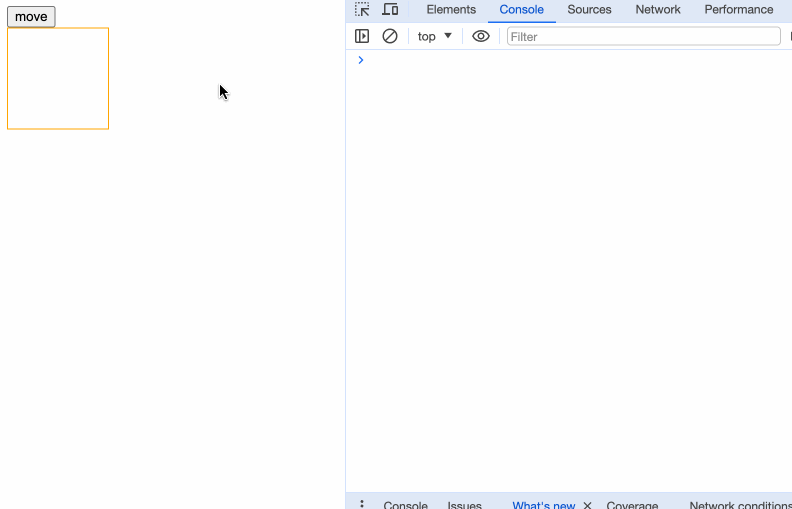  
我们只设置了开头和结尾的位置，以及开头运动到结尾需要1s，期间的运动过程则交由底层处理。这种设置方式不管是在设置ppt动画，制作视频剪辑中都非常常见。

笔者先演示一个不带动画的例子：
```html
<script>
  import { writable } from "svelte/store";

  const progress = writable(0);
</script>

<progress value={$progress}></progress>

{#each [0, 0.25, 0.5, 0.75, 1] as p}
  <button on:click={() => ($progress = p)}>
    {p * 100}%
  </button>
{/each}

<style>
  progress {
    display: block;
    width: 100%;
  }
</style>
```

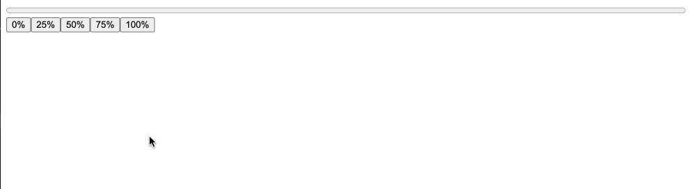

当我们使用了补间动画后：
```html
<script>
  import { tweened } from "svelte/motion";
  import { cubicOut } from 'svelte/easing';

	const progress = tweened(0, {
		duration: 300,
		easing: cubicOut
	});
</script>

<progress value={$progress}></progress>

{#each [0, 0.25, 0.5, 0.75, 1] as p}
  <button on:click={() => ($progress = p)}>
    {p * 100}%
  </button>
{/each}

<style>
  progress {
    display: block;
    width: 100%;
  }
</style>
```
因为返回值是一个store，我们可以像正常使用store一样使用`$store`。

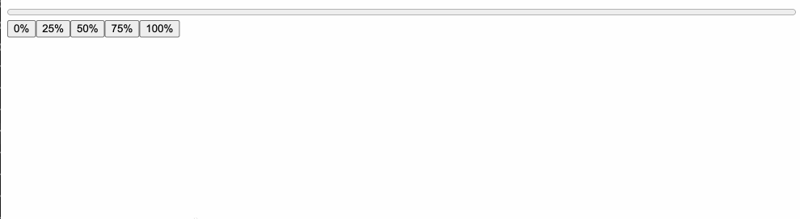

看下`tweened`的接收参数：
```typescript
function tweened<T>(
  value?: T | undefined,
  defaults?: TweenedOptions<T> | undefined
): Tweened<T>;
```
第一个参数接收一个初始值，第二个参数稍微复杂，是一个对象，能够接收以下参数：
- delay：补间延迟多少毫秒之后开始
- duration：补间效果的持续时间（以毫秒为单位）
- easing：在下一节中详细讲解
- interpolate：一个自定义的(starting, target) => t => value函数，用于在任意值之间进行插值。starting是起始值，target是目标值，t是0到1的数值，value是返回结果。

#### interpolate

interpolate是“插值”的意思，默认情况下，Svelte将在数字、日期以及形状相同的数组和对象之间进行插值（只要它们仅包含数字和日期或其他有效的数组和对象）。如果我们想要插值颜色字符串或变换矩阵，需要我们自己提供自定义插值器。

比如，我们将数组进行转换：
```html
<script>
  import { tweened } from "svelte/motion";
  import { cubicOut } from 'svelte/easing';

	const arr = tweened([1, 2, 3, 4, 5], {
		duration: 500,
		easing: cubicOut
	});
</script>

<button on:click={() => $arr = [6, 7, 8, 9, 10]}>change</button>

{#each $arr as item}
  <div>{item}</div>
{/each}
```
  
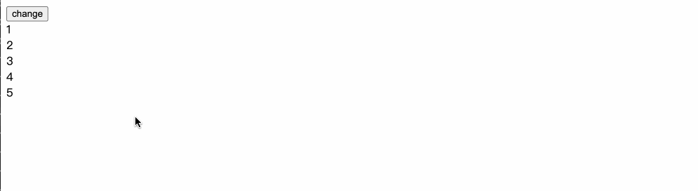  
这里的gif图由于帧率问题，只看出了几次变化，然而我们真实的页面改动频率则高得多。

再比如，如果我们需要进行颜色改变的补间动画，会使用到[d3-interpolate](https://d3js.org/d3-interpolate)：
```html
<script>
  import { tweened } from "svelte/motion";
  import { cubicInOut } from 'svelte/easing';
  import { interpolate } from "d3-interpolate";

  let colors = ['red', 'blue', 'green', 'pink'];
  let color = tweened('red', {
    duration: 1000,
    easing: cubicInOut,
    interpolate: interpolate,
  });

  const changeColor = (c) => {
    $color = c;
  }
</script>

{#each colors as color}
  <button on:click={() => changeColor(color)}>{color}</button>  
{/each}
<h2 style="color: {$color}">{$color}</h2>
```

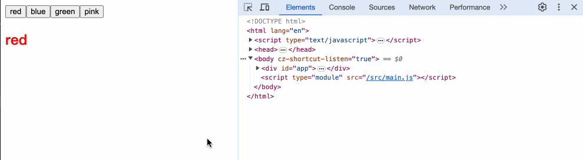

interpolate的要求必须是`(a, b) => t => value`格式的函数，我们简单看下各参数的意义：
```html
<script>
  import { tweened } from "svelte/motion";
  import { cubicOut } from 'svelte/easing';

	const value = tweened(0, {
		duration: 500,
		easing: cubicOut,
    interpolate: (a, b) => {
      console.log('a,b', a, b)
      return (t) => {
        console.log('t', t);
        return t;
      }
    }
	});
</script>

<button on:click={() => $value = 100}>change</button>
<h1>{$value}</h1>
```
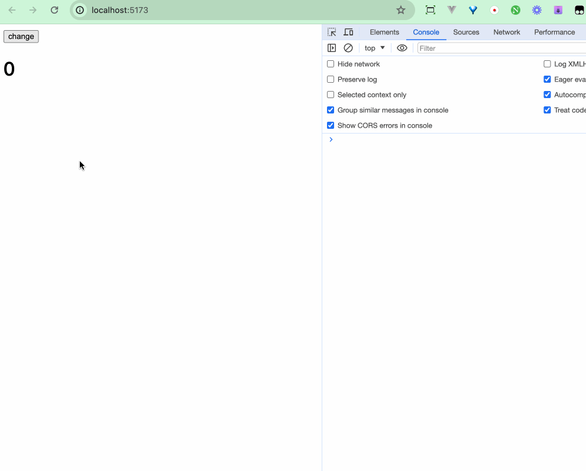
从打印的结果中，我们可以推断出，a是初始值，b是下一次更改的值，t是百分率，关键就在于t。
通过t的变化，我们可以丝滑地改动我们的变化值，当最终值无法超过b。

```diff
<script>
  import { tweened } from "svelte/motion";
  import { cubicOut } from 'svelte/easing';

	const value = tweened(0, {
		duration: 500,
		easing: cubicOut,
    interpolate: (a, b) => {
      console.log('a,b', a, b)
      return (t) => {
        console.log('t', t);
-       return t;
+       return (b - a) * t;
      }
    }
	});
</script>

<button on:click={() => $value = 100}>change</button>
<h1>{$value}</h1>
```
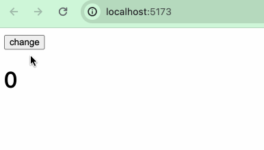

#### tween.js

我们可以使用其他补间动画库如[tween.js](https://github.com/tweenjs/tween.js/tree/main)来完成的补间动画。

```html
<script>
  import { tweened } from "svelte/motion";
  import { cubicOut } from "svelte/easing";

  const size = tweened(1, {
    duration: 400,
    easing: cubicOut,
  });

  const scale1 = () => {
    $size += 1;
  };
</script>

<button on:click={scale1}> scale </button>
<div class="box" style="transform: scale({$size}); transform-origin: 0 0"></div>

<style>
  .box {
    width: 100px;
    height: 100px;
    background: red;
    border-radius: 50%;
    margin-bottom: 100px;
  }
</style>
```
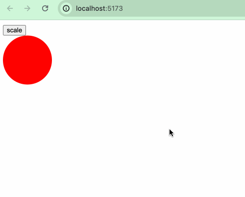  
这是一个正常使用Svelte的tween的例子，如果我们使用tween.js来实现，则需要：
```html
<script>
  import * as TWEEN from "@tweenjs/tween.js";
  
  let size2 = 1;
  let size2Tweened = size2;

  const scale2 = () => {
    let oldSize2 = size2;
    size2 += 1;
    new TWEEN.Tween({
      value: oldSize2,
    })
      .to({ value: size2 }, 400)
      .easing(TWEEN.Easing.Cubic.Out)
      .start().onUpdate(({value}) => {
        size2Tweened = value;
      });
  };

  animate();

  function animate(time) {
    TWEEN.update(time);
    requestAnimationFrame(animate);
  }
</script>

<button on:click={scale2}> scale2 </button>
<div
  class="box"
  style="transform: scale({size2Tweened}); transform-origin: 0 0"
></div>
```

### Spring

Spring弹性动画可以让UI交互的效果更接近我们的日常生活，比起像补间动画那样程序式地平滑改动，弹性动画可以运用弹性的物理特性，来让物体运动表现得更为自然生动。

spring方法的参数如下：
```typescript
function spring<T = any>(
  value?: T | undefined,
  opts?: SpringOpts | undefined
): Spring<T>;
```

同样参数value是初始值，opts是一个对象，该对象有以下属性：
- `stiffness`：表示刚度，其值介于0和1之间，值越高表示弹簧越紧。
- `damping`：表示阻尼，其值介于0和1之间，值越低表示弹跳阻尼越小。
- `precision`：表示精度，弹跳被认为处于静止状态的阈值，越低则越精确。

framer-motion

`tweened()`和`spring()`都有着与store相同的`set()`、`update()`方法，实际上，`tweened()`和`spring()`就是在《状态管理》章节中介绍过的custom store。

阻尼值
  
## Easing

在CSS中，我们通常会设置诸如`transition: all 1s ease`、`animation: animationEffect 0.5s ease` 等来实现过渡或者动画效果，而在`svelte/motion`的`tweened`方法中，我们也接触到了一个参数`easing`，在这一小节，我们来了解一下“计时函数”（timing-function）。

CSS 中的 `<timing-function>`是一个（数学）函数，它被用来指定物体随着时间的推移，从一个值转换到另一个值时速度。 它描述了过渡或动画将如何在其持续时间的一个周期内进行。timing-function也称为[easing-function](https://developer.mozilla.org/en-US/docs/Web/CSS/easing-function)。

计时函数通常作为[transition-timing-function](https://developer.mozilla.org/en-US/docs/Web/CSS/transition-timing-function)属性和[animation-timing-function](https://developer.mozilla.org/en-US/docs/Web/CSS/animation-timing-function)属性的值来使用。

在CSS中支持使用3种方式来定义计时函数：
- 使用预定义的关键字
- 使用步进函数
- 使用cubic-bezier函数（三次贝塞尔曲线函数）

```
<timing-function> = ease | linear | ease-in | ease-out | ease-in-out |
step-start | step-end | steps(<integer>[, [ start | end ] ]?) |
cubic-bezier(<number>, <number>, <number>, <number>)
```

也就是说我们设置效果时可以这样：
```css
transition: all 1s ease;
transition: all 1s steps();
transition: all 1s cubic-bezier()
```

### cubic-bezier

我们可以自定义三次贝塞尔曲线来创建自定义缓动效果甚至弹跳效果。感兴趣的读者可研读[贝塞尔曲线]的实现。

#### 预定义关键字

https://github.com/gre/bezier-easing
https://www.w3.org/TR/css-easing-1/#cubic-bezier-easing-functions
https://gist.github.com/terkel/4377409
CSS中的预定义关键字的timing-function有：`ease | linear | ease-in | ease-out | ease-in-out`，其实它们都是贝塞尔曲线的特定实现。
```css
ease: cubic-bezier(0.25, 0.1, 0.25, 1.0)
linear: cubic-bezier(0.0, 0.0, 1.0, 1.0)
ease-in: cubic-bezier(0.42, 0, 1.0, 1.0)
ease-out: cubic-bezier(0, 0, 0.58, 1.0)
ease-in-out: cubic-bezier(0.42, 0, 0.58, 1.0)
```

```html
<script>
  let animating = false;
  const startMove = () => {
    animating = true;
  }
</script>

<button on:click={startMove}>animate</button>
<div class="ball red-ball" class:ease={animating}></div>
<div class="ball red-ball" class:ease-cubic={animating}></div>
<div class="ball green-ball" class:linear={animating}></div>
<div class="ball green-ball" class:linear-cubic={animating}></div>

<style>
  .ball {
    width: 50px;
    height: 50px;
    border-radius: 50%;
  }
  .red-ball {
    background-color: red;
  }
  .green-ball {
    background-color: aquamarine;
  }

  .ease {
    animation: moveEffect 2s ease;
    animation-iteration-count: infinite;
  }
  .ease-cubic {
    animation: moveEffect 2s cubic-bezier(0.25, 0.1, 0.25, 1.0);
    animation-iteration-count: infinite;
  }
  .linear {
    animation: moveEffect 2s linear;
    animation-iteration-count: infinite;
  }
  .linear-cubic {
    animation: moveEffect 2s cubic-bezier(0.0, 0.0, 1.0, 1.0);
    animation-iteration-count: infinite;
  }

  @keyframes moveEffect {
    0% {
      transform: translateX(0);
    }
    50% {
      transform: translateX(200px);
    }
    100% {
      transform: translateX(0);
    }
  }
</style>
```

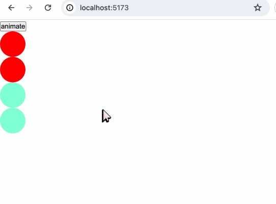
#### 工具

我们可以在[easings.net]( https://easings.net/)中查看关键字和贝塞尔曲线之间的转换。

比如我们选择[easeOutCirc](https://easings.net/#easeOutCirc)：
![[Pasted image 20240320171637.png]]
它对应的公式如下：
```javascript
function easeOutCirc(x: number): number {
  return Math.sqrt(1 - Math.pow(x - 1, 2));
}
```

再看`packages/svelte/src/runtime/easing/index.js`中的：
```javascript
export function circOut(t) {
	return Math.sqrt(1 - --t * t);
}
```
发现和easing.net上的实现无异。

除了easing.next，网络上有大量方便的贝塞尔曲线工具网站，比如[cubic-bezier.com](https://cubic-bezier.com/#.17,.67,.83,.67)和[ceaser](https://matthewlein.com/tools/ceaser)等，读者可自行探索。

### svelte/easing
https://css-tricks.com/ease-y-breezy-a-primer-on-easing-functions/
https://github.com/gre/bezier-easing
https://paulbourke.net/miscellaneous/interpolation/
http://robertpenner.com/easing/penner_chapter7_tweening.pdf
在Svelte中，`svelte/easing`中实现了大量的缓动效果：
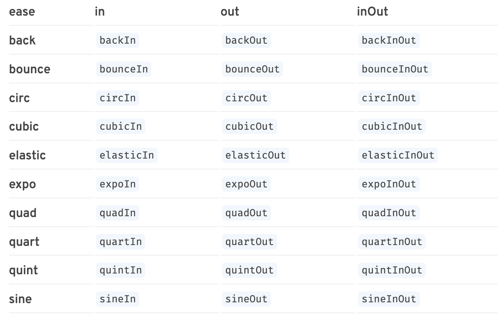

https://gist.github.com/terkel/4377409

https://github.com/Rich-Harris/eases-jsnext
https://github.com/sveltejs/svelte/pull/525
追根溯源：https://github.com/glslify/glsl-easings
## Transition

### svelte/transition

`svelte/transition`顾名思义，用来处理过渡效果，它导出了以下函数：
- fade
- blur
- fly
- slide
- scale
- draw
- crossfade

`svelte/transition`导出的方法可以结合`transition:fn`指令进行使用使用。

#### fade
`fade`的类型定义如下：
```typescript
function fade(
	node: Element,
	{ delay, duration, easing }?: FadeParams | undefined
): TransitionConfig;
```

演示例子：
```html
<script>
  import { fade } from "svelte/transition";
  import { cubicInOut } from "svelte/easing";

  let show = true;
</script>

<button on:click={() => (show = !show)}>toggle</button>

{#if show}
  <div
    class="ball"
    transition:fade={{
      easing: cubicInOut,
      duration: 1000,
    }}
  ></div>
{/if}

<style>
  .ball {
    width: 50px;
    height: 50px;
    border-radius: 50%;
    background-color: tomato;
  }
</style>
```


fade是通过修改元素节点的opacity透明度来实现动画效果。
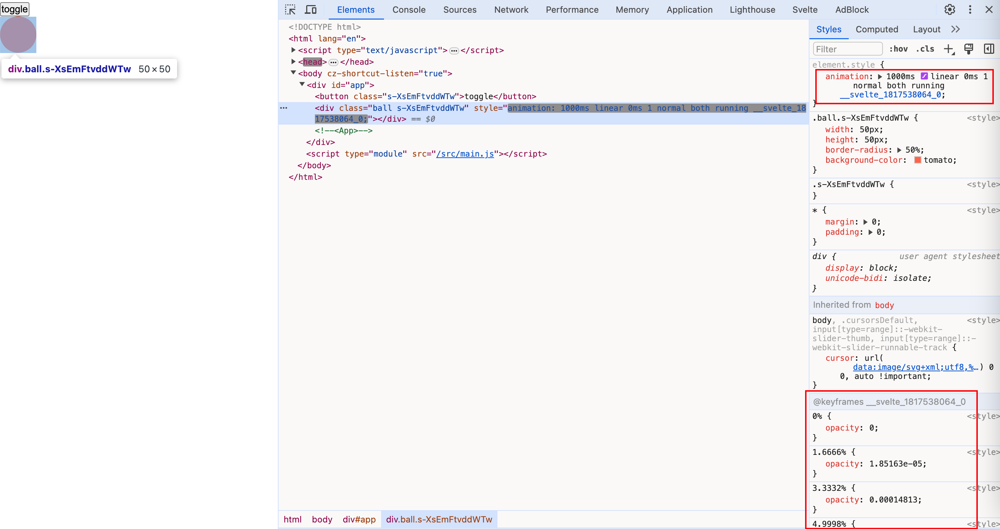
我们在使用`transition`指令时，也可以直接不传参数`<div transition:fade></div>`，因为方法内部提供了默认值。如`fade`方法的`delay`默认0，`duration`默认400ms，`easing`默认使用`linear`。
#### blur
`blur`方法的类型定义：
```typescript
function blur(
	node: Element,
	{
		delay,
		duration,
		easing,
		amount,
		opacity
	}?: BlurParams | undefined
): TransitionConfig;
```

- opacity：透明度开始显示或透明度准备结束的那个节点的值。比如我们设置了opacity为0.5，那动画就会直接从0.5到1开始和从1到0.5结束，0到0.5这个区间的变化不存在缓动效果。
- amount：可以理解为blur的模糊程度，默认是5，值越大越模糊。

```html
<script>
  import { blur } from "svelte/transition";
  import { cubicInOut } from "svelte/easing";

  let show = true;
</script>

<button on:click={() => (show = !show)}>toggle</button>

{#if show}
  <div
    class="ball"
    transition:blur={{
      easing: cubicInOut,
      duration: 1000,
    }}
  ></div>
{/if}
```


当我们设置了`amount`和`opacity`之后：
```html
{#if show}
  <div
    class="ball"
    transition:blur={{
      easing: cubicInOut,
      duration: 1000,
      amount: 10,
      opacity: 0.5,
    }}
  ></div>
{/if}
```

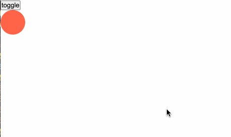
`blur`方法在切换透明度的同时添加一个blur滤镜。
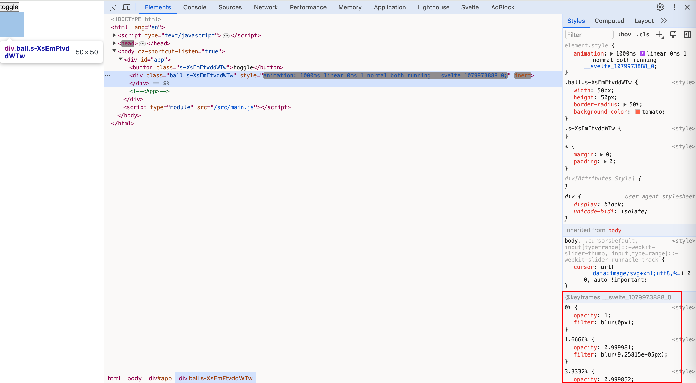

#### fly
`fly`方法的类型定义如下：
```typescript
function fly(
	node: Element,
	{
		delay,
		duration,
		easing,
		x,
		y,
		opacity
	}?: FlyParams | undefined
): TransitionConfig
```

- opacity：在`blur`中已进行过阐释
- x：元素在水平方向移动的距离。x正数表示元素向右平移。
- y：元素在垂直方向移动的距离。y正数表示元素向下平移。

`fly`方法在设置元素节点的透明度动画的同时，还能控制元素的移动。

```html
{#if show}
  <div
    class="ball"
    transition:fly={{
      easing: cubicInOut,
      duration: 1000,
      x: 200,
      y: 200
    }}
  ></div>
{/if}
```

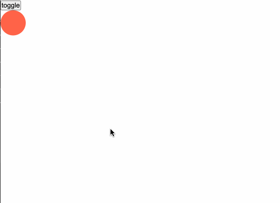

动画效果除了设置opacity，还设置了transform:translate()
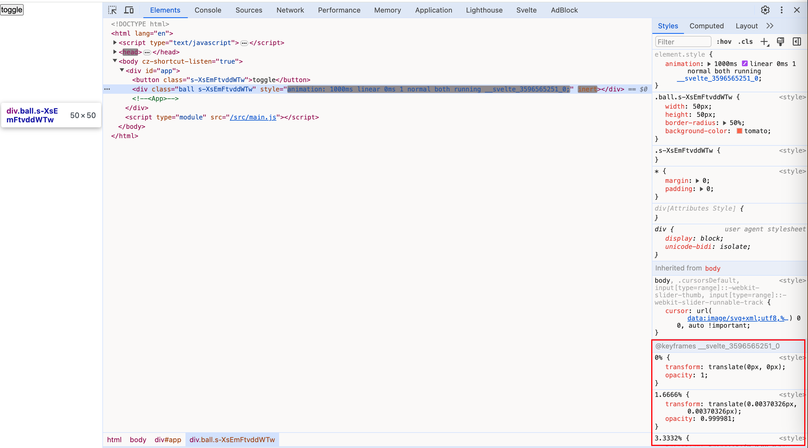

#### slide
`slide`方法的类型定义如下：
```typescript
function slide(
	node: Element,
	{
		delay,
		duration,
		easing,
		axis
	}?: SlideParams | undefined
): TransitionConfig;
```

- axis：接收`x`或`y`作为值，默认`y`。设置从哪个方向滑动。

```html
{#if show}
  <div
    class="ball"
    transition:slide={{
      easing: cubicInOut,
      duration: 1000
    }}
  ></div>
{/if}
```

默认表现：


```diff
{#if show}
  <div
    class="ball"
    transition:slide={{
      easing: cubicInOut,
      duration: 1000,
+      axis: 'x'
    }}
  ></div>
{/if}
```
设置成`x`方向：
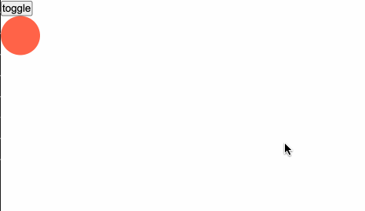

`slide`除了设置opacity，还伴随设置宽高来实现动画效果。
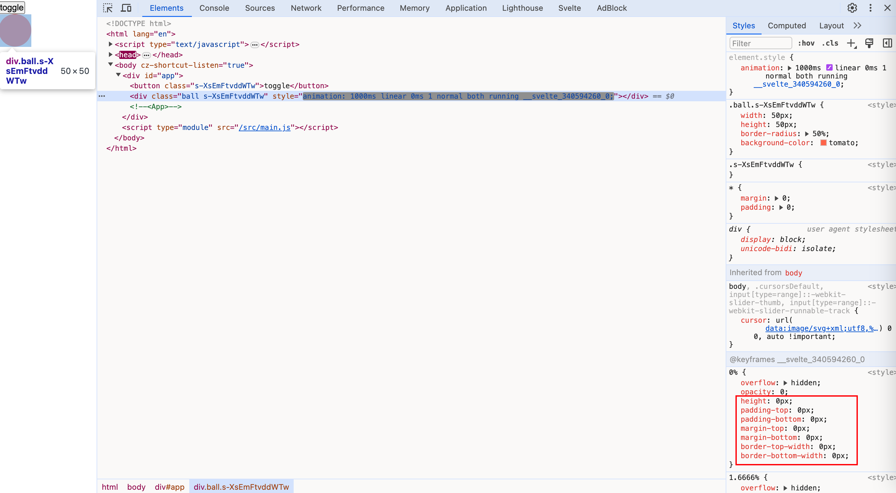
这也解释了为什么当元素逐渐消失时，如果是垂直方向是从上到下，水平方向是从右到左进行变化。
#### scale
`scale`方法类型定义如下：
```typescript
function scale(
	node: Element,
	{
		delay,
		duration,
		easing,
		start,
		opacity
	}?: ScaleParams | undefined
): TransitionConfig;
```

- start：和opacity的设置作用相似，用于设置一个值，从这个值到1之间存在过渡效果，从0到这个值之间不存在过渡效果。

```html
<script>
  import { scale } from "svelte/transition";
  import { cubicInOut } from "svelte/easing";

  let show = true;
</script>

<button on:click={() => (show = !show)}>toggle</button>


{#if show}
  <div
    class="ball"
    transition:scale={{
      easing: cubicInOut,
      duration: 1000,
    }}
  ></div>
{/if}
```

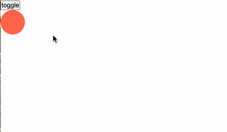

`scale`方法除了设置opacity，还伴随设置`transform:scale()`
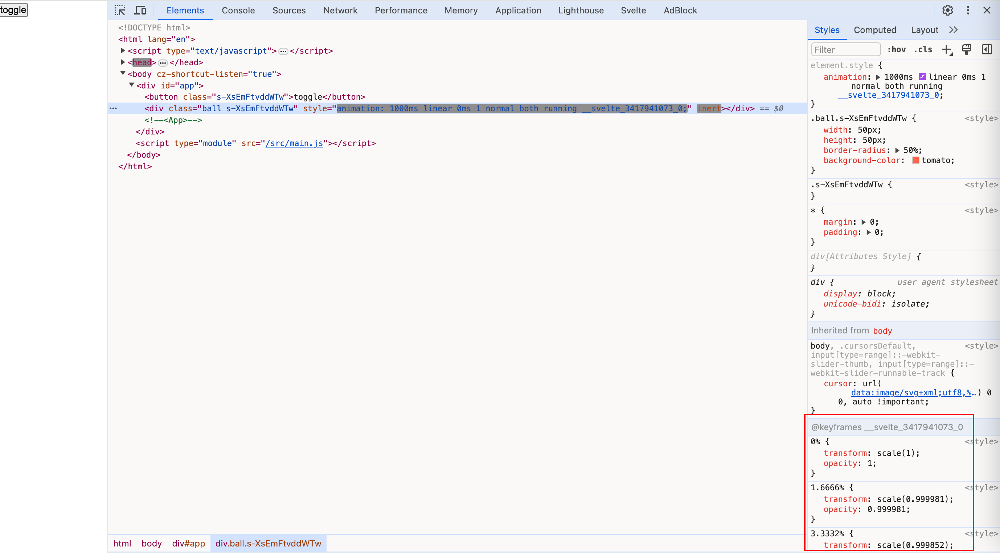
#### draw
专门用来画svg的动画方法，`draw`方法类型定义如下：
```html
<script>
  import { draw } from "svelte/transition";
  import { cubicInOut } from "svelte/easing";

  let show = true;
</script>

<button on:click={() => (show = !show)}>toggle</button>

<svg viewBox="0 0 50 50" xmlns="http://www.w3.org/2000/svg">
	{#if show}
		<path
			transition:draw={{ duration: 5000, delay: 500, easing: cubicInOut }}
			d="M25 1 L32 18 L50 18 L36 29 L40 46 L25 36 L10 46 L14 29 L1 18 L18 18 Z"
			fill="none"
			stroke="tomato"
			stroke-width="1px"
			stroke-linejoin="round"
		/>
	{/if}
</svg>
```

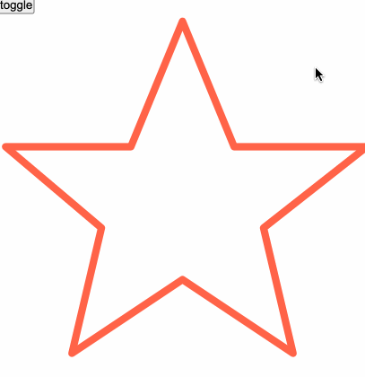

#### crossfade
不一一讲解了，感兴趣的读者自行探索。

### 指令
`svelte/transition`导出的方法同样可以和`in:fn`和`out:fn`指令结合使用。`in:fn`、`out:fn`和`transition:fn`的区别在于，它细分了过渡的发生时间点。在一个过渡效果的生命周期里，我们把它分为in和out两种时期。
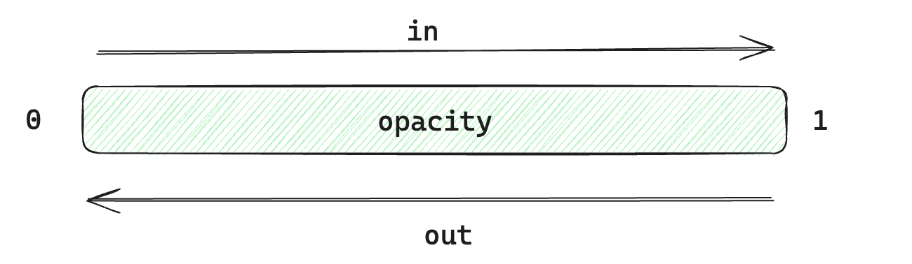
当元素从显示到隐藏的阶段，我们称其为out，而当元素从隐藏到显示的过渡，我们称其为in。

```html
<script>
  import { scale, fly } from "svelte/transition";
  import { cubicInOut } from "svelte/easing";

  let show = true;
</script>

<button on:click={() => (show = !show)}>toggle</button>


{#if show}
  <div
    class="ball"
    in:scale={{
      easing: cubicInOut
    }}
    out:fly={{
      x: 200,
      y: 200,
      easing: cubicInOut
    }}
  ></div>
{/if}
```

当小球要消失时，我们使用了`out:fly`效果，而当小球要显现出来时，我们使用了`in:scale`。
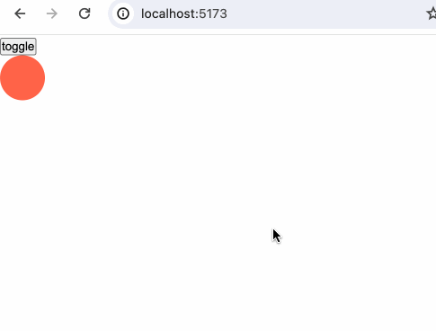
`in`、`out`和`transition`指令一样，可以直接使用`in:fn`、`out:fn`而不传参数。

### 自定义过渡 

https://css-tricks.com/making-your-first-custom-svelte-transition/
TODO: tick?
```javascript
transition = (node: HTMLElement, params: any) => {
  delay?: number,
  duration?: number,
  easing?: (t: number) => number,
  css?: (t: number, u: number) => string,
  tick?: (t: number, u: number) => void
}
```

```html
<script>
  import { cubicInOut } from "svelte/easing";

  let show = false;

  function rainbow(node) {
    const colors = [
      "rgba(255, 0, 0, 1)",
      "rgba(255, 154, 0, 1)",
      "rgba(208, 222, 33, 1)",
      "rgba(79, 220, 74, 1)",
      "rgba(63, 218, 216, 1)",
      "rgba(47, 201, 226, 1)",
      "rgba(28, 127, 238, 1)",
      "rgba(95, 21, 242, 1)",
      "rgba(186, 12, 248, 1)",
      "rgba(251, 7, 217, 1)",
      "rgba(255, 0, 0, 1)",
    ];
    return {
      duration: 3500,
      easing: cubicInOut,
      css: (t, v) => {
        return `
          background: ${colors[((t * 10) | 0) - 1]}
        `;
      },
    };
  }
</script>

<button
  on:click={() => {
    show = !show;
  }}>toggle</button
>

{#if show}
  <div class="rainbow-box" transition:rainbow></div>
{/if}

<style>
  .rainbow-box {
    width: 80vw;
    height: 200px;
    border-radius: 5px;
    border: 1px solid black;
  }
</style>
```

数组中的颜色如下：
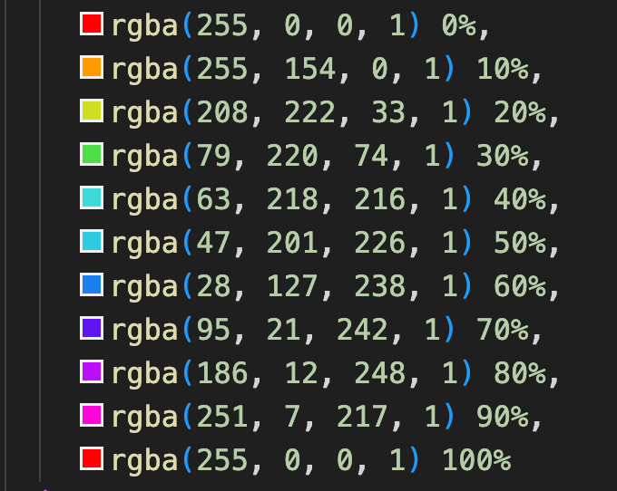
我们实现一个彩虹渐变的过渡效果：
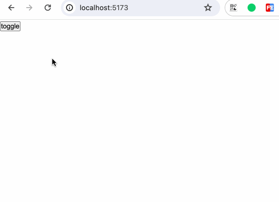

### 过渡事件

我们可以监听以下过渡效果的事件：
- introstart：进入效果开始
- introend：进入效果结束
- outrostart：退出效果开始
- outroend：退出效果结束

```html
<script>
  import { scale, fly } from "svelte/transition";
  import { cubicInOut } from "svelte/easing";

  let show = true;

  const onIntroStart = () => {
    console.log("intro start");
  };
  const onIntroEnd = () => {
    console.log("intro end");
  };
  const onOutroStart = () => {
    console.log("outro start");
  };
  const onOutroEnd = () => {
    console.log("outro end");
  };
</script>

<button on:click={() => (show = !show)}>toggle</button>

{#if show}
  <div
    class="ball"
    in:scale={{
      easing: cubicInOut,
      duration: 2000,
    }}
    out:fly={{
      x: 200,
      y: 200,
      duration: 2000,
      easing: cubicInOut,
    }}
    on:introstart={onIntroStart}
    on:introend={onIntroEnd}
    on:outrostart={onOutroStart}
    on:outroend={onOutroEnd}
  ></div>
{/if}
```

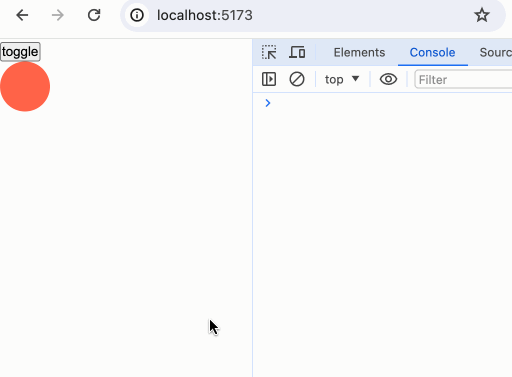

我们在上述的各类演示中，已经知道`svelte/transition`其实是通过控制css的animation来实现过渡的，因此，我们还能通过对js的`animationstart`和`animationend`事件的监听，在动画的开始与结束时执行一些操作。

```html
<script>
  import { scale, fly } from "svelte/transition";
  import { cubicInOut } from "svelte/easing";

  let show = true;

  const onIntroStart = () => {
    console.log("intro start");
  };
  const onIntroEnd = () => {
    console.log("intro end");
  };
  const onOutroStart = () => {
    console.log("outro start");
  };
  const onOutroEnd = () => {
    console.log("outro end");
  };

  const start = () => {
    console.log("animation start");
  };
  const end = () => {
    console.log("animation end");
  };
</script>

<button on:click={() => (show = !show)}>toggle</button>

{#if show}
  <div
    class="ball"
    in:scale={{
      easing: cubicInOut,
      duration: 2000,
    }}
    out:fly={{
      x: 200,
      y: 200,
      duration: 2000,
      easing: cubicInOut,
    }}
    on:introstart={onIntroStart}
    on:introend={onIntroEnd}
    on:outrostart={onOutroStart}
    on:outroend={onOutroEnd}
    on:animationstart={start}
    on:animationend={end}
  ></div>
{/if}
```

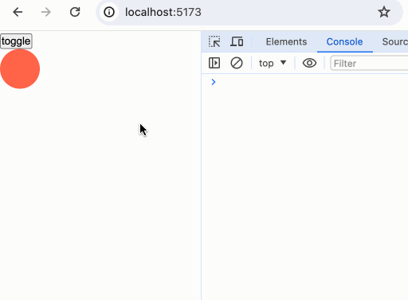
## Animation

目前`svelte/animation`中只导出了一个方法`flip`
  

## 小结

本章我们详细地了解了Svelte中动画的功能。
