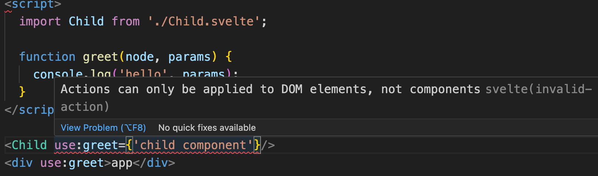
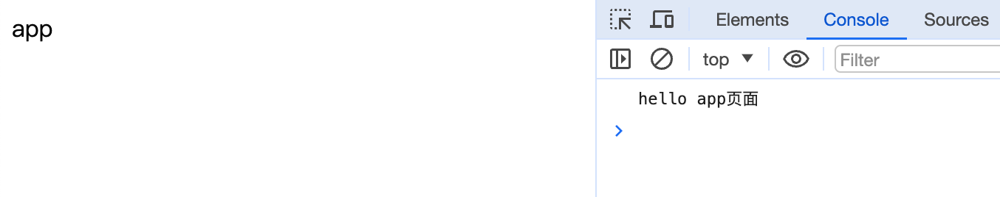
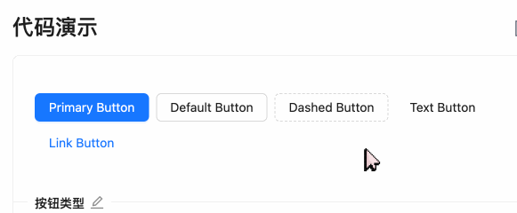
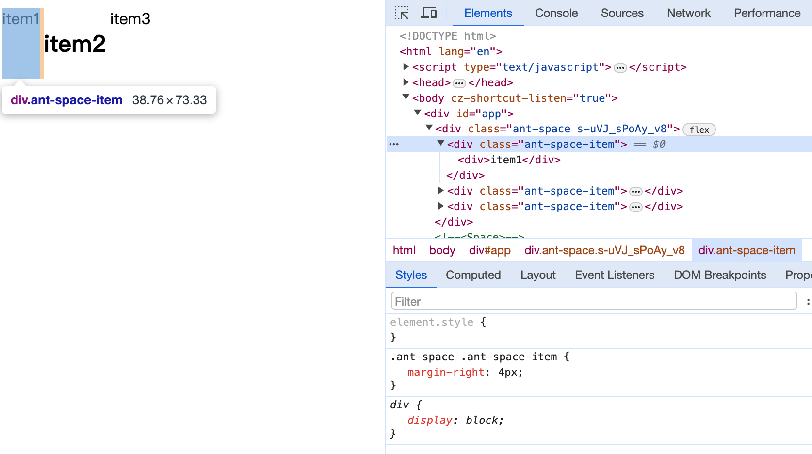

## Action

`svelte/action` is just an ordinary JavaScript function called when an element is created. Through this function, we can obtain a reference to the element itself. Therefore, we can attach any behavior to the element through JavaScript programming. It can be understood as performing operations within the lifecycle of the element.

The usage of an action is as follows:
```javascript
use:action={parameters}
```

here is the type definition:
```javascript
action = (node: HTMLElement, parameters: any) => {
  update?: (parameters: any) => void,
  destroy?: () => void
}
```
- node: Reference to the element
- parameters:`={parameters}`'s value。
- The method returns an object that has the following properties:
  - `update` method will be called every time the element is updated.
  - `destroy` method is called when the element is destroyed.

Actions can only be used on normal elements and cannot be used in components.


```html
<script>
  function greet(node, params) {
    console.log('hello', params);
  }
</script>

<div use:greet={'app页面'}>app</div>
```



I will present three demonstrations of custom actions for you: `use:clickoutside`, `use:wave`, and `use:space` respectively.

#### clickOutside

This action is to implement the click event listening outside the bound DOM. This kind of functionality is commonly seen in some UI pop-up window components. When clicking outside the pop-up window, the window needs to be closed.

```javascript
export const clickOutside = (node: HTMLElement, callback: () => void) => {
  const handleClick = (event: MouseEvent) => {
    if (!event?.target) return;

    if (
      node &&
      !node.contains(event.target as Node) &&
      !event.defaultPrevented
    ) {
      callback();
    }
  };

  document.addEventListener("click", handleClick, true);

  return {
    destroy() {
      document.removeEventListener("click", handleClick, true);
    },
  };
};
```

Bind a listening event in the `document`. Check `node.contains(event.target)`. If the object that triggers the event is not the currently bound object, execute the callback.
If you are not using `Typescript`, you can delete the type definitions in the example.

```html
<script>
  import { clickOutside } from './action';

  const onClickOutside = () => {
    console.log('点击外面');
  }
</script>

<main>
  <div id="box" use:clickOutside={onClickOutside}></div>
</main>

<style>
  main {
    width: 100px;
    height: 100px;
    background: #eeeeee;
    margin: 0 auto;
    display: flex;
    align-items: center;
    justify-content: center;
  }
  #box {
    width: 30px;
    height: 30px;
    background: salmon;
    line-height: 30px;
    text-align: center;
  }
</style>
```


When we click on the red area, no information will be printed. When we click outside the red area, information will be printed.

#### wave

If you have used Antd components, when clicking on some components such as the Button component, you will notice an animated effect where a wave-like layer appears:



let's implement this effect:
```javascript
export function wave(ele) {
  let clickWaveTimeoutId;
  let styleForPesudo;

  function getAttributeName() {
    return 'ant-click-animating-without-extra-node';
  }

  function _onClick(node, waveColor) {
    const attributeName = getAttributeName();
    node.removeAttribute(attributeName);
    node.setAttribute(attributeName, 'true');

    styleForPesudo = styleForPesudo || document.createElement('style');
    if (waveColor) {
      styleForPesudo.innerHTML =
        `[ant-click-animating-without-extra-node]:after { border-color: ${waveColor}; }`;
      if (!document.body.contains(styleForPesudo)) {
        document.body.appendChild(styleForPesudo);
      }
    }
    node.addEventListener('animationend', onTransitionEnd);
  }

  function bindAnimationEvent(node) {

    const onClick = (e) => {
      resetEffect(node);
      const waveColor =
        getComputedStyle(node).getPropertyValue('border-top-color') || // Firefox Compatible
        getComputedStyle(node).getPropertyValue('border-color') ||
        getComputedStyle(node).getPropertyValue('background-color');
      clickWaveTimeoutId = window.setTimeout(() => _onClick(node, waveColor), 0);
    };

    node.addEventListener('click', onClick, true);

    return {
      cancel: () => {
        node.removeEventListener('click', onClick, true);
      },
    };
  }

  function resetEffect(node) {
    const attributeName = getAttributeName();
    node.removeAttribute(attributeName);
    removeExtraStyleNode();

    node.removeEventListener('animationend', onTransitionEnd);
  }

  function onTransitionEnd(e) {
    if (!e || e.animationName !== 'fadeEffect') {
      return;
    }
    resetEffect(e.target);
  }

  function removeExtraStyleNode() {
    if (styleForPesudo) {
      styleForPesudo.innerHTML = '';
    }
  }

  bindAnimationEvent(ele);

  return {
    destroy() {
      if (clickWaveTimeoutId) {
        clearTimeout(clickWaveTimeoutId);
      }
    }
  }
}
```

Since the `style` within a Svelte component is scoped, we'll place the following style code globally:
```css
:root {
  --theme-color: purple;
}

[ant-click-animating-without-extra-node="true"] {
  position: relative;
}

[ant-click-animating-without-extra-node="true"]::after {
  position: absolute;
  top: 0;
  right: 0;
  bottom: 0;
  left: 0;
  display: block;
  border-radius: inherit;
  box-shadow: 0 0 0 0 var(--theme-color);
  opacity: 0.2;
  animation: fadeEffect 2s cubic-bezier(0.08, 0.82, 0.17, 1),
    waveEffect 0.4s cubic-bezier(0.08, 0.82, 0.17, 1);
  animation-fill-mode: forwards;
  content: "";
  pointer-events: none;
}

@keyframes waveEffect {
  100% {
    box-shadow: 0 0 0 var(--theme-color);
    box-shadow: 0 0 0 6px var(--theme-color);
  }
}

@keyframes fadeEffect {
  100% {
    opacity: 0;
  }
}
```

Briefly explain the implementation idea:

- When `use:wave` is called and enters our action, the `bindAnimationEvent` method is executed. This method serves as the entry point for implementing the wave animation effect.
- Inside the `bindAnimationEvent` method, a click event is bound to the currently bound element.
- When the element is clicked, first add the `ant-click-animating-without-extra-node` attribute to the element. After that, add a pseudo-class to the element with the `ant-click-animating-without-extra-node` attribute.
- After adding the pseudo-class, the styles of the pseudo-class take effect. There are two animations, `fadeEffect` and `waveEffect`. `fadeEffect` is used to set the transparency, and `waveEffect` is the most crucial animation, which sets two `box - shadow` values.
- After the animation ends, clear the `ant-click-animating-without-extra-node` attribute and remove the pseudo-class at the same time.

test our custom action：
```html
<script>
  import { wave } from "./action";
</script>

<button use:wave>按钮</button>

<style>
  button {
    width: 100px;
    height: 30px;
  }
</style>
```


In this way, without modifying the logic of the original components, we can add the click wave effect by using `use:wave`. Therefore, "use" is highly suitable for expanding the functionality of some components, or even third-party libraries. 

Readers interested in the source code for implementing this effect can refer to [motion/other.less](https://github.com/ant-design/ant-design/blob/3.26.20/components/style/core/motion/other.less)和[wave](https://github.com/ant-design/ant-design/blob/3.26.20/components/_util/wave.tsx)。

#### space

In the previous section introducing "Slots", we learned that in Svelte, it's not possible to hijack `$$slots` to re-define the content of slots. Instead, we can use the form of directives to accomplish this operation. 

```javascript
// action.js
export function space(node: HTMLElement, spaceClasses: string) {
  const wrap = () => {
    node.childNodes.forEach((element) => {
      if (!element) {
        return;
      }

      if (
        element.nodeType === 3 &&
        (!element.nodeValue || /^\s+$/.test(element.nodeValue))
      ) {
        return;
      }

      if (element.parentNode) {
        const wrapItem = document.createElement("div");

        wrapItem.className = spaceClasses;

        element.parentNode.insertBefore(wrapItem, element);

        wrapItem.appendChild(element);
      }
    });
  };

  wrap();

  return {
    destroy: wrap,
  };
}
```

After that, we use the `space` action in the `Space` component:
```html
<script>
// Space.svelte
  import { space } from "./action"
  let spaceChildClass = "ant-space-item";

  let spaceClass = "ant-space";
</script>

<div use:space={spaceChildClass} class={spaceClass}>
  <slot />
</div>

<style>
  .ant-space {
    display: flex;
  }
  :global(.ant-space .ant-space-item){
    margin-right: 4px;
  }
  :global(.ant-space-item:last-child) {
    margin-right: 0;
  }
</style>
```

test in App:
```html
<script>
  import Space from './Space.svelte';
</script>

<Space>
  <div>item1</div>
  <h2>item2</h2>
  <span>item3</span>
</Space>
```


## Others

In addition to using `use` to implement custom actions, Svelte also supports other directives. For example, `bind:` which was introduced when discussing data and DOM references, `transition:`, `in:`, `out:`, `animate:` introduced in the animation section, and `style:` introduced in the styling section.

## Summary

In this chapter, we have learned:
- What is an action and how to customize an action method? Use a custom action through the `use:action` approach.
- Demonstrated the role of actions in actual development with specific cases.
