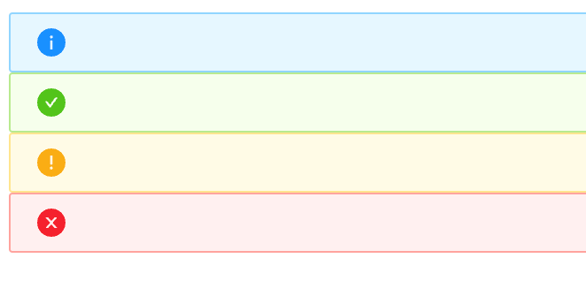
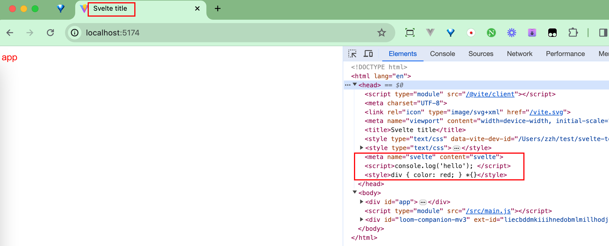
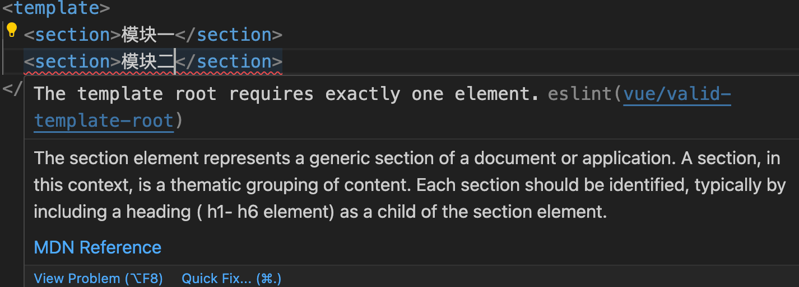
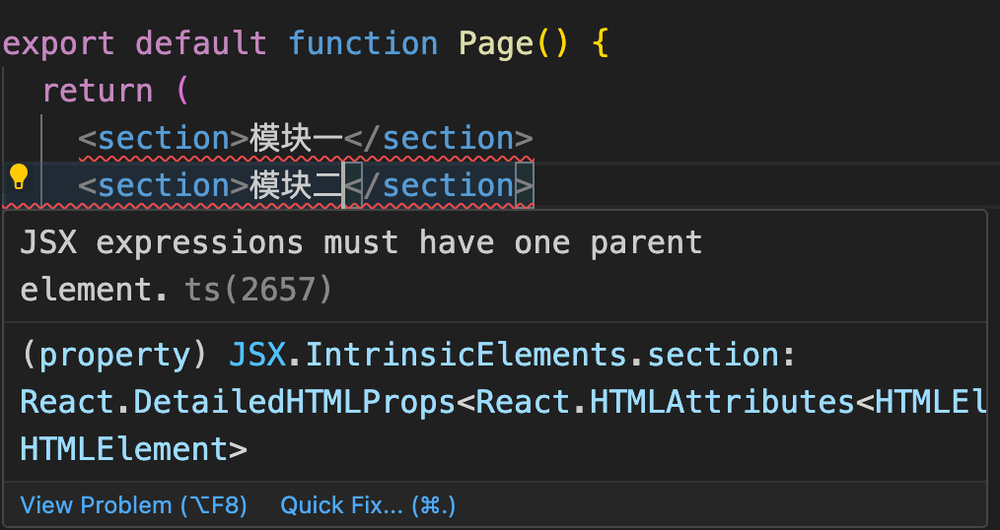
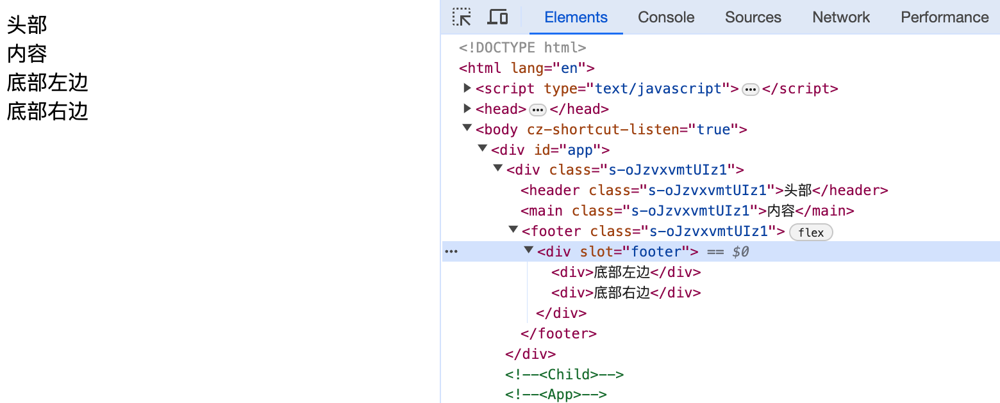

Some special tags are less frequently encountered in regular development. However, in specific situations, they can play a significant role. In this chapter, we will learn about the following tags: 
- `<svelte:self>`
- `<svelte:component>`
- `<svelte:element>`
- `<svelte:window>`
- `<svelte:head>`
- `<svelte:fragment>`
- `<svelte:options>`

## Call itself


`<svelte:self>` means that a component can call itself. This makes it very easy to think that this tag can be used for any component that involves a tree structure. 

```html
<script>
  // App.svelte
  import Folder from "./Folder.svelte";
  let data = [
    {
      name: "1.txt",
    },
    {
      name: "folder1",
      files: [
        {
          name: "2.png",
        },
        {
          name: "folder2",
          files: [
            {
              name: "3.doc",
            },
          ],
        },
      ],
    },
    {
      name: "3.pdf",
    },
  ];
</script>

<Folder {data} name={'Home'}/>
```

```html
<script>
// Folder.svelte
  export let data = [];
  export let name = '';
</script>

<p>{name}</p>
<ul>
  {#each data as item}
    <li>
      {#if item.files && item.files.length}
        <svelte:self data={item.files} name={item.name} />
      {:else}
        {item.name}
      {/if}
    </li>
  {/each}
</ul>

<style>
  ul {
    padding: 0.2em 0 0 0.5em;
    margin: 0 0 0 0.5em;
    list-style: none;
    border-left: 1px solid #eee;
  }

  li {
    padding: 0.2em 0;
  }
</style>
```


When using this tag, it is necessary to pay attention to the judgment of the termination condition; otherwise, it is very likely to cause an infinite recursive call. 


## Dynamic rendering

### component

`<svelte:component>` is used for dynamic rendering of components, and it can be regarded as a simple application of the strategy pattern. For example, if we want to design a component that has different states, and then we display different icons according to these different states.

Under normal circumstances, we might write the following code: 

```html
{#if type === 'success'}
{:else if type === 'warning'}
{:else if type === 'error'}
{:else}
{/if}
```
The advantage of this "spaghetti code" style of state judgment is its intuitiveness. However, once the number of states increases, the code will become extremely verbose.  

Take a look at the usage of `<svelte:component>`:
```html
<script>
  import SuccessIcon from "./icon/SuccessIcon.svelte";
  import InfoIcon from "./icon/InfoIcon.svelte";
  import WarningIcon from "./icon/WarningIcon.svelte";
  import ErrorIcon from "./icon/ErrorIcon.svelte";

  $: icon = {
    success: SuccessIcon,
    info: InfoIcon,
    warning: WarningIcon,
    error: ErrorIcon,
  }[type];
</script>

<svelte:component this={icon} />
```
This is one of our Icon components, which can display different icons according to the passed `type` parameter. All the states and the mapping contents corresponding to the states are grouped together in an object, and the content corresponding to the state is directly retrieved and returned according to the different states.  



### element

The functionality of `<svelte:element>` is quite similar to that of `<svelte:component>`. The only difference is that `<svelte:component>` is used for custom components, while `<svelte:element>` is for built-in HTML elements.

We can also dynamically specify the `element` in the same way: 

```html
<script>
  let htmlType = 'div';
</script>

<select bind:value={htmlType}>
  <option value="div">div</option>
  <option value="h2">h2</option>
  <option value="button">button</option>
</select>

<svelte:element this={htmlType}>text</svelte:element>
```


However, it should be noted that the dynamically bound elements cannot use `bind:value`.

When we use static specification, `bind:value` can be used normally: 
```html
<svelte:element this="input" bind:value={text} />
```


However, when we use dynamic specification, `bind:value` becomes ineffective. 


It should also be noted that if the element we dynamically specify is a self-closing tag and there is other content inside the `<svelte:element>`, the content will not be displayed. 
```html
<script>
  let type = "input";
</script>

<select bind:value={type}>
  <option value="input">input</option>
  <option value="div">div</option>
</select>
<svelte:element this={type}>text</svelte:element>
```


## BOM & DOM

### window

Use `<svelte:window>` to listen to the `window` object. 
```html
<svelte:window on:event={handler} />
```

You can also use `bind` to bind properties of the `window` object, but the properties that can be bound are limited: `innerWidth`, `innerHeight`, `outerWidth`, `outerHeight`, `scrollX`, `scrollY`, `online`, `devicePixelRatio`.

For example, we can: 
```html
<svelte:window bind:scrollY={y}>
```

We noticed a piece of prompt information on the official website:
> Note that the page will not be scrolled to the initial value to avoid accessibility issues. Only subsequent changes to the bound variable of `scrollX` and `scrollY` will cause scrolling. However, if the scrolling behaviour is desired, call `scrollTo()` in `onMount()`.

For example:
```html
<script>
  let y = 600;

  $: console.log('scrolly', y);
</script>

<svelte:window bind:scrollY={y} />

<div class="box red">red</div>
<div class="box green">green</div>
<button on:click={() => {y = 400}}>change</button>

<style>
  .box {
    width: 500px;
  }
  .red {
    height: 500px;
    background-color: red;
  }
  .green {
    height: 1000px;
    background-color: green;
  }
</style>
```


当我们初次设置成400后，因为页面在最顶部，此时scrollY为0。初始的设置并没有生效，等我们滑到底部时，点击按钮成功让页面滚动到400px的位置。

与`<svelte:window>`类似的标签还有`<svelte:document>`和`<svelte:body>`，显而易见，这两个标签分别操作document和document.body。

### head
```
<svelte:head>
```
往`<head>`标签中添加`<script>`、`<link>`、`<title>`和`<meta>`等元素。



操作window对象或document对象的这几个标签`<svelte:window>`、`<svelte:document>`、`<svelte:body>`、`<svelte:head>`，都只能在代码顶层中进行添加。不像<svelte:self>和<svelte:component>等标签可以在循环判断或条件判断中嵌套添加。

## fragment

在一些场景中，我们希望我们的页面下可以放置多个并排层级的元素，比如：
```javascript
<section>模块一</section>
<section>模块二</section>
```

然而现实却是我们会遇到框架的限制提示。

在Vue 2.x中：


在React中：

为了符合框架的要求，我们不得不用一个毫无意义的标签来包裹他们，以符合框架中只能返回一个顶级标签的需求：
```javascript
<div>
  <section>模块一</section>
  <section>模块二</section>
</div>
```
在Vue和React中，都提供了一种称为Fragment的组件来解决此类问题。Fragment是一个虚拟组件，它可以将组件功能绑定到一个单一的元素中，而不需要创建一个多余的DOM节点

虽然Svelte的html的标签填写非常灵活，可以直接写成：
```html
<script></script>

<section>模块一</section>
<section>模块二</section>

<style></style>
```

但在某些场景下，仍旧需要类似Fragment的功能支持。就比如下面这个例子：
```html
<!-- Child.svelte -->
<div>
  <header>
    <slot name="header">头部</slot>
  </header>
  <main>
    <slot>内容</slot>
  </main>
  <footer>
    <slot name="footer">底部</slot>
  </footer>
</div>

<style>
  footer {
    display: flex;
    align-items: center;
    justify-content: space-between;
  }
</style>
```

```html
<script>
 import Child from "./Child.svelte";
</script>

<Child>
  <div slot="footer">
    <div>底部左边</div>
    <div>底部右边</div>
  </div>
</Child>
```



我们原本在组件内容实现了底部内容的flex布局，然而因为我们在外部，需要一个标签来设置`slot="footer"`而导致需要对从外部传的内容进行一层包裹。导致原本期望的flex布局并不生效。一种解决方式是我们在自己外部自己再手动实现flex布局，另一种方式便是使用`<svelte:fragment>`标签。

```html
<Child>
  <svelte:fragment slot="footer">
    <div>底部左边</div>
    <div>底部右边</div>
  </svelte:fragment>
</Child>
```


可以看到<svelte:fragment>不会被当成实际标签编译展示到页面上。

## 编译

`<svelte:options>`为我们提供了自定义编译功能的能力，使用方式如下：
```html
<svelte:options option={value} />
```

可能会使用到的option参数有：
- immutable
- accessors
- namespace
- customElement

在大多数情况下，我们并不需要使用到这个标签，除非有深层次的定制。更多参数详见[compiler](https://svelte.dev/docs/svelte-compiler#types)。

### immutable

```html
<script>
let obj = {
  name: 'hello'
}
</script>
<input bind:value={obj.name} />
name: {obj.name}
```


当我们添加`<svelte:options immutable={true} />`时，我们的对象将变成不可变对象：
```html
<svelte:options immutable={true} />
<script>
let obj = {
  name: 'hello'
}
</script>
<input bind:value={obj.name} />
name: {obj.name}
```

可以看到，对象数据没有改变。
### accessors

如果我们配置accessors为true，编译器会为组件的props创建getters和setters。如果没配置，默认是false， 编译器只会为只读的导出数据（如const，class，function）创建getters。如果我们配置了 `customElement: true` ，accessors默认为`true`。

上面这段话有点让人费解，我们直接看例子：
```html
<script>
// Child.svelte
  let age = 18;
  export let name = 'Svelte';

  export function getAge() {
    console.log(age);
  }
</script>

<button on:click={getAge}>{name}</button>
```

```html
<script>
// App.svelte
  import Child from './Child.svelte';

  let childRef;

  function onClick() {
    console.log(childRef);
    console.log(childRef.name);
    console.log(childRef.getAge());
  }
</script>

<button on:click={onClick}>Get Child</button>
<Child bind:this={childRef} />
```
首先我们定义了一个子组件，对外导出name属性和getAge方法，然后我们在父组件中引用，并试图通过ref直接调用子组件的name和getAge。在《dom引用》章节，我们曾试验过直接调用子组件实例的数据和方法，答案很明显，我们无法直接使用childRef.name。


我们直接查看Child.svelte编译后的结果，发现只有getAge方法提供了getter。
```javascript
/* Child.svelte generated by Svelte v4.2.12 */

let age = 18;

function getAge() {
	console.log(age);
}

class Child extends SvelteComponent {
	constructor(options) {
		super();
		init(this, options, instance, create_fragment, safe_not_equal, { name: 0, getAge: 1 });
	}

	get getAge() {
		return getAge;
	}
}

export default Child;
```

而当我们开启了`accessors={true}`后，Child.svelte的编译结果为：
```javascript
/* Child.svelte generated by Svelte v4.2.12 */
let age = 18;

function getAge() {
	console.log(age);
}

class Child extends SvelteComponent {
	constructor(options) {
		super();
		init(this, options, instance, create_fragment, safe_not_equal, { name: 0, getAge: 1 });
	}

	get name() {
		return this.$$.ctx[0];
	}

	set name(name) {
		this.$$set({ name });
		flush();
	}

	get getAge() {
		return getAge;
	}
}

export default Child;
```
Child.svelte的name提供了getter和setter。重新执行页面内容：

可以看到内容都被正确打印出来。
我们甚至可以直接`childRef.name = 'xxx';`来操作子组件的值。

### customElement

customElement支持我们使用自定义标签。
我们先自定义一个标签：
```html
<!-- Custom.svelte -->
<svelte:options customElement="my-element" />

<script>
  export let name = 'world'
</script>

<h1>hello {name}</h1>

<style>
  h1 {
    color: orange;
  }
</style>
```

然后修改我们的vite.config.js：
```javascript
import { defineConfig } from "vite";
import { svelte } from "@sveltejs/vite-plugin-svelte";

// https://vitejs.dev/config/
export default defineConfig({
  plugins: [
    svelte({
      compilerOptions: {
        customElement: true,
      },
    }),
  ],
});
```

在main.js中引入组件，这样我们就无需在其他组件中反复导入：
```javascript
// main.js
import './app.css'
import App from './App.svelte'
import './Custom.svelte';

const app = new App({
  target: document.getElementById('app'),
})

export default app
```

最后在App.svlete中测试一下：
```html
<script>
  let name = 'svelte';
</script>

<input bind:value={name} />
<my-element {name} />
```


customElement除了支持传入一个字符串，还支持传入对象。
```html
<svelte:options
  customElement={{
	tag: 'xxx',
	shadow: 'xxx',
	props: {},
	extend: (customElementConstructor) => {}
/>
```

## Summary

In this chapter we have learned:
- Svelte内置的一些特殊标签：`<svelte:slef>`能使组件调用自身；`<svelte:component>`和`<svelte:element>`能进行动态渲染；`<svelte:fragment>`能提供一个专门用于包裹多个子节点的功能标签；`<svelte:options>`可以修改Svelte的编译能力；还有一些操作DOM和Window的标签等

