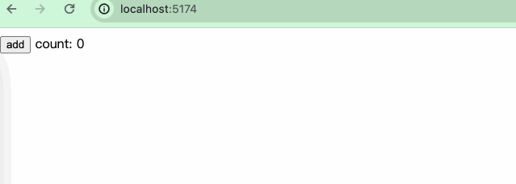

## await

在列表展示时，为了提升用户体验，我们在数据请求的过程中，往往会使用一些loading toast来提示用户我们正在请求，等到请求完成后便会隐藏loading提示而展示我们请求成功的数据。

```
{#await expression}...{:then name}...{:catch name}...{/await}
```

我们演示一个例子：
```html
<script>
 const myFetch = () => {
  return new Promise((resolve, reject) => {
    setTimeout(() => {
      let data = [{
        value: 'hello'
      }, {
        value: 'svelte'
      }];
      resolve(data);
    }, 2000)
  })
 }
</script>

{#await myFetch()}
  <div>loading...</div>
{:then data} 
  {#each data as item}
    <div>{item.value}</div>
  {/each}
{/await}
```


`{:catch}`用于展示当接口报错时的页面内容。我们演示一个接口报错的例子：
```html
<script>
 const myFetch = () => {
  return new Promise((resolve, reject) => {
    setTimeout(() => {
      const error = new Error('接口出错！');
      reject(error);
    }, 2000)
  })
 }
</script>

{#await myFetch()}
  <div>loading...</div>
{:then data} 
  {#each data as item}
    <div>{item.value}</div>
  {/each}
{:catch error}
  <div>页面出错：{error.message}</div>
{/await}
```


### Suspense
在React和Vue中，有一种称为Suspense的能力：[React Suspense](https://react.dev/reference/react/Suspense)、[Vue Suspense](https://vuejs.org/guide/built-ins/suspense.html)。这种能力允许开发者在页面中异步加载组件，这在一些性能优化的场合中非常有用。

我们演示下如何用`{#await}`实现Suspense的能力：
```html
<script>
// App.svelte
  let lazyComponent;
  let count = 0;

  function lazyload() {
    lazyComponent = import("./LazyLoad.svelte");
  }
</script>

<button on:click={lazyload}>Load</button>
<button on:click={() => count++}>Add</button>

{#if lazyComponent}
  {#await lazyComponent then { default: LazyComponent }}
    <LazyComponent {count} />
  {/await}
{/if}
```

```html
<script>
// LazyLoad.svelte
  export let count;
</script>
<div>这是一个用于异步加载的组件 {count}</div>
```


## html

`{@html}`允许我们直接渲染出html字符串内容，这在一些富文本应用中非常常见，正常写法如下：
```javascript
{@html expression}
```

```html
<script>
  let htmlContent = `<h1>hello svelte</h1>`
</script>

{@html htmlContent}
```

### XSS
Svelte不会在注入HTML之前转义表达式。如果数据来源不受信任，则必须对其进行转义，否则将用户暴露于XSS漏洞之中。

举个例子：
```html
<script>
  const htmlContent = '';
</script>

{@html htmlContent}
```


我们可以使用一些XSS防御库如[xss](https://www.npmjs.com/package/xss)和[DOMPurify](https://github.com/cure53/DOMPurify)等来对一些脚本内容进行转义。

```html
<script>
  import xss from "xss";

  const htmlContent = '';

  const filterContent = xss(htmlContent);
</script>

{@html filterContent}
```


## key

```
{#key expression}
```

> Key blocks destroy and recreate their contents when the value of an expression changes.This is useful if you want an element to play its transition whenever a value changes instead of only when the element enters or leaves the DOM.

说实话，笔者认为这个名字存在很大的误导性。 这个标签的真实作用是：当我们想看到一个元素因为状态变化而产生渐变效果时，我们可以用上这个语法。

```html
<script>
  import { slide } from "svelte/transition";

  let second = 60;

  let timer;

  const startCountDown = () => {
    stopCountDown();
    timer = setInterval(() => {
      if (second <= 0 && timer) {
        clearInterval(timer);
        return;
      }
      second--;
    }, 1000);
  };

  const stopCountDown = () => {
    if (timer) {
      clearInterval(timer);
    }
  };

  $: strArr = String(second).split("");
</script>

<button on:click={startCountDown}>开始倒计时</button>
<button on:click={stopCountDown}>停止倒计时</button>

<div class="num-list">
  {#each strArr as item}
    {#key item}
      <div class="num" in:slide={{duration: 1000}}>
        {item}
      </div>
    {/key}
  {/each}
</div>

<style>
  .num-list {
    display: flex;
  }
  .num {
    display: flex;
    align-items: center;
    justify-content: center;
    width: 100px;
    height: 150px;
    background: black;
    border-radius: 12px;
    color: white;
    font-size: 48px;
    margin-right: 10px;
  }
</style>
```


在这个例子中，我们针对每个变动的数字，添加了slide的过渡效果。当数字变化时，过渡效果便会生效，数字不变化时，则没有过渡效果。
## debug
顾名思义，可以用来调试。当我们打开调试控制台时，会在我们的变量更改时执行断点调试。
```html
{@debug variables}
```

```html
<script>
  let count = 0;
  $:double = count * 2;
</script>

{@debug double}
<button on:click={() => count++}>add</button>
count: {count}
```

当我们不打开控制台时，页面正常运行，不会打断点影响整体交互流程。


当打开控制台时，会出现调试断点，且当我们改变变量的值时，debug会再次被唤醒：


`{@debug}`接收固定格式的变量：
```html
<!-- 正确 -->
{@debug user}
{@debug user1, user2, user3}

<!-- 错误 -->
{@debug user.firstname}
{@debug myArray[0]}
{@debug !isReady}
{@debug typeof user === 'object'}
```

那如果我们想调试类似user.name格式的内容呢？一个取巧的方式是把它付给一个变量：
```html
<script>
  let obj = {
    name: 'hello'
  }

  const onChange = () => {
    const str = '' + Math.random();
    obj = {
      ...obj,
      name: str,
    }
  }

  $: name = obj.name;
</script>

{@debug name}
<button on:click={onChange}>change</button>
name: {name}
```

## 小结
本章中，我们学习了几个特殊的标签。剩余标签`{@const}`没有讲解，留给读者自行探究。