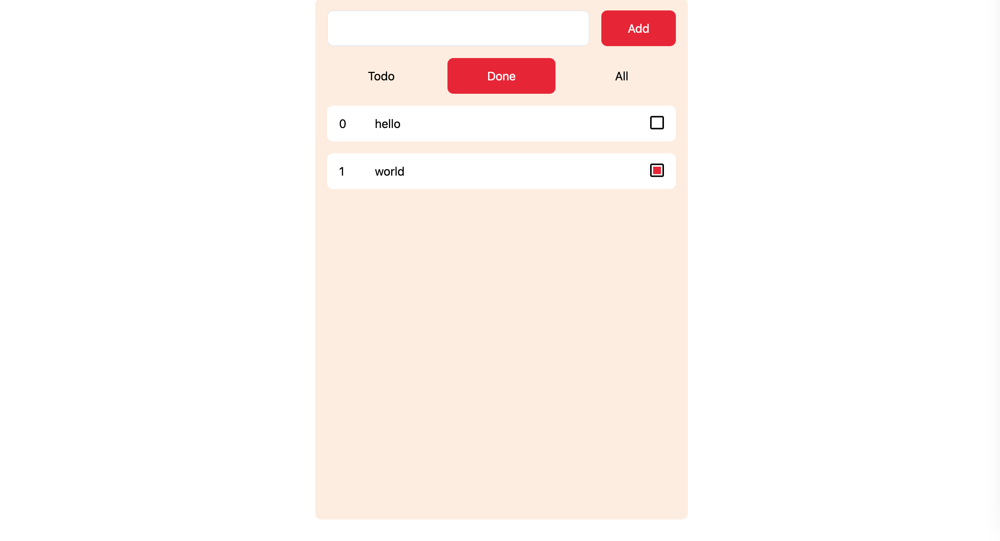
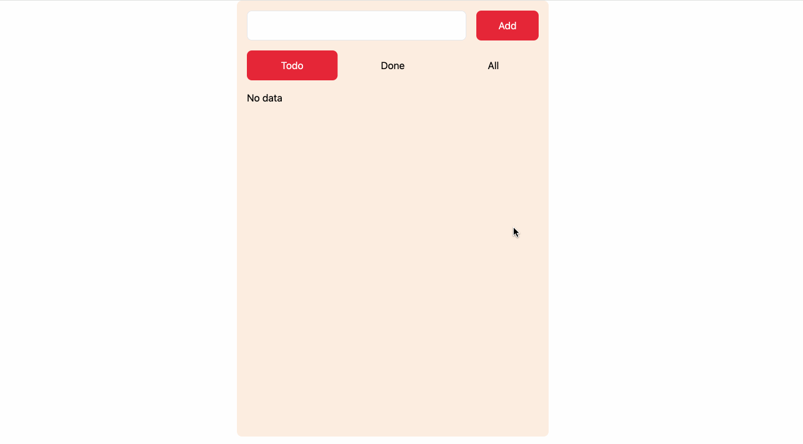
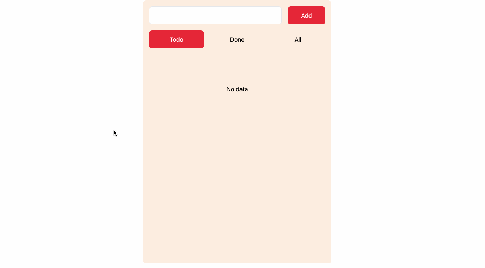

安装tailwind-merge
```bash
npm install tailwind-merge -D
```
tailwind-merge是一个类似于classnames的工具


新建store.js，用来管理我们的数据
```javascript
import { writable } from 'svelte/store';

export const tab = writable('todo'); // todo | done | all
```
我们修改Tabs.svelte
```html
<script>
  import { twMerge } from "tailwind-merge";
  import { tab } from "./store";
  let tabsClass = "grid grid-cols-3 gap-4 h-12 my-4";
  let tabClass =
    "h-12 flex items-center justify-center hover:cursor-pointer rounded-lg";
  let tabActiveClass = "bg-color2 text-white"

  const changeTab = (t) => tab.set(t);
</script>

<div class={tabsClass}>
  <button
    class={twMerge(tabClass, $tab === "todo" && tabActiveClass)}
    on:click={() => changeTab("todo")}>Todo</button
  >
  <button
    class={twMerge(tabClass, $tab === "done" && tabActiveClass)}
    on:click={() => changeTab("done")}>Done</button
  >
  <button
    class={twMerge(tabClass, $tab === "all" && tabActiveClass)}
    on:click={() => changeTab("all")}>All</button
  >
</div>
<div class="flex-1 overflow-auto">
  <slot></slot>
</div>
```
主要的逻辑修改就是，判断当前激活的是哪个tab，然后添加active样式，页面此时如下：

当点击其中一个tab时，能够看到tab样式的变化。

在store.js中添加待办项列表的数据：
```javascript
import { writable, derived } from 'svelte/store';

export const tab = writable('todo'); // todo | done | all
export const list = writable([]);

export const todoList = derived([list], ([$list]) => {
  return $list.filter(item => !item.done);
});

export const doneList = derived([list], ([$list]) => {
  return $list.filter(item => item.done);
});
```

修改List.svelte
```html
<script>
  import Item from './Item.svelte';
  import { tab, list, todoList, doneList } from './store';

  let currentList = [];

  $: {
    switch($tab) {
      case 'all': currentList = $list;
        break;
      case 'done': currentList = $doneList;
        break;
      default: 
        currentList = $todoList;
    }
  };
  
</script>

{#each currentList as {text, done}, i}
  <Item index={i} name={text} done={done} />
  {:else}
    No data
{/each}
```

然后我们开始为输入框添加事件，当点击按钮时，添加待办项：
```html
<script>
  import { list } from './store';

  let inputClass = "flex-1 h-full border rounded-lg mr-4 px-4 caret-color2 focus:outline-color2";
  let buttonClass = "w-[100px] h-full rounded-lg flex items-center justify-center bg-color2 text-white flex-shrink-0 hover:cursor-pointer";

  let task = ''
  const addItem = () => {
    if (!task) {
      return;
    }
    const obj = {
      id: new Date().valueOf(),
      text: task,
      done: false,
    };
    $list = [...$list, obj];
  };
</script>

<div class="flex h-12">
  <input
    type="text"
    bind:value={task}
    class={inputClass}
  />
  <button
    class={buttonClass} on:click={addItem}>Add</button
  >
</div>
```



在我们点击勾选后，已完成的待办项仍留在Todo栏里。
完善Item的逻辑，从外部接收tab参数，用来修饰index的样式，然后是为checkbox绑定更新事件：
```html
<script>
  import { createEventDispatcher } from 'svelte';
  import { twMerge } from 'tailwind-merge';
  
  export let tab = 'todo';
  
  const dispatch = createEventDispatcher();

  let indexWrapClass = "w-12 h-12 flex items-center justify-center"
  $: indexClass = twMerge(
    "w-8 h-8 text-left flex-shrink-0 rounded-full text-color1 flex items-center justify-center",
    tab === 'todo' && 'bg-color3',
    tab === 'done' && 'bg-color2',
    tab === 'all' && 'bg-color4',
  );

  ...

  const changeDone = (e) => {
    dispatch("change", { checked: e.target.checked });
  };
</script>

<div class={divClass}>
  <span class={indexWrapClass}>
    <span class={indexClass}>{index}</span>
  </span>
  <span class={nameClass}>{name}</span>
  <span class={checkboxWrapClass}>
    <input
      type="checkbox"
      checked={done}
      on:change={changeDone}
    />
  </span>
</div>

<style>
...
</style>
```

接着是外层的list，为Item绑定事件，用于更新store里的数据。剩余的是一些边角料工作，将index设置成从1开始`index={i + 1}`，传递tab参数，数据为空时的empty居中样式等。
```html
<script>
  import Item from "./Item.svelte";
  import { tab, list, todoList, doneList } from "./store";

  ...

  const updateItem = (id, value) => {
    const newArr = $list.map((item) => {
      if (item.id === id) {
        return {
          ...item,
          done: value,
        };
      }
      return item;
    });
    $list = newArr;
  };
</script>

{#each currentList as { id, text, done }, i}
  <Item
    index={i + 1}
    name={text}
    {done}
    tab={$tab}
    on:change={({ detail: { checked } }) => updateItem(id, checked)}
  />
{:else}
  <div class="mt-20 text-center">No data</div>
{/each}
```
写到这里，读者们应该能正常地添加任务，设置任务状态，然而细心的你一定能够发现，当我们设置完成时，出现了一点小问题：

当我们在设置第一项已完成后，第一项能够正常移除，然后剩余的第二项变成第一项后，勾选状态却是已完成！这个时候就轮到key出场了。
```html
{#each currentList as { id, text, done }, i (id)}
```

接着我们将All栏的展示改成禁止点击，
现在Item.svelte中
```html
<script>
  ...
  
  export let disabled = false;

  ...
  
  $: nameClass = twMerge(
    "flex-1 overflow-hidden text-ellipsis",
    disabled && "opacity-65"
  );
  
</script>

<div class={divClass}>
    ...
    <input
      type="checkbox"
      checked={done}
      on:change={changeDone}
      {disabled}
    />
  </span>
</div>

<style>
  ...

  input[type="checkbox"]:disabled::before {
    box-shadow: inset 1em 1em #FFADA8;
  }
</style>
```

然后在List.svelte中
```html
<Item
    ...
    disabled={$tab === 'all'}
/>
```
## 动画

在之前我们mock数据时，如果读者们点击过勾选框，应该能注意到有动画效果。然而经过上述的一系列改动，我们发现，当我们点击勾选后，已完成的数据马上被移到Done的Tab栏。

为了能够观察到动画效果，在List.svelte中，我们将数据更新做一个延迟
```javascript
  const updateItem = (id, value) => {
    const newArr = $list.map((item) => {
      if (item.id === id) {
        return {
          ...item,
          done: value,
        };
      }
      return item;
    });
    setTimeout(() => {
      $list = newArr;
    }, 300);
  };
```

接着我们为Item.svelte添加一些Svelte自带的动画效果
```html
<script>
  import { slide } from "svelte/transition";

  ...
</script>

<div class={divClass} transition:slide>
  ...
</div>

<style>
  ...
</style>
```

至此，我们已基本完成了一个功能完整的TodoList项目。



## 小结