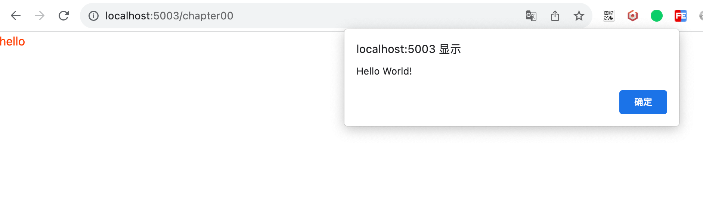

```
{#await expression}...{:then name}...{:catch name}...{/await}
```

react suspense

vue3 suspense

```
{@html expression}
```

需要对html内容进行转义

Svelte不会在注入HTML之前转义表达式。如果数据来源不受信任，则必须对其进行转义，否则将用户暴露于XSS漏洞之中。

举个例子

```
<script>
  let htmlContent = `
  <span onclick="alert('Hello World!')">hello</span>
  `;
</script>

<div>
  {@html htmlContent}
</div>
```



cookie操作

过滤 xss防御库

```
{@debug}
```

```
{@const}
```

```
{#key}
```