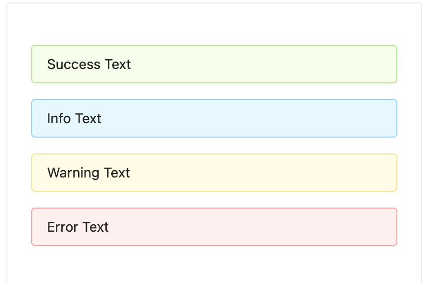
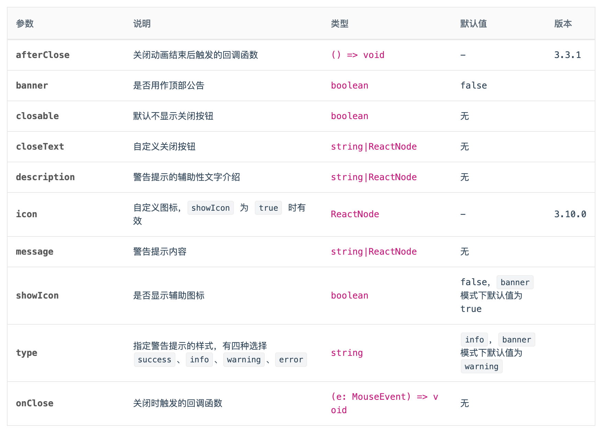
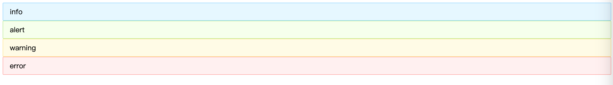
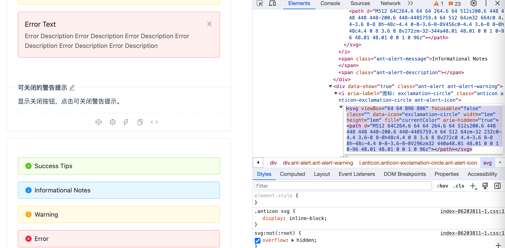
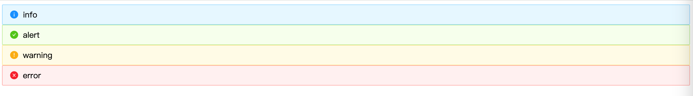
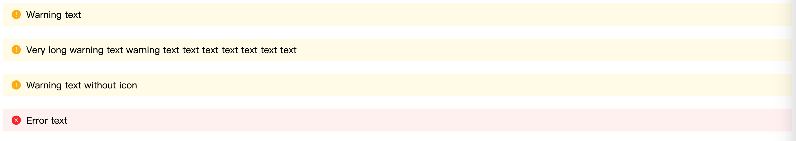
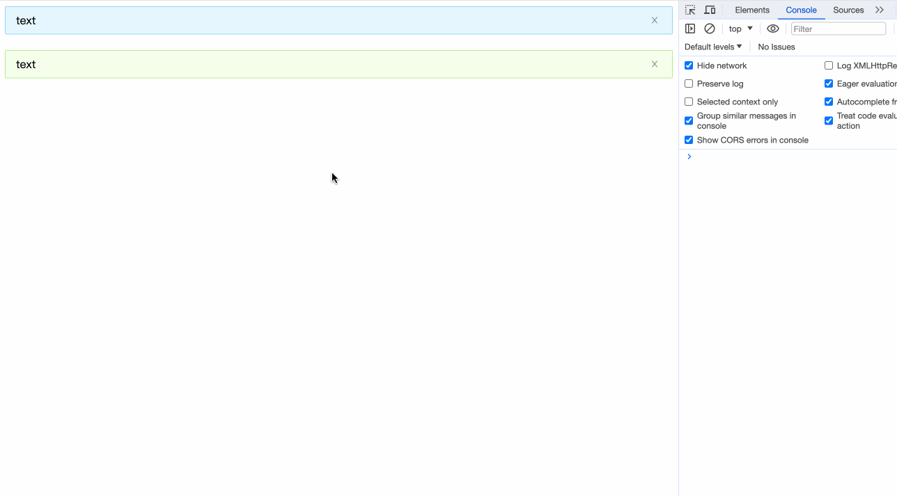

也许实现一个TodoList项目没有过瘾，这里笔者为大家带来第二个实战内容：使用Svelte来实现[Antd](https://ant-design.antgroup.com/index-cn)的其中一个组件。

这里笔者挑选的Antd组件是Alert组件


我们先来看下一个Alert组件对外支持的Api有哪些？

笔者选择了3.X版本的Antd的[Alert](https://3x.ant.design/components/alert-cn/)组件作为演示内容。


## 安装依赖

```bash
npm create vite@latest svelte-antd-alert -- --template svelte
```

这次我们选择的Less作为样式预处理器：
```bash
npm install svelte-preprocess-less less -D
```

修改`vite.config.js`的配置：
```javascript
import { defineConfig } from 'vite'
import { svelte } from '@sveltejs/vite-plugin-svelte'
import { less } from 'svelte-preprocess-less';

// https://vitejs.dev/config/
export default defineConfig({
  plugins: [svelte({
    preprocess: {
      style: less()
    }
  })],
})
```

```bash
npm install classnames
```

## 样式
alert.less内容如下：
```less
@alert-prefix-cls: 'ant-alert';
@margin-xs: 4px;
@font-size-base: 14px;

@alert-success-bg-color: #f6ffed;
@alert-success-border-color: #b7eb8f;
@alert-success-icon-color: #52c41a;
@alert-info-bg-color: #e6f7ff;
@alert-info-border-color: #91d5ff;
@alert-info-icon-color: #1890ff;
@alert-warning-bg-color: #fffbe6;
@alert-warning-border-color: #ffe58f;
@alert-warning-icon-color: #faad14;
@alert-error-bg-color: #fff1f0;
@alert-error-border-color: #ffa39e;
@alert-error-icon-color: #f5222d;
@alert-close-color: rgba(0,0,0,.45);
@alert-close-hover-color: rgba(0,0,0,.75);

@alert-with-description-padding: 15px;
@alert-with-description-no-icon-padding-vertical: 7px;
@alert-with-description-padding-vertical: 11px;
@alert-with-description-icon-size: 20px;

@border-width-base: 1px;
@border-style-base: solid;
@border-radius-base: 2px;

@font-size-sm: 12px;
@font-size-lg: 16px;
@iconfont-css-prefix: anticon;
@alert-message-color: rgba(0, 0, 0, .85);

.@{alert-prefix-cls} {

  position: relative;
  display: flex;
  align-items: center;
  padding: 8px 15px;
  word-wrap: break-word;
  border-radius: @border-radius-base;

  &-content {
    flex: 1;
    min-width: 0;
  }

  &-icon {
    margin-right: @margin-xs;
  }

  &-description {
    display: none;
    font-size: @font-size-base;
    line-height: @font-size-base + 8px;
  }

  &-success {
    background-color: @alert-success-bg-color;
    border: @border-width-base @border-style-base @alert-success-border-color;
    .@{alert-prefix-cls}-icon {
      color: @alert-success-icon-color;
    }
  }

  &-info {
    background-color: @alert-info-bg-color;
    border: @border-width-base @border-style-base @alert-info-border-color;
    .@{alert-prefix-cls}-icon {
      color: @alert-info-icon-color;
    }
  }

  &-warning {
    background-color: @alert-warning-bg-color;
    border: @border-width-base @border-style-base @alert-warning-border-color;
    .@{alert-prefix-cls}-icon {
      color: @alert-warning-icon-color;
    }
  }

  &-error {
    background-color: @alert-error-bg-color;
    border: @border-width-base @border-style-base @alert-error-border-color;

    .@{alert-prefix-cls}-icon {
      color: @alert-error-icon-color;
    }

    .@{alert-prefix-cls}-description > pre {
      margin: 0;
      padding: 0;
    }
  }

  &-action {
    margin-left: @margin-xs;
  }

  &-close-icon {
    margin-left: @margin-xs;
    padding: 0;
    overflow: hidden;
    font-size: @font-size-sm;
    line-height: @font-size-sm;
    background-color: transparent;
    border: none;
    outline: none;
    cursor: pointer;
    text-decoration: none;
	  color: @alert-close-color;

    .@{iconfont-css-prefix}-close {
      color: @alert-close-color;
      transition: color 0.3s;

      &:hover {
        color: @alert-close-hover-color;
      }
    }
  }

  &-close-text {
    color: @alert-close-color;
    transition: color 0.3s;
    cursor: pointer;

    &:hover {
      color: @alert-close-hover-color;
    }
  }

  &-with-description {
    align-items: flex-start;
    padding: @alert-with-description-padding;
  }

  &-with-description&-no-icon {
    padding: @alert-with-description-no-icon-padding-vertical 15px;
  }

  &-with-description &-icon {
    margin-right: @alert-with-description-padding-vertical;
    font-size: @alert-with-description-icon-size;
  }

  &-with-description &-message {
    display: block;
    margin-bottom: 4px;
    color: @alert-message-color;
    font-size: @font-size-lg;
  }

  &-message {
    color: @alert-message-color;
  }

  &-with-description &-description {
    display: block;
  }

  &-banner {
    margin-bottom: 0;
    border: 0;
    border-radius: 0;
  }
}

.@{iconfont-css-prefix} {
  display: inline-block;
  color: inherit;
  font-style: normal;
  line-height: 0;
  text-align: center;
  text-transform: none;
  vertical-align: -0.125em;
  text-rendering: optimizeLegibility;
  -webkit-font-smoothing: antialiased;
}
```

## api

在本章，我们先实现banner、closable、showIcon和type这几个传参的功能，因为这几个参数只单是接收参数，没有和slot的联动。


Alert.svelte初始内容如下：
```html
<script>  
  let prefixCls = 'ant-alert';

  $: alertCls = '';
</script>

<div class={alertCls}>
  <div class={`${prefixCls}-content`}>
    <slot></slot>
  </div>
</div>

<style lang="less">
  @import './alert.less';
</style>
```


### type

```html
<script>
  import classNames from 'classnames';

  export let type = 'info'; // info | success | warning | error

  let prefixCls = 'ant-alert';

  $: alertCls = classNames(prefixCls, {
    [`${prefixCls}-${type}`]: true,
  });
</script>

<div class={alertCls}>
  <div class={`${prefixCls}-content`}>
    <slot></slot>
  </div>
</div>

<style lang="less">
  @import './alert.less';
</style>
```


在App.svelte中
```html
<script>
  import Alert from './Alert.svelte';
</script>

<Alert>info</Alert>
<Alert type="success">alert</Alert>
<Alert type="warning">warning</Alert>
<Alert type="error">error</Alert>
```
可以看到页面内容：



### showIcon



然后再添加icon相关的svelte组件

SuccessIcon.svelte
```html
<svg
  viewBox="64 64 896 896"
  focusable="false"
  class=""
  data-icon="check-circle"
  width="1em"
  height="1em"
  fill="currentColor"
  aria-hidden="true"
  ><path
    d="M512 64C264.6 64 64 264.6 64 512s200.6 448 448 448 448-200.6 448-448S759.4 64 512 64zm193.5 301.7l-210.6 292a31.8 31.8 0 0 1-51.7 0L318.5 484.9c-3.8-5.3 0-12.7 6.5-12.7h46.9c10.2 0 19.9 4.9 25.9 13.3l71.2 98.8 157.2-218c6-8.3 15.6-13.3 25.9-13.3H699c6.5 0 10.3 7.4 6.5 12.7z"
  ></path></svg>
```

InfoIcon.svelte
```html
<svg
  viewBox="64 64 896 896"
  focusable="false"
  class=""
  data-icon="info-circle"
  width="1em"
  height="1em"
  fill="currentColor"
  aria-hidden="true"
  ><path
    d="M512 64C264.6 64 64 264.6 64 512s200.6 448 448 448 448-200.6 448-448S759.4 64 512 64zm32 664c0 4.4-3.6 8-8 8h-48c-4.4 0-8-3.6-8-8V456c0-4.4 3.6-8 8-8h48c4.4 0 8 3.6 8 8v272zm-32-344a48.01 48.01 0 0 1 0-96 48.01 48.01 0 0 1 0 96z"
  ></path></svg>
```

WarningIcon.svelte
```html
<svg
  viewBox="64 64 896 896"
  focusable="false"
  class=""
  data-icon="exclamation-circle"
  width="1em"
  height="1em"
  fill="currentColor"
  aria-hidden="true"
  ><path
    d="M512 64C264.6 64 64 264.6 64 512s200.6 448 448 448 448-200.6 448-448S759.4 64 512 64zm-32 232c0-4.4 3.6-8 8-8h48c4.4 0 8 3.6 8 8v272c0 4.4-3.6 8-8 8h-48c-4.4 0-8-3.6-8-8V296zm32 440a48.01 48.01 0 0 1 0-96 48.01 48.01 0 0 1 0 96z"
  ></path></svg>
```

ErrorIcon.svelte
```html
<svg
  viewBox="64 64 896 896"
  focusable="false"
  class=""
  data-icon="close-circle"
  width="1em"
  height="1em"
  fill="currentColor"
  aria-hidden="true"
  ><path
    d="M512 64C264.6 64 64 264.6 64 512s200.6 448 448 448 448-200.6 448-448S759.4 64 512 64zm165.4 618.2l-66-.3L512 563.4l-99.3 118.4-66.1.3c-4.4 0-8-3.5-8-8 0-1.9.7-3.7 1.9-5.2l130.1-155L340.5 359a8.32 8.32 0 0 1-1.9-5.2c0-4.4 3.6-8 8-8l66.1.3L512 464.6l99.3-118.4 66-.3c4.4 0 8 3.5 8 8 0 1.9-.7 3.7-1.9 5.2L553.5 514l130 155c1.2 1.5 1.9 3.3 1.9 5.2 0 4.4-3.6 8-8 8z"
  ></path></svg>
```


在Alert.svelte中，引入icon组件
```html
<script>
  import SuccessIcon from './icon/SuccessIcon.svelte';
  import InfoIcon from './icon/InfoIcon.svelte';
  import WarningIcon from './icon/WarningIcon.svelte';
  import ErrorIcon from './icon/ErrorIcon.svelte';
</script>
```

设置showIcon属性
```javascript
export let showIcon = false;
```

设置样式
```javascript
$: alertCls = classNames(prefixCls, {
    [`${prefixCls}-${type}`]: true,
    [`${prefixCls}-no-icon`]: !showIcon,
});
```

设置当前的icon类型
```javascript
$: icon = {
    'success': SuccessIcon,
    'info': InfoIcon,
    'warning': WarningIcon,
    'error': ErrorIcon
}[type];
```

添加html逻辑
```html
<div class={alertCls}>
  <div class={`${prefixCls}-content`}>
    {#if showIcon}
      <i class={`anticon ${prefixCls}-icon`}>
        <svelte:component this={icon} />
      </i>
    {/if}
    <slot></slot>
  </div>
</div>
```

现在我们来测试下showIcon属性是否生效，在App.svelte中
```html
<script>
  import Alert from './Alert.svelte';
</script>

<Alert showIcon={true}>info</Alert>
<Alert type="success" showIcon={true}>alert</Alert>
<Alert type="warning" showIcon={true}>warning</Alert>
<Alert type="error" showIcon={true}>error</Alert>
```



### banner
页面顶部通告形式，默认有图标且`type` 为 'warning'。

showIcon在`banner` 模式下默认值为 true

```
export let banner = false;
```

联动
```javascript
  // banner模式默认有 Icon
  showIcon = banner && showIcon === false ? true : showIcon;
  // banner模式默认为警告
  type = banner && type === 'info' ? 'warning' : type;
```

样式
```javascript
$: alertCls = classNames(prefixCls, {
    [`${prefixCls}-${type}`]: true,
    [`${prefixCls}-no-icon`]: !showIcon,
    [`${prefixCls}-banner`]: banner,
});
```

App.svelte
```html
<script>
  import Alert from "./Alert.svelte";
</script>

<Alert banner>Warning text</Alert>
<br />
<Alert banner
  >Very long warning text warning text text text text text text text</Alert
>
<br />
<Alert showIcon={false} banner>Warning text without icon</Alert>
<br />
<Alert type="error" banner>Error text</Alert>
```

内容如下：

### closable

添加close icon

CloseIcon.svelte
```html
<svg
  viewBox="64 64 896 896"
  focusable="false"
  class=""
  data-icon="close"
  width="1em"
  height="1em"
  fill="currentColor"
  aria-hidden="true"
  ><path
    d="M563.8 512l262.5-312.9c4.4-5.2.7-13.1-6.1-13.1h-79.8c-4.7 0-9.2 2.1-12.3 5.7L511.6 449.8 295.1 191.7c-3-3.6-7.5-5.7-12.3-5.7H203c-6.8 0-10.5 7.9-6.1 13.1L459.4 512 196.9 824.9A7.95 7.95 0 0 0 203 838h79.8c4.7 0 9.2-2.1 12.3-5.7l216.5-258.1 216.5 258.1c3 3.6 7.5 5.7 12.3 5.7h79.8c6.8 0 10.5-7.9 6.1-13.1L563.8 512z"
  ></path></svg>
```

```javascript
import CloseIcon from "./icon/CloseIcon.svelte";
```

```javascript
export let closable = undefined;
```

```javascript
$: alertCls = classNames(prefixCls, {
    [`${prefixCls}-${type}`]: true,
    [`${prefixCls}-no-icon`]: !showIcon,
    [`${prefixCls}-banner`]: banner,
    [`${prefixCls}-closable`]: closable,
});
```

添加关闭按钮的html内容
```html
  <div class={alertCls}>
    <div class={`${prefixCls}-content`}>
      {#if showIcon}
        <i class={`anticon ${prefixCls}-icon`}>
          <svelte:component this={icon} />
        </i>
      {/if}
      <slot />
    </div>
    {#if closable}
      <a
        href={""}
        on:click|preventDefault={handleClose}
        class={`${prefixCls}-close-icon`}
        role="button"
        tabindex="0"
      >
        <i class={`anticon anticon-close ${prefixCls}-icon`}>
          <CloseIcon />
        </i>
      </a>
    {/if}
  </div>
```

### onClose

实现点击关闭：
```html
<script>
	import { createEventDispatcher } from "svelte";
	
	const dispatch = createEventDispatcher();
	let closed = false;
	...

	const handleClose = (e) => {
		closed = true;
		dispatch("close", e);
	};
</script>

{#if !closed}
	<div class={alertCls}>
		...
	</div>
{/if}
```

我们在App.svelte中试验一下
```html
<script>
  import Alert from "./Alert.svelte";

  const onClose = (e) => {
    console.log('onClose', e);
  }
</script>

<Alert closable on:close={onClose}>text</Alert>
<br />
<Alert type="success" closable>text</Alert>
<br />
```



## 小结

了解了如何使用预处理器
svelte:component这个标签
如何在svelte中使用svg