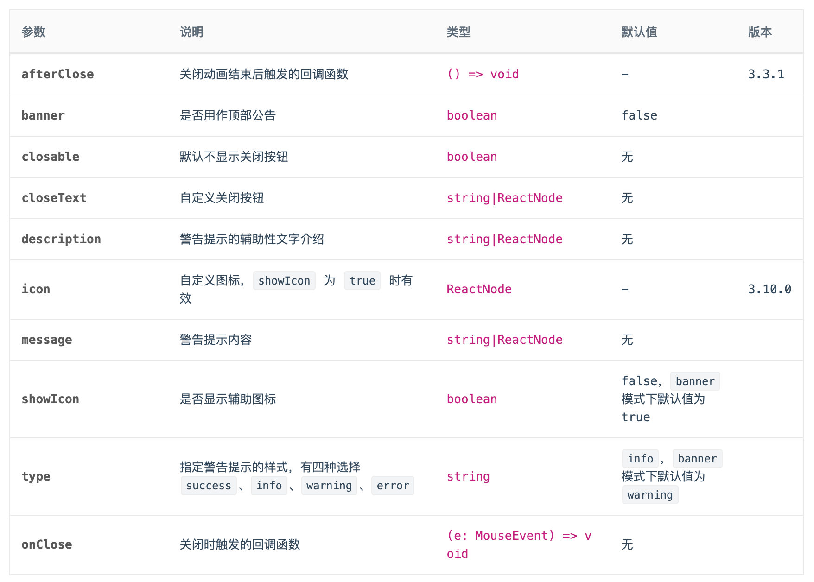

## api
  
接下来我们完成剩余的api，主要有afterClose回调、closeText、description、icon、message。

在Svelte中，我们不能像react那样直接把组件当成一个props来传递，因此对于一些既支持传数据又支持传组件的参数，我们的在Svelte的实现是既支持传值，又支持slot定义。然后在组件内容判断是否有slot值。
```javascript
function getPropsSlot(slots, props, prop = 'default') {
  if (props && props[prop]) {
    return props[prop];
  }
  if (slots && slots[prop]) {
    return slots[prop];
  }
  return null;
}
const slots = $$slots;
const props = $$props;
```

### closeText

```javascript
export let closeText = undefined;

const closeTextData = getPropsSlot(slots, props, 'closeText');
const hasCloseTextSlot = !!slots?.closeText;

if (closeTextData) {
  closable = true;
}
```

修改html的内容
```html
{#if closable}
  <a
    href={""}
    on:click|preventDefault={handleClose}
    class={`${prefixCls}-close-icon`}
    role="button"
    tabindex="0"
  >
    {#if hasCloseTextSlot}
      <slot name="closeText" />
    {:else if closeTextData}
      {closeText}
    {:else}
      <i class={`anticon anticon-close ${prefixCls}-icon`}>
        <CloseIcon />
      </i>
    {/if}
  </a>
{/if}
```

App.svelte中试验一下：
```html
<script>
  import Alert from "./Alert.svelte";
</script>

<Alert closeText="Close Text">Text</Alert>
<br />
<Alert type="success">
  Text
  <div slot="closeText">Close Text2</div>
</Alert>
<br />
```


### message

```javascript
export let message = undefined;
const messageData = getPropsSlot(slots, props, 'message');
const hasMessageSlot = !!slots?.message;
```
修改我们最开始定义的slot
```html
<div class={`${prefixCls}-content`}>
	{#if showIcon}
	<i class={`anticon ${prefixCls}-icon`}>
	  <svelte:component this={icon} />
	</i>
	{/if}
	{#if messageData}
	  {#if hasMessageSlot}
		<slot name="message" />
	  {:else}
		<div class={`${prefixCls}-message`}>{message}</div>
	  {/if}
	{/if}
</div>
```

在App.svelte中试验一下：
```html
<script>
  import Alert from "./Alert.svelte";
</script>

<Alert closable message="message" />
<br />
<Alert type="success" closable>
  <div slot="message" style="color: red;">message2</div>
</Alert>
<br />
```


### description

```javascript
export let description = undefined;
const descriptionData = getPropsSlot(slots, props, 'description');
const hasDescriptionSlot = !!slots?.description;
```
在Antd的Alert组件中，当使用了description时，需要使用另一种样式的icon，为此我们需要重构下我们的icon组件，笔者这里只拿SuccessIcon作为例子，其他type的icon更改逻辑相同。

SuccessIcon.svelte：
```html
<script>
  export let theme = "filled";
</script>

{#if theme === "filled"}
  <svg
    viewBox="64 64 896 896"
    focusable="false"
    class=""
    data-icon="check-circle"
    width="1em"
    height="1em"
    fill="currentColor"
    aria-hidden="true"
    ><path
      d="M512 64C264.6 64 64 264.6 64 512s200.6 448 448 448 448-200.6 448-448S759.4 64 512 64zm193.5 301.7l-210.6 292a31.8 31.8 0 0 1-51.7 0L318.5 484.9c-3.8-5.3 0-12.7 6.5-12.7h46.9c10.2 0 19.9 4.9 25.9 13.3l71.2 98.8 157.2-218c6-8.3 15.6-13.3 25.9-13.3H699c6.5 0 10.3 7.4 6.5 12.7z"
    ></path></svg
  >
{/if}
{#if theme === "outlined"}
  <svg
    viewBox="64 64 896 896"
    focusable="false"
    class=""
    data-icon="check-circle"
    width="1em"
    height="1em"
    fill="currentColor"
    aria-hidden="true"
    ><path
      d="M699 353h-46.9c-10.2 0-19.9 4.9-25.9 13.3L469 584.3l-71.2-98.8c-6-8.3-15.6-13.3-25.9-13.3H325c-6.5 0-10.3 7.4-6.5 12.7l124.6 172.8a31.8 31.8 0 0 0 51.7 0l210.6-292c3.9-5.3.1-12.7-6.4-12.7z"
    ></path><path
      d="M512 64C264.6 64 64 264.6 64 512s200.6 448 448 448 448-200.6 448-448S759.4 64 512 64zm0 820c-205.4 0-372-166.6-372-372s166.6-372 372-372 372 166.6 372 372-166.6 372-372 372z"
    ></path></svg
  >
{/if}
```

```javascript
let iconTheme = 'filled';

if (!!descriptionData) {
  iconTheme = 'outlined';
}
```

```javascript
$: alertCls = classNames(prefixCls, {
    [`${prefixCls}-${type}`]: true,
    [`${prefixCls}-no-icon`]: !showIcon,
    [`${prefixCls}-banner`]: banner,
    [`${prefixCls}-closable`]: closable,
    [`${prefixCls}-with-description`]: !!descriptionData,
});
```

在App.svelte中试验下
```html
<script>
  import Alert from "./Alert.svelte";
</script>

<Alert
  message="Success Tips"
  description="Detailed description and advice about successful copywriting."
  type="success"
  showIcon
/>
<br />
<Alert message="Infomation Tips" showIcon>
  <div slot="description">
    Additional description and information about copywriting.
  </div>
</Alert>
```


### icon
```javascript
const hasIconSlot = !!slots?.icon;
```

修改html内容
```html
{#if showIcon}
  {#if hasIconSlot}
	<slot name="icon" />
  {:else}
	<i class={`anticon ${prefixCls}-icon`}>
	  <svelte:component this={icon} theme={iconTheme} />
	</i>
  {/if}
{/if}
```

我们自定义一个Icon组件，笔者这里就不列出这部分代码了，读者朋友们可以自行定义。
在App.svelte中验证一下

```html
<script>
  import Alert from "./Alert.svelte";
  import SvelteIcon from "./icon/SvelteIcon.svelte";

</script>

<Alert
  message="Success Tips"
  type="success"
  showIcon
>
  <SvelteIcon slot="icon" />
</Alert>
```


我们还剩余一部分内容，那就是关闭时的动画，在下一章中进行讲解。

## 小结

本章我们完成了：
- `$$props`和`$$slots`的使用
- `<slot>`插槽的使用
