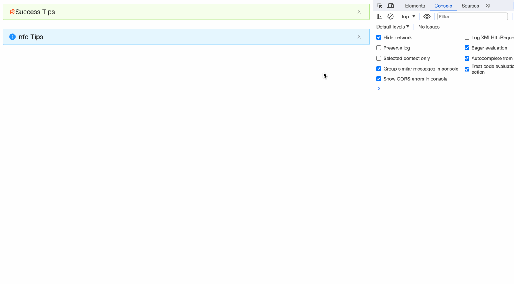

## 动画

当我们点击关闭Alert组件时，会出现一段向上关闭的动画。我们使用`svelte/easing`配合`transition`指令来实现相似的动画。

```javascript
<script>
  import { circInOut } from "svelte/easing";

  function slideUp(node, { duration = 300 }) {
    return {
      duration,
      css: (t, u) => {
        const data = circInOut(t);
        return `
          transform: scaleY(${data});
          transform-origin: 0% 0%;
          opacity: ${data};
        `
      },
    };
  }
</script>
```

然后修改html内容：
```html
{#if !closed}
	<div class={alertCls} transition:slideUp on:outroend={animationEnd}>
	...
{/if}
```

添加最后一个api事件afterClose：
```javascript
const animationEnd = () => {
    dispatch("afterClose");
};
```

在App.svelte中试验一下
```html
<script>
  import Alert from "./Alert.svelte";
  import SvelteIcon from "./icon/SvelteIcon.svelte";

  const onClose = () => {
    console.log('onClose');
  }

  const afterClose = () => {
    console.log('afterClose');
  }
</script>

<Alert
  message="Success Tips"
  type="success"
  showIcon
  closable
  on:close={onClose}
  on:afterClose={afterClose}
>
  <SvelteIcon slot="icon" />
</Alert>
<br />
<Alert
  message="Info Tips"
  showIcon
  closable
/>
```


## 完整代码

最后附上完整代码：
```html
<script>
  import { createEventDispatcher } from "svelte";
  import { circInOut } from "svelte/easing";
  import classNames from "classnames";
  import SuccessIcon from "./icon/SuccessIcon.svelte";
  import InfoIcon from "./icon/InfoIcon.svelte";
  import WarningIcon from "./icon/WarningIcon.svelte";
  import ErrorIcon from "./icon/ErrorIcon.svelte";
  import CloseIcon from "./icon/CloseIcon.svelte";

  export let type = "info"; // info | success | warning | error
  export let showIcon = false;
  export let banner = false;
  export let closable = undefined;
  export let closeText = undefined;
  export let message = undefined;
  export let description = undefined;

  function getPropsSlot(slots, props, prop = "default") {
    if (props && props[prop]) {
      return props[prop];
    }
    if (slots && slots[prop]) {
      return slots[prop];
    }
    return null;
  }

  function slideUp(node, { duration = 300 }) {
    return {
      duration,
      css: (t, u) => {
        const data = circInOut(t);
        return `
          transform: scaleY(${data});
          transform-origin: 0% 0%;
          opacity: ${data};
        `;
      },
    };
  }

  const dispatch = createEventDispatcher();
  const slots = $$slots;
  const props = $$props;

  let prefixCls = "ant-alert";
  let closed = false;
  let iconTheme = "filled";

  // banner模式默认有 Icon
  showIcon = banner && showIcon === false ? true : showIcon;
  // banner模式默认为警告
  type = banner && type === "info" ? "warning" : type;

  const closeTextData = getPropsSlot(slots, props, "closeText");
  const messageData = getPropsSlot(slots, props, "message");
  const descriptionData = getPropsSlot(slots, props, "description");
  const hasCloseTextSlot = !!slots?.closeText;
  const hasMessageSlot = !!slots?.message;
  const hasDescriptionSlot = !!slots?.description;
  const hasIconSlot = !!slots?.icon;

  if (closeTextData) {
    closable = true;
  }

  if (!!descriptionData) {
    iconTheme = "outlined";
  }

  $: alertCls = classNames(prefixCls, {
    [`${prefixCls}-${type}`]: true,
    [`${prefixCls}-no-icon`]: !showIcon,
    [`${prefixCls}-banner`]: banner,
    [`${prefixCls}-closable`]: closable,
    [`${prefixCls}-with-description`]: !!descriptionData,
  });

  $: icon = {
    success: SuccessIcon,
    info: InfoIcon,
    warning: WarningIcon,
    error: ErrorIcon,
  }[type];

  const handleClose = (e) => {
    closed = true;
    dispatch("close", e);
  };

  const animationEnd = () => {
    dispatch("afterClose");
  };
</script>

{#if !closed}
  <div class={alertCls} transition:slideUp on:outroend={animationEnd}>
    {#if showIcon}
      {#if hasIconSlot}
        <slot name="icon" />
      {:else}
        <i class={`anticon ${prefixCls}-icon`}>
          <svelte:component this={icon} theme={iconTheme} />
        </i>
      {/if}
    {/if}
    <div class={`${prefixCls}-content`}>
      {#if messageData}
        {#if hasMessageSlot}
          <slot name="message" />
        {:else}
          <span class={`${prefixCls}-message`}>{message}</span>
        {/if}
      {/if}
      {#if descriptionData}
        {#if hasDescriptionSlot}
          <slot name="description" />
        {:else}
          <span class={`${prefixCls}-description`}>{description}</span>
        {/if}
      {/if}
    </div>
    {#if closable}
      <a
        href={""}
        on:click|preventDefault={handleClose}
        class={`${prefixCls}-close-icon`}
        role="button"
        tabindex="0"
      >
        {#if hasCloseTextSlot}
          <slot name="closeText" />
        {:else if closeTextData}
          {closeText}
        {:else}
          <i class={`anticon anticon-close ${prefixCls}-icon`}>
            <CloseIcon />
          </i>
        {/if}
      </a>
    {/if}
  </div>
{/if}

<style lang="less">
  @import "./alert.less";
</style>
```

## 小结

本章为Alert组件添加了动画。