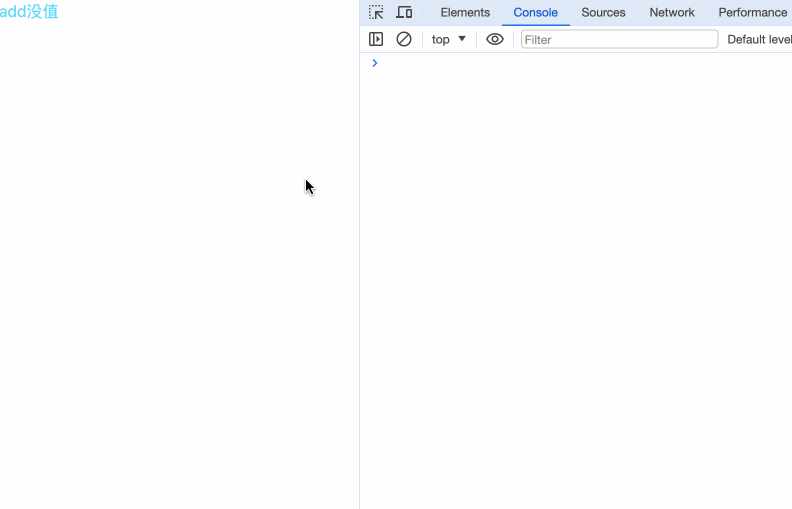
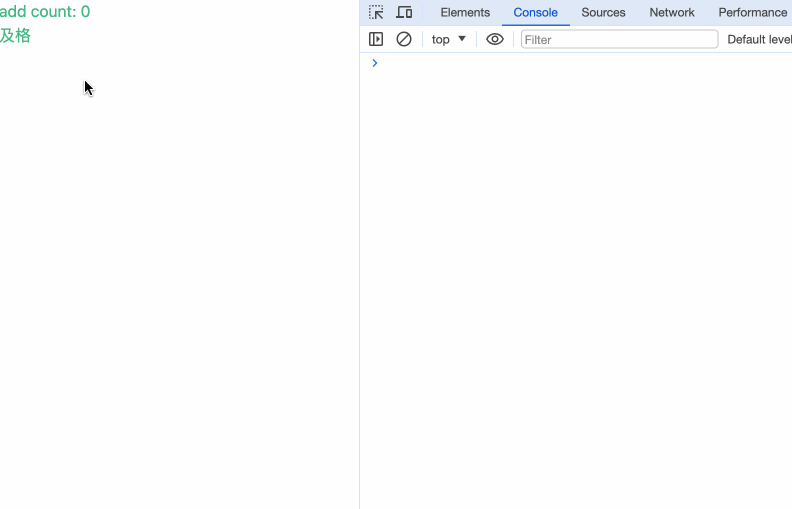
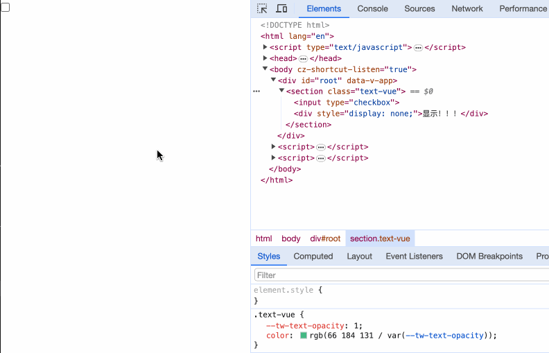

## React

### if-else
在React中，条件判断在`{}`中执行，通过三元表达式的判断来显示内容。
```javascript
{boolean ? 真值内容 : 假值内容}
```

```javascript
import { useState } from 'react';

export default function Page() {
  const [count, setCount] = useState(0)
  return (
    <div>
      <button onClick={() => setCount(count + 1)}>add</button>
      {count === 0 ? <span>没值</span> : <h2>有值了！{count}</h2>}
    </div>
  )
}
```



### `&&`
除了三元表达式`? :` 外，还能使用二院表达式`&&`来判断。
```javascript
boolean && 显示内容
```

修改上面的例子：
```javascript
import { useState } from 'react';

export default function Page() {
  const [count, setCount] = useState(0)
  return (
    <div>
      <button onClick={() => setCount(count + 1)}>add</button>
      {count > 0 && <h2>有值了！{count}</h2>}
    </div>
  )
}
```
这种方式适用需要页面隐藏的情况。

### 引用

因为React使用的是jsx语法，非常灵活，即使我们无法在`{}`内用ifelse或switch来判断显示，我们仍有一些委婉的方式来实现。

```javascript
import { useEffect, useState } from 'react';

export default function Page() {
  const [count, setCount] = useState(0);
  const [component, setComponent] = useState();

  useEffect(() => {
    if (count > 0) {
      setComponent(<h2>有值了！{count}</h2>)
    } else {
      setComponent(<span>没值</span>)
    }
  }, [
    count
  ])

  return (
    <div>
      <button onClick={() => setCount(count + 1)}>add</button>
      {component}
    </div>
  )
}
```
通过把组件内容设置成一个变量的形式来引用。

## Vue

### if-else

在Vue中，通过 `v-if`、`v-else-if`、`v-else`来判断内容的展示。
```html
<template>
  <section>
    <button @click="updateCount">add</button> count: {{ count }}
    <div v-if="count >= 0 && count < 2">及格</div>
    <div v-else-if="count >= 2 && count < 4">良好</div>
    <div v-else>优秀</div>
  </section>
</template>

<script>
export default {
  data() {
    return {
      count: 0,
    };
  },
  methods: {
    updateCount() {
      this.count++;
    },
  },
};
</script>
```



`v-if`能单独使用，单独使用使用有隐藏内容的情况。需要注意当使用`v-else-if`和`v-else`时，需要前置有`v-if`内容，单独使用其中一个都会报错。

### v-show

在Vue中，除了提供`v-if`来控制内容的显示隐藏，使用`v-show`同样能控制元素的显示隐藏。
```html
<template>
  <section>
    <input type="checkbox" v-model="checked" />
    <div v-show="checked">显示！！！</div>
  </section>
</template>

<script>
export default {
  data() {
    return {
      checked: false,
    };
  },
};
</script>
```



二者的区别在于： `v-if`指令，是根据表达式值的真假来销毁或者重建一个我们绑定的DOM元素；而`v-show`指令利用元素的display属性控制着元素的显示隐藏，不管初始条件是什么，元素总是会被渲染。

## Svelte

### if-else

在Svelte中，通过 `{#if}{:else if}{:else}{/if}`来判断内容的展示。
```html
<script>
  let count = 0;

  const updateCount = () => {
    count++;
  };
</script>

<button on:click={updateCount}>Add</button>
{count}
{#if count >= 0 && count < 2}
  <div>及格</div>
{:else if count >= 2 && count < 4}
  <div>良好</div>
{:else}
  <div>优秀</div>
{/if}
```
`{:else if}`和`{:else}`是可选的。

## 小结

本章我们对比了：
- React在`{}`中使用三元表达式`? :`或二元表达式`&&`来实现内容切换。
- Vue通过`v-if`、`v-else-if`、`v-else`和`v-show`来判断内容的展示。
- Svelte通过 `{#if}{:else if}{:else}{/if}`来判断内容的展示。
