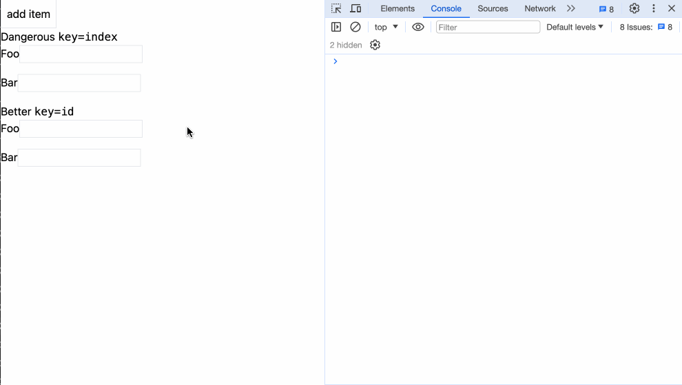

## React

在React中，我们可以灵活地操作数组类型的数据，如果要把数组数据以列表的形式展示到页面上，jsx允许我们正常地使用数组支持的方法，比如map、forEach等。  

在`function component`的`return`中或者`class component`的`render`方法的`return`中，我们通常直接使用map来返回列表：
```javascript
function FunctionComponent() {
  return (
    list.map((item, index) => {
      return 内容;
    })
  )
}

class ClassComponent extends React.Component {
  render() {
    return (
      list.map((item, index) => {
        return 内容;
      })
    )
  }
}
```

```javascript
import { useState } from "react";

export default function Page() {
  const [list] = useState([1, 2, 3]);

  return (
    <ul>
      {list.map((item, index) => {
        return <li key={index}>item - {item}</li>;
      })}
    </ul>
  );
}
```
React的循环列表项中，要求我们需要为每一项添加一个key值。

如果我们想使用forEach呢？以上面一个例子为例：
```javascript
import { useEffect, useState } from "react";

export default function Page() {
  const [list] = useState([1, 2, 3]);
  const [items, setItems] = useState([]);

  useEffect(() => {
    const newLists = [];
    list.forEach((item,index) => {
      newLists.push(<li key={index}>item - {item}</li>)
    });
    setItems(newLists);
  }, [list])

  return (
    <ul>
      {items}
    </ul>
  );
}
```
使用forEach，我们能够在数组循环时做一些复杂的逻辑。

#### key
React[官网](https://legacy.reactjs.org/docs/lists-and-keys.html)中详细地阐释了key在循环中的作用。我们直接演示例子：
```javascript
import { useState } from "react";

function Item(props) {
  return (
    <div className="flex mb-4">
      <label>{props.name}</label>
      <div>
        <input type="text" className="border" />
      </div>
    </div>
  );
}

export default function Page() {
  const [list, setList] = useState([
    { name: "Foo", id: 1 },
    { name: "Bar", id: 2 },
  ]);

  const addItem = () => {
    const id = +new Date();

    setList([{ name: "Random" + id, id }, ...list]);
  };

  return (
    <div className="text-black">
      <button className="border p-2" onClick={addItem}>add item</button>
      <h3>
        Dangerous <code>key=index</code>
      </h3>
      <form>
        {list.map((todo, index) => (
          <Item {...todo} key={index} />
        ))}
      </form>
      <h3>
        Better <code>key=id</code>
      </h3>
      <form>
        {list.map((todo) => (
          <Item {...todo} key={todo.id} />
        ))}
      </form>
    </div>
  );
}
```

我们可以看到，我们在两个不同的列表中，同样是在Foo输入框中输入值，但使用index作为key的输入框，在添加了新的输入框后，表现异常，原来在Foo输入框的值，一直存在在第一个输入框中，而使用id作为key的输入框则表现正常。

key可以帮助React识别出哪些元素改变了，比如被添加或删除。如果列表项目的顺序可能会变化，不建议使用索引来用作key值，因为这样做会导致性能变差，还可能引起组件状态的问题。这种异常表现在Vue和Svelte中都存在。

## Vue

```html
<template>
  <ul>
    <li v-for="(item, index) in list" :key="index">item - {{ item }}</li>
  </ul>
</template>

<script setup>
import { reactive } from "vue";

const list = reactive([1, 2, 3]);
</script>

```
在Vue中，使用`v-for`来进行数组循环，同样要求在循环项中绑定key，以`:key=""`的形式。

#### key
同样以上面的例子来展示：
```html
<!-- Child.vue -->
<template>
  <div class="flex mb-4">
    <label>{{ name }}</label>
    <div>
      <input type="text" class="border" />
    </div>
  </div>
</template>

<script>
export default {
  props: {
    name,
  },
};
</script>
```

```html
<template>
  <div class="text-black">
    <button class="border p-2" @click="addItem">add item</button>
    <h3>Dangerous <code>key=index</code></h3>
    <form>
      <Item v-for="(todo, index) in list" :name="todo.name" :key="index" />
    </form>
    <h3>Better <code>key=id</code></h3>
    <form>
      <Item v-for="(todo, index) in list" :name="todo.name" :key="todo.id" />
    </form>
  </div>
</template>

<script>
import Item from "./Child.vue";

export default {
  data() {
    return {
      list: [
        { name: "Foo", id: 1 },
        { name: "Bar", id: 2 },
      ],
    };
  },
  methods: {
    addItem() {
      const id = +new Date();
      this.list = [{ name: "Random" + id, id }, ...this.list];
    },
  },
  components: {
    Item,
  },
};
</script>
```
## Svelte

```html
<script>
  const list = [1,2,3];
</script>

<ul>
  {#each list as item, index (key)}
    <li>item - {item}</li>
  {/each}
</ul>
```
在Svelte中，循环的功能放在`{#each}{/each}`中，key是可选的。

#### key
同样以相同的例子举例：
```html
<script>
// Child.svelte
  export let name;
</script>

<div class="flex mb-4">
  <label>{name}</label>
  <div>
    <input type="text" class="border" />
  </div>
</div>
```

```html
<script>
  import Item from './Child.svelte';

  let list = [{ name: "Foo", id: 1 },
    { name: "Bar", id: 2 }]

  const addItem = () => {
    const id = +new Date();

    list = [{ name: "Random" + id, id }, ...list]
  };
</script>

<div class="text-black">
  <button class="border p-2" on:click={addItem}>add item</button>
  <h3>
    Dangerous <code>key=index</code>
  </h3>
  <form>
    {#each list as todo}
      <Item {...todo} />
    {/each}
  </form>
  <h3>
    Better <code>key=id</code>
  </h3>
  <form>
    {#each list as todo (todo.id)}
      <Item {...todo} />
    {/each}
  </form>
</div>
```
## 小结
本章我们了解了在三大框架中如何使用循环。