## React

### 行内样式

在React中，行内样式需要以`style={styleObj}`的形式：
```javascript
export default function Page() {
  return <div style={{
    border: '2px solid black',
    backgroundColor: 'purple',
    color: 'white'
  }}>style</div>
}
```

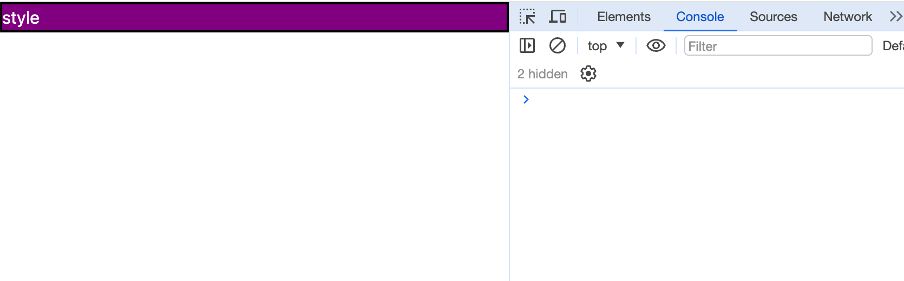
在样式对象内，之前在行内样式中使用`-`连接的属性需要转成使用驼峰的形式，比如`font-size`要写成`fontSize`、`background-color`要写成`backgroundColor`等。

### 非行内样式
React的样式通常集中写在一个样式文件中，在jsx中只写js代码和长得像html的代码。

```javascript
// Child.jsx
import "./Child.css";

export default function Child() {
  return (
    <div className="color">子组件</div>
  );
}
```

当然，如果是使用cssinjs库，则能够直接在jsx文件或tsx文件中写样式。

### class属性

在React中，写样式class需要写在`className`中，对于`className`的传值，和其他传递属性无异，可以正常的执行js表达式。

### 模块化

我们使用[create-react-app](https://create-react-app.dev/)来创建一个React项目：
```bash
npx create-react-app react-test
```

我们创建一个子组件：
```javascript
// Child.jsx
import "./Child.css";
import styles from "./Child.module.css";

export default function Child() {
  return (
    <div>
      <div className="color">子组件</div>
      <div className={styles.color}>子组件 模块化样式</div>
    </div>
  );
}
```

```css
.color {
  color: red;
}
```

在页面中：
```javascript
import './App.css';
import Child from './Child';

function App() {
  return (
    <div>
      <div className="color">父组件</div>
      <Child />
    </div>
  );
}

export default App;
```

而在App.css中：
```css
.color {
  color: green;
}
```

我们可以看到，原本我们是想子组件的红色，父组件里的字体是绿色，然而现在都变成了红色。

在React中，要想实现样式模块化，通常有以下方式：
- module css
- BEM
- css-in-js
这里以前两种来举例。

#### module
在使用`create-react-app`创建的项目中，我们把样式文件名写成`xxx.module.css`的形式，然后以变量的形式引入。
将上述例子的Child.css改成Child.module.css，调整Child.jsx的逻辑：
```javascript
import styles from "./Child.module.css";

export default function Child() {
  return <div className={styles.color}>子组件 模块化样式</div>;
}
```

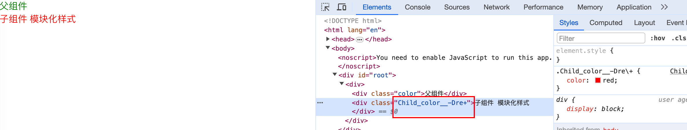
可以看到，子组件的color样式选择器已经被改动了。

#### BEM
[BEM](https://yandex.com/dev/bem/)风格规范指的是Block、Element、Modifier这三者的简称，这个规范将CSS拆分成块、元素、修饰符，根本作用是帮助开发者快速理解HTML与CSS之间的关系。我们可以根据不同的标签层级，使用约定好格式的类名，以此来到达维护css的目的。

我们并非严格地按照BEM规范来执行，而是以此规范为参考，为每个组件人工地添加一个唯一前缀，然后把组件的样式都限定在这个唯一的选择器内，实现其中的核心思想。

继续以上述Child.jsx为例，假如不使用module css，那我们修改我们的样式文件：
```css
.child-color {
  color: red;
}

.child-background {
  background: red;
}
```

然后修改我们的Child.jsx：
```javascript
import "./Child.css";

export default function Child() {
  return (
    <>
      <div className="child-color">子组件 模块化样式</div>
      <div className="child-background">子组件</div>
    </>
  );
}
```

从页面上看，同样可以达到样式模块化。
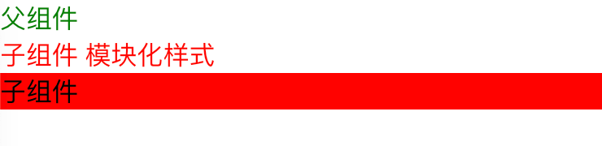

可能有些读者会质疑这种实现方式，不仅要每个class都要添加前缀，样式文件的选择器也复杂化了。那是因为现在我们还是用css来演示，如果我们结合样式预处理器，那操作则简化了很多。

为了演示方便，我们使用vite重新创建一个项目：
```bash
npm create vite@latest react-test-vite -- --template react
```

同时使用Less：
```bash
npm install -D less
```

修改Child.jsx内容：
```javascript
import './Child.less';

export default function Child () {
  return (<div className="child">
    <div className="color">子组件 样式模块化</div>
  </div>)
}
```

Child.less内容：
```css
.child {
  .color {
    color: red;
  }
}
```

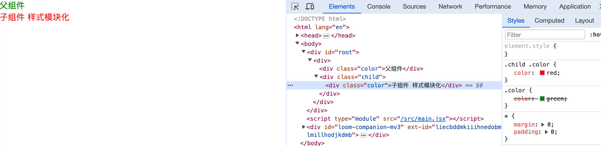
因为我们为组件最外层添加了一层包裹，`.child .color`的优先级大于`.color`的优先级。

BEM规范同样能应用在Vue、Svelte等框架中，它的一个劣势是我们需要人工地确保各组件有唯一的前缀或唯一的用于包裹的选择器。

## Vue

### 行内样式

Vue的行内样式同样接收一个变量，以`:style="styleObject"`的形式：
```html
<template>
  <div :style="{ border: '1px solid black', fontSize: 16 }">hello world</div>
</template>
```

### 非行内样式

Vue的非行内样式写在`<style></style>`标签内，可以在该标签内写css内容，也可以在标签内引入样式文件。
```html
<template>
  <div></div>
</template>

<style>
  div {
    color: red;
  }
</style>
```

### class属性

Vue为开发者提供了大量便捷地操作class属性的方式。

#### 默认
```html
<div class="rounded"></div>
```

#### 动态class
```html
<script setup>
  import { ref } from 'vue';
  let colorClass = ref('red');
</script>

<template>
  <div>
    <select v-model="colorClass">
      <option value="red">red</option>
      <option value="green">green</option>
      <option value="blue">blue</option>
    </select>
    <div :class="colorClass">text</div>
  </div>
</template>

<style scoped>
.red {
  color: red;
}
.green {
  color: green;
}
.blue {
  color: blue;
}
</style>
```
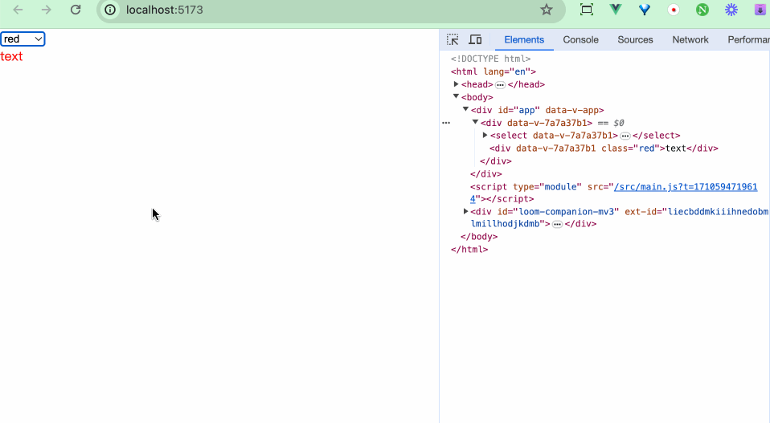

#### 表达式
```html
<div :class="isActive ? 'active' : ''"></div>
```

#### 数组形式
能够通过操作数组动态增删class：
```html
<script setup>
  import { reactive } from 'vue';

  const classArr = reactive(['class1', 'class2']);

  const addClass = () => {
    classArr.push('class3');
  }
</script>
<template>
  <div>
    <button @click="addClass">add class</button>
    <div :class="classArr">text</div>
  </div>
</template>

<style scoped>
.class1 {
  color: white;
}
.class2 {
  background: black;
}
.class3 {
  width: 100px;
  height: 100px;
}
</style>
```

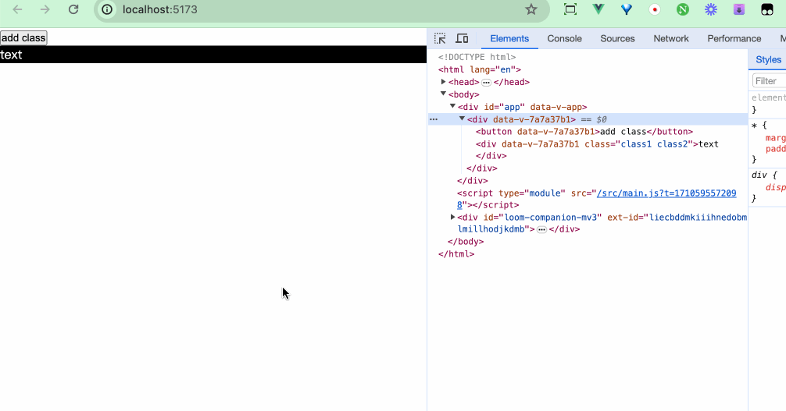

#### 对象形式
通过`key:value`的形式，当value为true时，key才生效。

```html
<script setup>
  import { ref } from 'vue';
  let isActive = ref(false);

  const toggle = () => {
    isActive.value = !isActive.value;
  }
</script>

<template>
  <div>
    <button @click="toggle">toggle</button>
    <div :class="{ active:isActive }">text</div>
  </div>
</template>

<style scoped>
.active {
  color: red;
}
</style>
```
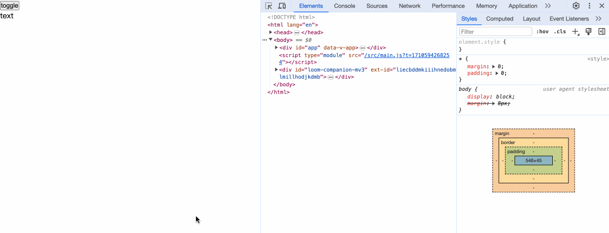

### 模块化

我们先看以下例子：
```html
<!-- Father.vue -->
<template>
  <div>
    <div class="style">father style</div>
    <Child />
  </div>
</template>

<script>
import Child from './Child.vue';
export default {
  components: {
    Child,
  }
}
</script>

<style>
  .style {
    color: red;
  }
</style>
```

```html
<template>
  <div class="style">style</div>
</template>

<script>
export default {}
</script>

<style>
  .style {
    color: green;
  }
</style>
```
我们原本期望子组件的颜色是绿色，然而得到的却是如下：
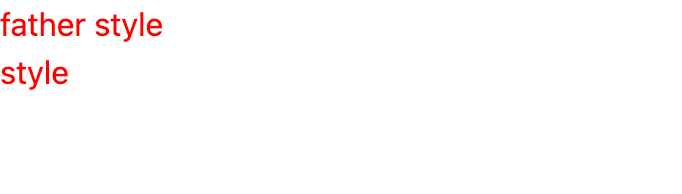

要想实现样式模块化，需要在`<style>`标签中添加`scoped`属性：
```diff
<template>
  <div class="style">style</div>
</template>

<script>
export default {}
</script>

- <style>
+ <style scoped>
  .style {
    color: green;
  }
</style>
```
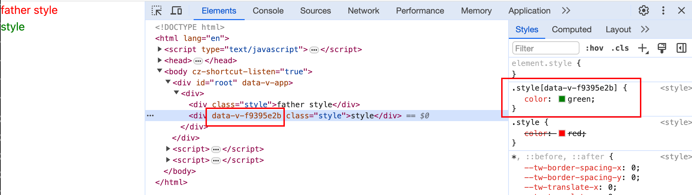
可以看到，Vue是通过添加`data-v-xxx`属性的形式来实现模块化。

## Svelte

### 行内样式

在Svelte中，行内样式的书写和在正常html标签内写style样式一样，均是以字符串的形式。
```html
<div style="border: 2px solid black; background-color: purple; color: white;">style</div>
```

### 非行内样式
正常我们的样式都写在`<style></style>`标签中。

```html
<div></div>

<style>
  div {
    color: red;
  }
</style>
```

### class属性

#### 默认
Svelte中，正常写`class`，不用像React中一样使用`className`。
```html
<div class="rounded"></div>
```

#### 动态class
如果需要支持动态class，以`class={variable}`的形式：
```html
<script>
  let colorClass = 'red';
</script>

<select bind:value={colorClass}>
  <option value="red">red</option>
  <option value="blue">blue</option>
  <option value="green">green</option>
</select>
<div class={colorClass}>color</div>

<style>
  .red {
    color: red;
  }
  .blue {
    color: blue;
  }
  .green {
    color: green;
  }
</style>
```
![[31-11.gif]]

#### 表达式
```html
<script>
  let isActive = false;
  const toggle = () => {
    isActive = !isActive
  }
</script>

<button on:click={toggle}>toggle</button>
<div class={isActive ? 'active' : ''}>color</div>

<style>
  .active {
    color: red;
  }
</style>
```

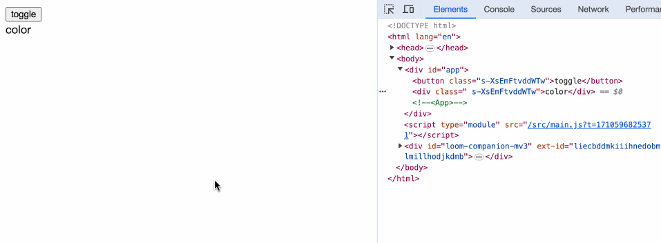

我们能够使用`class`指令来简化表达式的形式，对于`class={isActive ? 'active' : ''}`的写法，我们可以简写成：
```html
<div class:active={isActive}></div>
```

### 模块化

Svelte文件的`<style></style>`标签内的样式，默认启用了模块化特性。
```html
<div class="style">style</div>

<style>
  .style {
    color: red;
  }
</style>
```

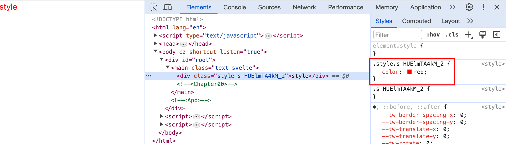
翻看编译后的结果，发现我们的样式类型都带上了后缀。

## 小结

本章我们对比了：
- React的行内样式的写法、非行内样式的引入方式。React中写样式的`class`需要写成`className`。
- Vue的行内样式的写法、非行内样式的处理。Vue动态class的几种写法。
- Svelte的行内样式的写法、非行内样式的处理。class表达式的写法。
- 三大框架样式模块化的处理方式。
- 除了以上特性外，框架还可以结合诸如Tailwind等原子类库、Emotion等cssinjs库以及Less、Sass等样式预处理器来实现页面样式。

