在正式解读源码之前，笔者会和读者朋友们一起了解一些npm库的功能作用，每一个都和我们接下来的源码解读息息相关。在阅读完本章后，相信读者们在接下来的源码讲解中，不至于遇到一个功能库而一头雾水。本章中，我们将了解以下功能库：
- [acorn](https://github.com/acornjs/acorn/tree/master/acorn)
- [periscopic](https://github.com/Rich-Harris/periscopic#readme)
- [estree-walker](https://github.com/Rich-Harris/estree-walker#readme)
- [escodegen](https://github.com/estools/escodegen)

## AST

在认识这些工具库之前，我们需要先了解一个概念：抽象语法树（Abstract Syntax Tree，AST）。这个概念非常重要，它是实现一个编译器的核心，后面介绍的各种库都是围绕这个核心概念服务的。

抽象语法树是以树形结构数据来表现编程语言的语法结构，树上的每个节点都表示源代码中的一种结构。其拥有一套[约定的规范](https://github.com/estree/estree?tab=readme-ov-file)。

AST运用非常广泛：代码格式化、代码高亮、代码错误校验、代码转换等等，可以说，谁掌握了AST的使用，谁就掌握了前端代码编译的天下。

AST的生成通常涉及到两个步骤：词法分析、语法分析。

#### 词法分析

词法分析（Lexical analyzer）是由词法分析器来扫描源代码，将扫描出来的字符与Javascript关键字进行比较，生成一个个不可再分割的最小单元，这些单元被称为Token。

比如我们有一段代码：
```javascript
let str = 'svelte';
```
那么经过词法分析后，得到的是类似如下的一个数组：
```javascript
[
  { type: 'Keyword', value: 'let' },
  { type: 'Identifier', value: 'str' },
  { type: 'Punctuator', value: '=' },
  { type: 'String', value: '"svelte"' }
]
```

#### 语法分析

语法分析（Syntax analyzer）就是将词法分析阶段生成的Token转换为抽象语法树。

在[astexplorer](https://astexplorer.net/)中，我们能够试验各种ast工具对源码的抽象。

## acorn
如果读者此前没有听说过`acorn`，那有一个鼎鼎大名的库相信读者一定了解，那就是`webpack`。`webpack`底层将代码转换成抽象语法树时使用的便是`acorn`。使用`acorn`转换得到的返回值，是符合The ESTree Spec规范的对象。

除了`webpack`之外，`Rollup`和`Babel`的`@babel/parser`等工具都使用到了`acorn`。
市面上除了`acorn`外，还流行其他js解析器，如：[Esprima](https://esprima.org/)、[UglifyJS](https://lisperator.net/uglifyjs/)、[Shift](https://shift-ast.org/)等。

### parse
```javascript
acorn.parse(str, options)
```
str就是要解析的字符串内容，options是一个对象，其中只有ecmaVersion是必填的，用于指定指定要解析的 ECMAScript 版本。
```typescript
export interface Options {
  ecmaVersion: ecmaVersion
  sourceType?: "script" | "module"
  onInsertedSemicolon?: (lastTokEnd: number, lastTokEndLoc?: Position) => void
  onTrailingComma?: (lastTokEnd: number, lastTokEndLoc?: Position) => void
  allowReserved?: boolean | "never"
  allowReturnOutsideFunction?: boolean
  allowImportExportEverywhere?: boolean
  allowAwaitOutsideFunction?: boolean
  allowSuperOutsideMethod?: boolean
  allowHashBang?: boolean
  checkPrivateFields?: boolean
  locations?: boolean
  onToken?: ((token: Token) => void) | Token[]
  onComment?: ((
    isBlock: boolean, text: string, start: number, end: number, startLoc?: Position,
    endLoc?: Position
  ) => void) | Comment[]
  ranges?: boolean
  program?: Node
  sourceFile?: string
  directSourceFile?: string
  preserveParens?: boolean
}
```
目前我们只需大概了解参数即可，感兴趣的读者可阅读[acorn](https://github.com/acornjs/acorn/tree/master/acorn/)了解其他参数的功能。

```javascript
import * as acorn from "acorn";

let str = `let a = 0;
let b = 1;
let c = a + b;

a++;
window.e = 2;
f = 3;
`

const ast = acorn.parse(str, {
  ecmaVersion: 2023
});

console.log(ast);
```

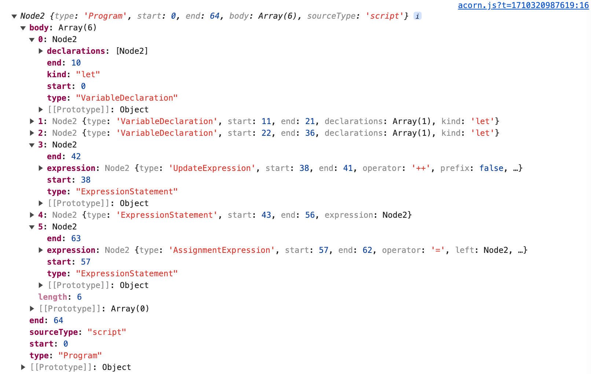


我们在[AST Explorer](https://astexplorer.net/)中，得到的是同样的结果：
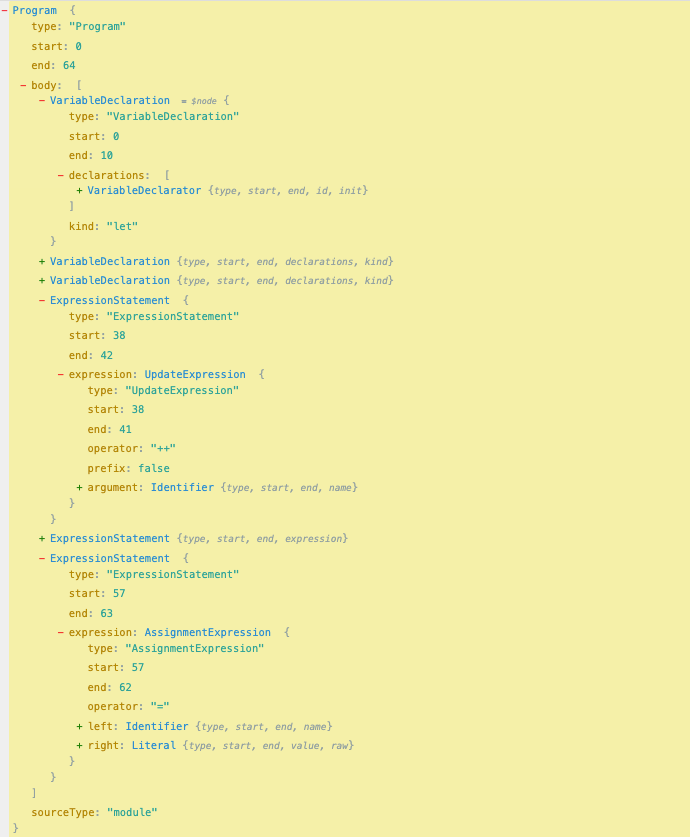

使用acorn解析之后得到的数据便是ast抽象语法树，树形结构的数据必然存在一个或多个叶子节点，在每个节点上，都有一个参数type来标记这个节点属于什么类型。我们了解一下在一个AST对象中的各种type的意义。

### type
#### Literal
Literal是字面量的意思，比如 `let str = 'svelte'`中`'svelte'`就是一个字符串字面量
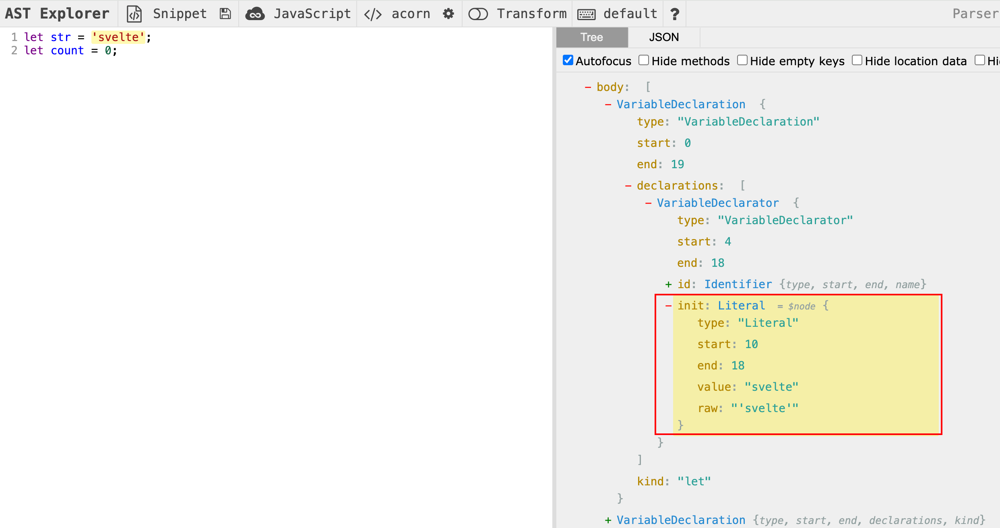  

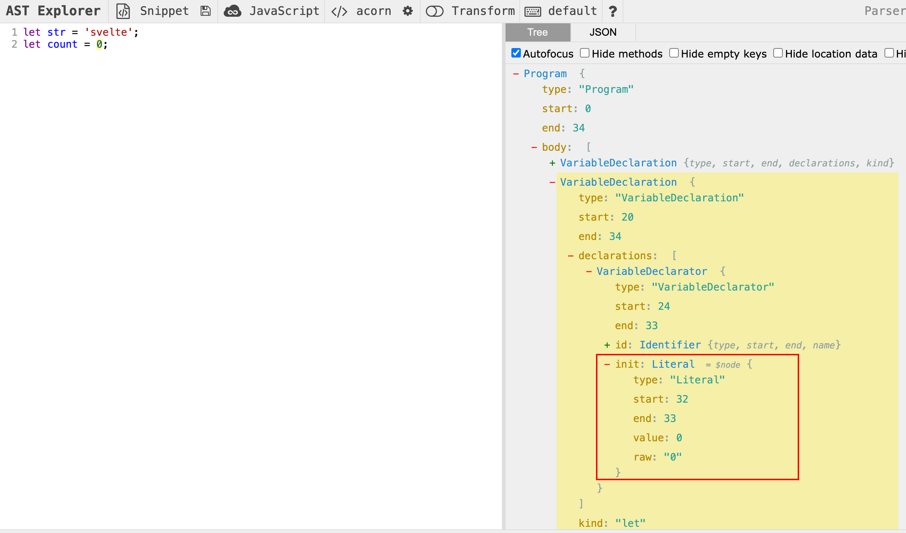

#### Identifier
Identifier指标识符，变量名、属性名、参数名等各种声明和引用的名字，都是Identifer。
```javascript
const str = 'world';

function greet(val) {
  console.log(val);
}

const foo = {
  bar: 'svelte'
}
```
就拿这一小段代码来说，它的Identifier类型节点就将近十个：
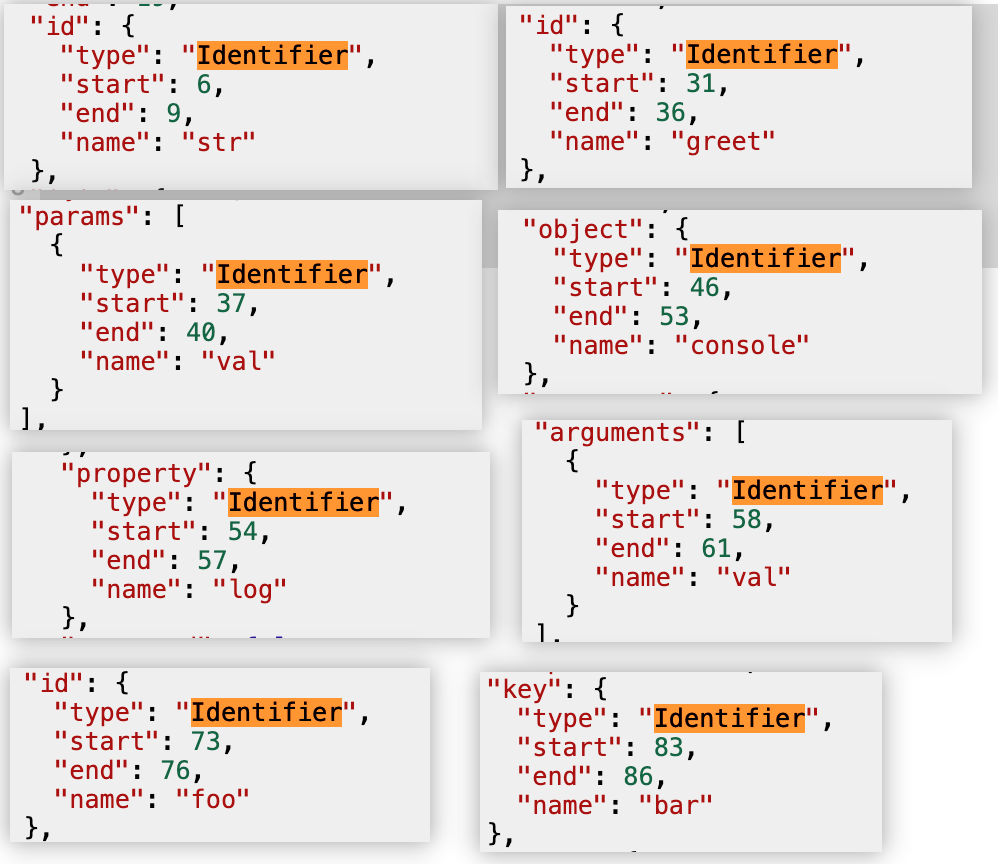

#### Statement
语句，一些常见的执行代码用此类型，比如：

`{}`是`BlockStatement`
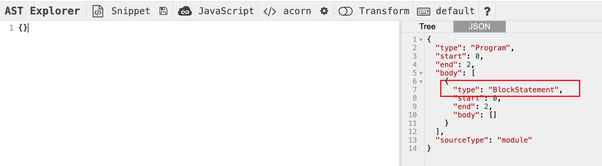
`do {} while()`是`DoWhileStatement`
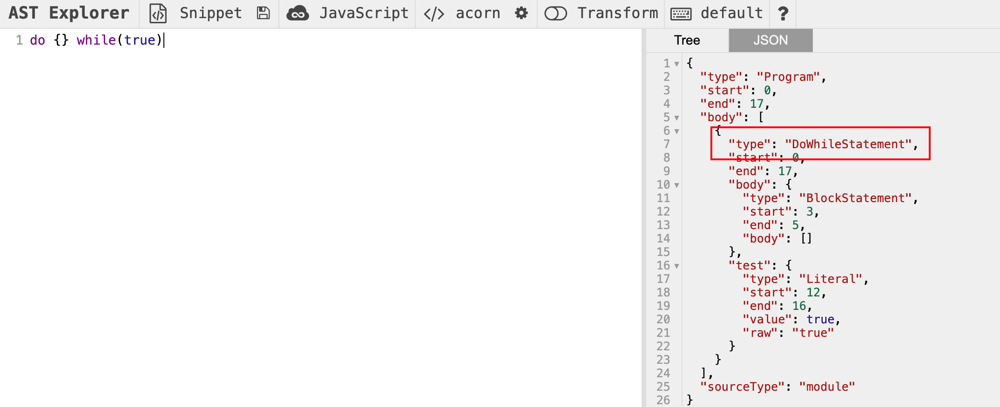
`debugger`是`DebuggerStatement`
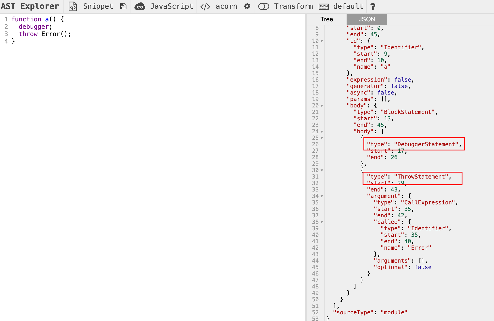

`$:xxx`是`LabeledStatement`。Svelte中的反应性的监听，巧妙地运用了这个语句。
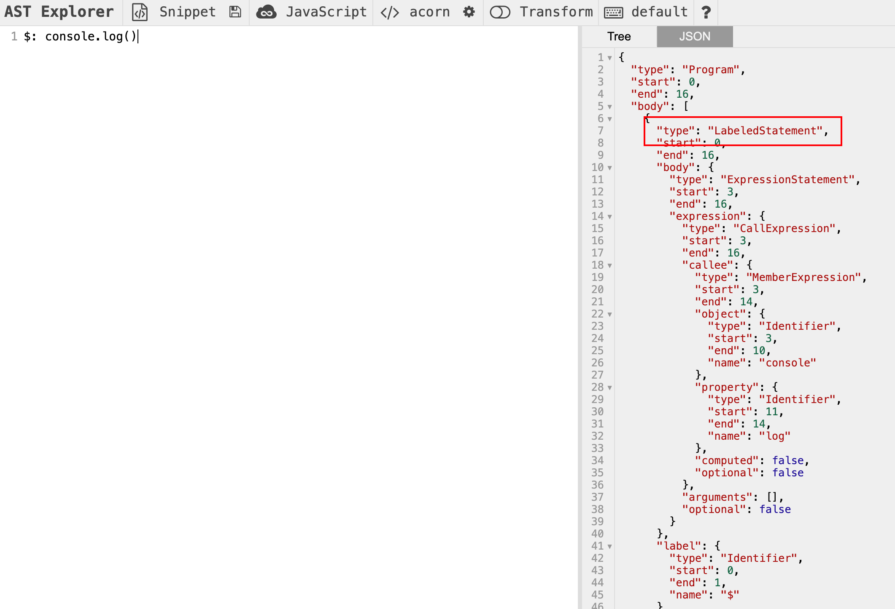
不再逐一展示。以下是常见语句：
```javascript
{} // BlockStatement

do {} while() // DoWhileStatement
while() {} // WhileStatement
for(let i = 0; i < n; i++){} // ForStatement
for(let i in obj){} // ForInStatement
for(let i of arr){} // ForOfStatement

debugger; // DebuggerStatement
throw Error(); // ThrowStatement
label: xxx // LabeledStatement
break; // BreakStatement
continue; // ContinueStatement
return; // ReturnStatement

if(true) {} // IfStatement
switch(true) {} // SwitchStatement

try {} catch(e) {} // TryStatement
...等等
```

#### Declaration
相比于Statement语句用来控制执行逻辑，Declaration声明语句将非空标识符绑定到常量、Class、变量、函数或导入导出当中。
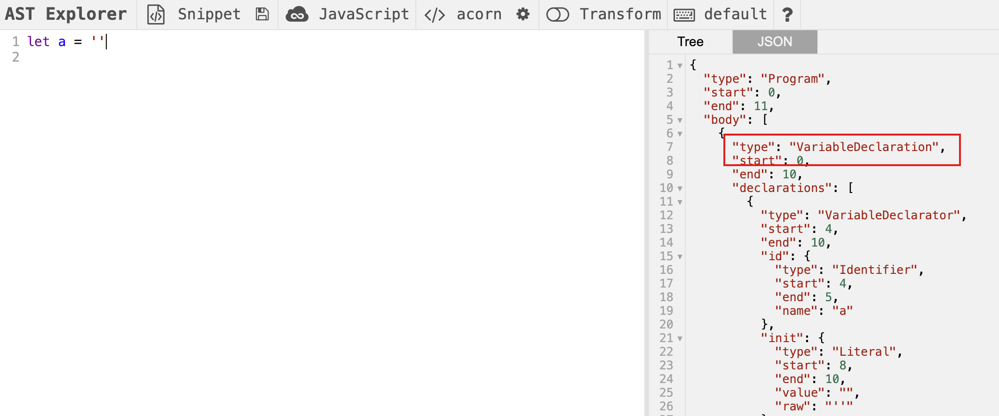

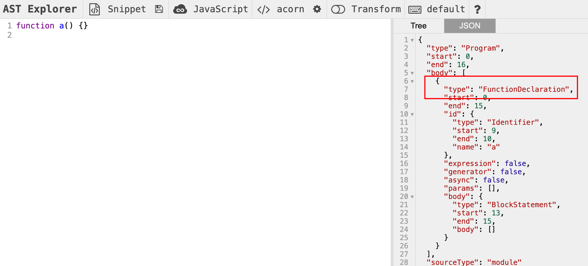
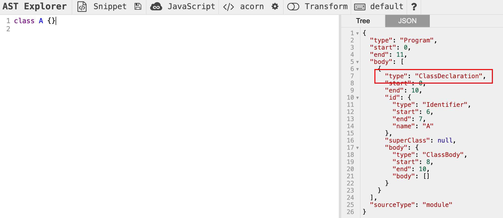

```javascript
let a = ''; // VariableDeclaration
function a() {} // FunctionDeclaration
class A {} // ClassDeclaration
import a from 'a'; // ImportDeclaration
export default a = 1; // ExportDefaultDeclaration
...等等
```

#### Expression
Expression表达式，通过调用运算符或者函数来得到一个计算后的返回值。

```javascript
[1,2,3] // ArrayExpression                数组表达式
({a: ''}) // ObjectExpression             对象表达式
this; // ThisExpression                   this表达式

1 + 2 // BinaryExpression                 二元表达式
true ? '' : '' // ConditionalExpression   条件表达式
a++; // UpdateExpression                  更新表达式
-1 // UnaryExpression                     一元表达式

a = 1; // AssignmentExpression            赋值表达式
new a(); // NewExpression                 New表达式
a = function() {} // FunctionExpression   函数表达式
() => {} // ArrowFunctionExpression       箭头函数表达式
...等等
```

#### Program
正常情况下，最顶级的节点的type即是Program


还有Class、Modules、Directive、File、Comment等type不一一演示了。
TODO https://cloud.tencent.com/developer/article/1842134

## periscopic

从ast对象中分析出变量作用域。

```javascript
import { analyze } from 'periscopic';

const ast = acorn.parse(str, options);

const { map, globals, scope } = analyze(ast);
```

### analyze

`periscopic`导出一个方法`analyze`，调用此方法得到一个对象，该对象有以下属性：
- `map`：是一个WeakMap类型的对象（`WeakMap<Node, Scope>`）, 对象的keys是创建出scope的ast节点。
- `globals`：是一个Map类型的对象（`Map<string, Node>`），收集所有被引用的但没有被声明的Identifier，Identifier我们在acorn中已详细讲解。
- `scope`：程序中的顶级作用域，`Scope`类型

```javascript
import * as acorn from 'acorn';
import { analyze } from 'periscopic';

let a = `let a = 0;
window.b = 1;
function c() {
  let d = 2;
}
e = 3;
`;

const ast = acorn.parse(a, {
  ecmaVersion: 2023,
});

const { map, globals, scope } = analyze(ast);
console.log('map', map);
console.log('globals', globals);
console.log('scope', scope);
```

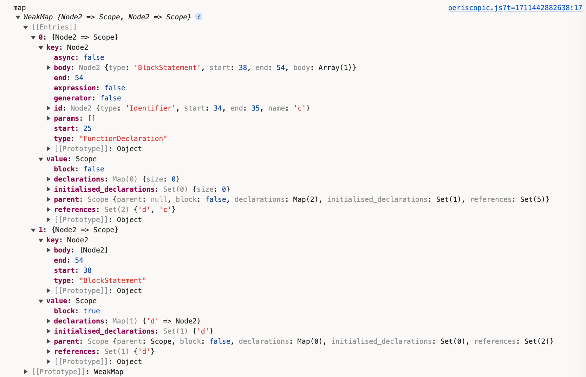
我们首先看下map的打印数据：
periscopic分析出两个创建了scope的节点。
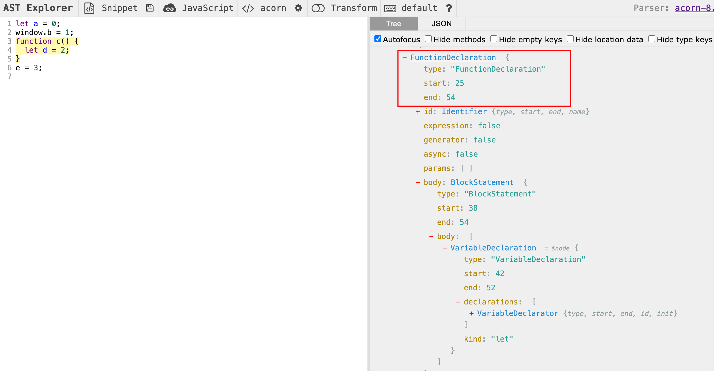
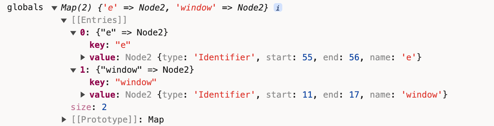

globals中我们可以得知，`e`和`window`这两个变量我们没有进行声明而直接用了。


scope，top-level级别的作用域
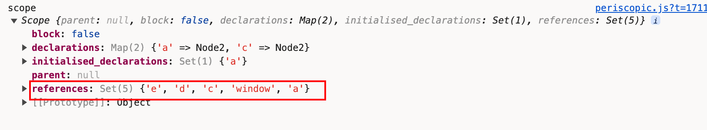

#### Scope
 `Scope`类型的对象有以下参数:
- `scope.block`：如果scope是BlockStatement创建的，则是true，否则是false
- `scope.parent`：父级的Scope对象
- `scope.declarations`：一个Map类型对象（`Map<string, Node>` ），在当前scope中声明的所有变量，Node节点值是Declaration类型节点
- `scope.initialised_declarations`：一个Set类型对象（`Set<string>`），在当前scope中声明且初始化了的对象
- `scope.references`：一个Set类型对象（`Set<string>` ），在当前scope中的所有变量名

`Scope`类型对象有两个方法：
- `scope.has(name)`：如果`name`在当前作用域或祖先作用域中声明过，则返回`true`
- `scope.find_owner(name)`：返回声明`name`的`Scope`对象

我们以上述例子`const { map, globals, scope } = analyze(ast)`中返回的scope为例：
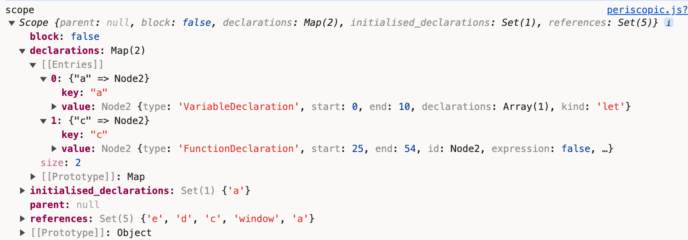
block：不是BlockStatement创建的，所以false
parent：没有父级作用域，所以null
declarations: 变量a和c是在当前作用域声明的
initialised_declarations: 变量a在当前作用域声明并且初始化
references: 当前作用域中的变量有a、window、c、d、e

### extract

periscopic还导出了两个方法`extract_identifiers`和`extract_names`用来提取特定值。

```javascript
import * as acorn from 'acorn';
import { extract_identifiers, extract_names } from 'periscopic';

let a = `let a = 0;
window.b = 1;
function c() {
  let d = 2;
}
e = 3;
`;

const ast = acorn.parse(a, {
  ecmaVersion: 2023,
});

const data = ast.body[2].id;
const identifiers = extract_identifiers(data);
const names = extract_names(data);
console.log('identifiers', identifiers);
console.log('names', names);
```

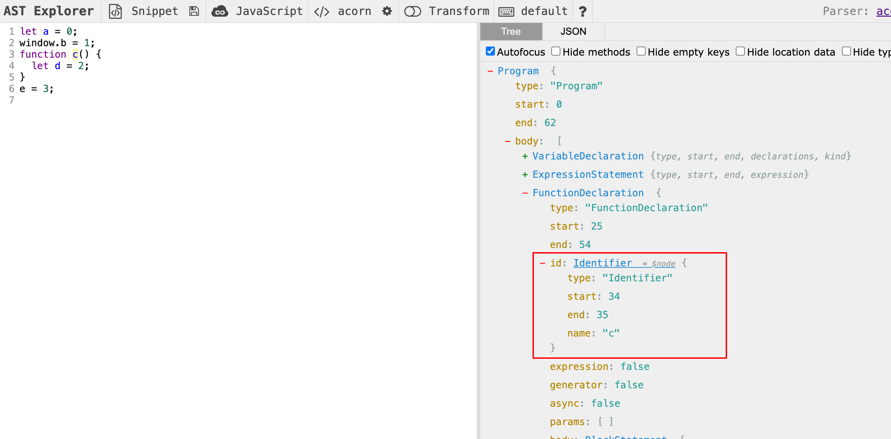

在控制台中输出：
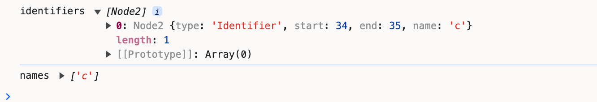

## estree-walker

用来遍历ast对象。

```javascript
import { walk } from "estree-walker";

const ast = acorn.parse(str, options);

walk(ast, {
  enter(node, parent, prop, index) {
    // some code happens
  },
  leave(node, parent, prop, index) {
    // some code happens
  }
});
```

### enter / leave
enter方法：进入节点时调用
leave方法：离开遍历的节点时调用

- 在`enter`方法中，调用`this.skip()`可以阻止当前节点的子节点被遍历，或者阻止`leave`方法被调用
- 在`enter`或`leave`方法中调用`this.replace(new_node)`可以替换节点
- 在`enter`或`leave`方法中调用`this.remove`可以删除当前节点

具有相同作用的包还有：estraverse、acorn-walk等。

```javascript
import * as acorn from "acorn";
import { walk } from "estree-walker";

let a = `let a = 0;`;

let ast = acorn.parse(a, { ecmaVersion: 2023 });

walk(ast, {
  enter(node) {
    console.log('enter', node);
  },
  leave(node) {
    console.log('leave', node);
  }
})
```

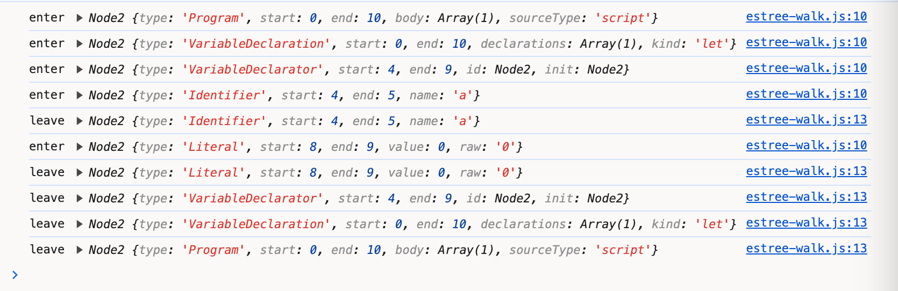

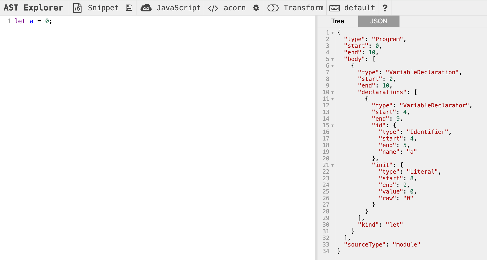
我们对照着解析出来的ast对象来过一遍流程：
- 进入Program节点`enter Program`
- 进入VariableDeclaration节点`enter VariableDeclaration`
- 进入VariableDeclarator节点`enter VariableDeclarator`
- 进入Identifier节点`enter Identifier`，没有子节点了，回退到上一级父节点VariableDeclarator`leave Identifier`
- 进入Literal节点`enter Literal`，没有子节点了，回退到上一级父节点VariableDeclarator`leave Literal`
- VariableDeclarator的子节点已遍历完了，回退到上一级VariableDeclaration`leave VariableDeclarator`
- VariableDeclaration的子节点也遍历完了，继续回退到上一级`leave VariableDeclaration`
- 结束遍历`leave Program`

#### skip
`this.skip()`功能演示：
```javascript
let a = `let a = 0;`;

let ast = acorn.parse(a, { ecmaVersion: 2023 });

walk(ast, {
  enter(node) {
    console.log('enter', node);
    if (node.type == 'VariableDeclarator') {
      this.skip();
    }
  },
  leave(node) {
    console.log('leave', node);
  }
})
```
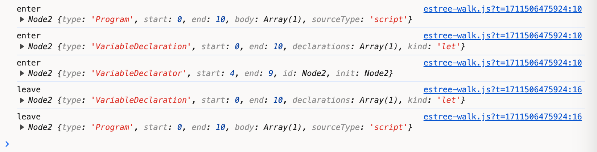

### replace
`this.replace()`方法演示：
比如我们想把`let a = 0;`改成`let a = 1;`，0对应的是`Literal`的节点
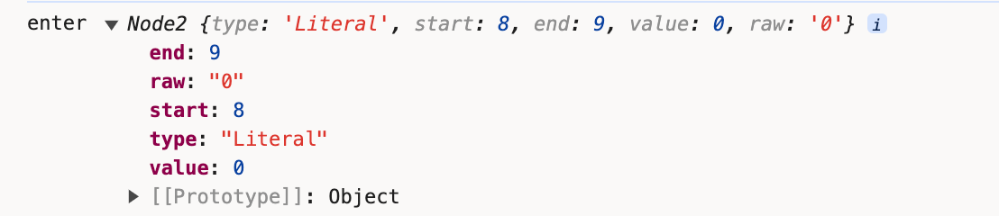

```javascript
import * as acorn from "acorn";
import { walk } from "estree-walker";
import { generate } from "escodegen";

let a = `let a = 0;`;

let ast = acorn.parse(a, { ecmaVersion: 2023 });

walk(ast, {
  enter(node) {
    console.log('enter', node);
    if (node.type === 'Literal') {
      this.replace({
        ...node,
        raw: '1',
        value: 1
      })
    }
  },
  leave(node) {
    console.log('leave', node);
  }
})

const str = generate(ast);
console.log('new str', str);
```
我们把原来节点的`raw`和`value`属性都改成1，然后调用`this.replace()`来替换。
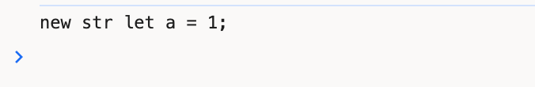


## escodegen

用于把满足 Estree 标准的 AST 转换为 ESMAScript 代码
### generate
```javascript
escodegen.generate(AST[, options]);
```
options的详细参数见[escodegen options](https://github.com/estools/escodegen/wiki/API)

在estree-walk的最后一节演示中，我们已经使用了escodegen来展示它的功能。

## 小结
通过介绍这几个库，相信笔者已经发现，这些其实就是实现一个编译器所需要的几个功能：解析代码文件 -> 分析ast，ast转换 ->生成新代码。