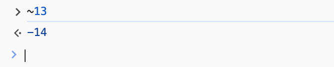
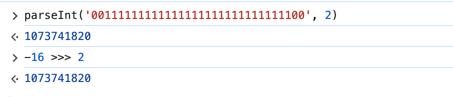
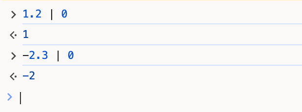

我们在解读源码时，会遇到一行这样的代码：
```javascript
component.$$.dirty[(i / 31) | 0] |= (1 << (i % 31))
```

如果没有接触过位运算的读者，可能会对这行代码犯迷糊，因此，笔者准备花一章的时间来和大家一起了解“位运算”。

## 二进制编码
在了解位运算之前，我们需要首先了解下二进制编码方式。我们主要了解原码、反码和补码。

### 原码

**原码**：最高位表示正负、其他位表示数值。

假设我们有8位的二进制数，如果用原码来表示，最高位则用来表示正负，剩余7位用来表示二进制数：
```
// +13
00001101

// -13 只有第一位不一样
10001101
```

使用原码来表示二进制数的优点是对开发者阅读友好，缺点是对计算机不友好，计算机无法直接用原码进行运算，否则可能会出错。

比如一个非常经典的问题：在数学运算中，`1 + (-1) = 0`这是毫无疑问的，而在二进制中，
```
 00000001
+10000001
_________
 10000010
```
运算结果变成了-2，显然出错了。

### 反码

**反码**：反码是在原码的基础上，保留符号位，正数不变，负数的数值位全部“取反”。

如果我们把上述的`1+(-1)`问题用反码来解决：
```
 00000001
+11111110
_________
 11111111
```
可以看到，得到的结果`11111111`是-0。理论上来说0和-0是一样的，但同一个数字有两种表示会让我们在开发时产生不必要的判断，补码则能解决这个问题。

### 补码
**补码**：补码是在反码的逻辑基础上进一步改动，符号位仍然不变，同样正数不改，而负数数值在原来的基础上`+1`。

```
// 13原码、反码、补码
00001101

// -13原码
10001101

// -13反码
11110010

// -13补码
11110011
```

如果我们使用补码来进行计算：
```
  00001101 (13)
+ 11110011 (-13)
________________
 100000000
```

多出来的一位会因为溢出被忽略掉，于是 `a + -a = 0` 仍然成立。这样设计之后`-0`就不存在了。
在计算机系统底层，数值一律用补码来表示和运算。

## 位运算

程序中的所有数在计算机内存中都是以二进制的形式储存的。位运算就是直接对数据在内存中的二进制位进行操作。
在Javascript中，位运算符是用来对二进制位进行操作的符号，可以将二进制位从低位到高位对齐后进行运算。

Javascript中所有的数字都是符合`IEEE-754`标准的`64`位双精度浮点类型，但做位运算时所有的运算数以及运算结果只会保留[32位](https://262.ecma-international.org/5.1/#sec-11.10)的整数。

Javascript中支持的位运算符有：`&`、`|`、`^`、`~`、`>`、`>>>`。

### 按位与 &

当两个位都是1时，结果为为1，否则为0：

```
  00000000 00000000 00000000 00001101 (13)
& 00000000 00000000 00000000 00000110 (6)
_____________________________________
  00000000 00000000 00000000 00000100 (4)
```

比如我们可以用`&`来判断奇偶性。
```javascript
3 & 1 // 1
2 & 1 // 0
```
结果是1表示是奇数，结果是0则是偶数。
原理就是1的32为二进制是最低位为1，其他为为0的值，用来判断的数字X如果是奇数，最低位一定是1，两个1相与，一定是1，而X的其他位不管是1还是0，遇到0时都变成0。

### 按位或 |

两个位都是0时，结果为为0，否则为1：
```
  00000000 00000000 00000000 00001101 (13)
| 00000000 00000000 00000000 00000110 (6)
_____________________________________
  00000000 00000000 00000000 00001111 (15)
```

### 按位异或 ^

两个位相同时，结果为0，否则为1。任何数和自身异或结果都为零，和零异或结果都是其本身。

```
  00000000 00000000 00000000 00001101 (13)
^ 00000000 00000000 00000000 00000110 (6)
_____________________________________
  00000000 00000000 00000000 00001011 (11)
```

### 按位非 ~

按位原来是1变为0，0变为1。

```
~ 00000000 00000000 00000000 00001101 (13)
_____________________________________
  11111111 11111111 11111111 11110010 补码
  11111111 11111111 11111111 11110001 反码
  10000000 00000000 00000000 00001110 原码 (-14)
```
首先我们将13转成补码，经过补码的按位非之后，我们得到另一组补码，将这组补码转成原码，再将得到的原码转成十进制数。我们能得到`~13 == -14`，我们可以在浏览器控制台上简单验证：  


### 左移 <<

把数值的二进制表示向左移位，移除的位会被遗弃，末尾补0。

```
00000000 00000000 00000000 00001101 << 2
___________________________________
00000000 00000000 00000000 00110100 
```
这里仍然用13举例，`13 << 2`结果是52。左移一位表示乘以2，`13 << 2`相当于`13 * 2 * 2 == 52`。

### 右移 >>

把数值的二进制表示向右移位，末尾的位会被遗弃，前面缺失的位按符号位来补，符号位是1则补1，符号位是0则补0。

我们以-16为例：
```
10000000 00000000 00000000 00010000 原码
11111111 11111111 11111111 11101111 反码
11111111 11111111 11111111 11110000 补码 >> 2
___________________________________
11111111 11111111 11111111 11111100 补码
11111111 11111111 11111111 11111011 反码
10000000 00000000 00000000 00000100 原码                            
```

补码用来计算，原码用来展示。`-16 >> 2 == -4`。

### 无符号右移 >>>

无符号右移，顾名思义就是右移的时候，不考虑符号位，前面统统补 `0`。
仍旧以-16为例：
```
10000000 00000000 00000000 00010000 原码
11111111 11111111 11111111 11101111 反码
11111111 11111111 11111111 11110000 补码 >>> 2
___________________________________
00111111 11111111 11111111 11111100 正数补码、反码、原码相同
```


在Javascript中，使用`parseInt`和`Number.prototype.toString`能够进行进制之间的转换。

## `component.$$.dirty`

现在，我们终于能够结合位运算的知识来解读这段代码：
```javascript
component.$$.dirty[(i / 31) | 0] |= (1 << (i % 31))
```

- `(i / 31) | 0`：这里是用数组下标`i`除以31，然后向下取整（数字和`| 0`进行运算有取整的效果）；
  
`component.$$.dirty`变量是个数组，里面存放了多个32位整数，整数转成32位后，每个比特位用来表示组件中的变量是否发生变更。这里的32对应了前面所说的JS的位运算的运算数和运算结果只保留32位。即dirty数组里的一个整数能够记录32个变量的更新状态，如果组件中的变量超过了32个，则放到下一个整数中记录
  - 比如i=0,计算结果为0，第一个变量的状态放到第一个整数的最右边第一位。
  - i=1，计算结果为0，第二个变量的状态放到第一个整数的最右边第二位。
  - i=32，计算结果为1，第三十三个变量的状态放到第二个整数的最右边第一位，以此类推……
- `(1 << (i % 31))`：用`i`对`31`取模，然后做左移操作；
  - 比如i=0，计算结果为1<<0 => 01。
  - i=1，计算结果为1 << 1 => 10。
  - i=32，计算结果为1<<1 => 10。
- `|=`：再和数组里的旧值进行按位或运算，更新数组。
  - 当i=0时这行代码就变成了`component.$$.dirty[0] |= 01`,由于dirty数组在前面已经被fill为0了，所以代码就变成了`component.$$.dirty[0] = 0 | 01` => `component.$$.dirty[0] = 01`。说明从右边数第一个变量被标记为dirty。
  - 同理当i=1时这行代码就变成了`component.$$.dirty[0] |= 10` =>`component.$$.dirty[0] = 0 | 10` => `component.$$.dirty[0] = 10`。说明从右边数第二个变量被标记为dirty。

## 小结