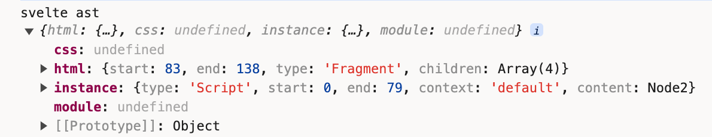

https://pic1.zhimg.com/80/v2-5de464e8217c79ab0a12a279ee7cf42c_1440w.webp
https://github.com/Jarweb/thinking-in-deep/issues/15
TODO: https://zhuanlan.zhihu.com/p/409291132

经过了前两章的铺垫，我们正式开始对源码进行解读。到笔者目前写此文章时（2024-02-28），Svelte的最新版本是4.2.12


我们要想在webpack或vite中Svelte，必须安装`svelte-loader`或`vite-plugin-svelte`，它们的重要性不言而喻。
[svelte-loader](https://github.com/sveltejs/svelte-loader/blob/master/index.js): 
```javascript
const svelte = require('svelte/compiler');

svelte.preprocess(source, options.preprocess).then(processed => {
  const compiled = svelte.compile(processed.toString(), compileOptions);
}
```
[vite-plugin-svelte](https://github.com/sveltejs/vite-plugin-svelte/blob/main/packages/vite-plugin-svelte/src/utils/compile.js): 
```javascript
import * as svelte from 'svelte/compiler';

let preprocessed;
preprocessed = await svelte.preprocess(code, preprocessors, { filename });
const finalCode = preprocessed ? preprocessed.code : code;

let compiled;
compiled = svelte.compile(finalCode, finalCompileOptions);
```

从源码可以看到，Svelte官方的webpack插件[svelte-loader](https://github.com/sveltejs/svelte-loader)和Rollup插件[rollup-plugin-svelte](https://github.com/sveltejs/rollup-plugin-svelte)的主入口都是svelte.compile，这也是我们的切入点。

把项目下载下来，切换到4.2.12分支。
```bash
git clone git@github.com:sveltejs/svelte.git
```


## preprocess

源码路径：`packages/svelte/src/compiler/preprocess/index.js`
```javascript
export default async function preprocess(source, preprocessor, options) {

	const filename = (options && options.filename) || /** @type {any} */ (preprocessor).filename; // legacy
	const preprocessors = preprocessor
		? Array.isArray(preprocessor)
			? preprocessor
			: [preprocessor]
		: [];
	const result = new PreprocessResult(source, filename);
	for (const preprocessor of preprocessors) {
		if (preprocessor.markup) {
			result.update_source(await process_markup(preprocessor.markup, result));
		}
		if (preprocessor.script) {
			result.update_source(await process_tag('script', preprocessor.script, result));
		}
		if (preprocessor.style) {
			result.update_source(await process_tag('style', preprocessor.style, result));
		}
	}

	return result.to_processed();
}
```

下是这个文件的主要功能：

1. `PreprocessResult`类：这个类表示预处理的中间状态。它包含了源代码、文件名、源代码映射列表、依赖列表等信息。
    
2. `processed_content_to_code`函数：这个函数将预处理后的代码和其源代码映射转换为一个`MappedCode`对象。
    
3. `processed_tag_to_code`函数：这个函数将预处理后的标签和其内容转换为一个`MappedCode`对象。
    
4. `parse_tag_attributes`函数：这个函数解析标签的属性。
    
5. `process_tag`函数：这个函数处理指定标签的所有实例。它会调用预处理器函数，然后将预处理后的代码和源代码映射转换为一个`MappedCode`对象。
    
6. `process_markup`函数：这个函数处理标记语言。它会调用预处理器函数，然后将预处理后的代码和源代码映射转换为一个`MappedCode`对象。
    
7. `preprocess`函数：这是主要的预处理函数。它接收源代码、预处理器和选项作为参数，然后对源代码进行预处理。预处理的步骤包括处理标记语言、处理`<script>`标签和处理`<style>`标签。
    

总的来说，这个文件提供了预处理Svelte组件源代码的功能，它允许你在编译前对源代码进行任意的转换。

## compile


首先会将 parse 过程中拿到的语法树（包含 html，css，instance 和 module）转换为 Component，然后在 render_dom 中通过 code-red 中的 print 函数将component 的转换为 js 可运行代码，最终输出 complier 的结果

将parse解析得到的语法树转成js文件

语法的最终编译是来自[code-red](https://link.juejin.cn/?target=https%3A%2F%2Fgithub.com%2FRich-Harris%2Fcode-red "https://github.com/Rich-Harris/code-red")的 print 将调整后的语法树转换成为代码

第一步将 parse 过程中拿到的语法树（包含 html，css，instance 和 module）转换为 Component，第二步将 Component 进入**render dom**处理并生成 component 的转换代码以及 runtime，第三步输出 compiler 的结果

packages/svelte/src/compiler/compile/index.js
```javascript
/**
 * `compile` takes your component source code, and turns it into a JavaScript module that exports a class.
 *
 * https://svelte.dev/docs/svelte-compiler#svelte-compile
 * @param {string} source
 * @param {import('../interfaces.js').CompileOptions} options
 */
export default function compile(source, options = {}) {
	const ast = parse(source, options);
	const component = new Component(
		ast,
		source,
		options.name || get_name_from_filename(options.filename) || 'Component',
		options,
	);
	const result = render_dom(component, options);
	return component.generate(result);
}
```
我们去掉不相关的代码，可以看到基本的compile逻辑。

通过解读svelte文件的字符串内容，得到ast，将ast转成Component类，然后render dom，最后generate。


compiler这个编译器主要分为两部分 parse 和 compile，parse 是解析的过程，解析 script 和 style 等 tag 标签以及 each 和 ifelse 等 mustache 模版语法。compile 则是包含了 parse 的动作，将解析出来的 ast 语法树转换为可执行的代码

## parse

首先我们查看下compile方法：
```diff
export default function compile(source, options = {}) {
+	const ast = parse(source, options);
	const component = new Component(
		ast,
		source,
		options.name || get_name_from_filename(options.filename) || 'Component',
		options,
	);
	const result = render_dom(component, options);
	return component.generate(result);
}
```
它的第一步逻辑便是调用parse来解析文件内容。

跳转到parse方法的主入口`packages/svelte/src/compiler/parse/index.js`：
```javascript
export default function parse(template, options = {}) {
	const parser = new Parser(template, options);
	
	const instance_scripts = parser.js.filter((script) => script.context === 'default');
	const module_scripts = parser.js.filter((script) => script.context === 'module');

	return {
		html: parser.html,
		css: parser.css[0],
		instance: instance_scripts[0],
		module: module_scripts[0]
	};
}
```
逻辑都封装在`Parser`类中。

我们在REPL中可以看到，AST的输出结构正是上述的返回对象。


### Parser

源码路径：`packages/svelte/src/compiler/parse/index.js`
```javascript
export class Parser {
  template = undefined;
  filename = undefined;
  customElement = undefined;
  css_mode = undefined;
  index = 0;
  stack = [];
  html = undefined;
  css = [];
  js = [];
  meta_tags = {};
  last_auto_closed_tag = undefined;

  constructor(template, options) {
    let state = fragment;
    while (this.index < this.template.length) {
      state = state(this) || fragment;
    }
  }
  current() {}
  eat(str, required, error) {}
  match(str) {}
  match_regex(pattern) {}
  allow_whitespace() {}
  read(pattern) {}
  read_identifier(allow_reserved = false) {}
  read_until(pattern, error_message) {}
  require_whitespace() {}
}
```

在Parse类中，定义了一些如何解析模板字符串的方法，比如`match`用来判断是否匹配对应字符串、`eat`用来“吃掉”当前字符串，用于确保读取字符串模板的索引index的正确指向等等。

我们着重关注的是在`constructor`里的一段代码：
```javascript
let state = fragment;
while (this.index < this.template.length) {
  state = state(this) || fragment;
}
```

我们需要有个认知作为阅读Parser源码的前提，那就是内部的所有逻辑都是为了转变成ast对象服务的。

TODO：script分为instance和module

Instance 是指 script 标签中响应式的属性和方法，module 是使用 `<script context="module"` 声明 的无响应的变量和方法。

script 的解析主要靠的是[code-red](https://link.juejin.cn/?target=https%3A%2F%2Fgithub.com%2FRich-Harris%2Fcode-red "https://github.com/Rich-Harris/code-red")，它是基于[acorn](https://link.juejin.cn/?target=https%3A%2F%2Fgithub.com%2Facornjs%2Facorn "https://github.com/acornjs/acorn")的封装

#### fragment
源码路径：`packages/svelte/src/compiler/parse/state/fragment.js`
```javascript
import tag from './tag.js';
import mustache from './mustache.js';
import text from './text.js';

/**
 * @param {import('../index.js').Parser} parser
 */
export default function fragment(parser) {
	if (parser.match('<')) {
		return tag;
	}

	if (parser.match('{')) {
		return mustache;
	}

	return text;
}
```
#### tag
tag除了原生，还包括svelte:html, svelte:body, svelte:component, svelte:element等等
TODO: 重写 tag 解析的内容以 `<` 作为标识，包括 HTMLElement、style标签、script标签以及用户自定义的 svelte 组件以及 svelte 实现的一些特殊标签如 `svelte:head` 、`svelte:options` 、`svelte:window` 以及`svelte:body` 等
#### mustache
mustache模板语法
TODO: 重写 mustache 以 `{` 作为标识，识别的内容除了模板语法之外，还包括 svelte 的逻辑渲染(else……if、each)等语法、`{``@html``}`、`{``@debug}` 等
#### text
逻辑相对简单很多，记录`type: 'Text'`的数据节点：
```javascript
export default function text(parser) {
	...

	const node = {
		start,
		end: parser.index,
		type: 'Text',
		raw: data,
		data: decode_character_references(data, false)
	};

	parser.current().children.push(node);
}
```

## Component
经过`parse`的处理，我们拿到了ast对象，然后我们往`Component`中传入字符串内容和ast对象：
```diff
export default function compile(source, options = {}) {
	const ast = parse(source, options);
+	const component = new Component(
		ast,
		source,
		options.name || get_name_from_filename(options.filename) || 'Component',
		options,
	);
	const result = render_dom(component, options);
	return component.generate(result);
}
```

以下是这个文件的主要功能：

解析：它首先使用Svelte的解析器将源代码解析为一个抽象语法树（AST）。

验证：然后，它会对AST进行一些验证检查，以确保组件代码没有明显的错误。

编译：接下来，它会将AST转换为JavaScript代码。这个过程包括处理Svelte特定的语法，如块级元素、插槽、动态属性等。

生成：最后，它会生成最终的JavaScript代码，这包括创建渲染函数、更新函数等。

这个文件还包含了处理Svelte组件生命周期、响应式声明、上下文API等特性的代码。

总的来说，Component.js文件是Svelte编译器的核心，它负责将Svelte组件源代码转换为可以在浏览器中运行的JavaScript代码。

```javascript
export default class Component {
	constructor(ast, source, name, compile_options, stats, warnings) {
		this.ast = ast;
		this.source = source;

		// styles
		this.stylesheet = new Stylesheet({
			source,
			ast,
			filename: compile_options.filename,
			component_name: name,
			dev: compile_options.dev,
			get_css_hash: compile_options.cssHash
		});

		this.walk_module_js();
		this.walk_instance_js_pre_template();
		this.fragment = new Fragment(this, ast.html);

		this.walk_instance_js_post_template();
	}
  generate(result) {}
  walk_module_js() {}
  walk_instance_js_pre_template() {}
  walk_instance_js_post_template() {}
}
```

### walk_module_js
这个walk_module_js()函数是Svelte编译器的一部分，它处理Svelte组件中的`<script>`标签的内容。这个函数的主要任务是遍历（或“walk”）模块脚本的抽象语法树（AST），并对其进行一些处理和转换。

以下是这个函数的主要步骤：

首先，它检查是否存在模块脚本。如果不存在，函数就会直接返回。

然后，它使用walk函数遍历模块脚本的AST。在遍历过程中，它会检查是否存在标签为$的语句，这在Svelte中是不允许的，因为$是用于响应式声明的特殊符号。

接下来，它创建了模块脚本的作用域，并将其存储在this.module_scope中。在创建作用域的过程中，它会收集所有的声明和全局变量。

对于每个声明，它会检查变量名是否以$开头，如果是，它会抛出一个错误，因为在模块脚本中，变量名不能以$开头。然后，它会将这个声明添加到组件的变量列表中。

对于每个全局变量，它也会检查变量名是否以$开头，如果是，它会抛出一个错误。然后，它会将这个全局变量添加到组件的变量列表中。

最后，它会遍历模块脚本的所有语句，对于每个ImportDeclaration，它会提取出导入的信息。对于每个以export开头的语句，它会提取出导出的信息。

总的来说，walk_module_js()函数的主要任务是处理Svelte组件中的模块脚本，包括提取导入和导出的信息，创建作用域，以及处理声明和全局变量。

### walk_instance_js_pre_template

这个`walk_instance_js_pre_template()`函数是Svelte编译器的一部分，它处理Svelte组件中的`<script>`标签的内容。这个函数的主要任务是遍历（或“walk”）实例脚本的抽象语法树（AST），并对其进行一些处理和转换。

以下是这个函数的主要步骤：

1. 首先，它检查是否存在实例脚本。如果不存在，函数就会直接返回。
    
2. 然后，它遍历实例脚本的所有语句，对于每个标签语句，它会检查是否是响应式声明。如果是，它会提取出声明的变量名，并将其添加到`this.injected_reactive_declaration_vars`中。
    
3. 接下来，它创建了实例脚本的作用域，并将其存储在`this.instance_scope`中。在创建作用域的过程中，它会收集所有的声明和全局变量。
    
4. 对于每个声明，它会检查变量名是否以`$`开头，如果是，它会抛出一个错误，因为在实例脚本中，变量名不能以`$`开头。然后，它会将这个声明添加到组件的变量列表中。
    
5. 对于每个全局变量，它会检查变量名是否以`$`开头，如果是，它会抛出一个错误。然后，它会将这个全局变量添加到组件的变量列表中。
    
6. 最后，它会跟踪实例脚本中的所有引用和变异。
    

总的来说，`walk_instance_js_pre_template()`函数的主要任务是处理Svelte组件中的实例脚本，包括提取响应式声明的变量，创建作用域，以及处理声明和全局变量

### Fragment
源码路径：`packages/svelte/src/compiler/compile/nodes/Fragment.js`
```javascript
export default class Fragment extends Node {
	block;
	children;
	scope;
	constructor(component, info) {
		const scope = new TemplateScope();
		super(component, null, scope, info);
		this.scope = scope;
		this.children = map_children(component, this, scope, info.children);
	}
}
```

map_children源码路径：`packages/svelte/src/compiler/compile/nodes/shared/map_children.js`
```javascript
export default function map_children(component, parent, scope, children) {
	let last = null;
	let ignores = [];
	return children.map((child) => {
		const constructor = get_constructor(child.type);
		...
		const node = new constructor(component, parent, scope, child);
		...
		return node;
	});
}
```

get_constructor经过new得到一个node对象：
```javascript
function get_constructor(type) {
	switch (type) {
		case 'AwaitBlock':
			return AwaitBlock;
		case 'Body':
			return Body;
		case 'Comment':
			return Comment;
		case 'ConstTag':
			return ConstTag;
		case 'Document':
			return Document;
		case 'EachBlock':
			return EachBlock;
		case 'Element':
			return Element;
		case 'Head':
			return Head;
		case 'IfBlock':
			return IfBlock;
		...
		default:
			throw new Error(`Not implemented: ${type}`);
	}
}
```

TODO: 拿其中一个举例
### walk_instance_js_post_template

是这个函数的主要步骤：

1. 首先，它检查是否存在实例脚本。如果不存在，函数就会直接返回。
    
2. 然后，它调用`this.post_template_walk()`，这个函数会遍历实例脚本的抽象语法树（AST），并对其进行一些后处理，比如检查变量的引用，处理赋值语句等。
    
3. 接下来，它调用`this.hoist_instance_declarations()`，这个函数会将实例脚本中的所有声明提升到顶部，这是因为在JavaScript中，变量和函数的声明会被提升。
    
4. 然后，它调用`this.extract_reactive_declarations()`，这个函数会提取出实例脚本中的所有响应式声明。在Svelte中，响应式声明是一种特殊的声明，它们以`$:`开头，当它们的依赖变化时，它们会自动重新计算。
    
5. 最后，它调用`this.check_if_tags_content_dynamic()`，这个函数会检查模板中的标签是否包含动态内容。如果包含，它会生成相应的更新代码。
    

总的来说，`walk_instance_js_post_template()`函数的主要任务是在模板解析之后处理实例脚本，包括后处理AST，提升声明，提取响应式声明，以及检查标签的动态内容
## render_dom

#### Renderer

## generate
隶属于`Component`中的一个方法

调用code-red的print方法。


## 小结