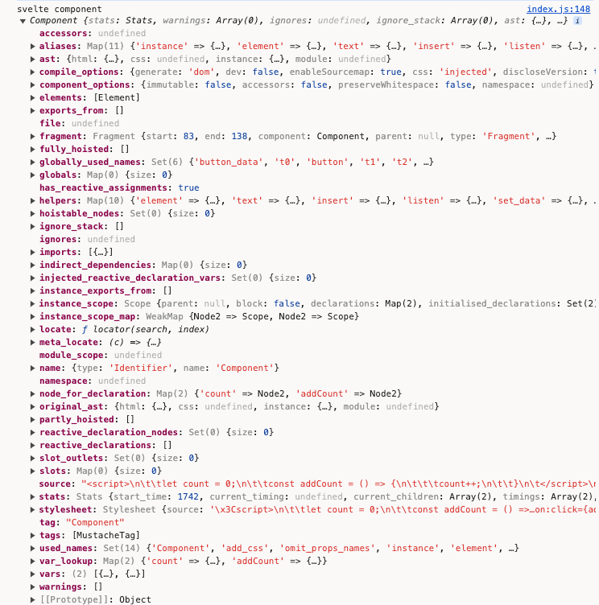

经过了前两章的铺垫，我们正式开始对源码进行解读。到笔者目前写文章时，Svelte的最新版本是4.2.12。  


我们要想在`webpack`或`vite`中使用`Svelte`，必须安装`svelte-loader`或`vite-plugin-svelte`，它们的重要性不言而喻。

看下[svelte-loader](https://github.com/sveltejs/svelte-loader/blob/master/index.js)的核心逻辑: 
```javascript
const svelte = require('svelte/compiler');

svelte.preprocess(source, options.preprocess).then(processed => {
  const compiled = svelte.compile(processed.toString(), compileOptions);
}
```

再看下[vite-plugin-svelte](https://github.com/sveltejs/vite-plugin-svelte/blob/main/packages/vite-plugin-svelte/src/utils/compile.js)的核心逻辑: 
```javascript
import * as svelte from 'svelte/compiler';

let preprocessed;
preprocessed = await svelte.preprocess(code, preprocessors, { filename });
const finalCode = preprocessed ? preprocessed.code : code;

let compiled;
compiled = svelte.compile(finalCode, finalCompileOptions);
```

从源码可以看到，`Svelte`官方的`webpack`插件[svelte-loader](https://github.com/sveltejs/svelte-loader)和`Rollup`插件[rollup-plugin-svelte](https://github.com/sveltejs/rollup-plugin-svelte)的主入口都是`svelte.compile`，这也是我们的切入点。

把项目下载下来，切换到**4.2.12**分支。
```bash
git clone git@github.com:sveltejs/svelte.git
```


## preprocess

首先是预处理。源码路径：`packages/svelte/src/compiler/preprocess/index.js`
```javascript
export default async function preprocess(source, preprocessor, options) {
  const filename = (options && options.filename) || /** @type {any} */ (preprocessor).filename; // legacy
  const preprocessors = preprocessor
    ? Array.isArray(preprocessor)
      ? preprocessor
      : [preprocessor]
    : [];
  const result = new PreprocessResult(source, filename);
  for (const preprocessor of preprocessors) {
    if (preprocessor.markup) {
      result.update_source(await process_markup(preprocessor.markup, result));
    }
    if (preprocessor.script) {
      result.update_source(await process_tag('script', preprocessor.script, result));
    }
    if (preprocessor.style) {
      result.update_source(await process_tag('style', preprocessor.style, result));
    }
  }

  return result.to_processed();
}
```
简单理解：
- 首先是从外部接收要编译的文件`source`和预处理器对象`preprocessor`。
- 判断`preprocessor`是不是数组，因为可能传了多个`preprocessor`，遍历执行预处理器的功能
- 分别处理`markup`、`script`、`style`，即对应着html标记、js脚本和css样式的编译处理。

总的来说，这个文件提供了预处理Svelte组件源代码的功能，它允许你在编译前对源代码进行任意的转换。

## compile

进入到`packages/svelte/src/compiler/compile/index.js`：
```javascript
export default function compile(source, options = {}) {
  const ast = parse(source, options);
  const component = new Component(
    ast,
    source,
    options.name || get_name_from_filename(options.filename) || 'Component',
    options,
  );
  const result = render_dom(component, options);
  return component.generate(result);
}
```
我们去掉不相关的代码，可以看到基本的compile逻辑：

- 首先会将`parse`过程中拿到的语法树ast转换为`component`
- 然后在`render_dom`中调整成特定的代码片段
- 最后`component.generate`中，通过[code-red](https://github.com/Rich-Harris/code-red)的`print`将调整后的代码片段拼成完整的代码

用以下代码来进行编译为例：
```html
<script>
  let count = 0;
  const addCount = () => {
    count++;
  }
<\/script>

<button on:click={addCount}>add</button>
count:{count}
```
我们分别把`ast`、`component`、`result`这几个变量打印出来看下：





### parse

首先我们查看下compile方法：
```javascript
const ast = parse(source, options);
```
`compile`第一步的逻辑便是调用parse来解析文件内容。

跳转到`parse`方法的主入口`packages/svelte/src/compiler/parse/index.js`：
```javascript
export default function parse(template, options = {}) {
  const parser = new Parser(template, options);
  
  const instance_scripts = parser.js.filter((script) => script.context === 'default');
  const module_scripts = parser.js.filter((script) => script.context === 'module');

  return {
    html: parser.html,
    css: parser.css[0],
    instance: instance_scripts[0],
    module: module_scripts[0]
  };
}
```
逻辑都封装在`Parser`类中，经过`Parser`处理后，返回带有`html`、`css`、`instance`、`module`属性值的对象。`html`和`css`容易理解，而`instance`存储的是正常的`script`内容，`module`存储的则是`<script context="module"></script>`内的js内容。

我们在REPL中可以看到，AST的输出结构正是上述的返回对象。


#### Parser

```javascript
export class Parser {
  index = 0;
  stack = [];
  html = undefined;
  css = [];
  js = [];

  constructor(template, options) {
    let state = fragment;
    while (this.index < this.template.length) {
      state = state(this) || fragment;
    }
  }
  current() {}
  eat(str, required, error) {}
  match(str) {}
  match_regex(pattern) {}
  allow_whitespace() {}
  read(pattern) {}
  read_identifier(allow_reserved = false) {}
  read_until(pattern, error_message) {}
  require_whitespace() {}
}
```

在`Parse`类中，定义了一些如何解析模板字符串的方法，比如`match`用来判断是否匹配对应字符串、`eat`用来“吃掉”当前字符串，用于确保读取字符串模板的索引index的正确指向等等。

我们着重关注的是在`constructor`里的一段代码：
```javascript
let state = fragment;
while (this.index < this.template.length) {
  state = state(this) || fragment;
}
```

#### fragment
进入到`fragment`的文件中`packages/svelte/src/compiler/parse/state/fragment.js`：
```javascript
import tag from './tag.js';
import mustache from './mustache.js';
import text from './text.js';

/**
 * @param {import('../index.js').Parser} parser
 */
export default function fragment(parser) {
  if (parser.match('<')) {
    return tag;
  }

  if (parser.match('{')) {
    return mustache;
  }

  return text;
}
```
可以看到，`fragment`内部是使用了三种不同的解析处理，分别是`tag`、`mustache`和`text`。

#### tag

当解析的内容是以`<`开头时，进入到`tag`的解析流程。`tag`除了解析原生html、css、script标签外，还支持了Svelte自定义的标签如`svelte:html`、`svelte:body`、`svelte:component`等等。

```javascript
if (parser.eat('!--')) {
  const data = parser.read_until(regex_closing_comment);
  parser.eat('-->', true, parser_errors.unclosed_comment);
  parser.current().children.push({
    start,
    end: parser.index,
    type: 'Comment',
    data,
    ignores: extract_svelte_ignore(data)
  });
  return;
}
```
当在`<`之后遇到的是`!--`，表明解析到了注释语句，返回`Comment`类型的节点。

```javascript
const meta_tags = new Map([
  ['svelte:head', 'Head'],
  ['svelte:options', 'Options'],
  ['svelte:window', 'Window'],
  ['svelte:document', 'Document'],
  ['svelte:body', 'Body']
]);
const valid_meta_tags = Array.from(meta_tags.keys()).concat(
  'svelte:self',
  'svelte:component',
  'svelte:fragment',
  'svelte:element'
);

const type = meta_tags.has(name)
  ? meta_tags.get(name)
  : regex_capital_letter.test(name[0]) || name === 'svelte:self' || name === 'svelte:component'
  ? 'InlineComponent'
  : name === 'svelte:fragment'
  ? 'SlotTemplate'
  : name === 'title' && parent_is_head(parser.stack)
  ? 'Title'
  : name === 'slot'
  ? 'Slot'
  : 'Element';
```
遇到Svelte的自定义标签时，返回特定类型的节点，剩余的原生html标签，则标记为`Element`类型节点。


```javascript
const specials = new Map([
  [
    'script',
    {
      read: read_script,
      property: 'js'
    }
  ],
  [
    'style',
    {
      read: read_style,
      property: 'css'
    }
  ]
]);

if (is_top_level_script_or_style) {
  const special = specials.get(name);
  parser.eat('>', true);
  const content = special.read(parser, start, element.attributes);
  if (content) parser[special.property].push(content);
  return;
}
```
当遇到`script`标签时，用`read_script`进行解析；当遇到`style`标签时，用`read_style`进行解析。

`read_script`的逻辑如下，核心是调用`code-red`的`parse`方法对script的内容进行解析：
```javascript
export default function read_script(parser, start, attributes) {
  ...
  let ast;
  try {
    ast = acorn.parse(source);
  } catch (err) {
    parser.acorn_error(err);
  }
  
  return {
    type: 'Script',
    start,
    end: parser.index,
    context: get_context(parser, attributes, start),
    content: ast
  };
}
```

acorn.parse的逻辑：
```javascript
export const parse = (source) =>
  code_red.parse(source, {
    sourceType: 'module',
    ecmaVersion: 13,
    locations: true
  });
```

`read_style`的逻辑如下，核心是使用了`css-tree`的`fork`功能：
```javascript
import { parse } from './css-tree-cq/css_tree_parse.js'; // Use extended css-tree for 
import { walk } from 'estree-walker';

export default function read_style(parser, start, attributes) {
  ...

  let ast;

  try {
    ast = parse(styles, {
      positions: true,
      offset: content_start,
      onParseError(error) {
        throw error;
      }
    });
  } catch (err) {
    ...
  }

  ast = JSON.parse(JSON.stringify(ast));

  walk(ast, {
    enter: (node) => {
      ...

    }
  });

  parser.read(regex_starts_with_closing_style_tag);

  const end = parser.index;

  return {
    type: 'Style',
    start,
    end,
    attributes,
    children: ast.children,
    content: {
      start: content_start,
      end: content_end,
      styles
    }
  };
}
```

css`parse`的逻辑：
```javascript
import { fork } from 'css-tree';
import * as node from './node/index.js';

const cq_syntax = fork({
  atrule: {
    container: {
      parse: {
        prelude() {
          return this.createSingleNodeList(this.ContainerQuery());
        },
        block(is_style_block = false) {
          return this.Block(is_style_block);
        }
      }
    }
  },
  node
});

export const parse = cq_syntax.parse;
```

#### mustache

当解析的内容是以`{`开头时，进入到`mustache`的解析流程。除了识别正常的`{xxx}`语法外，还识别Svelte的逻辑渲染语法如`{#if}`、`{#each}`、`{@html}`等等。

```javascript
export default function mustache(parser) {
  ...
  // {/if}, {/each}, {/await} or {/key}
  if (parser.eat('/')) {
    
    ...
  } else if (parser.eat(':else')) {
    ...
    // :else if
    if (parser.eat('if')) {
      ...
      block.else = {
        start: parser.index,
        end: null,
        type: 'ElseBlock',
        children: [
          {
            start: parser.index,
            end: null,
            type: 'IfBlock',
            elseif: true,
            expression,
            children: []
          }
        ]
      };
      parser.stack.push(block.else.children[0]);
    } else {
      // :else
      ...
      block.else = {
        start: parser.index,
        end: null,
        type: 'ElseBlock',
        children: []
      };
      parser.stack.push(block.else);
    }
  } else if (parser.match(':then') || parser.match(':catch')) {
    const block = parser.current();
    const is_then = parser.eat(':then') || !parser.eat(':catch');
    ...
    
    const new_block = {
      start,
      end: null,
      type: is_then ? 'ThenBlock' : 'CatchBlock',
      children: [],
      skip: false
    };
    await_block[is_then ? 'then' : 'catch'] = new_block;
    parser.stack.push(new_block);
  } else if (parser.eat('#')) {
    // {#if foo}, {#each foo} or {#await foo}
    let type;
    if (parser.eat('if')) {
      type = 'IfBlock';
    } else if (parser.eat('each')) {
      type = 'EachBlock';
    } else if (parser.eat('await')) {
      type = 'AwaitBlock';
    } else if (parser.eat('key')) {
      type = 'KeyBlock';
    } else {
      parser.error(parser_errors.expected_block_type);
    }
    parser.require_whitespace();
    const expression = read_expression(parser);
    const block =
      type === 'AwaitBlock'
        ? {
            start,
            end: null,
            type,
            expression,
            value: null,
            error: null,
            pending: {
              start: null,
              end: null,
              type: 'PendingBlock',
              children: [],
              skip: true
            },
            then: {
              start: null,
              end: null,
              type: 'ThenBlock',
              children: [],
              skip: true
            },
            catch: {
              start: null,
              end: null,
              type: 'CatchBlock',
              children: [],
              skip: true
            }
          }
        : {
            start,
            end: null,
            type,
            expression,
            children: []
          };
    parser.allow_whitespace();
    // {#each} blocks must declare a context – {#each list as item}
    if (type === 'EachBlock') {
      ...
    }
    
    ...
  } else if (parser.eat('@html')) {
    // {@html content} tag
    parser.require_whitespace();
    const expression = read_expression(parser);
    parser.allow_whitespace();
    parser.eat('}', true);
    parser.current().children.push({
      start,
      end: parser.index,
      type: 'RawMustacheTag',
      expression
    });
  } else if (parser.eat('@debug')) {
    let identifiers;
    // Implies {@debug} which indicates "debug all"
    if (parser.read(regex_whitespace_with_closing_curly_brace)) {
      identifiers = [];
    } else {
      const expression = read_expression(parser);
      ...
    }
    parser.current().children.push({
      start,
      end: parser.index,
      type: 'DebugTag',
      identifiers
    });
  } else if (parser.eat('@const')) {
    // {@const a = b}
    parser.require_whitespace();
    const expression = read_expression(parser);
    ...
    parser.current().children.push({
      start,
      end: parser.index,
      type: 'ConstTag',
      expression
    });
  } else {
    const expression = read_expression(parser);
    parser.allow_whitespace();
    parser.eat('}', true);
    parser.current().children.push({
      start,
      end: parser.index,
      type: 'MustacheTag',
      expression
    });
  }
}
```
笔者已经把大部分细节代码删除，从上述代码中，我们大体能够知道，`mustache`方法能够解析`{}`、`{@html}`、`{@debug}`、`{@const}`、`{#if}`、`{#each}`、`{#await}`、`{#key}`、`{:else}`、`{:else if}`、`{:then}`、`{:catch}`、`{/if}`、`{/each}`、`{/await}`、`{/key}`等。

#### text
逻辑相对简单很多，主要是用于解析纯文本，返回`Text`类型的数据节点：
```javascript
export default function text(parser) {
  ...

  const node = {
    start,
    end: parser.index,
    type: 'Text',
    raw: data,
    data: decode_character_references(data, false)
  };

  parser.current().children.push(node);
}
```

`const ast = parse(source, options);`的流程解析到此，回到`compile`。


### Component

经过`parse`的处理，我们拿到了ast对象，然后我们往`Component`中传入字符串内容和ast对象：
```javascript
const component = new Component(
  ast,
  source,
  options.name || get_name_from_filename(options.filename) || 'Component',
  options,
);
```

```javascript
export default class Component {
  constructor(ast, source, name, compile_options, stats, warnings) {
    this.ast = ast;
    this.source = source;

    // styles
    this.stylesheet = new Stylesheet({
      source,
      ast,
      filename: compile_options.filename,
      component_name: name,
      dev: compile_options.dev,
      get_css_hash: compile_options.cssHash
    });

    this.walk_module_js();
    this.walk_instance_js_pre_template();
    this.fragment = new Fragment(this, ast.html);

    this.walk_instance_js_post_template();
  }
  generate(result) {}
  walk_module_js() {}
  walk_instance_js_pre_template() {}
  walk_instance_js_post_template() {}
}
```

#### walk_module_js
```javascript
walk_module_js() {
  const component = this;
  const script = this.ast.module;
  if (!script) return;
  walk(script.content, {
    /** @param {import('estree').Node} node */
    enter(node) {
      ...
    }
  });
  const { scope, globals } = create_scopes(script.content);
  this.module_scope = scope;
  scope.declarations.forEach((node, name) => {
    if (name[0] === '$') {
      return this.error(/** @type {any} */ (node), compiler_errors.illegal_declaration);
    }
    const writable =
      node.type === 'VariableDeclaration' && (node.kind === 'var' || node.kind === 'let');
    const imported = node.type.startsWith('Import');
    this.add_var(node, {
      name,
      module: true,
      hoistable: true,
      writable,
      imported
    });
  });
}
```
这个方法主要对`ast.module`的内容进行解析，即对`<script context="module"></script>`中的内容进行解析，比如判断里面是否声明了`$`相关的响应式语句，对`import`、`export`语句的处理等。

#### walk_instance_js_pre_template

```javascript
walk_instance_js_pre_template() {
  const script = this.ast.instance;
  if (!script) return;
  // inject vars for reactive declarations
  script.content.body.forEach((node) => {
    ...
    extract_names(expression.left).forEach((name) => {
      if (!this.var_lookup.has(name) && name[0] !== '$') {
        this.injected_reactive_declaration_vars.add(name);
      }
    });
  });
  const { scope: instance_scope, map, globals } = create_scopes(script.content);
  this.instance_scope = instance_scope;
  this.instance_scope_map = map;
  instance_scope.declarations.forEach((node, name) => {
    ...
    const { type } = node;
    this.add_var(node, {
      name,
      initialised: instance_scope.initialised_declarations.has(name),
      imported: type.startsWith('Import'),
      writable: type === 'VariableDeclaration' && (node.kind === 'var' || node.kind === 'let')
    });
    this.node_for_declaration.set(name, node);
  });
  // NOTE: add store variable first, then only $store value
  // as `$store` will mark `store` variable as referenced and subscribable
  const global_keys = Array.from(globals.keys());
  const sorted_globals = [
    ...global_keys.filter((key) => key[0] !== '$'),
    ...global_keys.filter((key) => key[0] === '$')
  ];
  ...
  this.track_references_and_mutations();
}
```

`walk_instance_js_pre_template()`方法在处理html模板之前解析`ast.instance`即`<script></script>`标签中的内容，主要处理功能包括处理变量声明、提取响应式声明的变量，解析作用域等。

#### Fragment
源码路径：`packages/svelte/src/compiler/compile/nodes/Fragment.js`
```javascript
export default class Fragment extends Node {
  block;
  children;
  scope;
  constructor(component, info) {
    const scope = new TemplateScope();
    super(component, null, scope, info);
    this.scope = scope;
    this.children = map_children(component, this, scope, info.children);
  }
}
```

`map_children`源码路径：`packages/svelte/src/compiler/compile/nodes/shared/map_children.js`
```javascript
export default function map_children(component, parent, scope, children) {
  let last = null;
  let ignores = [];
  return children.map((child) => {
    const constructor = get_constructor(child.type);
    ...
    const node = new constructor(component, parent, scope, child);
    ...
    return node;
  });
}
```

`get_constructor`经过new得到一个node对象：
```javascript
function get_constructor(type) {
  switch (type) {
    case 'AwaitBlock':
      return AwaitBlock;
    case 'Body':
      return Body;
    case 'Comment':
      return Comment;
    case 'ConstTag':
      return ConstTag;
    case 'Document':
      return Document;
    case 'EachBlock':
      return EachBlock;
    case 'Element':
      return Element;
    case 'Head':
      return Head;
    case 'IfBlock':
      return IfBlock;
    ...
    default:
      throw new Error(`Not implemented: ${type}`);
  }
}
```

我们把`this.fragment`打印出来看下：
  
`children`属性中，就是经过各种各种node类型实例化后的对象。

我们拿数组中一个子元素来看：


里面的`component`属性其实就是在`this.fragment = new Fragment(this, ast.html);`时传递的`this`。

#### walk_instance_js_post_template
```javascript
walk_instance_js_post_template() {
  const script = this.ast.instance;
  if (!script) return;
  this.post_template_walk();
  this.hoist_instance_declarations();
  this.extract_reactive_declarations();
  this.check_if_tags_content_dynamic();
}
```
`walk_instance_js_pre_template`是在html模板处理前对`ast.instance`实例进行解析，而`walk_instance_js_post_template`是在处理模板之后解析`ast.instance`。因为处理了html模板之后，模板文件中存在和变量相关的内容，比如在`{}`中渲染变量，在事件绑定中绑定变量等。

我们看下`const component = new Component();`得到的数据：


### render_dom
解析完`new Component()`，我们继续执行下一步：
```javascript
const result =
  options.generate === false
    ? null
    : options.generate === 'ssr'
    ? render_ssr(component, options)
    : render_dom(component, options);
```
关注`render_dom`部分，源码路径：`packages/svelte/src/compiler/compile/render_dom/index.js`：

```javascript
export default function dom(component, options) {
  const { name } = component;
  const renderer = new Renderer(component, options);
  const { block } = renderer;
  block.has_outro_method = true;
  ...

  const blocks = renderer.blocks.slice().reverse();
  push_array(
    body,
    blocks.map((block) => {
      if (/** @type {import('./Block.js').default} */ (block).render)
        return /** @type {import('./Block.js').default} */ (block).render();
      return block;
    })
  );

  ...

  const rest = uses_rest
    ? b`
    const ${omit_props_names.name} = [${props.map((prop) => `"${prop.export_name}"`).join(',')}];
    let $$restProps = ${compute_rest};
  `
    : null;
  ...
  
  // instrument assignments
  if (component.ast.instance) {
    let scope = component.instance_scope;
    const map = component.instance_scope_map;

    /** @type {import('estree').Node | null} */
    let execution_context = null;
    walk(component.ast.instance.content, {
      enter(node) {
        ...
      },
      leave(node) {
        if (map.has(node)) {
          scope = scope.parent;
        }
        if (execution_context === node) {
          execution_context = null;
        }
        if (node.type === 'AssignmentExpression' || node.type === 'UpdateExpression') {
          const assignee = node.type === 'AssignmentExpression' ? node.left : node.argument;
          const names = new Set(extract_names(/** @type {import('estree').Node} */ (assignee)));
          this.replace(invalidate(renderer, scope, node, names, execution_context === null));
        }
      }
    });
    ...
  }

  ...

  const has_create_fragment = component.compile_options.dev || block.has_content();
  if (has_create_fragment) {
    body.push(b`
      function create_fragment(#ctx) {
        ${block.get_contents()}
      }
    `);
  }

  const instance_javascript = component.extract_javascript(component.ast.instance);
  ...
  const definition = has_definition
    ? component.alias('instance')
    : { type: 'Literal', value: null };

    if (has_create_fragment) {
    console.log('svelte block', block)
    body.push(b`
      function create_fragment(#ctx) {
        ${block.get_contents()}
      }
    `);
  }
  ...
  const instance_javascript = component.extract_javascript(component.ast.instance);
  const has_definition =
    component.compile_options.dev ||
    (instance_javascript && instance_javascript.length > 0) ||
    filtered_props.length > 0 ||
    uses_props ||
    component.partly_hoisted.length > 0 ||
    renderer.initial_context.length > 0 ||
    component.reactive_declarations.length > 0 ||
    capture_state ||
    inject_state;
  const definition = has_definition
    ? component.alias('instance')
    : { type: 'Literal', value: null };
  ...
  if (has_definition) {
    ...
    
    body.push(b`
      function ${definition}(${args}) {
        ...
      }
    `);
  }

  ...

  const superclass = {
    type: 'Identifier',
    name: options.dev ? '@SvelteComponentDev' : '@SvelteComponent'
  };
  ...
  const declaration = /** @type {import('estree').ClassDeclaration} */ (
    b`
    class ${name} extends ${superclass} {
      constructor(options) {
        super(${options.dev && 'options'});
        @init(this, options, ${definition}, ${
      has_create_fragment ? 'create_fragment' : 'null'
    }, ${not_equal}, ${prop_indexes}, ${optional_parameters});
        ${
          options.dev &&
          b`@dispatch_dev("SvelteRegisterComponent", { component: this, tagName: "${name.name}", options, id: create_fragment.name });`
        }
      }
    }
  `[0]
  );
  push_array(declaration.body.body, accessors);
  body.push(/** @type {any} */ (declaration));

  ...

  return { js: flatten(body), css };
}
```

`Renderer`实例中包含了一系列用于生成各种DOM操作的代码，这些代码最终会通过`component.generate`包含在一个js文件中。

这里笔者删除了大量细节逻辑，我们关注其中几个部分即可：
```javascript
this.replace(invalidate(renderer, scope, node, names, execution_context === null));
```
我们从REPL上看一下一个代码例子的编译后结果：

很明显，`this.replace(invalidate)`的作用就是将我们的赋值语句进行`$$invalidate`的替换。

```javascript
if (has_create_fragment) {
  body.push(b`
    function create_fragment(#ctx) {
      ${block.get_contents()}
    }
  `);
}
```
这部分则是处理以下片段，`block.get_contents()`我们在后面讲Block时进行说明：


```javascript
const definition = has_definition
  ? component.alias('instance')
  : { type: 'Literal', value: null };
...
if (has_definition) {
  ...
  
  body.push(b`
    function ${definition}(${args}) {
      ...
    }
  `);
}
```
这一部分则对应了`instance`片段：

我们可以在源码中把`definition`这个变量打印出来看下：


```javascript
const superclass = {
  type: 'Identifier',
  name: options.dev ? '@SvelteComponentDev' : '@SvelteComponent'
};
...
const declaration = /** @type {import('estree').ClassDeclaration} */ (
  b`
  class ${name} extends ${superclass} {
    constructor(options) {
      super(${options.dev && 'options'});
      @init(this, options, ${definition}, ${
    has_create_fragment ? 'create_fragment' : 'null'
  }, ${not_equal}, ${prop_indexes}, ${optional_parameters});
      ${
        options.dev &&
        b`@dispatch_dev("SvelteRegisterComponent", { component: this, tagName: "${name.name}", options, id: create_fragment.name });`
      }
    }
  }
`[0]
);
```
这部分很明显则对应了以下片段：


#### Renderer

```javascript
import Block from './Block.js';
import FragmentWrapper from './wrappers/Fragment.js';
import { x } from 'code-red';
import flatten_reference from '../utils/flatten_reference.js';
import { reserved_keywords } from '../utils/reserved_keywords.js';
import { renderer_invalidate } from './invalidate.js';

export default class Renderer {

  ...

  constructor(component, options) {
    this.component = component;
    ...
    // main block
    this.block = new Block({
      renderer: this,
      name: null,
      type: 'component',
      key: null,
      bindings: new Map(),
      dependencies: new Set()
    });
    this.block.has_update_method = true;
    this.fragment = new FragmentWrapper(
      this,
      this.block,
      component.fragment.children,
      null,
      true,
      null
    );

    this.blocks.forEach((block) => {
      if (block instanceof Block) {
        block.assign_variable_names();
      }
    });
    this.block.assign_variable_names();
    this.fragment.render(this.block, null, /** @type {import('estree').Identifier} */ (x`#nodes`));
    
    ...
  }

  ...

  invalidate(name, value, main_execution_context = false) {
    return renderer_invalidate(this, name, value, main_execution_context);
  }

  dirty(names, is_reactive_declaration = false) {
    const renderer = this;
    const dirty = /** @type {| import('estree').Identifier
                    | import('estree').MemberExpression} */ (
      is_reactive_declaration ? x`$$self.$$.dirty` : x`#dirty`
    );
    const get_bitmask = () => {
      /** @type {BitMasks} */
      const bitmask = [];
      names.forEach((name) => {
        const member = renderer.context_lookup.get(name);
        if (!member) return;
        if (member.index.value === -1) {
          throw new Error('unset index');
        }
        const value = /** @type {number} */ (member.index.value);
        const i = (value / 31) | 0;
        const n = 1 << value % 31;
        if (!bitmask[i]) bitmask[i] = { n: 0, names: [] };
        bitmask[i].n |= n;
        bitmask[i].names.push(name);
      });
      return bitmask;
    };
    return ({
      type: 'ParenthesizedExpression',
      get expression() {
        const bitmask = get_bitmask();
        if (!bitmask.length) {
          return /** @type {import('estree').BinaryExpression} */ (
            x`${dirty} & /*${names.join(', ')}*/ 0`
          );
        }
        if (renderer.context_overflow) {
          return bitmask
            .map((b, i) => ({ b, i }))
            .filter(({ b }) => b)
            .map(({ b, i }) => x`${dirty}[${i}] & /*${b.names.join(', ')}*/ ${b.n}`)
            .reduce((lhs, rhs) => x`${lhs} | ${rhs}`);
        }
        return /** @type {import('estree').BinaryExpression} */ (
          x`${dirty} & /*${names.join(', ')}*/ ${bitmask[0].n}`
        );
      }
    });
  }

  ...

  remove_block(block) {
    this.blocks.splice(this.blocks.indexOf(block), 1);
  }
}

```

##### Block
```javascript
import { b, x } from 'code-red';
import { is_head } from './wrappers/shared/is_head.js';
import { regex_double_quotes } from '../../utils/patterns.js';
import { flatten } from '../../utils/flatten.js';

export default class Block {
  ...

  /** @param {BlockOptions} options */
  constructor(options) {
    ...
    this.chunks = {
      declarations: [],
      init: [],
      create: [],
      claim: [],
      hydrate: [],
      mount: [],
      measure: [],
      restore_measurements: [],
      fix: [],
      animate: [],
      intro: [],
      update: [],
      outro: [],
      destroy: []
    };
    ...
  }

  assign_variable_names() {}

  ...

  add_element(id, render_statement, claim_statement, parent_node, no_detach) {
    this.add_variable(id);
    this.chunks.create.push(b`${id} = ${render_statement};`);
    if (this.renderer.options.hydratable) {
      this.chunks.claim.push(b`${id} = ${claim_statement || render_statement};`);
    }
    if (parent_node) {
      this.chunks.mount.push(b`@append(${parent_node}, ${id});`);
      if (is_head(parent_node) && !no_detach) this.chunks.destroy.push(b`@detach(${id});`);
    } else {
      this.chunks.mount.push(b`@insert(#target, ${id}, #anchor);`);
      if (!no_detach) this.chunks.destroy.push(b`if (detaching) @detach(${id});`);
    }
  }

  ...

  /** @param {any} [key] */
  get_contents(key) {
    ...
    /** @type {Record<string, any>} */
    const properties = {};
    const noop = x`@noop`;
    properties.key = key;
    if (this.first) {
      properties.first = x`null`;
      this.chunks.hydrate.push(b`this.first = ${this.first};`);
    }
    if (this.chunks.create.length === 0 && this.chunks.hydrate.length === 0) {
      properties.create = noop;
    } else {
      const hydrate =
        this.chunks.hydrate.length > 0 &&
        (this.renderer.options.hydratable ? b`this.h();` : this.chunks.hydrate);
      properties.create = x`function #create() {
        ${this.chunks.create}
        ${hydrate}
      }`;
    }
    ...
    if (this.chunks.mount.length === 0) {
      properties.mount = noop;
    } else if (this.event_listeners.length === 0) {
      properties.mount = x`function #mount(#target, #anchor) {
        ${this.chunks.mount}
      }`;
    } else {
      properties.mount = x`function #mount(#target, #anchor) {
        ${this.chunks.mount}
      }`;
    }
    ...
    if (this.has_animation) {
      ...
    }
    if (this.has_intro_method || this.has_outro_method) {
      ...
    }
    if (this.chunks.destroy.length === 0) {
      properties.destroy = noop;
    } else {
      const dispose_elements = [];
      // Coalesce if blocks with the same condition
      const others = flatten(this.chunks.destroy).filter(
        /** @param {import('estree').Node} node */
        (node) => {
          if (
            node.type === 'IfStatement' &&
            node.test.type === 'Identifier' &&
            node.test.name === 'detaching'
          ) {
            dispose_elements.push(node.consequent);
            return false;
          } else {
            return true;
          }
        }
      );

      properties.destroy = x`function #destroy(detaching) {
        ${dispose_elements.length ? b`if (detaching) { ${dispose_elements} }` : null}
        ${others}
      }`;
    }
    ...

    /** @type {any} */
    const return_value = x`{
      key: ${properties.key},
      first: ${properties.first},
      c: ${properties.create},
      l: ${properties.claim},
      h: ${properties.hydrate},
      m: ${properties.mount},
      p: ${properties.update},
      r: ${properties.measure},
      s: ${properties.restore_measurements},
      f: ${properties.fix},
      a: ${properties.animate},
      i: ${properties.intro},
      o: ${properties.outro},
      d: ${properties.destroy}
    }`;
    const block = dev && this.get_unique_name('block');
    const body = b`
      ${this.chunks.declarations}

      ${Array.from(this.variables.values()).map(({ id, init }) => {
        return init ? b`let ${id} = ${init}` : b`let ${id}`;
      })}

      ${this.chunks.init}

      ${
        dev
          ? b`
          const ${block} = ${return_value};
          @dispatch_dev("SvelteRegisterBlock", {
            block: ${block},
            id: ${this.name || 'create_fragment'}.name,
            type: "${this.type}",
            source: "${this.comment ? this.comment.replace(regex_double_quotes, '\\"') : ''}",
            ctx: #ctx
          });
          return ${block};`
          : b`
          return ${return_value};`
      }
    `;
    return body;
  }

  /** @returns {boolean} */
  has_content() {}

  render() {
    const key = this.key && this.get_unique_name('key');

    /** @type {any[]} */
    const args = [x`#ctx`];
    if (key) args.unshift(key);
    const fn = b`function ${this.name}(${args}) {
      ${this.get_contents(key)}
    }`;
    return this.comment
      ? b`
        // ${this.comment}
        ${fn}`
      : fn;
  }

  render_listeners(chunk = '') {}
  render_binding_groups() {}
}
```
从代码中我们可以知道，`Block`主要是为代码块添加生命周期，比如我们常见的c`create`、m`mount`、p`update`、d`destroy`等。

##### FragmentWrapper
```javascript
...
const wrappers = {
  AwaitBlock,
  Body,
  Comment,
  DebugTag,
  Document,
  EachBlock,
  Element,
  Head,
  IfBlock,
  InlineComponent,
  KeyBlock,
  MustacheTag,
  Options: null,
  RawMustacheTag,
  Slot,
  SlotTemplate,
  Text,
  Title,
  Window
};

...

export default class FragmentWrapper {
  nodes;
  constructor(renderer, block, nodes, parent, strip_whitespace, next_sibling) {
    this.nodes = [];
    ...
    while (i--) {
      const child = nodes[i];
      ...
      if (child.type === 'Window') {
        window_wrapper = new Window(renderer, block, parent, child);
        continue;
      }
      if (child.type === 'Text') {
        ...
      } else {
        const Wrapper = wrappers[child.type];
        if (!Wrapper || (child.type === 'Comment' && !renderer.options.preserveComments)) continue;
        const wrapper = new Wrapper(
          renderer,
          block,
          parent,
          child,
          strip_whitespace,
          last_child || next_sibling
        );
        this.nodes.unshift(wrapper);
        link(last_child, (last_child = wrapper));
      }
    }
    ...
  }

  render(block, parent_node, parent_nodes) {
    for (let i = 0; i < this.nodes.length; i += 1) {
      this.nodes[i].render(block, parent_node, parent_nodes);
    }
  }
}
```
`FragmentWrapper`通过`child.type`来调用对应类型的Wrapper，每个Wrapper内部都实现了自己的render方法。

通过`this.fragment = new FragmentWrapper()`得到的fragment和原来在`new Component()`中生成的fragment并不相同，注意区分，我们可以把两者打印出来比较一下：

在`packages/svelte/src/compiler/compile/Component.js`中：
```diff
  this.fragment = new Fragment(this, ast.html);
+  console.log('svelte new Fragment in Component', this.fragment);
```
和在`packages/svelte/src/compiler/compile/render_dom/Renderer.js`中：
```diff
  this.fragment = new FragmentWrapper(
    this,
    this.block,
    component.fragment.children,
    null,
    true,
    null
  );
+ console.log('svelte new FragmentWrapper in Renderer', this.fragment);
```


##### render
前面说到每个Wrapper都会实现自己的`render`方法，之后便是调用各自的`render`。
```javascript
this.fragment.render(this.block, null, /** @type {import('estree').Identifier} */ (x`#nodes`));
```

比如`Text`的Wrapper：
```javascript
import Wrapper from './shared/Wrapper.js';
import { x } from 'code-red';

export default class TextWrapper extends Wrapper {
  _data;
  skip;
  var;

  constructor(renderer, block, parent, node, data) {
    super(renderer, block, parent, node);
    this.skip = this.node.should_skip();
    this._data = data;
    this.var = /** @type {unknown} */ /** @type {import('estree').Identifier} */ (
      this.skip ? null : x`t`
    );
  }
  use_space() {
    return this.node.use_space();
  }
  set data(value) {
    this.node.data = this._data = value;
  }
  get data() {
    return this._data;
  }

  render(block, parent_node, parent_nodes) {
    if (this.skip) return;
    const use_space = this.use_space();
    const string_literal = {
      type: 'Literal',
      value: this.data,
      loc: {
        start: this.renderer.locate(this.node.start),
        end: this.renderer.locate(this.node.end)
      }
    };
    block.add_element(
      this.var,
      use_space ? x`@space()` : x`@text(${string_literal})`,
      parent_nodes &&
        (use_space
          ? x`@claim_space(${parent_nodes})`
          : x`@claim_text(${parent_nodes}, ${string_literal})`),
      /** @type {import('estree').Identifier} */ (parent_node)
    );
  }
}
```
Wrapper内部的render是对已经添加了生命周期处理的block对象进行二次处理。

### generate

来到最后一步，首先看下result的大致结构：


`genetate`隶属于`Component`中的一个方法。

```javascript
generate(result) {
  let js = null;
  let css = null;
  if (result) {

    const program = { type: 'Program', body: result.js };
    walk(program, {
      enter: (node, parent, key) => {
        if (node.type === 'Identifier') {
          if (node.name[0] === '@') {
            ...
          } else if (node.name[0] !== '#' && !is_valid(node.name)) {
            const literal = { type: 'Literal', value: node.name };
            if (parent.type === 'Property' && key === 'key') {
              parent.key = literal;
            } else if (parent.type === 'MemberExpression' && key === 'property') {
              parent.property = literal;
              parent.computed = true;
            }
          }
        }
      }
    });
    ...
    create_module(
      program,
      name,
      banner,
      compile_options.sveltePath,
      imported_helpers,
      referenced_globals,
      this.imports,
      this.vars
        .filter((variable) => variable.module && variable.export_name)
        .map((variable) => ({
          name: variable.name,
          as: variable.export_name
        })),
      this.exports_from
    );
    css = compile_options.customElement ? { code: null, map: null } : result.css;
    const js_sourcemap_enabled = check_enable_sourcemap(compile_options.enableSourcemap, 'js');
    if (!js_sourcemap_enabled) {
      js = print(program);
      js.map = null;
    } else {
      ...
    }
  }
  return {
    js,
    css,
    ast: this.original_ast,
    warnings: this.warnings,
    vars: this.get_vars_report(),
    stats: this.stats.render()
  };
}
```
整体逻辑就是把`program`变量进行`create_module`的模块化输出准备，然后调用`print`把完整的js文件内容输出。

#### create_module
```javascript
export default function create_module(
  program,
  name,
  banner,
  svelte_path = 'svelte',
  helpers,
  globals,
  imports,
  module_exports,
  exports_from
) {
  const internal_path = `${svelte_path}/internal`;
  helpers.sort((a, b) => (a.name < b.name ? -1 : 1));
  globals.sort((a, b) => (a.name < b.name ? -1 : 1));
  return esm(
    program,
    name,
    banner,
    svelte_path,
    internal_path,
    helpers,
    globals,
    imports,
    module_exports,
    exports_from
  );
}
```
`create_module`内部调用了`esm`方法。

```javascript
function esm(
  program,
  name,
  banner,
  svelte_path,
  internal_path,
  helpers,
  globals,
  imports,
  module_exports,
  exports_from
) {
  
  ...

  program.body = b`
    /* ${banner} */

    ${import_declaration}
    ${internal_globals}
    ${imports}
    ${exports_from}

    ${program.body}

    export default ${name};
    ${exports}
  `;
}
```
我们可以把`program.body`打印出来看下：
  

可以看到，到这一步，所有的代码片段已经整理好，之后调用`code-red`的`print`方法对编译好的节点进行整合输出。

## 小结

本章我们学习了：
- `parse`如何把字符串模板内容解析成ast抽象语法树
- `new Component`从ast中解析出html、css、js代码片段
- `render_dom()`将分析好的html、css、js代码片段进行组装，切分成一个个代码块
- `generate`将切分好的代码块进行整合输出