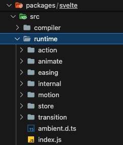
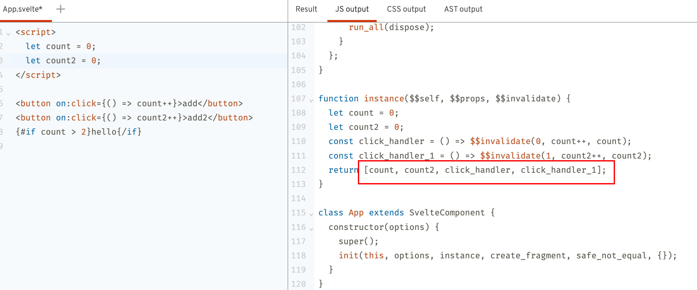

要了解Svelte的运行时逻辑，可以从它编译后的代码出发。我们在[REPL](https://svelte.dev/repl/hello-world?version=4.2.12)编写一个简易的程序。

```html
<script>
	let count = 0;
	const updateCount = () => {
		count++;
	}
</script>

<button on:click={updateCount}>add count</button> 
<p>count: {count}</p>
{#if count> 2}
	hello svelte!!!
{/if}
```

看下编译后的js代码：
```javascript
/* App.svelte generated by Svelte v4.2.12 */
import {
	SvelteComponent,
	append,
	detach,
	element,
	empty,
	init,
	insert,
	listen,
	noop,
	safe_not_equal,
	set_data,
	space,
	text
} from "svelte/internal";

import "svelte/internal/disclose-version";

function create_if_block(ctx) {
	let t;

	return {
		c() {
			t = text("hello svelte!!!");
		},
		m(target, anchor) {
			insert(target, t, anchor);
		},
		d(detaching) {
			if (detaching) {
				detach(t);
			}
		}
	};
}

function create_fragment(ctx) {
	let button;
	let t1;
	let p;
	let t2;
	let t3;
	let t4;
	let if_block_anchor;
	let mounted;
	let dispose;
	let if_block = /*count*/ ctx[0] > 2 && create_if_block(ctx);

	return {
		c() {
			button = element("button");
			button.textContent = "add count";
			t1 = space();
			p = element("p");
			t2 = text("count: ");
			t3 = text(/*count*/ ctx[0]);
			t4 = space();
			if (if_block) if_block.c();
			if_block_anchor = empty();
		},
		m(target, anchor) {
			insert(target, button, anchor);
			insert(target, t1, anchor);
			insert(target, p, anchor);
			append(p, t2);
			append(p, t3);
			insert(target, t4, anchor);
			if (if_block) if_block.m(target, anchor);
			insert(target, if_block_anchor, anchor);

			if (!mounted) {
				dispose = listen(button, "click", /*updateCount*/ ctx[1]);
				mounted = true;
			}
		},
		p(ctx, [dirty]) {
			if (dirty & /*count*/ 1) set_data(t3, /*count*/ ctx[0]);

			if (/*count*/ ctx[0] > 2) {
				if (if_block) {
					
				} else {
					if_block = create_if_block(ctx);
					if_block.c();
					if_block.m(if_block_anchor.parentNode, if_block_anchor);
				}
			} else if (if_block) {
				if_block.d(1);
				if_block = null;
			}
		},
		i: noop,
		o: noop,
		d(detaching) {
			if (detaching) {
				detach(button);
				detach(t1);
				detach(p);
				detach(t4);
				detach(if_block_anchor);
			}

			if (if_block) if_block.d(detaching);
			mounted = false;
			dispose();
		}
	};
}

function instance($$self, $$props, $$invalidate) {
	let count = 0;

	const updateCount = () => {
		$$invalidate(0, count++, count);
	};

	return [count, updateCount];
}

class App extends SvelteComponent {
	constructor(options) {
		super();
		init(this, options, instance, create_fragment, safe_not_equal, {});
	}
}

export default App;
```

我们理一下编译后的大体逻辑：
- 首先是建一个`SvelteComponent`类，该类由`svelte/internal`导出。在`SvelteComponent`类实例化时调用`init`方法。`init`方法中比较关键的参数有`instance`和`create_fragment`。
- `instance`是一个方法，里面有用于触发响应式更新的方法`$$invalidate`。
- `create_fragment`组件完整的生命周期，包含了创建、挂载、更新和卸载等。

我们所关注的运行时逻辑都在源码仓库的`packages/svelte/src/runtime`里。


## SvelteComponent

源码路径：`packages/svelte/src/runtime/internal/Component.js`
```javascript
export class SvelteComponent {
	$$ = undefined;
	$$set = undefined;
	$destroy() {}
	$on(type, callback) {}
	$set(props) {}
}
```

`SvelteComponent`中定义了一些属性和方法，在官网的[Client-side component API](https://svelte.dev/docs/client-side-component-api)中，有介绍这些方法的使用，我们集中关注`$$`这个属性，后面大量的数据会挂载到这个属性上。

## init
`init`方法，在组件初始化时执行的唯一方法，由`svelte/internal`导出。

源码路径：`packages/svelte/src/runtime/internal/Component.js`

```javascript
export function init(
	component,
	options,
	instance,
	create_fragment,
	not_equal,
	props,
	append_styles = null,
	dirty = [-1]
) {
	const parent_component = current_component;
	set_current_component(component);
	/** @type {import('./private.js').T$$} */
	const $$ = (component.$$ = {
		fragment: null,
		ctx: [],
		// state
		props,
		update: noop,
		not_equal,
		bound: blank_object(),
		// lifecycle
		on_mount: [],
		on_destroy: [],
		on_disconnect: [],
		before_update: [],
		after_update: [],
		context: new Map(options.context || (parent_component ? parent_component.$$.context : [])),
		// everything else
		callbacks: blank_object(),
		dirty,
		skip_bound: false,
		root: options.target || parent_component.$$.root
	});

	let ready = false;
	$$.ctx = instance
		? instance(component, options.props || {}, (i, ret, ...rest) => {
				const value = rest.length ? rest[0] : ret;
				if ($$.ctx && not_equal($$.ctx[i], ($$.ctx[i] = value))) {
					if (!$$.skip_bound && $$.bound[i]) $$.bound[i](value);
					if (ready) make_dirty(component, i);
				}
				return ret;
		  })
		: [];
	$$.update();
	ready = true;
	run_all($$.before_update);
	$$.fragment = create_fragment ? create_fragment($$.ctx) : false;
	if (options.target) {
		$$.fragment && $$.fragment.c();
		mount_component(component, options.target, options.anchor);
		flush();
	}
	set_current_component(parent_component);
}
```
这里笔者删除了一些无关代码，比如样式的添加，hydrate注水逻辑等。

先看下`init`接收的几个参数：
```javascript
init(
	component,
	options,
	instance,
	create_fragment,
	not_equal,
	props,
	append_styles = null,
	dirty = [-1]
) 
```
- component：组件实例，即组件初始化时传的this
- instance：外部传入的方法，内含数据更新逻辑
- create_fragment：外部传入的方法，组件的生命周期逻辑
- dirty：组件内的数据更新标识

init的逻辑：
- 进入`init`，首先设置当前组件为正在运行的组件，往组件的`$$`属性中挂载大量属性
- 执行`instance`方法，`instance`接收三个参数，第一个参数是组件实例，第三个参数是一个方法，其实它就是`$$invalidate`（待会分析），执行后将返回值挂载到`$$.ctx`。我们可以把`$$.ctx`理解为组件的上下文，每个组件都有自己的上下文，其中存储的是在`<script></script>`内定义的变量的值和涉及到变量更新的方法，Svelte会按照变量在组件内的声明顺序依次保存在`$$.ctx`数组当中，先保存变量，再变量方法。
- 进行更新，`run_all($$.before_update)`在`mount_component`之前，对应了我们在生命周期里了解到的第一次`beforeUpdate`是在`onMount`之前执行的。
- `create_fragment`创建组件的fragment，同时挂载到`$$.fragment`。`mount_component`挂载组件到页面上。
- 执行`flush`方法。
- 执行完这个组件的逻辑后，重置当前组件为父组件。

### instance

我们可以把`instance`方法是理解成是svelte实例的执行器，里面包含的是一个组件应该如何运行的逻辑。我们在Svelte组件中写在`<script></script>`里的代码，会被编译进`instance`方法内。每个组件在执行`init`初始化时，会调用一次`instance`方法形成自己的闭包，从而达到数据隔离的目的。

比如我们最开始的例子里：
```javascript
<script>
	let count = 0;
	const updateCount = () => {
		count++;
	}
</script>
```

被编译后，变成：
```javascript
function instance($$self, $$props, $$invalidate) {
	let count = 0;

	const updateCount = () => {
		$$invalidate(0, count++, count);
	};

	return [count, updateCount];
}
```

#### `$$invalidate`
```typescript
(i, ret, ...rest) => {
	const value = rest.length ? rest[0] : ret;
	if ($$.ctx && not_equal($$.ctx[i], $$.ctx[i] = value)) {
		if (ready) make_dirty(component, i);
	}
	return ret;
}
```
`$$invalidate`的逻辑：
- 首先是编译器将我们原来的赋值代码进行了更改，将`count++`转变成`$$invalidate(0, count++, count)`，看下`$$invalidate`的三个参数`(i, ret, ...rest)`：i表示是组件内的第几个变量，ret是表达式，`...rest`是剩余参数
- 首先是进行赋值`($$.ctx[i] = value)`，然后通过`not_equal`判断赋值前后的变量是否改变，如果改变了，通过`make_dirty`标记组件为dirty（非常关键！！！）

调用`$$invalidate`，会对某个改动的变量进行标记，然后在微任务中调用`flush`函数，根据变量改动的dirty标记进行局部更新。

##### make_dirty

源码路径：`packages/svelte/src/runtime/internal/Component.js`
```javascript
function make_dirty(component, i) {
	if (component.$$.dirty[0] === -1) {
		dirty_components.push(component);
		schedule_update();
		component.$$.dirty.fill(0);
	}
	component.$$.dirty[(i / 31) | 0] |= 1 << i % 31;
}
```

`make_dirty`的逻辑如下：
- 首先检查组件是否已经被标记为dirty。如果没有（Svelte中约定，`$$.dirty`数组的第一项如果是-1，则非dirty)，那么将组件添加到dirty_components数组中，并调度一个更新。
- 将组件的dirty标志位数组原来是`[-1]`的填充为`[0]`，既标记了组件是dirty状态，又方便后续的位运算操作
- 最后将参数i指定的部分标记为dirty，通过将dirty标志位数组的相应元素设置为1来实现的。终于轮到位运算上场！

###### schedule_update

```typescript
const resolved_promise = /* @__PURE__ */ Promise.resolve();
let update_scheduled = false;

export function schedule_update() {
	if (!update_scheduled) {
		update_scheduled = true;
		resolved_promise.then(flush);
	}
}
```
在`Promise.then`微任务中执行更新。
### create_fragment

`create_fragment`是Svelte文件编译后输出的一个方法，里面包含了组件具体的生命周期。
```javascript
function create_fragment(ctx) {
	let button;
	...
	let if_block = /*count*/ ctx[0] > 2 && create_if_block(ctx);

	return {
		c() {
			button = element("button");
			button.textContent = "add count";
			t1 = space();
			p = element("p");
			t2 = text("count: ");
			t3 = text(/*count*/ ctx[0]);
			...
		},
		m(target, anchor) {
			insert(target, button, anchor);
			...
			append(p, t2);
			...

			if (!mounted) {
				dispose = listen(button, "click", /*updateCount*/ ctx[1]);
				mounted = true;
			}
		},
		p(ctx, [dirty]) {
			if (dirty & /*count*/ 1) set_data(t3, /*count*/ ctx[0]);
		},
		d(detaching) {
			if (detaching) {
				detach(button);
				...
			}
		}
	};
}
```

`create_fragment`的逻辑：
- `create_fragment`接收一个参数ctx，我们通过前面知道，这个ctx就是`instance`方法执行后的返回值，ctx是一个数组，包含了数据和用于更新数据的方法，比如：


- `create_fragment`方法返回一个对象，这个对象内包含 `c,m,p,i,o,d`等特殊名称的函数，这些函数并非编译混淆，而是Fragment内部的生命周期缩写，这个对象会挂载到`$$.fragment`上。
```javascript
// 源码路径：packages/svelte/src/runtime/internal/private.d.ts
export interface Fragment {
	key: string | null;
	first: null;
	/* create  */ c: () => void;
	/* claim   */ l: (nodes: any) => void;
	/* hydrate */ h: () => void;
	/* mount   */ m: (target: HTMLElement, anchor: any) => void;
	/* update  */ p: (ctx: T$$['ctx'], dirty: T$$['dirty']) => void;
	/* measure */ r: () => void;
	/* fix     */ f: () => void;
	/* animate */ a: () => void;
	/* intro   */ i: (local: any) => void;
	/* outro   */ o: (local: any) => void;
	/* destroy */ d: (detaching: 0 | 1) => void;
}
```
- 在创建时，会调用封装好的`element`、`space`、`text`等方法；在挂在时调用`insert`、`append`等方法；在更新时，通过dirty数组中的值进行位运算，判断是否需要更新数据，还记得我们前面章节学习到的位运算的知识吗，在Svelte源码中，凡是涉及到dirty的地方，位运算无处不在；在卸载时调用`detach`等方法。

#### 封装

源码路径：`packages/svelte/src/runtime/internal/dom.js`
```typescript
export function append(target: Node, node: Node) {
	target.appendChild(node);
}

export function detach(node: Node) {
	if (node.parentNode) {
		node.parentNode.removeChild(node);
	}
}

export function element<K extends keyof HTMLElementTagNameMap>(name: K) {
	return document.createElement<K>(name);
}

export function insert(target: Node, node: Node, anchor?: Node) {
	target.insertBefore(node, anchor || null);
}

export function listen(node: EventTarget, event: string, handler: EventListenerOrEventListenerObject, options?: boolean | AddEventListenerOptions | EventListenerOptions) {
	node.addEventListener(event, handler, options);
	return () => node.removeEventListener(event, handler, options);
}

export function text(data: string) {
	return document.createTextNode(data);
}
```

### mount_component

源码路径：`packages/svelte/src/runtime/internal/Component.js`

```javascript
export function mount_component(component, target, anchor) {
	const { fragment, after_update } = component.$$;
	fragment && fragment.m(target, anchor);
	// onMount happens before the initial afterUpdate
	add_render_callback(() => {
		const new_on_destroy = component.$$.on_mount.map(run).filter(is_function);

		if (component.$$.on_destroy) {
			component.$$.on_destroy.push(...new_on_destroy);
		} else {
			run_all(new_on_destroy);
		}
		component.$$.on_mount = [];
	});
	after_update.forEach(add_render_callback);
}
```
调用fragment的`m()`方法，这里我们可以看到，会调用`onMount`方法，如果`onMount`有返回值，则相当于是`destroy`方法。

### flush

源码路径：`packages/svelte/src/runtime/internal/scheduler.js`

```javascript
let flushidx = 0;

export function flush() {
	if (flushidx !== 0) {
		return;
	}
	const saved_component = current_component;
	do {
		try {
			while (flushidx < dirty_components.length) {
				const component = dirty_components[flushidx];
				flushidx++;
				set_current_component(component);
				update(component.$$);
			}
		} catch (e) {
			dirty_components.length = 0;
			flushidx = 0;
			throw e;
		}
		set_current_component(null);
		dirty_components.length = 0;
		flushidx = 0;
		while (binding_callbacks.length) binding_callbacks.pop()();
		for (let i = 0; i < render_callbacks.length; i += 1) {
			const callback = render_callbacks[i];
			if (!seen_callbacks.has(callback)) {
				seen_callbacks.add(callback);
				callback();
			}
		}
		render_callbacks.length = 0;
	} while (dirty_components.length);
	while (flush_callbacks.length) {
		flush_callbacks.pop()();
	}
	update_scheduled = false;
	seen_callbacks.clear();
	set_current_component(saved_component);
}
```
`flush`函数的主要作用是更新和渲染组件，其步骤如下：
- 通过`flushidx !== 0`检查是否已经在更新脏组件，如果是则返回，避免无限循环。
- 先保存当前组件，然后在一个do-while循环中，首先调用`beforeUpdate`函数并更新组件。如果在更新过程中出现错误，会重置脏状态以避免死锁。
- 清空脏组件列表，重置`flushidx`，然后调用所有`bind:this`回调函数。
- 在组件更新后，调用`afterUpdate`函数。这可能会导致后续的更新，所以需要防止无限循环。之后清空渲染回调列表。
- 如果还有脏组件，重复上述步骤。
- 调用所有`flush`回调函数。清除已调用的回调函数列表。
- 恢复保存的当前组件。

这个函数的主要目的是确保所有的组件都被正确地更新和渲染，同时避免因为错误或无限循环导致的问题。

#### update
```typescript
function update($$) {
	if ($$.fragment !== null) {
		$$.update();
		run_all($$.before_update);
		const dirty = $$.dirty;
		$$.dirty = [-1];
		$$.fragment && $$.fragment.p($$.ctx, dirty);

		$$.after_update.forEach(add_render_callback);
	}
}
```

一言蔽之，就是把需要更新的组件给更新了。调用 `$$.update`,调用组件里的`$$.fragment.p`方法，执行`$$.after_update`的回调。

## 更新流程

我们重新整理下组件的更新逻辑：
- 用户执行具体操作触发更新流程
- 在instance的`$$invalidate`方法中，通过`not_equal`比较操作前后`$$.ctx`中的值是否发生了改变，如果发生改变则继续执行`make_dirty`
- 执行`make_dirty`函数标记为脏值，添加带有脏值需要更新的组件，从而继续触发更新
- 执行`schedule_update`函数
- 执行`flush`函数，取出所有的脏值组件，执行update方法`update(component.$$)`
- 在`update`方法中，执行的是组件的`fragment.p`方法，p方法的逻辑就是确定需要更新组件，并操作和更新dom组件，从而完成了最后的流程

我们用以下例子来进行说明：
```html
<script>
  let count = 0;
  let count2 = 0;
</script>

<button on:click={() => count++}>add</button>
<button on:click={() => count2++}>add2</button>
{count} {count2}
```

它的编译结果如下：
```javascript
/* App.svelte generated by Svelte v4.2.12 */
import {
	...
} from "svelte/internal";

function create_fragment(ctx) {
	...

	return {
		c() {
			button0 = element("button");
			button0.textContent = "add";
			t1 = space();
			button1 = element("button");
			button1.textContent = "add2";
			t3 = space();
			t4 = text(/*count*/ ctx[0]);
			t5 = space();
			t6 = text(/*count2*/ ctx[1]);
		},
		m(target, anchor) {
			...

			if (!mounted) {
				dispose = [
					listen(button0, "click", /*click_handler*/ ctx[2]),
					listen(button1, "click", /*click_handler_1*/ ctx[3])
				];

				mounted = true;
			}
		},
		p(ctx, [dirty]) {
			if (dirty & /*count*/ 1) set_data(t4, /*count*/ ctx[0]);
			if (dirty & /*count2*/ 2) set_data(t6, /*count2*/ ctx[1]);
		},
		i: noop,
		o: noop,
		d(detaching) {
			...
		}
	};
}

function instance($$self, $$props, $$invalidate) {
	let count = 0;
	let count2 = 0;
	const click_handler = () => $$invalidate(0, count++, count);
	const click_handler_1 = () => $$invalidate(1, count2++, count2);
	return [count, count2, click_handler, click_handler_1];
}

class App extends SvelteComponent {
	constructor(options) {
		super();
		init(this, options, instance, create_fragment, safe_not_equal, {});
	}
}

export default App;
```

- 当我们点击按钮1时，执行`click_handler`方法，内部调用`$$invalidate(0, count++, count)`
- `$$invalidate`内部执行`not_equal($$.ctx[i], $$.ctx[i] = value)`，i此时是0，`$$.ctx[0]`是0，执行`$$.ctx[0] = 1`之后，和原来的值不一样，执行`make_dirty`
- 首先是初始`dirty[0]`是-1，先填充为`dirty.fill(0)`，变成`dirty[0]`是0。执行`component.$$.dirty[(i / 31) | 0] |= 1 << i % 31`，`0 % 31`是0，`1<<0`仍是1，`(0 / 31) | 0`得到0，我们需要注意`component.$$.dirty[xxx] |= xxx`中间是一个位或运算。`0 | 1`得到1，最终`component.$$.dirty[0] = 1`。
- 微任务中执行`schedule_update`里的逻辑，调用`fragment.p`方法，此时`[dirty]`数组是`[1]`，`1 && 1`是1，能够执行`set_data(t4, /*count*/ ctx[0])`，`set_data`方法内通过设置`document.createTextNode().data`的值来更新页面的展示。`1 & 2`是0，不执行`set_data(t6, /*count2*/ ctx[1])`。之后`dirty`数组重新变成`[-1]`
```javascript
p(ctx, [dirty]) {
	if (dirty & /*count*/ 1) set_data(t4, /*count*/ ctx[0]);
	if (dirty & /*count2*/ 2) set_data(t6, /*count2*/ ctx[1]);
}
```

- 当点击按钮2时，执行`click_handler`方法，内部调用`$$invalidate(1, count++, count)`
- `$$invalidate`内部执行`not_equal($$.ctx[i], $$.ctx[i] = value)`，i此时是1，`$$.ctx[1]`是1，执行`$$.ctx[1] = 1`之后，和原来的值不一样，执行`make_dirty`
-  依旧是初始`dirty[0]`是-1，先填充为`dirty.fill(0)`，变成`dirty[0]`是0。执行`component.$$.dirty[(i / 31) | 0] |= 1 << i % 31`，`1 % 31`是1，`1<<1`是2，`(1 / 31) | 0`得到0，`0 | 2`得到2，最终`component.$$.dirty[0] = 2`。
- 执行`schedule_update`，调用`fragment.p`方法，此时`[dirty]`数组是`[2]`，`2 && 2`是1，能够执行`set_data(t6, /*count2*/ ctx[1])`，`2 & 1`是0，不执行`set_data(t4, /*count*/ ctx[0])`

## 小结

本章我们学习了：
- `SvelteComponent`的基本功能
- `init`方法的基本功能
- `instance`方法的基本功能，它就是把我们在`<script></script>`中定义的更新数据的方法包裹起来，然后编译成新的更新语句，同时返回一个数组，`ctx`会接收这个数组的值。
- `$$invalidate`的基本逻辑，触发更新操作的关键方法
- `make_dirty`的基本逻辑，里面有位运算的运用
- `create_fragment`的基本功能，里面包含了一个组件的基本生命周期方法
- dom操作的封装
- Svelte文件被编译后，数据更新的大体流程。
