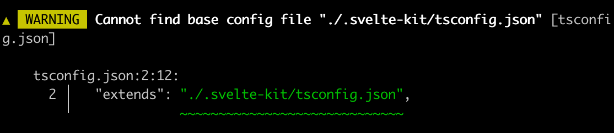

本章笔者将演示Svelte从编译到运行的整体流程。

这里笔者使用的Node版本为`18.15.0`。

首先我们下载源码，然后把版本分支切换到`4.2.12`分支。
```bash
git clone git@github.com:sveltejs/svelte.git
```

TODO: 展示项目整体目录

TODO: 跑不起来的解决
```bash
svelte-kit sync
```

```bash
pnpm add --force @img/sharp-darwin-arm64
```
请读者朋友们结合本章内容和源码对比阅读，效果更佳。

## compile阶段

参照`svelte-loader`中的[逻辑](https://github.com/sveltejs/svelte-loader/blob/master/index.js):
```javascript
svelte.preprocess(source, options.preprocess).then(processed => {
  if (processed.dependencies && this.addDependency) {
    for (let dependency of processed.dependencies) {
      this.addDependency(dependency);
    }
  }

  if (processed.map) compileOptions.sourcemap = processed.map;

  const compiled = svelte.compile(processed.toString(), compileOptions);
  let { js, css, warnings } = compiled;

  callback(null, js.code, js.map);
})
```
首先Svelte文件经过预处理，比如像要添加typescript支持等，然后调用`compile`，最后返回`js.code`。


为了简单直观地查看到各个阶段的执行结果，我们在网站首页`sites/svelte.dev/src/routes/+layout.svelte`直接引入svelte编译器文件：
```diff
  import '@sveltejs/site-kit/styles/index.css';

  import { browser } from '$app/environment';
  import { page } from '$app/stores';
  import { Icon, Shell, Banners } from '@sveltejs/site-kit/components';
  import { Nav, Separator } from '@sveltejs/site-kit/nav';
  import { Search, SearchBox } from '@sveltejs/site-kit/search';
+ import { compile, preprocess } from '../../../../packages/svelte/src/compiler';
```

然后我们仿照`svelte-loader`的逻辑，先调用`preprocess`，然后把预处理的结果打印出来，因为我们本次重点在编译和运行，所以我们只是打印经过`preprocess`后的结果，在`compile`阶段，我们直接传入Svelte文件的字符串内容。
```javascript
let str = `<script>
  let count = 0;
  const addCount = () => {
    count++;
  }
<\/script>

<button on:click={addCount}>add</button>
count:{count}
`;
preprocess(str, {}).then(preResult => {
  console.log('preprocess result', preResult);
  let result = compile(str);
  console.log('compile result', result);
});
```

进入到网站目录`cd sites/svelte.dev`，执行`pnpm run dev`把网站跑起来，在控制台中查看打印结果：


### parse
`compile(str)`的内部逻辑首先是`parse`，地址：`packages/svelte/src/compiler/compile/index.js`。
```javascript
  console.log('svelte before parse', source);
  const ast = parse(source, options);
  console.log('svelte after parse', ast);
```

  
`source`即是我们的模板字符串，即Svelte文件的内容。

  
经过转换后得到ast对象
```javascript
ast = {
  css: {}
  html: {},
  instance: {},
  module: {}
}
```

点击`parse`，进入到`packages/svelte/src/compiler/parse/index.js`。  
`parse`内部有个`Parser`类，通过实例化该类，对模板字符串文件进行解析。
```javascript
const parser = new Parser(template, options);
```

`Parser`内部则通过四种不同的类型的节点解析器，分别是`fragment`、`tag`、`mustache`和`text`。通过遍历文件的字符串内容，轮流调用这几个方法。

首先，我们没有使用`<style></style>`标签，忽略css解析的步骤。  
在初始化时，默认的html内容整体的type是`Fragment`。把解析后的html数据存储到`this.html`中

```javascript
this.html = {
  start: null,
  end: null,
  type: 'Fragment',
  children: []
};
```

开始解析我们的Svelte文件内容，最开始解析`<script>...`的最左侧`<`，符合`tag`的解析。
```javascript
if (parser.match('<')) {
  return tag;
}
```

点击`tag`，进入`packages/svelte/src/compiler/parse/state/tag.js`。很明显，`script`符合以下逻辑：
```javascript
const specials = new Map([
  [
    'script',
    {
      read: read_script,
      property: 'js'
    }
  ],
  [
    'style',
    {
      read: read_style,
      property: 'css'
    }
  ]
]);
```

调用`read_script`：
```javascript
export default function read_script(parser, start, attributes) {
  ...
  let ast;
  try {
    ast = acorn.parse(source);
  } catch (err) {
    parser.acorn_error(err);
  }
  ...
  return {
    type: 'Script',
    start,
    end: parser.index,
    context: get_context(parser, attributes, start),
    content: ast
  };
}
```

点击`acorn.parse`，我们看到里面的核心便是调用`code-read`的`parse`来解析js的内容：
```javascript
export const parse = (source) =>
  code_red.parse(source, {
    sourceType: 'module',
    ecmaVersion: 13,
    locations: true
  });
```

这部分便是ast对象中的instance属性中的内容：
  
到这里我们已经完成了对`<script>...</script>`标签内容的解析

接下来是重点处理的html的内容。

`<script></script>`解析完成之后，我们遇到了一个空行，空字符串也不能忽略，继续用fragment方法判断。
```javascript
export default function fragment(parser) {
  ...

  return text;
}
```
使用`text`方法来解析这个空行内容。返回的格式：
```javascript
export default function text(parser) {
  ...

  const node = {
    start,
    end: parser.index,
    type: 'Text',
    raw: data,
    data: decode_character_references(data, false)
  };

  parser.current().children.push(node);
}
```


空行解析完成，我们遇到了`<button>`标签，此时仍旧是调用`fragment`中的`tag`方法。
```javascript
const type = meta_tags.has(name)
    ? meta_tags.get(name)
    : regex_capital_letter.test(name[0]) || name === 'svelte:self' || name === 'svelte:component'
    ? 'InlineComponent'
    : name === 'svelte:fragment'
    ? 'SlotTemplate'
    : name === 'title' && parent_is_head(parser.stack)
    ? 'Title'
    : name === 'slot'
    ? 'Slot'
    : 'Element';

const element = {
  start,
  end: null,
  type,
  name,
  attributes: [],
  children: []
};
```
我们遇到的不是`<script>`、`<style>`此类标签，也不是Svelte的自定义标签，最后得到的是`Element`type。

之后开始读取标签内属性的内容：
```javascript
while ((attribute = read_attribute(parser, unique_names, is_top_level_script_or_style))) {
  element.attributes.push(attribute);
  parser.allow_whitespace();
}
```

```javascript
const name = parser.read_until(regex_token_ending_character);
if (!name) return null;
let end = parser.index;
parser.allow_whitespace();
const colon_index = name.indexOf(':');
const type = colon_index !== -1 && get_directive_type(name.slice(0, colon_index));
```

`parser.read_until`读取到`on:click`：
```javascript
function get_directive_type(name) {
  if (name === 'use') return 'Action';
  if (name === 'animate') return 'Animation';
  if (name === 'bind') return 'Binding';
  if (name === 'class') return 'Class';
  if (name === 'style') return 'StyleDirective';
  if (name === 'on') return 'EventHandler';
  if (name === 'let') return 'Let';
  if (name === 'in' || name === 'out' || name === 'transition') return 'Transition';
}
```
通过`get_directive_type`来得到attribute的type是`EventHandler`类型。

通过`read_attribute_value`来获取`on:click={}`中`{}`内的值。
```javascript
if (parser.eat('=')) {
  parser.allow_whitespace();
  value = read_attribute_value(parser, is_static);
  end = parser.index;
} 
```

在`read_attribute_value`内部调用`read_sequence`：
```javascript
try {
  value = read_sequence(
    parser,
    () => {
      // handle common case of quote marks existing outside of regex for performance reasons
      if (quote_mark) return parser.match(quote_mark);
      return !!parser.match_regex(regex_starts_with_invalid_attr_value);
    },
    'in attribute value'
  );
} 
```

而`read_sequence`内部则调用`read_expression(parser);`，深挖其核心逻辑，最终是调用`code-red`的`parseExpressionAt`来解析`{}`的内容，将这部分内容赋值到`expression`属性中。

```javascript
import * as code_red from 'code-red';

export const parse_expression_at = (source, index) =>
code_red.parseExpressionAt(source, index, {
  sourceType: 'module',
  ecmaVersion: 13,
  locations: true
});
```


此时我们已经解析到`<button on:click={addCount}>`。

接着往下，这个`Element`type的children值只有一个节点，那就是add文案所代表的Text节点
  
之后我们算是已经解析到`</button>`。

接着往下我们遇到`count:`，同样是`Text`节点。


接着遇到`{`，继续调用`fragment`内的`mustache`方法，解析得到`MustacheTag`类型的节点。
```javascript
const expression = read_expression(parser);
parser.allow_whitespace();
parser.eat('}', true);
parser.current().children.push({
  start,
  end: parser.index,
  type: 'MustacheTag',
  expression
});
```


### Component
执行完`const ast = parse(source, options);`后，我们进入下一步：
```javascript
const component = new Component(
  ast,
  source,
  options.name || get_name_from_filename(options.filename) || 'Component',
  options,
  stats,
  warnings
);
```

`Component`中几个关键的步骤：
```javascript
this.walk_module_js();
this.walk_instance_js_pre_template();
this.fragment = new Fragment(this, ast.html);
this.walk_instance_js_post_template();
```
我们没有声明过`context='module'`的script内容，所以跳过`walk_module_js`。

在`walk_instance_js_pre_template`中调用`create_scopes`来解析script标签内的作用域：
```javascript
const { scope: instance_scope, map, globals } = create_scopes(script.content);
```
可以把这些变量打印出来看下`console.log('svelte Component walk_instance_js_pre_template', instance_scope, map, globals);`

`create_scopes`内部是使用了`periscopic`的`analyse`方法。
```javascript
import { analyze, Scope, extract_names, extract_identifiers } from 'periscopic';

/**
 * @param {import('estree').Node} expression
 */
export function create_scopes(expression) {
  return analyze(expression);
}
```


调用`this.add_var()`将变量存入`vars`中：
```javascript
add_var(node, variable, add_to_lookup = true) {
  this.vars.push(variable);
  if (add_to_lookup) {
    if (this.var_lookup.has(variable.name)) {
      const exists_var = this.var_lookup.get(variable.name);
      if (exists_var.module && exists_var.imported) {
        this.error(/** @type {any} */ (node), compiler_errors.illegal_variable_declaration);
      }
    }
    this.var_lookup.set(variable.name, variable);
  }
}
```

打印出来看下：
```diff
  this.walk_instance_js_pre_template();
+ console.log('svelte Component this', this);
```


执行完`this.walk_instance_js_pre_template();`，继续下一步：
```javascript
this.fragment = new Fragment(this, ast.html);
```

`Fragment`内部，执行`map_children`方法：
```javascript
export default class Fragment extends Node {
  constructor(component, info) {
    const scope = new TemplateScope();
    super(component, null, scope, info);
    this.scope = scope;
    this.children = map_children(component, this, scope, info.children);
  }
}
```

```diff
  this.children = map_children(component, this, scope, info.children);
+ console.log('svelte Fragment children', this.children);
```


把数组的每项展开看下：


`map_children`的作用是将ast中的节点进行转换。

执行完`new Fragment()`，继续下一步：
```javascript
walk_instance_js_post_template() {
  const script = this.ast.instance;
  if (!script) return;
  this.post_template_walk();
  this.hoist_instance_declarations();
  this.extract_reactive_declarations();
  this.check_if_tags_content_dynamic();
}
```
执行`walk_instance_js_post_template`中的`this.post_template_walk`
walk的content就是ast.instance.content的内容。
```javascript
post_template_walk() {
  const script = this.ast.instance;
  if (!script) return;
  const component = this;
  const { content } = script;

  ...

  walk(content, {
    enter(node, parent, prop, index) {},
    leave(node) {}
  })
}
```

把content打印出来看下：


这个`walk_instance_js_post_template`的主要作用是：
对节点进行一些额外的检查，例如检查是否有未关闭的标签，是否有不合法的属性等。
对节点进行一些优化，例如移除不必要的空白节点，合并连续的文本节点等。
收集一些信息，例如收集所有使用的组件，收集所有的依赖等。

```diff
const component = new Component(
  ast,
  source,
  options.name || get_name_from_filename(options.filename) || 'Component',
  options,
  stats,
  warnings
);
+  console.log('svelte component', component);
```
把`new Component()`的结果打印出来看下：


### render_dom
往下执行`render_dom`，查看下`render_dom`的执行逻辑：
```javascript
const result =
  options.generate === false
    ? null
    : options.generate === 'ssr'
    ? render_ssr(component, options)
    : render_dom(component, options);
```
点击`render_dom`进入内部，内部有个`Renderer`：
```javascript
const renderer = new Renderer(component, options);
```

`Renderer`内部：
```javascript
this.block = new Block({
  renderer: this,
  name: null,
  type: 'component',
  key: null,
  bindings: new Map(),
  dependencies: new Set()
});
this.block.has_update_method = true;
this.fragment = new FragmentWrapper(
  this,
  this.block,
  component.fragment.children,
  null,
  true,
  null
);
this.fragment.render(this.block, null, /** @type {import('estree').Identifier} */ (x`#nodes`));
```

看下`Block`的实现，`Block`的`constructor`如下：
```javascript
constructor(options) {
  this.parent = options.parent;
  this.renderer = options.renderer;
  this.name = options.name;
  this.type = options.type;
  this.comment = options.comment;
  this.wrappers = [];
  // for keyed each blocks
  this.key = options.key;
  this.first = null;
  this.bindings = options.bindings;
  this.chunks = {
    declarations: [],
    init: [],
    create: [],
    claim: [],
    hydrate: [],
    mount: [],
    measure: [],
    restore_measurements: [],
    fix: [],
    animate: [],
    intro: [],
    update: [],
    outro: [],
    destroy: []
  };
  this.has_animation = false;
  this.has_intro_method = false; // a block could have an intro method but not intro transitions, e.g. if a sibling block has intros
  this.has_outro_method = false;
  this.outros = 0;
  this.get_unique_name = this.renderer.component.get_unique_name_maker();
  this.aliases = new Map();
  if (this.key) this.aliases.set('key', this.get_unique_name('key'));
}
```

用来表示一个代码块的类，它包含了一些关于这个代码块的信息，例如它的类型，它的依赖，它的绑定等。

了解完`Block`，下一步`FragmentWrapper`：
```javascript
this.fragment = new FragmentWrapper(
  this,
  this.block,
  component.fragment.children,
  null,
  true,
  null
);
```
Svelte内部用来表示一个模板片段的类，它包含了一些关于这个模板片段的信息，例如它的子节点，它的父节点等。

继续下一步：
```javascript
this.fragment.render(this.block, null, /** @type {import('estree').Identifier} */ (x`#nodes`));
```

就是`FragmentWrapper`内部的`render`方法：
```javascript
render(block, parent_node, parent_nodes) {
  for (let i = 0; i < this.nodes.length; i += 1) {
    this.nodes[i].render(block, parent_node, parent_nodes);
  }
}
```


这里的nodes是调用各个类型的wrapper实例化后的对象，每个wrapper类有自己的render方法：
```javascript
const wrappers = {
  AwaitBlock,
  Body,
  Comment,
  DebugTag,
  Document,
  EachBlock,
  Element,
  Head,
  IfBlock,
  InlineComponent,
  KeyBlock,
  MustacheTag,
  Options: null,
  RawMustacheTag,
  Slot,
  SlotTemplate,
  Text,
  Title,
  Window
};
```

Text Wrapper`packages/svelte/src/compiler/compile/render_dom/wrappers/Text.js`
```javascript
render(block, parent_node, parent_nodes) {
  if (this.skip) return;
  const use_space = this.use_space();
  const string_literal = {
    type: 'Literal',
    value: this.data,
    loc: {
        start: this.renderer.locate(this.node.start),
        end: this.renderer.locate(this.node.end)
    }
  };
  block.add_element(
    this.var,
    use_space ? x`@space()` : x`@text(${string_literal})`,
    parent_nodes &&
        (use_space
          ? x`@claim_space(${parent_nodes})`
          : x`@claim_text(${parent_nodes}, ${string_literal})`),
    /** @type {import('estree').Identifier} */ (parent_node)
  );
}
```

这里调用了code-red的x方法。

```diff
+ console.log('svelte text wrapper render', x`@text(${string_literal})`);
    block.add_element(
      this.var,
      use_space ? x`@space()` : x`@text(${string_literal})`,
      ...
```



Element的render方法
```
render(block, parent_node, parent_nodes) {
    if (this.child_dynamic_element) {
      this.render_dynamic_element(block, parent_node, parent_nodes);
    } else {
      this.render_element(block, parent_node, parent_nodes);
    }
  }
```

render_element
```javascript
render_element(block, parent_node, parent_nodes) {
    const { renderer } = this;
    const hydratable = renderer.options.hydratable;
    if (this.node.name === 'noscript') return;
    const node = this.var;
    const nodes = parent_nodes && block.get_unique_name(`${this.var.name}_nodes`);
    const children = x`@children(${this.node.name === 'template' ? x`${node}.content` : node})`;
    block.add_variable(node);
    const render_statement = this.get_render_statement(block);
    block.chunks.create.push(b`${node} = ${render_statement};`);
    const { can_use_textcontent, can_optimise_to_html_string, can_optimise_hydration } = this.node;
    ...
    if (parent_node) {
      ...
    } else {
      const insert = b`@insert(#target, ${node}, #anchor);`;
      ((insert[0]).expression).callee.loc = {
        start: this.renderer.locate(this.node.start),
        end: this.renderer.locate(this.node.end)
      };
      block.chunks.mount.push(insert);
      block.chunks.destroy.push(b`if (detaching) @detach(${node});`);
    }
    if (can_optimise_to_html_string && (!hydratable || can_optimise_hydration)) {
      if (this.fragment.nodes.length === 1 && this.fragment.nodes[0].node.type === 'Text') {
        /** @type {import('estree').Node} */
        let text = string_literal(
          /** @type {import('../Text.js').default} */ (this.fragment.nodes[0]).data
        );
        ...
        block.chunks.create.push(b`${node}.textContent = ${text};`);
        ...
      } else {
        ...
      }
    } else {
      ...
    }
    
    ...
    block.renderer.dirty(this.node.tag_expr.dynamic_dependencies());
  }
```

```diff
const node = this.var;
    const nodes = parent_nodes && block.get_unique_name(`${this.var.name}_nodes`); // if we're in unclaimable territory, i.e. <head>, parent_nodes is null
    const children = x`@children(${this.node.name === 'template' ? x`${node}.content` : node})`;
    block.add_variable(node);
+    console.log('svelte render_element children', children);
    const render_statement = this.get_render_statement(block);
```


```diff
    const insert = b`@insert(#target, ${node}, #anchor);`;
      /** @type {import('estree').CallExpression} */ (
        /** @type {import('estree').ExpressionStatement} */ (insert[0]).expression
      ).callee.loc = {
        start: this.renderer.locate(this.node.start),
        end: this.renderer.locate(this.node.end)
      };
      block.chunks.mount.push(insert);
      // TODO we eventually need to consider what happens to elements
      // that belong to the same outgroup as an outroing element...
      block.chunks.destroy.push(b`if (detaching) @detach(${node});`);
+      console.log('svelte render_element insert', insert, node, b`if (detaching) @detach(${node});`)
```


```
this.fragment.nodes.forEach((child) => {
        child.render(block, this.node.name === 'template' ? x`${node}.content` : node, nodes, {
          element_data_name: this.element_data_name
        });
      });
```
依次调用render方法

MustachTag的render方法
```javascript
render(block, parent_node, parent_nodes, data) {
    const contenteditable_attributes =
      this.parent instanceof ElementWrapper &&
      this.parent.attributes.filter((a) => a.node.name === 'contenteditable');
    const spread_attributes =
      this.parent instanceof ElementWrapper &&
      this.parent.attributes.filter((a) => a.node.is_spread);

    ...
    const { init } = this.rename_this_method(block, (value) => {
      if (contenteditable_attr_value) {
        ...
      } else {
        return x`@set_data(${this.var}, ${value})`;
      }
    });
    block.add_element(
      this.var,
      x`@text(${init})`,
      parent_nodes && x`@claim_text(${parent_nodes}, ${init})`,
      parent_node
    );
  }
```

```diff
const { init } = this.rename_this_method(block, (value) => {
      if (contenteditable_attr_value) {
        if (contenteditable_attr_value === true) {
          return x`@set_data_contenteditable(${this.var}, ${value})`;
        } else {
          return x`@set_data_maybe_contenteditable(${this.var}, ${value}, ${contenteditable_attr_value})`;
        }
      } else {
+        console.log('svelte mustachetag rename_this_method', x`@set_data(${this.var}, ${value})`, this.var, value);
        return x`@set_data(${this.var}, ${value})`;
      }
    });
```


返回到`packages/svelte/src/compiler/compile/render_dom/index.js`
```diff
export default function dom(component, options) {
  const { name } = component;
  const renderer = new Renderer(component, options);
+  console.log('svelte renderer', renderer);
  const { block } = renderer;
  ...
```


在刚才查看各个render方法时，我们注意到它一直在操作block.chunk，现在我们可以看到上面的`create`、`mount`、`update`和`destroy`上的逻辑代码已准备就绪。我们也知道了`render_dom`的主要作用就是把代码转化成能真正挂载到页面上的节点，同时处理了页面的各个生命周期。

render_dom中一段非常重要的解析
```javascript
walk(component.ast.instance.content, {
      enter(node) {
        ...
      },
      leave(node) {
        if (map.has(node)) {
          scope = scope.parent;
        }
        if (execution_context === node) {
          execution_context = null;
        }
        if (node.type === 'AssignmentExpression' || node.type === 'UpdateExpression') {
          const assignee = node.type === 'AssignmentExpression' ? node.left : node.argument;
          // normally (`a = 1`, `b.c = 2`), there'll be a single name
          // (a or b). In destructuring cases (`[d, e] = [e, d]`) there
          // may be more, in which case we need to tack the extra ones
          // onto the initial function call
          const names = new Set(extract_names(/** @type {import('estree').Node} */ (assignee)));
          this.replace(invalidate(renderer, scope, node, names, execution_context === null));
        }
      }
    });
```
大家对`this.replace`还有印象吗？不错，我们在《库》章节演示estree-walk时演示过这个方法，`this.replace(invalidate(renderer, scope, node, names, execution_context === null))`对Svelte文件中涉及到更新的代码进行替换，替换成`$$invalidate`相关形式的代码。

`packages/svelte/src/compiler/compile/render_dom/invalidate.js`
```diff
invalidate = x`$$invalidate(${
      renderer.context_lookup.get(head.name).index
    }, ${node}, ${extra_args})`;
+    console.log('svelte invalidate', invalidate, renderer.context_lookup, node);
```


继续回到render_dom方法
```
const has_create_fragment = component.compile_options.dev || block.has_content();
  if (has_create_fragment) {
    body.push(b`
      function create_fragment(#ctx) {
        ${block.get_contents()}
      }
    `);
  }
```
很明显，这段就是到时会编译到页面上的`create_fragment`方法。我们可以把block.get_contents打印出来看一下

笔者之前都是使用console.log这种粗暴直接的方法来进行演示，一是快速直接，二是在控制台中打印出数据的全貌便于浏览。如果读者对断点调试得心应手，也可像上图般对各个关键节点进行打断点调试。

```
const condition =
        !uses_rest_or_props && writable.length > 0 && renderer.dirty(writable, true);
      let statement = d.node;
      if (condition)
        statement = /** @type {import('estree').Statement} */ (
          b`if (${condition}) { ${statement} }`[0]
        );
```
此段代码是用来编译条件判断ifblock的展示。

```javascript
body.push(b`
      function ${definition}(${args}) {
        ${injected.map((name) => b`let ${name};`)}

        ${rest}

        ${reactive_store_declarations}

        ${reactive_store_subscriptions}

        ${resubscribable_reactive_store_unsubscribers}

        ${
          component.slots.size || component.compile_options.dev || uses_slots
            ? b`let { $$slots: #slots = {}, $$scope } = $$props;`
            : null
        }
        ...

        ${instance_javascript}

        ...

        ${/* before reactive declarations */ props_inject}

        ${
          reactive_declarations.length > 0 &&
          b`
        $$self.$$.update = () => {
          ${reactive_declarations}
        };
        `
        }

        ...

        return ${return_value};
      }
    `);
```
我们把definition和args打印出来看下

从打印结果我们能够推断出，这段代码编译后对应的是`function instance(){}`

```javascript
const superclass = {
    type: 'Identifier',
    name: options.dev ? '@SvelteComponentDev' : '@SvelteComponent'
  };
  ...
  const declaration = /** @type {import('estree').ClassDeclaration} */ (
    b`
    class ${name} extends ${superclass} {
      constructor(options) {
        super(${options.dev && 'options'});
        @init(this, options, ${definition}, ${
      has_create_fragment ? 'create_fragment' : 'null'
    }, ${not_equal}, ${prop_indexes}, ${optional_parameters});
        ${
          options.dev &&
          b`@dispatch_dev("SvelteRegisterComponent", { component: this, tagName: "${name.name}", options, id: create_fragment.name });`
        }
      }
    }
  `[0]
  );
  push_array(declaration.body.body, accessors);
  body.push(/** @type {any} */ (declaration));
```
这段代码则对应编译后的组件的类`class X extends SvelteComponent {}`

```diff
const result =
    options.generate === false
      ? null
      : options.generate === 'ssr'
      ? render_ssr(component, options)
      : render_dom(component, options);
+  console.log('svelte compile result', result);
```


### generate
终于来到编译的最后一步。

```javascript
generate(result) {
    let js = null;
    let css = null;
    if (result) {

      /** @type {any} */
      const program = { type: 'Program', body: result.js };
      walk(program, {
        enter: (node, parent, key) => {
          if (node.type === 'Identifier') {
            ...
          }
        }
      });
      ...
      create_module(
        program,
        name,
        banner,
        compile_options.sveltePath,
        imported_helpers,
        referenced_globals,
        this.imports,
        this.vars
          .filter((variable) => variable.module && variable.export_name)
          .map((variable) => ({
            name: variable.name,
            as: variable.export_name
          })),
        this.exports_from
      );
      const js_sourcemap_enabled = check_enable_sourcemap(compile_options.enableSourcemap, 'js');
      if (!js_sourcemap_enabled) {
        js = print(program);
        js.map = null;
      } else {
        ...
      }
    }
    return {
      js,
      css,
      ast: this.original_ast,
      warnings: this.warnings,
      vars: this.get_vars_report(),
      stats: this.stats.render()
    };
  }
```

create_module方法
```javascript
export default function create_module(
  program,
  name,
  banner,
  svelte_path = 'svelte',
  helpers,
  globals,
  imports,
  module_exports,
  exports_from
) {
  const internal_path = `${svelte_path}/internal`;
  helpers.sort((a, b) => (a.name < b.name ? -1 : 1));
  globals.sort((a, b) => (a.name < b.name ? -1 : 1));
  return esm(
    program,
    name,
    banner,
    svelte_path,
    internal_path,
    helpers,
    globals,
    imports,
    module_exports,
    exports_from
  );
}

function esm(
  program,
  name,
  banner,
  svelte_path,
  internal_path,
  helpers,
  globals,
  imports,
  module_exports,
  exports_from
) {
  const import_declaration = {
    type: 'ImportDeclaration',
    specifiers: helpers.map((h) => ({
      type: 'ImportSpecifier',
      local: h.alias,
      imported: { type: 'Identifier', name: h.name }
    })),
    source: { type: 'Literal', value: internal_path }
  };

  ...

  program.body = b`
    /* ${banner} */

    ${import_declaration}
    ${internal_globals}
    ${imports}
    ${exports_from}

    ${program.body}

    export default ${name};
    ${exports}
  `;
}

```
核心就是编译生成页面最终的import和export部分的内容


我们尝试把import部分的代码变量打印出来看下：
```diff
const import_declaration = {
    type: 'ImportDeclaration',
    specifiers: helpers.map((h) => ({
      type: 'ImportSpecifier',
      local: h.alias,
      imported: { type: 'Identifier', name: h.name }
    })),
    source: { type: 'Literal', value: internal_path }
  };
+  console.log('svelte import_declaration', import_declaration, helpers);
```


最后经过code-red的`print`方法生成最终的js代码
```
if (!js_sourcemap_enabled) {
        js = print(program);
        js.map = null;
      } 
```

```diff
const result =
    options.generate === false
      ? null
      : options.generate === 'ssr'
      ? render_ssr(component, options)
      : render_dom(component, options);
+  console.log('svelte final code',
+    component.generate(result),
+    component.generate(result).js.code
+  );
```


回看svelte-loader的代码，同样是返回js.code的代码。
`https://github.com/sveltejs/svelte-loader/blob/master/index.js`


## runtime

 TODO: 重画

我们把在编译后得到的js代码复制进一个文件中`index.js`。
在svelte源码项目目录下新建一个目录叫`test-runtime`，新建一个index.html：
```html
<div id="app"></div>
<script type="module" src="./index.js"></script>
```


修改index.js的两处地方，
一是把引用`svelte/internal`的路径进行调整`../packages/svelte/src/runtime/internal`；
二是注释最下面一行的`export default Component`，改成：
```javascript
new Component({
  target: document.querySelector('#app')
})
```

安装vite，然后把项目跑起来。


在runtime阶段，我们主要观察数据是如何更新的。

首先是当我们点击button时
```
if (!mounted) {
        dispose = listen(button, "click", /*addCount*/ ctx[1]);
        mounted = true;
      }
```
这里click绑定的监听方法是`ctx[1]`，经过前面的学习，我们知道，ctx数组就是instance方法执行后的返回值。
```javascript
function instance($$self, $$props, $$invalidate) {
  let count = 0;

  const addCount = () => {
    $$invalidate(0, count++, count);
  };

  return [count, addCount];
}
```

也就是我们点击按钮之后，会执行addCount方法，addCount内部的赋值语句已经被重新编译后，变成了`$$invalidate()`。
```diff
instance(component, options.props || {}, (i, ret, ...rest) => {
        const value = rest.length ? rest[0] : ret;
+        console.log('svelte instance $$invalidate', i, ret, rest);
        if ($$.ctx && not_equal($$.ctx[i], ($$.ctx[i] = value))) {
          if (!$$.skip_bound && $$.bound[i]) $$.bound[i](value);
          if (ready) make_dirty(component, i);
        }
        return ret;
      })
```


i是0，ret是未更新前的值0，rest数组中是更新后的值1。
经过not_equal比较后0和1不相等，触发make_dirty。
我们把剩余的关键节点都逐个打印出来

```diff
function make_dirty(component, i) {
+  console.log('svelte make_dirty', component, i);
  if (component.$$.dirty[0] === -1) {
    dirty_components.push(component);
    schedule_update();
    component.$$.dirty.fill(0);
+    console.log('svelte component.$$.dirty before', [...component.$$.dirty]);
  }
  component.$$.dirty[(i / 31) | 0] |= 1 << i % 31;
+  console.log('svelte component.$$.dirty after', component.$$.dirty);
}
```

```diff
export function schedule_update() {
+  console.log('svelte schedule_update');
  if (!update_scheduled) {
    update_scheduled = true;
    resolved_promise.then(flush);
  }
}
```

```diff
export function flush() {
+  console.log('svelte flush', flushidx, dirty_components);
  
  ...

  do {
    try {
      while (flushidx < dirty_components.length) {
        const component = dirty_components[flushidx];
        flushidx++;
        set_current_component(component);
        update(component.$$);
      }
    } catch (e) {
      ...
    }
  }
  ...
}
```

```diff
function update($$) {
+  console.log('svelte update');
  if ($$.fragment !== null) {
    $$.update();
    run_all($$.before_update);
    const dirty = $$.dirty;
    $$.dirty = [-1];
    $$.fragment && $$.fragment.p($$.ctx, dirty);
    $$.after_update.forEach(add_render_callback);
  }
}
```

```diff
p(ctx, [dirty]) {
+      console.log('svelte runtime p', ctx, dirty);
      if (dirty & /*count*/ 1) set_data(t2, /*count*/ ctx[0]);
    },
```

当我们刷新页面时，执行了flush


当我们点击button进行更新


首先执行`$$invalidate`，然后执行make_dirty，然后执行schedule_update。
我们看到schedule_update内部其实就是把flush放到微任务中执行，所以我们会先看到`component.$$.dirty`在更新前的值是`[0]`，然后执行位运算之后变成`[1]`。之后执行微任务中的flush，flush内部调用update，而update方法则是调用组件内的`p`方法。p方法中通过`dirty & 1`的判断`1 & 1`，从而执行set_data。

```javascript
export function set_data(text, data) {
  data = '' + data;
  if (text.data === data) return;
  text.data = /** @type {string} */ (data);
}
```
set_data方法的主要逻辑则是更新text节点的data属性的值。

## 小结

compiler和runtime的难易程度，笔者认为其符合二八定律。作为一个编译器，代码的百分之八十的逻辑都在compiler中。