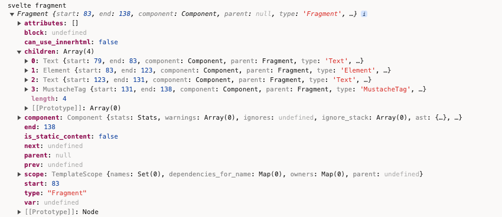
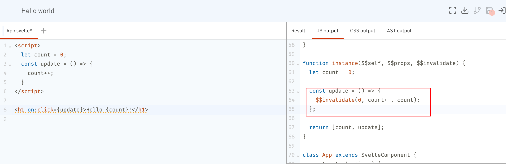
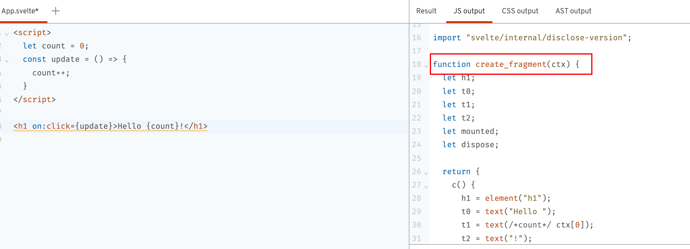
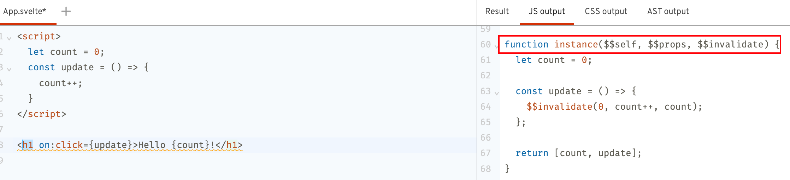
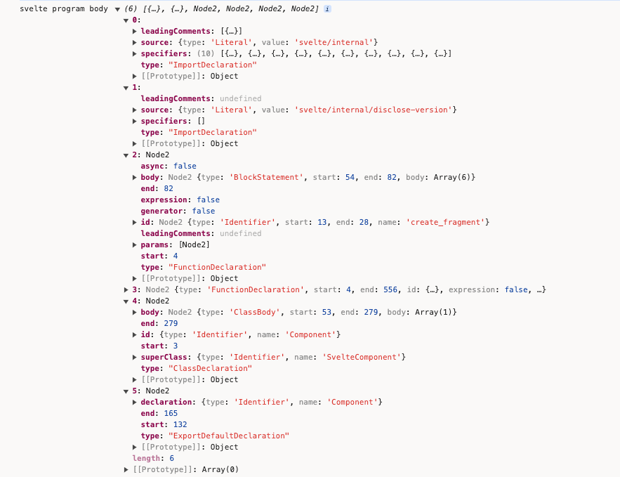
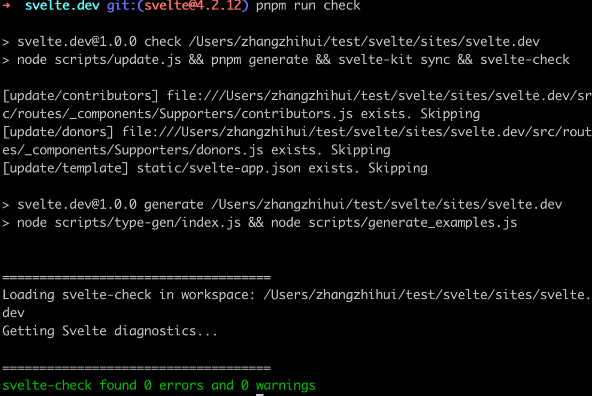
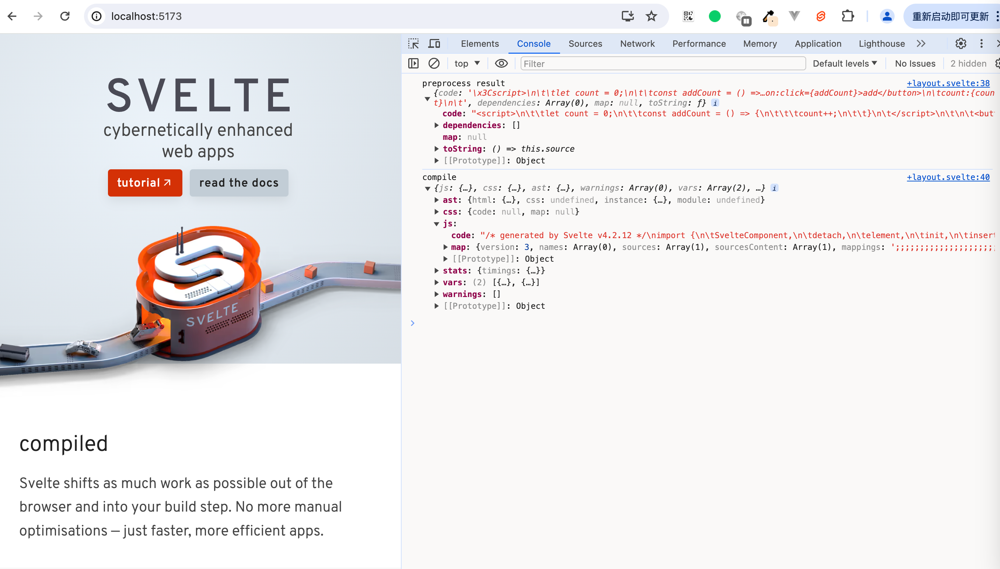

TODO: 直接使用svelte源码来编译自定义的App.svelte，查看具体的编译流程，及各个节点的数据内容

node 版本 笔者使用18.15

首先下载源码

Svelte版本切换到`4.2.12`分支
```
svelte-kit sync
```

```
pnpm add --force @img/sharp-darwin-arm64
```

参照svelte-loader中的逻辑`https://github.com/sveltejs/svelte-loader/blob/master/index.js`
```javascript
svelte.preprocess(source, options.preprocess).then(processed => {
		if (processed.dependencies && this.addDependency) {
			for (let dependency of processed.dependencies) {
				this.addDependency(dependency);
			}
		}

		if (processed.map) compileOptions.sourcemap = processed.map;

		const compiled = svelte.compile(processed.toString(), compileOptions);
		let { js, css, warnings } = compiled;

    callback(null, js.code, js.map);
})
```
首先svelte文件经过预处理，比如像要添加typescript支持等，然后调用compile，最后返回js.code


为了简单直观地查看到各个阶段的执行结果，我们在网站首页直接引入svelte编译器文件
路径：`sites/svelte.dev/src/routes/+layout.svelte`
```diff
	import '@sveltejs/site-kit/styles/index.css';

	import { browser } from '$app/environment';
	import { page } from '$app/stores';
	import { Icon, Shell, Banners } from '@sveltejs/site-kit/components';
	import { Nav, Separator } from '@sveltejs/site-kit/nav';
	import { Search, SearchBox } from '@sveltejs/site-kit/search';
+	import { compile, preprocess } from '../../../../packages/svelte/src/compiler';
```

```javascript
let str = `<script>
		let count = 0;
		const addCount = () => {
			count++;
		}
	<\/script>
	
	<button on:click={addCount}>add</button>
	count:{count}
	`;
	preprocess(str, {}).then(preResult => {
		console.log('preprocess result', prePresult);
		let result = compile(str);
		console.log('compile result', result);
	});
```

`cd sites/svelte.dev`
现在我们可以把网站跑起来`pnpm run dev`，在控制台中查看打印结果


结合chrome浏览器断点调试

### parse
首先在parse阶段，`packages/svelte/src/compiler/compile/index.js`
```javascript
	console.log('svelte before parse', source);
	const ast = parse(source, options);
	console.log('svelte after parse', ast);
```


`source`即是我们的模板字符串，即Svelte文件的内容


经过转换后得到ast对象
```
ast = {
	css: {}
	html: {},
	instance: {},
	module: {}
}
```

parse内部有个Parser类，通过实例化该类，对模板字符串文件进行解析
```
const parser = new Parser(template, options);
```

Parser内部则通过四种不同的类型的节点解析器，分别是`fragment`、`tag`、`mustache`和`text`。通过遍历文件的字符串内容，轮流调用这几个方法。

首先，我们没有使用`<style></style>`标签，忽略css解析的步骤。  
在初始化时，默认的html内容整体的type是`Fragment`。
`packages/svelte/src/compiler/parse/index.js`
```
this.html = {
			start: null,
			end: null,
			type: 'Fragment',
			children: []
		};
```

开始解析`<script>...`的最左侧`<`，符合tag的解析
```
if (parser.match('<')) {
		return tag;
	}
```

符合
```
const specials = new Map([
	[
		'script',
		{
			read: read_script,
			property: 'js'
		}
	],
	[
		'style',
		{
			read: read_style,
			property: 'css'
		}
	]
]);
```
调用read_script，里面的核心便是调用`code-read`的`parse`来解析js的内容。
```javascript
export default function read_script(parser, start, attributes) {
	...
	let ast;
	try {
		ast = acorn.parse(source);
	} catch (err) {
		parser.acorn_error(err);
	}
  ...
	return {
		type: 'Script',
		start,
		end: parser.index,
		context: get_context(parser, attributes, start),
		content: ast
	};
}
```
```
export const parse = (source) =>
	code_red.parse(source, {
		sourceType: 'module',
		ecmaVersion: 13,
		locations: true
	});
```

这部分便是ast对象中的instance属性中的内容


接下来是重点处理的html的内容。
`<script></script>`解析完成之后，我们遇到了一个空行，空字符串也不能忽略，继续用fragment方法判断。
```
export default function fragment(parser) {
	...

	return text;
}
```
使用text方法来解析这个空行内容。
返回
```
export default function text(parser) {
	...

	const node = {
		start,
		end: parser.index,
		type: 'Text',
		raw: data,
		data: decode_character_references(data, false)
	};

	parser.current().children.push(node);
}
```


空行解析完成，我们遇到了`<button>`标签，此时仍旧是调用fragment中的`tag`方法。
```
const type = meta_tags.has(name)
		? meta_tags.get(name)
		: regex_capital_letter.test(name[0]) || name === 'svelte:self' || name === 'svelte:component'
		? 'InlineComponent'
		: name === 'svelte:fragment'
		? 'SlotTemplate'
		: name === 'title' && parent_is_head(parser.stack)
		? 'Title'
		: name === 'slot'
		? 'Slot'
		: 'Element';

const element = {
		start,
		end: null,
		type,
		name,
		attributes: [],
		children: []
	};
```
我们遇到的不是`<script>`、`<style>`此类标签，也不是Svelte的自定义标签，最后得到的是`Element`type

之后开始读取标签内属性的内容
```javascript
while ((attribute = read_attribute(parser, unique_names, is_top_level_script_or_style))) {
		element.attributes.push(attribute);
		parser.allow_whitespace();
	}
```

```
const name = parser.read_until(regex_token_ending_character);
	if (!name) return null;
	let end = parser.index;
	parser.allow_whitespace();
	const colon_index = name.indexOf(':');
	const type = colon_index !== -1 && get_directive_type(name.slice(0, colon_index));
```
parser.read_until读取到`on:click`，

```javascript
function get_directive_type(name) {
	if (name === 'use') return 'Action';
	if (name === 'animate') return 'Animation';
	if (name === 'bind') return 'Binding';
	if (name === 'class') return 'Class';
	if (name === 'style') return 'StyleDirective';
	if (name === 'on') return 'EventHandler';
	if (name === 'let') return 'Let';
	if (name === 'in' || name === 'out' || name === 'transition') return 'Transition';
}
```
通过`get_directive_type`来得到attribute的type是`EventHandler`类型。

通过read_attribute_value来获取`on:click={}`中`{}`内的值。
```
if (parser.eat('=')) {
		parser.allow_whitespace();
		value = read_attribute_value(parser, is_static);
		end = parser.index;
	} 
```

在read_attribute_value内部调用read_sequence
```
try {
		value = read_sequence(
			parser,
			() => {
				// handle common case of quote marks existing outside of regex for performance reasons
				if (quote_mark) return parser.match(quote_mark);
				return !!parser.match_regex(regex_starts_with_invalid_attr_value);
			},
			'in attribute value'
		);
	} 
```

而read_sequence内部则调用`read_expression(parser);`，深挖其核心逻辑，最终是调用`code-red`的`parseExpressionAt`来解析`{}`的内容，将这部分内容赋值到expression属性中

```javascript
import * as code_red from 'code-red';

export const parse_expression_at = (source, index) =>
	code_red.parseExpressionAt(source, index, {
		sourceType: 'module',
		ecmaVersion: 13,
		locations: true
	});
```


此时我们已经解析到`<button on:click={addCount}>`。

接着往下，这个`Element`type的children值只有一个节点，那就是add文案所代表的Text节点
  
之后我们算是已经解析到`</button>`。

接着往下我们遇到`count:`，同样是Text节点


接着遇到`{`，继续调用fragment内的mustache方法。
```
const expression = read_expression(parser);
		parser.allow_whitespace();
		parser.eat('}', true);
		parser.current().children.push({
			start,
			end: parser.index,
			type: 'MustacheTag',
			expression
		});
```



### Component
```
const component = new Component(
		ast,
		source,
		options.name || get_name_from_filename(options.filename) || 'Component',
		options,
		stats,
		warnings
	);
```

Component中几个关键的步骤
```javascript
this.walk_module_js();
this.walk_instance_js_pre_template();
this.fragment = new Fragment(this, ast.html);
this.walk_instance_js_post_template();
```
我们没有声明过`context='module'`的script内容，所以跳过`walk_module_js`。

在`walk_instance_js_pre_template`中调用`create_scopes`来解析script标签内的作用域
```
const { scope: instance_scope, map, globals } = create_scopes(script.content);
```
可以把这些遍历打印出来看下`console.log('svelte Component walk_instance_js_pre_template', instance_scope, map, globals);`

`create_scopes`内部是使用了`periscopic`的analyse方法
```
import { analyze, Scope, extract_names, extract_identifiers } from 'periscopic';

/**
 * @param {import('estree').Node} expression
 */
export function create_scopes(expression) {
	return analyze(expression);
}
```


调用`this.add_var()`将变量存入`vars`中
```
add_var(node, variable, add_to_lookup = true) {
		this.vars.push(variable);
		if (add_to_lookup) {
			if (this.var_lookup.has(variable.name)) {
				const exists_var = this.var_lookup.get(variable.name);
				if (exists_var.module && exists_var.imported) {
					this.error(/** @type {any} */ (node), compiler_errors.illegal_variable_declaration);
				}
			}
			this.var_lookup.set(variable.name, variable);
		}
	}
```
```diff
this.walk_instance_js_pre_template();
+		console.log('svelte Component this', this);
```

打印出来看下


执行
```
this.fragment = new Fragment(this, ast.html);
```

Fragment内部，执行map_children方法
```
export default class Fragment extends Node {
	constructor(component, info) {
		const scope = new TemplateScope();
		super(component, null, scope, info);
		this.scope = scope;
		this.children = map_children(component, this, scope, info.children);
	}
}
```
```diff
this.children = map_children(component, this, scope, info.children);
+ console.log('svelte Fragment children', this.children);
```





map_children的作用是将ast中的节点进行转换。

```
walk_instance_js_post_template() {
		const script = this.ast.instance;
		if (!script) return;
		this.post_template_walk();
		this.hoist_instance_declarations();
		this.extract_reactive_declarations();
		this.check_if_tags_content_dynamic();
	}
```
执行`walk_instance_js_post_template`中的`this.post_template_walk`
walk的content就是ast.instance.content的内容


这个`walk_instance_js_post_template`的主要作用是
对节点进行一些额外的检查，例如检查是否有未关闭的标签，是否有不合法的属性等。
对节点进行一些优化，例如移除不必要的空白节点，合并连续的文本节点等。
收集一些信息，例如收集所有使用的组件，收集所有的依赖等

```diff
const component = new Component(
		ast,
		source,
		options.name || get_name_from_filename(options.filename) || 'Component',
		options,
		stats,
		warnings
	);
+	console.log('svelte component', component);
```


查看下render_dom的执行逻辑
```
const result =
		options.generate === false
			? null
			: options.generate === 'ssr'
			? render_ssr(component, options)
			: render_dom(component, options);
```
内部有个Renderer
```
const renderer = new Renderer(component, options);
```

Renderer内部
```
this.block = new Block({
			renderer: this,
			name: null,
			type: 'component',
			key: null,
			bindings: new Map(),
			dependencies: new Set()
		});
		this.block.has_update_method = true;
		this.fragment = new FragmentWrapper(
			this,
			this.block,
			component.fragment.children,
			null,
			true,
			null
		);
```

## compile阶段


## runtime


## 小结