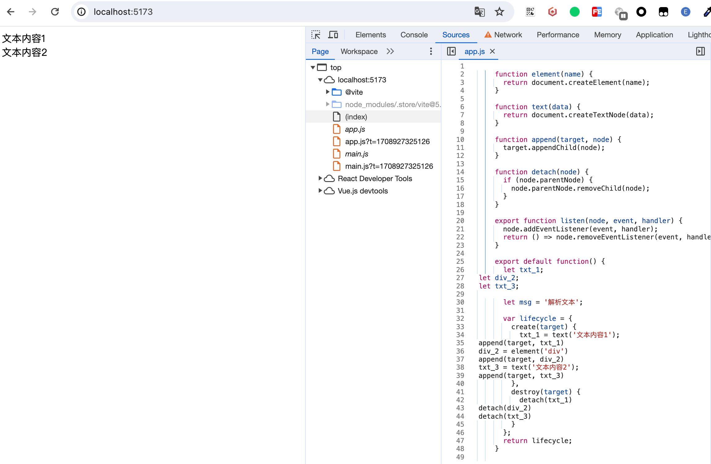
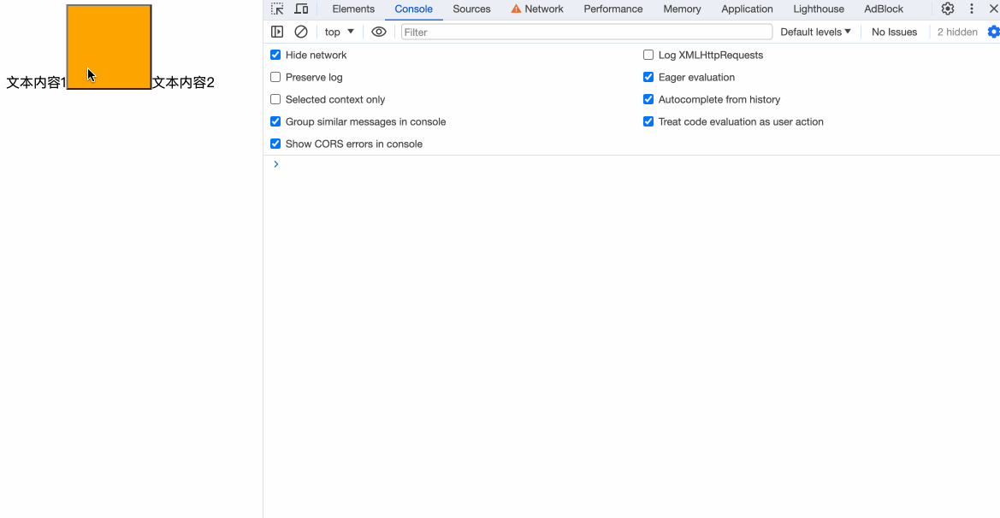

在上一章中，我们完成了script的解析，其主要逻辑都集中在parseScript中

## 标签
### 解析标签

在parseFragment方法内，添加parseElement的解析逻辑：
```javascript
function parseFragment() {
    return parseScript() ?? parseElement();
}
```
`??`是一个空值合并运算符，当前面的值为null或undefined时，会执行后面的逻辑。parseScript的方法没有返回值，因此当执行完parseScript后，会执行parseElement。

parseElement的逻辑如下：
```javascript
function parseElement() {
	skipWhitespace();
	if (match('<')) {
	  eat('<');
	  const tagName = readWhileMatching(/[a-z]/);
	  eat('>');
	  const endTag = `</${tagName}>`;
	  const element = {
		type: 'Element',
		name: tagName,
		attributes: [],
		children: [],
	  };
	  eat(endTag);
	  skipWhitespace();
	  return element;
	}
}
```
主要逻辑是，遇到`<`开头的标签后，读取接下来的标签名称，然后返回一个fragment对象。

我们将从html字符串中解析得到的内容称为fragment，随着解析内容的深入，我们可能会遇到不同类型的fragment。在parseElement方法中，解析得到的fragment的类型是`type: 'Element'`。除了type之外，name存储读取到的标签名，attributes存储标签上的属性，children存储标签内的子标签对象。

因为我们parseElement中有返回一个对象，我们需要调整我们的parseFragments方法：
```javascript
function parseFragments() {
    const fragments = [];
    while (i < content.length) {
      const fragment = parseFragment();
      if (fragment) {
        fragments.push(fragment);
      }
    }
    return fragments;
}
```


将parseFragments()返回值赋给ast.html：
```javascript
function parse(content) {
  let i = 0;
  const ast = {};
  ast.html = parseFragments();
  return ast;

  ...
}
```
现在我们的ast对象上不止有script属性，也有html属性。

### 生成标签

接着我们开始完善generate的方法
```javascript
function generate(ast) {
  const code = {
    variables: [],
    create: [],
    destroy: [],
  };
  
  let counter = 1;

  function traverse(node, parent) {
    switch(node.type) {
      case 'Element': {
        const variableName = `${node.name}_${counter++}`;
        code.variables.push(variableName);        
        code.create.push(
          `${variableName} = element('${node.name}')`
        );
        code.create.push(`append(${parent}, ${variableName})`);
        code.destroy.push(`detach(${variableName})`);        
        break;
      }
    }
  }

  ast.html.forEach((fragment) => traverse(fragment, 'target'));

  return `
    ...
    
    export default function() {
	    ...
    }
  `;
}
```

我们定义一个变量code，里面用来收集在解析过程中的各种用于转换的参数。其中，create用来存储组件创建时的数据，destroy用来存储组件销毁时的数据。variables数组用来存储在编译时用来声明的变量。

ast.html中存储的是一个数组，`ast.html.forEach`遍历这个数组，然后对数组里的内容作`traverse`转换。
因为目前我们只解析了标签，数组里只有`type: Element`的数据，所以我们先只处理标签的转换。

仔细看转换的代码：
```javascript
case 'Element': {
	const variableName = `${node.name}_${counter++}`;
	code.variables.push(variableName);        
	code.create.push(
	  `${variableName} = element('${node.name}')`
	);
	code.create.push(`append(${parent}, ${variableName})`);
	code.destroy.push(`detach(${variableName})`);        
	break;
}
```
node.name是标签名，counter是一个自增变量，用来区分不同的变量。不如我们可能会解析出很多div标签，第一个div是div1，然后counter加1，下一个div标签则是div2，确保相同标签的解析变量不会重名。然后我们把这个变量存入到`code.variables`中。

在`code.create`中，我们添加创建标签的代码，在`code.destroy`中，我们添加移除标签的代码。还记得我们在基本流程章节中定义的运行时方法吗，这里便派上了用场：element、append、detach。

经过转换后，我们的create和destroy中已经存储了组件在创建时如何运行和销毁时如何运行的js代码。

现在我们重构字符串模板中的导出内容。
```javascript
function generate(ast) {
	...
	return `
		export default function() {
		${code.variables.map(v => `let ${v};`).join('\n')}
		
		${escodegen.generate(ast.script)}

			var lifecycle = {
		        create(target) {
		          ${code.create.join('\n')}
		        },
		        destroy(target) {
		          ${code.destroy.join('\n')}
		        }
			};
		    return lifecycle;
	    }	
    `
}
```
在方法最开头，把`code.variables`中的变量全都使用`let ${v}`打印出来，然后在lifecycle的create中调用`code.create`，在destroy中调用`code.destroy`。

## 纯文本

### 解析纯文本

解析完Element之后，我们开始解析纯文本Text：
```javascript
function parseFragment() {
    return parseScript() ?? parseElement() ?? parseText();
}
```

解析得到的对象，我们将其类型定义为`type: 'Text'`：
```javascript
function parseText() {
    const text = readWhileMatching(/[^<{]/);
    if (text.trim() !== '') {
      return {
        type: 'Text',
        value: text.trim(),
      }
    }
}
```

### 生成纯文本
完善generate里的traverse方法，添加对Text类型的转换：
```javascript
function traverse(node, parent) {
    switch(node.type) {
      case 'Element': {
        ...
      }
      case 'Text': {
        const variableName = `txt_${counter++}`;
        code.variables.push(variableName);
        code.create.push(`${variableName} = text('${node.value}');`);
        code.create.push(`append(${parent}, ${variableName})`);
        code.destroy.push(`detach(${variableName})`);
        break;
      }
    }
}
```
同样是在create时存入创建文本内容的逻辑，在destroy时存入销毁文本内容的逻辑。

在App.svelte中添加测试内容：
```html
<script>
  let msg = '解析文本';
</script>

文本内容1
<div></div>
文本内容2
```
看看`npm run compile`后的结果吧。

现在如果我们往div标签里添加内容，编译往往会报错。因为还没有实现递归解析html内容的逻辑。这也是为什么笔者在这里只演示了最基本的html标签的写法。

## 标签属性
### 解析标签属性

修改parseElement的内容：
```diff
function parseElement() {
    skipWhitespace();
    if (match('<')) {
      eat('<');
      const tagName = readWhileMatching(/[a-z]/);
+     const attributes = parseAttributes();
      eat('>');
      const endTag = `</${tagName}>`;
      const element = {
        type: 'Element',
        name: tagName,
-       attributes: [],
+       attributes,
        children: [],
      };
      eat(endTag);
      skipWhitespace();
      return element;
    }
}
```
在一开始，我们把attributes设置成了空数组，现在我们通过parseAttributes来解析出这部分内容。

```javascript
  function parseAttributes() {
    skipWhitespace();
    const attributes = [];
    while(!match('>')) {
      attributes.push(parseAttribute());
      skipWhitespace();
    }
    return attributes;
  }

  function parseAttribute() {
    const name = readWhileMatching(/[^=]/);
    if (match('={')) {
      eat('={');
      const value = parseJavaScript();
      eat('}');
      return {
        type: 'Attribute',
        name,
        value,
      };
    }
  }
```
parseAttributes的主要逻辑是解析从`<`到`>`之间的内容，其内部调用parseAttribute方法；
而parseAttribute则解析`key={value}`格式的内容，之后返回`type: Attribute`的对象。因此parseAttributes返回的是`type: Attribute`对象数组。
目前我们只实现诸如`on:click={onClick}`形式的内容。

### 解析行内表达式
```javascript
function parseJavaScript() {
    const js = acorn.parseExpressionAt(content, i, { ecmaVersion: 2023 });
    i = js.end;
    return js;
}
```
这里同样使用acron提供的能力。
### 生成标签属性
完善generate里的traverse方法：
```javascript
function traverse(node, parent) {
    switch(node.type) {
      case 'Element': {
        ...
        node.attributes.forEach(attribute => {
          traverse(attribute, variableName);
        });
      }
      case "Attribute": {
        if (node.name.startsWith("on:")) {
          const eventName = node.name.slice(3);
          const eventHandler = node.value.name;
          const eventNameCall = `${eventName}_${counter++}`;
          code.variables.push(eventNameCall);
          code.create.push(
            `${eventNameCall} = listen(${parent}, "${eventName}", ${eventHandler})`
          );
          code.destroy.push(`${eventNameCall}()`);
        }
        break;
      }
    }
  }
  ```
判断属性是不是`on:`开头，是才处理。因为我们对addEventListener做了封装，当我们执行listen()方法后，会返回一个用于移除事件监听的方法。我们在destroy阶段调用这个方法。

修改App.svelte的内容：
```html
<script>
  let count = 0;
  const updateCount = () => {
    count++;
    console.log('update count', count);
  }
</script>

文本内容1
<button on:click={updateCount}></button>
文本内容2
```
因为现在仍不支持标签内添加元素，因此，我们单独在index.html内给button添加样式，方便我们测试
```html
<!-- index.html -->
<style>
  button {
	width: 100px;
	height:100px;
	background: orange;
  }
</style>
```

执行`npm run compile`看一下效果吧。


## 完整代码
按照惯例，本章最后附上代码：
```javascript
import * as fs from "fs";
import { fileURLToPath } from "url";
import { dirname, resolve } from "path";
import * as acorn from "acorn";
import * as escodegen from "escodegen";

const modulePath = dirname(fileURLToPath(import.meta.url));

function bootstrap() {
  try {
    const inputPath = resolve(modulePath, "./App.svelte");
    const outputPath = resolve(modulePath, "./app.js");
    const content = fs.readFileSync(inputPath, "utf-8");
    fs.writeFileSync(outputPath, compile(content), "utf-8");
  } catch (e) {
    console.error(e);
  }
}

function compile(content) {
  const ast = parse(content); // 解析svelte文件内容成ast
  return generate(ast);
}

function parse(content) {
  let i = 0;
  const ast = {};
  ast.html = parseFragments();
  
  return ast;

  function parseFragments() {
    const fragments = [];
    while (i < content.length) {
      const fragment = parseFragment();
      if (fragment) {
        fragments.push(fragment);
      }
    }
    return fragments;
  }

  function parseFragment() {
    return parseScript() ?? parseElement() ?? parseText();
  }

  function parseScript() {
    skipWhitespace();
    if (match("<script>")) {
      eat("<script>");
      const startIndex = i;
      const endIndex = content.indexOf("</script>", i);
      const code = content.slice(startIndex, endIndex);
      ast.script = acorn.parse(code, { ecmaVersion: 2023 });
      i = endIndex;
      eat("</script>");
      skipWhitespace();
    }
  }

  function parseElement() {
    skipWhitespace();
    if (match('<')) {
      eat('<');
      const tagName = readWhileMatching(/[a-z]/);
      const attributes = parseAttributes();
      eat('>');
      const endTag = `</${tagName}>`;
      const element = {
        type: 'Element',
        name: tagName,
        attributes,
        children: [],
      };
      eat(endTag);
      skipWhitespace();
      return element;
    }
  }

  function parseAttributes() {
    skipWhitespace();
    const attributes = [];
    while(!match('>')) {
      attributes.push(parseAttribute());
      skipWhitespace();
    }
    return attributes;
  }

  function parseAttribute() {
    const name = readWhileMatching(/[^=]/);
    if (match('={')) {
      eat('={');
      const value = parseJavaScript();
      eat('}');
      return {
        type: 'Attribute',
        name,
        value,
      };
    }
  }

  function parseJavaScript() {
    const js = acorn.parseExpressionAt(content, i, { ecmaVersion: 2023 });
    i = js.end;
    return js;
  }

  function parseText() {
    const text = readWhileMatching(/[^<{]/);
    if (text.trim() !== '') {
      return {
        type: 'Text',
        value: text.trim(),
      }
    }
  }

  function match(str) {
    return content.slice(i, i + str.length) === str;
  }

  function eat(str) {
    if (match(str)) {
      i += str.length;
    } else {
      throw new Error(`Parse error: expecting "${str}"`);
    }
  }

  function readWhileMatching(reg) {
    let startIndex = i;
    while(i < content.length && reg.test(content[i])) {
      i++;
    }
    return content.slice(startIndex, i);
  }

  function skipWhitespace() {
    readWhileMatching(/[\s\n]/);
  }
}

function generate(ast) {

  const code = {
    variables: [],
    create: [],
    destroy: [],
  };

  let counter = 1;

  function traverse(node, parent) {
    switch(node.type) {
      case 'Element': {
        const variableName = `${node.name}_${counter++}`;
        code.variables.push(variableName);
        code.create.push(
          `${variableName} = element('${node.name}')`
        )
        node.attributes.forEach(attribute => {
          traverse(attribute, variableName);
        });

        code.create.push(`append(${parent}, ${variableName})`);
        code.destroy.push(`detach(${variableName})`);
        break;
      }
      case 'Text': {
        const variableName = `txt_${counter++}`;
        code.variables.push(variableName);
        code.create.push(`${variableName} = text('${node.value}');`);
        code.create.push(`append(${parent}, ${variableName})`);
        code.destroy.push(`detach(${variableName})`);
        break;
      }
      case "Attribute": {
        if (node.name.startsWith("on:")) {
          const eventName = node.name.slice(3);
          const eventHandler = node.value.name;
          const eventNameCall = `${eventName}_${counter++}`;
          code.variables.push(eventNameCall);
          code.create.push(
            `${eventNameCall} = listen(${parent}, "${eventName}", ${eventHandler})`
          );
          code.destroy.push(`${eventNameCall}()`);
        }
        break;
      }
    }
  }

  ast.html.forEach((fragment) => traverse(fragment, 'target'));

  return `
    function element(name) {
      return document.createElement(name);
    }

    function text(data) {
      return document.createTextNode(data);
    }

    function append(target, node) {
      target.appendChild(node);
    }

    function detach(node) {
      if (node.parentNode) {
        node.parentNode.removeChild(node);
      }
    }

    export function listen(node, event, handler) {
      node.addEventListener(event, handler);
      return () => node.removeEventListener(event, handler);
    }
    
    export default function() {
      ${code.variables.map(v => `let ${v};`).join('\n')}

      ${escodegen.generate(ast.script)}

      var lifecycle = {
        create(target) {
          ${code.create.join('\n')}
        },
        destroy(target) {
          ${code.destroy.join('\n')}
        }
      };
      return lifecycle;
    }
  `;
}

bootstrap();
```


## 小结

本章中，我们完成了对html内容的解析，我们能够解析出正常的html标签内容、纯文本、以及能够对标签进行事件绑定。