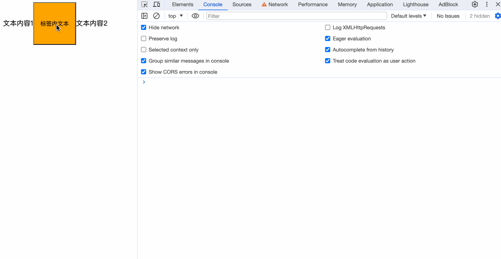
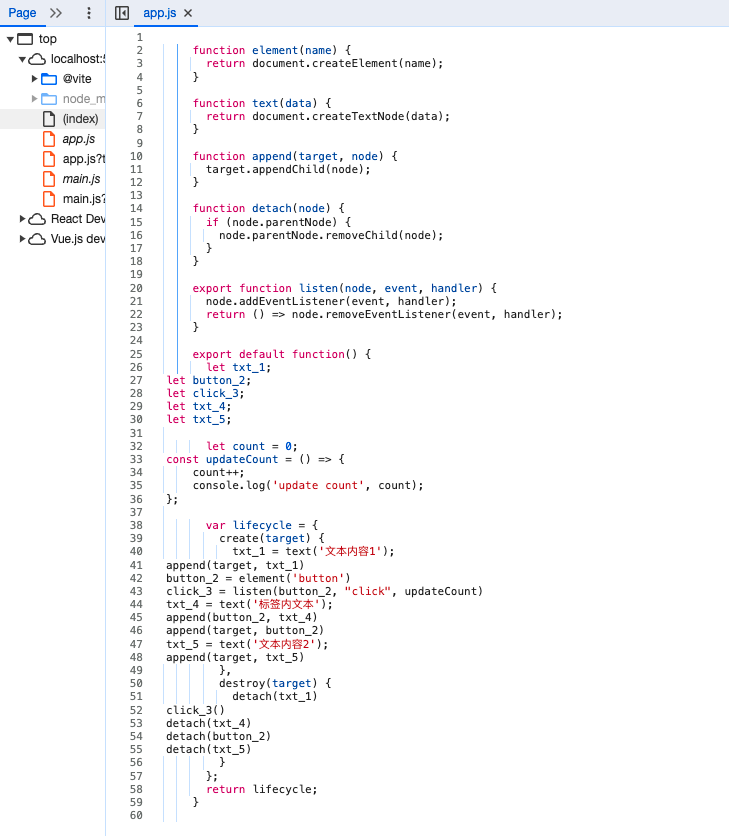
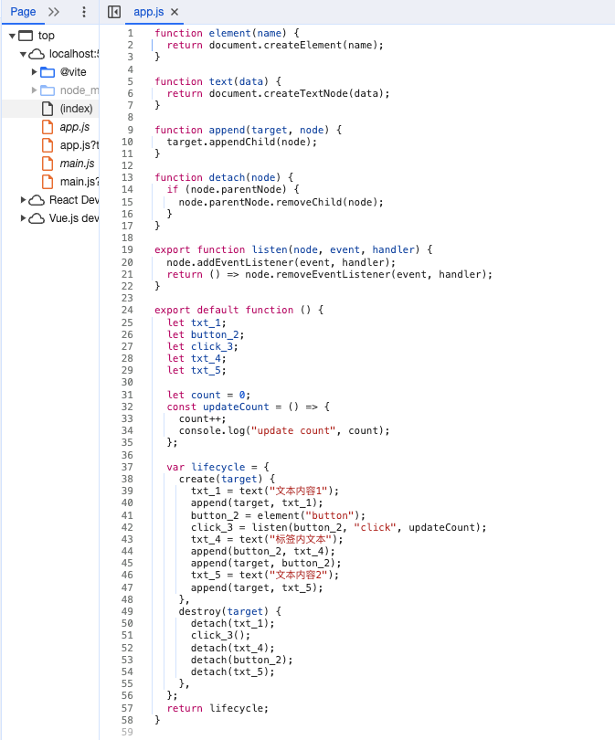

## 解析子节点
在前面的章节中，我们反复提到没有支持标签内子元素的展示，而导致我们在演示时只能干写标签而无内容，在本章中我们将完善这一功能。

首先我们要改造的是parseFragments：
```javascript
function parseFragments(condition) {
  const fragments = [];
  while (condition()) {
    const fragment = parseFragment();
    if (fragment) {
      fragments.push(fragment);
    }
  }
  return fragments;
}
```

将其改为接收一个参数condition，condition是一个方法，执行后得到是否符合条件的布尔值。修改这一步的原因是因为在解析子元素时的while判断条件和初始解析时的判断条件不一样。

之后我们修改最初调用parseFragments时的代码，将原来while的判断改成一个方法参数传入。
```javascript
ast.html = parseFragments(() => i < content.length);
```

修改parseElement的内容
```diff
function parseElement() {
  skipWhitespace();
  if (match('<')) {
    eat('<');
    const tagName = readWhileMatching(/[a-z]/);
    const attributes = parseAttributeList();
    eat('>');
    const endTag = `</${tagName}>`;
    const element = {
      type: 'Element',
      name: tagName,
      attributes,
-     children: []
+     children: parseFragments(() => !match(endTag)),
      };
    eat(endTag);
    skipWhitespace();
    return element;
  }
}
```
很明显，从一个标签开始到标签结束的这部分内容，我们把它看成是子标签的内容。

完善generate内traverse对Element的转换
```javascript
function traverse(node, parent) {
  switch(node.type) {
    case 'Element': {
      ...

      node.children.forEach(child => {
        traverse(child, variableName);
      });

      ...
    }
  ...
}
```

往上一章中的App.svelte中添加内容：
```html
<script>
  let count = 0;
  const updateCount = () => {
    count++;
    console.log('update count', count);
  }
</script>

文本内容1
<button on:click={updateCount}>标签内文本</button>
文本内容2
```

`npm run compile`执行看一下


## prettier
现在我们已经有了基本的Svelte编译思路，然而我们不管是从我们执行`npm run compile`后的app.js还是从控制台中看，编译出来的代码的格式都非常不美观。


一种方式是我们每次在`npm run compile`后，手动地通过VSCode的格式化功能来格式化我们app.js的代码，那有没有更便捷的方式呢？答案便是我们可以在代码中引入[Prettier](https://prettier.io/)。

```bash
npm install prettier -D
```

```javascript
import * as fs from "fs";
import { fileURLToPath } from "url";
import { dirname, resolve } from "path";
import * as acorn from "acorn";
import * as escodegen from "escodegen";
import * as prettier from "prettier";
```

修改我们的入口方法：
```javascript
async function bootstrap() {
  try {
    const inputPath = resolve(modulePath, "./App.svelte");
    const outputPath = resolve(modulePath, "./app.js");
    const content = fs.readFileSync(inputPath, "utf-8");
    const compiledContent = compile(content);;
    const prettierContent = await prettier.format(compiledContent, {parser: 'babel'});
    fs.writeFileSync(outputPath, prettierContent, "utf-8");
  } catch (e) {
    console.error(e);
  }
}
```

重新执行`npm run compile`看下

之后我们就能清晰地看到经过编译后的js代码长什么样啦。

## 完整代码
```javascript
import * as fs from "fs";
import { fileURLToPath } from "url";
import { dirname, resolve } from "path";
import * as acorn from "acorn";
import * as escodegen from "escodegen";
import * as prettier from "prettier";

const modulePath = dirname(fileURLToPath(import.meta.url));

async function bootstrap() {
  try {
    const inputPath = resolve(modulePath, "./App.svelte");
    const outputPath = resolve(modulePath, "./app.js");
    const content = fs.readFileSync(inputPath, "utf-8");
    const compiledContent = compile(content);
    const prettierContent = await prettier.format(compiledContent, {parser: 'babel'});
    fs.writeFileSync(outputPath, prettierContent, "utf-8");
  } catch (e) {
    console.error(e);
  }
}

function compile(content) {
  const ast = parse(content); // 解析svelte文件内容成ast
  return generate(ast);
}

function parse(content) {
  let i = 0;
  const ast = {};
  ast.html = parseFragments(() => i < content.length);
  
  return ast;

  function parseFragments(condition) {
    const fragments = [];
    while (condition()) {
      const fragment = parseFragment();
      if (fragment) {
        fragments.push(fragment);
      }
    }
    return fragments;
  }

  function parseFragment() {
    return parseScript() ?? parseElement() ?? parseText();
  }

  function parseScript() {
    skipWhitespace();
    if (match("<script>")) {
      eat("<script>");
      const startIndex = i;
      const endIndex = content.indexOf("</script>", i);
      const code = content.slice(startIndex, endIndex);
      ast.script = acorn.parse(code, { ecmaVersion: 2023 });
      i = endIndex;
      eat("</script>");
      skipWhitespace();
    }
  }

  function parseElement() {
    skipWhitespace();
    if (match('<')) {
      eat('<');
      const tagName = readWhileMatching(/[a-z]/);
      const attributes = parseAttributes();
      eat('>');
      const endTag = `</${tagName}>`;
      const element = {
        type: 'Element',
        name: tagName,
        attributes,
        children: parseFragments(() => !match(endTag)),
      };
      eat(endTag);
      skipWhitespace();
      return element;
    }
  }

  function parseAttributes() {
    skipWhitespace();
    const attributes = [];
    while(!match('>')) {
      attributes.push(parseAttribute());
      skipWhitespace();
    }
    return attributes;
  }

  function parseAttribute() {
    const name = readWhileMatching(/[^=]/);
    if (match('={')) {
      eat('={');
      const value = parseJavaScript();
      eat('}');
      return {
        type: 'Attribute',
        name,
        value,
      };
    }
  }

  function parseJavaScript() {
    const js = acorn.parseExpressionAt(content, i, { ecmaVersion: 2023 });
    i = js.end;
    return js;
  }

  function parseText() {
    const text = readWhileMatching(/[^<{]/);
    if (text.trim() !== '') {
      return {
        type: 'Text',
        value: text.trim(),
      }
    }
  }

  function match(str) {
    return content.slice(i, i + str.length) === str;
  }

  function eat(str) {
    if (match(str)) {
      i += str.length;
    } else {
      throw new Error(`Parse error: expecting "${str}"`);
    }
  }

  function readWhileMatching(reg) {
    let startIndex = i;
    while(i < content.length && reg.test(content[i])) {
      i++;
    }
    return content.slice(startIndex, i);
  }

  function skipWhitespace() {
    readWhileMatching(/[\s\n]/);
  }
}

function generate(ast) {

  const code = {
    variables: [],
    create: [],
    destroy: [],
  };

  let counter = 1;

  function traverse(node, parent) {
    switch(node.type) {
      case 'Element': {
        const variableName = `${node.name}_${counter++}`;
        code.variables.push(variableName);
        code.create.push(
          `${variableName} = element('${node.name}')`
        )
        node.attributes.forEach(attribute => {
          traverse(attribute, variableName);
        });

        node.children.forEach(child => {
          traverse(child, variableName);
        });

        code.create.push(`append(${parent}, ${variableName})`);
        code.destroy.push(`detach(${variableName})`);
        break;
      }
      case 'Text': {
        const variableName = `txt_${counter++}`;
        code.variables.push(variableName);
        code.create.push(`${variableName} = text('${node.value}');`);
        code.create.push(`append(${parent}, ${variableName})`);
        code.destroy.push(`detach(${variableName})`);
        break;
      }
      case "Attribute": {
        if (node.name.startsWith("on:")) {
          const eventName = node.name.slice(3);
          const eventHandler = node.value.name;
          const eventNameCall = `${eventName}_${counter++}`;
          code.variables.push(eventNameCall);
          code.create.push(
            `${eventNameCall} = listen(${parent}, "${eventName}", ${eventHandler})`
          );
          code.destroy.push(`${eventNameCall}()`);
        }
        break;
      }
    }
  }

  ast.html.forEach((fragment) => traverse(fragment, 'target'));

  return `
    function element(name) {
      return document.createElement(name);
    }

    function text(data) {
      return document.createTextNode(data);
    }

    function append(target, node) {
      target.appendChild(node);
    }

    function detach(node) {
      if (node.parentNode) {
        node.parentNode.removeChild(node);
      }
    }

    export function listen(node, event, handler) {
      node.addEventListener(event, handler);
      return () => node.removeEventListener(event, handler);
    }
    
    export default function() {
      ${code.variables.map(v => `let ${v};`).join('\n')}

      ${escodegen.generate(ast.script)}

      var lifecycle = {
        create(target) {
          ${code.create.join('\n')}
        },
        destroy(target) {
          ${code.destroy.join('\n')}
        }
      };
      return lifecycle;
    }
  `;
}

bootstrap();
```
## 小结

本章我们实现了：
- 对html标签进行递归解析
- 对编译后的代码进行格式化的美化操作