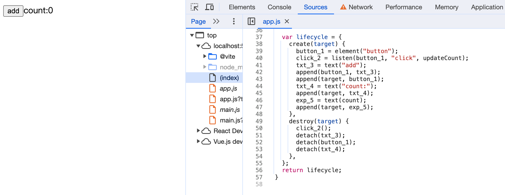
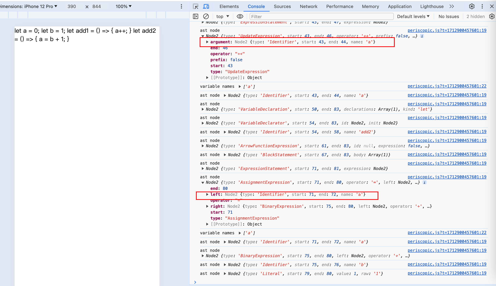
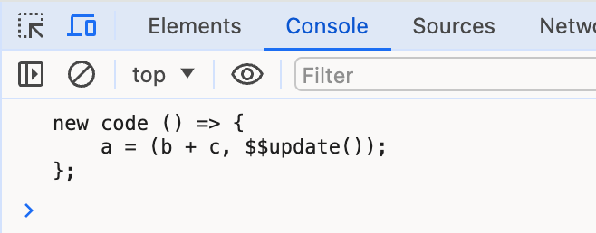
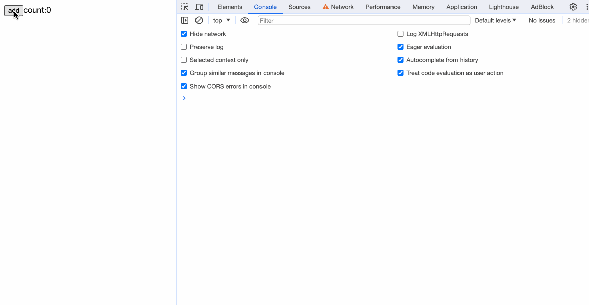
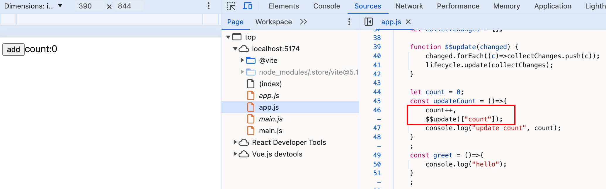

## 解析表达式
目前，我们在标签内的展示内容，都是静态文本。这一样，我们添加对诸如`<div>{count}</div>`形式内容的支持。

首先在`parseFragment`方法中添加`parseExpression`方法：
```javascript
function parseFragment() {
  return parseScript() ?? parseElement() ?? parseText() ?? parseExpression();
}
```

```javascript
function parseExpression() {
  if (match('{')) {
    eat('{');
    const expression = parseJavaScript();
    eat('}');
    return {
    type: 'Expression',
    expression,
    };
  }
}
```
在《解析html》章节，我们已经实现了`parseJavaScript`的支持，其功能就是调用`acorn`的`parseExpressionAt`方法。`parseExpression`返回`type: 'Expression'`类型的对象。

完善generate内的traverse方法：
```javascript
function traverse(node, parent) {
  switch(node.type) {
    ...

    case 'Expression': {
      const variableName = `exp_${counter++}`;
      const expressionStr = escodegen.generate(node.expression);
      code.variables.push(variableName);
      code.create.push(
        `${variableName} = text(${expressionStr})`
      );
      code.create.push(`append(${parent}, ${variableName});`);
      break;
    }
  }
}
```
对于`Expression`类型的对象，调用`escodegen.generate`来生成js代码。

修改App.svelte的内容，同时我们把原来的button自定义样式移除。


通过编译后的方法中，我们可以看到：
  

我们的`{count}`已经能被编译成`exp_5 = text(count)`。现在我们还差关键的一步：更新状态。


## 静态分析

我们知道Svelte是在静态代码阶段就解析出变量之间的关系，从而实现了响应式。首先我们定义一个`analyse`方法，用来解析代码中变量之间的关系，然后在生成阶段，我们会用到这部分数据。

```javascript
function compile(content) {
  const ast = parse(content); // 解析svelte文件内容成ast
  const analysis = analyse(ast);
  return generate(ast, analysis);
}
```

```javascript
function analyse(ast) {
  const result = {
    variables: new Set(),
    willChange: new Set(),
    useInTemplate: new Set(),
  };

  return result;
}
```

result对象中有三个属性：viriables记录声明的变量，willChange记录会触发更新的变量，useInTemplate记录在html模板内容中使用到的变量。使用Set集合来确保我们记录到的变量唯一不重复。

### 解析script

安装`estree-walker`和`periscopic`。`estree-walker`用来编译ast对象，`periscopic`用来分析代码的作用域。
```bash
npm install estree-walker periscopic -D
```

```diff
  import * as fs from "fs";
  import { fileURLToPath } from "url";
  import { dirname, resolve } from "path";
  import * as acorn from "acorn";
  import * as escodegen from "escodegen";
  import * as prettier from "prettier";
+ import * as estreewalker from "estree-walker";
+ import * as periscopic from "periscopic";
```

```javascript
function analyse(ast) {
  ...
  const { scope: rootScope, map, globals } = periscopic.analyze(ast.script);
  result.variables = new Set(rootScope.declarations.keys());
  result.rootScope = rootScope;
  result.map = map;

  let currentScope = rootScope;
  estreewalker.walk(ast.script, {
    enter(node) {
      if (map.has(node)) {
        currentScope = map.get(node)
      }
      if (node.type === 'UpdateExpression' || node.type === 'AssignmentExpression') {
        const names = periscopic.extract_names(node.type === 'UpdateExpression' ? node.argument : node.left);
        for(const name of names) {
          if (currentScope.find_owner(name) === rootScope || globals.has(name)) {
            result.willChange.add(name);
          }
        }
      }
    },
    leave(node) {
      if (map.has(node)) {
        currentScope = currentScope.parent;
      }
    }
  })
}
```

- 首先我们用`periscopic`来`analyse`script标签内代码的作用域，`rootScope.declarations.keys()`能够拿到我们定义在script标签内声明的所有变量。
- 使用`estreewalker`来遍历script的抽象语法树。`enter`方法首先拿到当前节点的作用域。然后如果节点的类型是`UpdateExpression`或`AssignmentExpression`，它将提取出所有的变量名，并检查这些名字是否在根作用域（rootScope）或全局变量（globals）中。如果是，将这些名字加入到`willChange`变量中。
- 离开节点时重置作用域

我们举个简单的例子来演示下：
```javascript
import * as acorn from 'acorn';
import { extract_names } from 'periscopic';
import { walk } from "estree-walker";

export let a = `let a = 0;
let b = 1;
let add1 = () => {
  a++;
}
let add2 = () => {
  a = b + 1;
}
`;

let ast = acorn.parse(a, { ecmaVersion: 2023 });

walk(ast, {
  enter(node) {
    console.log('ast node', node);
    if (node.type === 'UpdateExpression' || node.type === 'AssignmentExpression') {
      const names = extract_names(node.type === 'UpdateExpression' ? node.argument : node.left);
      console.log('variable names', names)
    }
  },
  leave(node) {}
})
```



我们可以看到，`UpdateExpression`对应的是`a++`相关节点，通过`extract_names`取`node.argument`里的name即是自增赋值后要更新的变量a，而`AssignmentExpression`对应的是`a = b + 1;`，`extract_names`需要取`node.left`里的name，才能取到被赋值后的变量。

### 解析html

完善`analyse`方法：
```javascript
function traverse(fragment) {
  switch(fragment.type) {
    case 'Element':
      fragment.children.forEach((child) => traverse(child));
      break;
    case 'Expression': {
      periscopic.extract_names(fragment.expression).forEach((name) => {
        result.willUseInTemplate.add(name);
      });
      break;
    } 
  }
}
ast.html.forEach(fragment => traverse(fragment));
```

`willUseInTemplate`用来存储在html模板语法内使用到的变量，比如以下例子：  
```html
<div>{count}</div>
```
`{count}`中的`count`会被记录到`willUseInTemplate`中。

## 编译

完善generate方法：
```diff
function generate(ast, analysis) {

  const code = {
    variables: [],
    create: [],
+   update: [],
    destroy: [],
  };
  ...
}
```
添加`update`属性，用来存放更新逻辑的代码。

### 编译script
在`generate`方法中添加：
```javascript
const { rootScope, map } = analysis;
let currentScope = rootScope;
estreewalker.walk(ast.script, {
  enter(node, parent) {
    if (map.has(node)) {
      currentScope = map.get(node)
    }
    if (node.type === 'UpdateExpression' || node.type === 'AssignmentExpression') {
      const names = periscopic
        .extract_names(
          node.type === 'UpdateExpression' ? node.argument : node.left
        )
        .filter(
          (name) =>
            currentScope.find_owner(name) === rootScope &&
            analysis.willUseInTemplate.has(name)
        );
      if (names.length > 0) {
        this.replace({
          type: 'SequenceExpression',
          expressions: [
            node,
            acorn.parseExpressionAt(`$$update(${JSON.stringify(names)})`, 0, {
              ecmaVersion: 2023,
            }),
          ],
        });
        this.skip();
      }
    }
  },
  leave(node) {
    if (map.has(node)) {
      currentScope = currentScope.parent;
    }
  }
});
```

- 一个比较重要的步骤是使用`periscopic`的`extract_names`方法提取出所有的变量名，然后过滤出在根作用域中并且在模板中会使用的变量名。
- 如果我们筛选出了符合条件的变量名，我们在这个变量名后面添加一个约定字符串`$$update([x])`，这个其实是一个方法，我们用它来模拟在运行时的`$invalidate`。

演示一个例子：
```javascript
import * as acorn from "acorn";
import { walk } from "estree-walker";
import * as escodegen from "escodegen";

export let a = `() => { a = b + c}`;

let ast = acorn.parse(a, { ecmaVersion: 2023 });
walk(ast, {
  enter(node) {
    if (node.type === "BinaryExpression") {
      this.replace({
        type: "SequenceExpression",
        expressions: [
          node,
          acorn.parseExpressionAt(`$$update()`, 0, {
            ecmaVersion: 2023,
          }),
        ],
      });
      this.skip();
    }
  },
});

let newCode = escodegen.generate(ast);
console.log('new code', newCode);
```


### 编译html

为`Expression`添加逻辑：
```javascript
function generate(ast, analysis) {
  const code = {
    variables: [],
    create: [],
    update: [],
    destroy: [],
  };

  let counter = 1;

  function traverse(node, parent) {
    switch (node.type) {
	  ...
	  
      case "Expression": {
        ...

        // 更新
        const names = periscopic.extract_names(node.expression);
        if (analysis.willChange.has(names[0])) {
          let condition = `changed.includes('${names[0]}')`;
          code.update.push(`if (${condition}) {
            ${variableName}.data = ${expressionStr};
          }`);
        }
        break;
      }
    }
  }

  ast.html.forEach((fragment) => traverse(fragment, "target"));

  ...
  
}
```

- 首先我们从expression表达式中的变量中筛选出即将要更新的变量
- 这里我们假设我们的`{}`表达式内只存在一个变量。`willChange`中记录的是被赋值后将要更新的变量，判断`{}`内获取到的变量名是否存在在`willChange`集合中，是的话填写我们的编译后的判断条件代码，把这部分执行逻辑放到`code.update`中，让它在变量更新后执行。


最后，我们需要完善我们默认导出的字符串模板内容
```javascript
function generate(ast, analysis) {
  return `
    ...
    
    export default function() {
      ${code.variables.map((v) => `let ${v};`).join("\n")}

      let collectChanges = [];
      
      function $$update(changed) {
        changed.forEach(c => collectChanges.push(c));
        lifecycle.update(collectChanges);
      }

      ${escodegen.generate(ast.script)}

      var lifecycle = {
        create(target) {
          ${code.create.join("\n")}
        },
        update(changed) {
          ${code.update.join('\n')}
        },
        destroy(target) {
          ${code.destroy.join("\n")}
        }
      };
      return lifecycle;
    }
  `;
}
```

- 添加`$$update`方法，这个方法我们在前面已经通过逻辑判断，只要变量会更新，在后面便会带上该方法。
- `lifecycle`中补充`update`的逻辑，展开`code.update`中已经存放好的update生命周期的方法。

我们修改App.svelte的内容测试一下：
```html
<script>
  let count = 0;
  const updateCount = () => {
    count++;
    console.log('update count', count);
  }
</script>

<button on:click={updateCount}>add</button>
count: {count}
```

  

观察编译后的代码，发现在`count++`后携带了`$$update([count])`：  


到这里，一个最最基本的Svelte编译器已经完成！

## 完整代码
```javascript
import * as fs from "fs";
import { fileURLToPath } from "url";
import { dirname, resolve } from "path";
import * as acorn from "acorn";
import * as escodegen from "escodegen";
import * as prettier from "prettier";
import * as estreewalker from "estree-walker";
import * as periscopic from "periscopic";

const modulePath = dirname(fileURLToPath(import.meta.url));

async function bootstrap() {
  try {
    const inputPath = resolve(modulePath, "./App.svelte");
    const outputPath = resolve(modulePath, "./app.js");
    const content = fs.readFileSync(inputPath, "utf-8");
    const compiledContent = compile(content);
    const prettierContent = await prettier.format(compiledContent, {
      parser: "babel",
    });
    fs.writeFileSync(outputPath, prettierContent, "utf-8");
  } catch (e) {
    console.error(e);
  }
}

function compile(content) {
  const ast = parse(content); // 解析svelte文件内容成ast
  const analysis = analyse(ast);
  return generate(ast, analysis);
}

function parse(content) {
  let i = 0;
  const ast = {};
  ast.html = parseFragments(() => i < content.length);

  return ast;

  function parseFragments(condition) {
    const fragments = [];
    while (condition()) {
      const fragment = parseFragment();
      if (fragment) {
        fragments.push(fragment);
      }
    }
    return fragments;
  }

  function parseFragment() {
    return parseScript() ?? parseElement() ?? parseText() ?? parseExpression();
  }

  function parseScript() {
    skipWhitespace();
    if (match("<script>")) {
      eat("<script>");
      const startIndex = i;
      const endIndex = content.indexOf("</script>", i);
      const code = content.slice(startIndex, endIndex);
      ast.script = acorn.parse(code, { ecmaVersion: 2023 });
      i = endIndex;
      eat("</script>");
      skipWhitespace();
    }
  }

  function parseElement() {
    skipWhitespace();
    if (match("<")) {
      eat("<");
      const tagName = readWhileMatching(/[a-z]/);
      const attributes = parseAttributes();
      eat(">");
      const endTag = `</${tagName}>`;
      const element = {
        type: "Element",
        name: tagName,
        attributes,
        children: parseFragments(() => !match(endTag)),
      };
      eat(endTag);
      skipWhitespace();
      return element;
    }
  }

  function parseAttributes() {
    skipWhitespace();
    const attributes = [];
    while (!match(">")) {
      attributes.push(parseAttribute());
      skipWhitespace();
    }
    return attributes;
  }

  function parseAttribute() {
    const name = readWhileMatching(/[^=]/);
    if (match("={")) {
      eat("={");
      const value = parseJavaScript();
      eat("}");
      return {
        type: "Attribute",
        name,
        value,
      };
    }
  }

  function parseExpression() {
    if (match("{")) {
      eat("{");
      const expression = parseJavaScript();
      eat("}");
      return {
        type: "Expression",
        expression,
      };
    }
  }

  function parseJavaScript() {
    const js = acorn.parseExpressionAt(content, i, { ecmaVersion: 2023 });
    i = js.end;
    return js;
  }

  function parseText() {
    const text = readWhileMatching(/[^<{]/);
    if (text.trim() !== "") {
      return {
        type: "Text",
        value: text.trim(),
      };
    }
  }

  function match(str) {
    return content.slice(i, i + str.length) === str;
  }

  function eat(str) {
    if (match(str)) {
      i += str.length;
    } else {
      throw new Error(`Parse error: expecting "${str}"`);
    }
  }

  function readWhileMatching(reg) {
    let startIndex = i;
    while (i < content.length && reg.test(content[i])) {
      i++;
    }
    return content.slice(startIndex, i);
  }

  function skipWhitespace() {
    readWhileMatching(/[\s\n]/);
  }
}

function analyse(ast) {
  const result = {
    variables: new Set(),
    willChange: new Set(),
    useInTemplate: new Set(),
  };

  const { scope: rootScope, map, globals } = periscopic.analyze(ast.script);
  result.variables = new Set(rootScope.declarations.keys());
  result.rootScope = rootScope;
  result.map = map;

  let currentScope = rootScope;
  estreewalker.walk(ast.script, {
    enter(node) {
      if (map.has(node)) {
        currentScope = map.get(node);
      }
      if (
        node.type === "UpdateExpression" ||
        node.type === "AssignmentExpression"
      ) {
        const names = periscopic.extract_names(
          node.type === "UpdateExpression" ? node.argument : node.left
        );
        for (const name of names) {
          if (
            currentScope.find_owner(name) === rootScope ||
            globals.has(name)
          ) {
            result.willChange.add(name);
          }
        }
      }
    },
    leave(node) {
      if (map.has(node)) {
        currentScope = currentScope.parent;
      }
    },
  });

  function traverse(fragment) {
    switch (fragment.type) {
      case "Element":
        fragment.children.forEach((child) => traverse(child));
        break;
      case "Expression": {
        periscopic.extract_names(fragment.expression).forEach((name) => {
          result.useInTemplate.add(name);
        });
        break;
      }
    }
  }
  ast.html.forEach((fragment) => traverse(fragment));

  return result;
}


function generate(ast, analysis) {
  const code = {
    variables: [],
    create: [],
    update: [],
    destroy: [],
  };

  let counter = 1;

  function traverse(node, parent) {
    switch (node.type) {
      case "Element": {
        const variableName = `${node.name}_${counter++}`;
        code.variables.push(variableName);
        code.create.push(`${variableName} = element('${node.name}')`);
        node.attributes.forEach((attribute) => {
          traverse(attribute, variableName);
        });

        node.children.forEach((child) => {
          traverse(child, variableName);
        });

        code.create.push(`append(${parent}, ${variableName})`);
        code.destroy.push(`detach(${variableName})`);
        break;
      }
      case "Text": {
        const variableName = `txt_${counter++}`;
        code.variables.push(variableName);
        code.create.push(`${variableName} = text('${node.value}');`);
        code.create.push(`append(${parent}, ${variableName})`);
        code.destroy.push(`detach(${variableName})`);
        break;
      }
      case "Attribute": {
        if (node.name.startsWith("on:")) {
          const eventName = node.name.slice(3);
          const eventHandler = node.value.name;
          const eventNameCall = `${eventName}_${counter++}`;
          code.variables.push(eventNameCall);
          code.create.push(
            `${eventNameCall} = listen(${parent}, "${eventName}", ${eventHandler})`
          );
          code.destroy.push(`${eventNameCall}()`);
        }
        break;
      }
      case "Expression": {
        const variableName = `exp_${counter++}`;
        const expressionStr = escodegen.generate(node.expression);
        code.variables.push(variableName);
        code.create.push(`${variableName} = text(${expressionStr})`);
        code.create.push(`append(${parent}, ${variableName});`);

        // 更新
        const names = periscopic.extract_names(node.expression);
        if (analysis.willChange.has(names[0])) {
          let condition = `changed.includes('${names[0]}')`;
          code.update.push(`if (${condition}) {
            ${variableName}.data = ${expressionStr};
          }`);
        }
        break;
      }
    }
  }

  ast.html.forEach((fragment) => traverse(fragment, "target"));

  const { rootScope, map } = analysis;
  let currentScope = rootScope;
  estreewalker.walk(ast.script, {
    enter(node, parent) {
      if (map.has(node)) {
        currentScope = map.get(node)
      }
      if (node.type === 'UpdateExpression' || node.type === 'AssignmentExpression') {
        const names = periscopic
          .extract_names(
            node.type === 'UpdateExpression' ? node.argument : node.left
          )
          .filter(
            (name) =>
              currentScope.find_owner(name) === rootScope &&
              analysis.useInTemplate.has(name)
          );
        if (names.length > 0) {
          this.replace({
            type: 'SequenceExpression',
            expressions: [
              node,
              acorn.parseExpressionAt(`$$update(${JSON.stringify(names)})`, 0, {
                ecmaVersion: 2023,
              }),
            ],
          });
          this.skip();
        }
      }
    },
    leave(node) {
      if (map.has(node)) {
        currentScope = currentScope.parent;
      }
    }
  });

  return `
    function element(name) {
      return document.createElement(name);
    }

    function text(data) {
      return document.createTextNode(data);
    }

    function append(target, node) {
      target.appendChild(node);
    }

    function detach(node) {
      if (node.parentNode) {
        node.parentNode.removeChild(node);
      }
    }

    export function listen(node, event, handler) {
      node.addEventListener(event, handler);
      return () => node.removeEventListener(event, handler);
    }
    
    export default function() {
      ${code.variables.map((v) => `let ${v};`).join("\n")}

      let collectChanges = [];
      
      function $$update(changed) {
        changed.forEach(c => collectChanges.push(c));
        lifecycle.update(collectChanges);
      }

      ${escodegen.generate(ast.script)}

      var lifecycle = {
        create(target) {
          ${code.create.join("\n")}
        },
        update(changed) {
          ${code.update.join('\n')}
        },
        destroy(target) {
          ${code.destroy.join("\n")}
        }
      };
      return lifecycle;
    }
  `;
}

bootstrap();
```

## 小结

本章我们实现了：
- 解析html模板内的变量
- 收集文件中存在更新操作的变量
- 对`<script></script>`标签内的更新方法进行重新编译，编译成能够触发框架更新的`$$update`方法