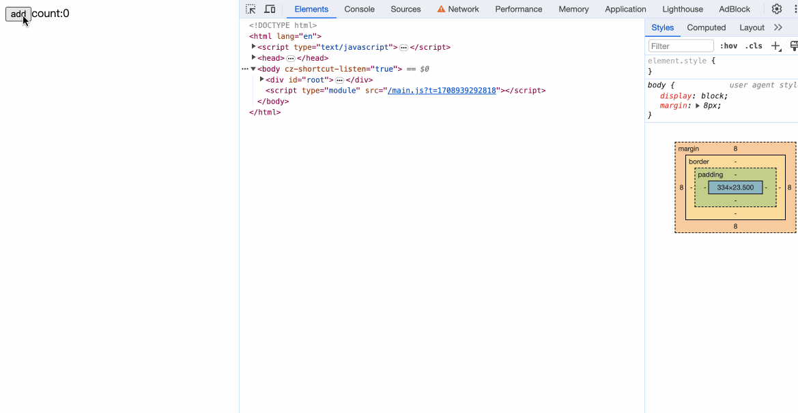

## 特殊block

这是实现模块的最后一章，笔者会带大家编写如何实现一个简单的if逻辑判断。

首先我们需要在原来判断表达式的逻辑里，加上对特殊html标签的判断。
```diff
function parseExpression() {
-   if (match("{")) {
+   if (match("{") && !match('{#')) {
      eat("{");
      const expression = parseJavaScript();
      eat("}");
      return {
        type: "Expression",
        expression,
      };
    }
}
```

添加解析特殊标签的逻辑。
```javascript
function parseFragment() {
    return parseScript() ?? parseElement() ?? parseText() ?? parseExpression() ?? parseBlock();
}
```

parseBlock的具体内容：
```javascript
function parseBlock() {
	if (match('{#')) {
	  if (match('{#if')) {
		eat('{#if')
		skipWhitespace();
		const expression = parseJavaScript();
		eat('}');
		const endTag = '{/if}';
		const block = {
		  type: 'IfBlock',
		  expression,
		  children: parseFragments(() => !match(endTag))
		}
		eat(endTag);
		return block;
	  }
	}
}
```
我们判断在`{#if}{/if}`中的内容为IfBlock。对于里面的内容，继续调用parseFragments进行解析。


完善generate里的traverse方法
```javascript
function traverse(node, parent) {
    switch (node.type) {
      case "IfBlock": {
        const variableName = `if_block_${counter++}`;
        const funcName = `${variableName}_func`;
        const funcCallName = `${funcName}_call`;
        const expressionStr = escodegen.generate(node.expression);
        code.variables.push(variableName);
        code.variables.push(funcName);
        code.variables.push(funcCallName);

		code.create.push(`
        ${funcName} = () => {
          if (${expressionStr}) {
            if (${funcCallName}) {return;}
            ${variableName} = element('span');
          `)
          node.children.forEach(subNode => {
            traverse(subNode, variableName)
          });

        code.create.push(`
          append(${parent}, ${variableName});
          ${funcCallName} = true;
          } else {
            ${funcCallName} = false;
            if (${variableName} && ${variableName}.parentNode) {
              detach(${variableName});
            }
          }
        }
        ${funcName}()
        `);
        
        code.destroy.push(`detach(${variableName})`);
        code.update.push(`${funcName}()`);
        
        break;
      }
    }
}
```

在App.svelte中测试一下
```html
<script>
  let count = 0;
  const updateCount = () => {
    count++;
    console.log('update count', count);
  }
</script>

<button on:click={updateCount}>add</button>
count: {count}
{#if count > 2 && count < 5}hello{/if}
```



缺点：多了一个span标签包裹。

有了parseBlock方法，我们就可以在里面继续添加EachBlock、AwaitBlock等其他特殊标签的解析。

```javascript
addBtn.addEventListener('click', function() {
  text = document.createTextNode('');
  const div = document.createElement('div');
  div.innerHTML = 'hello';
  
  box.appendChild(text);
  box.appendChild(div);
})

removeBtn.addEventListener('click', function() {
  if (text) {
    text.parentNode.removeChild(text.nextElementSibling);
    text.parentNode.removeChild(text);
  }
})
```

## 完整代码
```javascript
import * as fs from "fs";
import { fileURLToPath } from "url";
import { dirname, resolve } from "path";
import * as acorn from "acorn";
import * as escodegen from "escodegen";
import * as prettier from "prettier";
import * as estreewalker from "estree-walker";
import * as periscopic from "periscopic";

const modulePath = dirname(fileURLToPath(import.meta.url));

async function bootstrap() {
  try {
    const inputPath = resolve(modulePath, "./App.svelte");
    const outputPath = resolve(modulePath, "./app.js");
    const content = fs.readFileSync(inputPath, "utf-8");
    const compiledContent = compile(content);
    const prettierContent = await prettier.format(compiledContent, {
      parser: "babel",
    });
    fs.writeFileSync(outputPath, prettierContent, "utf-8");
  } catch (e) {
    console.error(e);
  }
}

function compile(content) {
  const ast = parse(content); // 解析svelte文件内容成ast
  const analysis = analyse(ast);
  return generate(ast, analysis);
}

function parse(content) {
  let i = 0;
  const ast = {};
  ast.html = parseFragments(() => i < content.length);

  return ast;

  function parseFragments(condition) {
    const fragments = [];
    while (condition()) {
      const fragment = parseFragment();
      if (fragment) {
        fragments.push(fragment);
      }
    }
    return fragments;
  }

  function parseFragment() {
    return parseScript() ?? parseElement() ?? parseText() ?? parseExpression() ?? parseBlock();
  }

  function parseScript() {
    skipWhitespace();
    if (match("<script>")) {
      eat("<script>");
      const startIndex = i;
      const endIndex = content.indexOf("</script>", i);
      const code = content.slice(startIndex, endIndex);
      ast.script = acorn.parse(code, { ecmaVersion: 2023 });
      i = endIndex;
      eat("</script>");
      skipWhitespace();
    }
  }

  function parseElement() {
    skipWhitespace();
    if (match("<")) {
      eat("<");
      const tagName = readWhileMatching(/[a-z]/);
      const attributes = parseAttributes();
      eat(">");
      const endTag = `</${tagName}>`;
      const element = {
        type: "Element",
        name: tagName,
        attributes,
        children: parseFragments(() => !match(endTag)),
      };
      eat(endTag);
      skipWhitespace();
      return element;
    }
  }

  function parseAttributes() {
    skipWhitespace();
    const attributes = [];
    while (!match(">")) {
      attributes.push(parseAttribute());
      skipWhitespace();
    }
    return attributes;
  }

  function parseAttribute() {
    const name = readWhileMatching(/[^=]/);
    if (match("={")) {
      eat("={");
      const value = parseJavaScript();
      eat("}");
      return {
        type: "Attribute",
        name,
        value,
      };
    }
  }

  function parseExpression() {
    if (match("{") && !match('{#')) {
      eat("{");
      const expression = parseJavaScript();
      eat("}");
      return {
        type: "Expression",
        expression,
      };
    }
  }

  function parseJavaScript() {
    const js = acorn.parseExpressionAt(content, i, { ecmaVersion: 2023 });
    i = js.end;
    return js;
  }

  function parseText() {
    const text = readWhileMatching(/[^<{]/);
    if (text.trim() !== "") {
      return {
        type: "Text",
        value: text.trim(),
      };
    }
  }

  function parseBlock() {
    if (match('{#')) {
      if (match('{#if')) {
        eat('{#if')
        skipWhitespace();
        const expression = parseJavaScript();
        eat('}');
        const endTag = '{/if}';
        const block = {
          type: 'IfBlock',
          expression,
          children: parseFragments(() => !match(endTag))
        }
        eat(endTag);
        return block;
      }
    }
  }

  function match(str) {
    return content.slice(i, i + str.length) === str;
  }

  function eat(str) {
    if (match(str)) {
      i += str.length;
    } else {
      throw new Error(`Parse error: expecting "${str}"`);
    }
  }

  function readWhileMatching(reg) {
    let startIndex = i;
    while (i < content.length && reg.test(content[i])) {
      i++;
    }
    return content.slice(startIndex, i);
  }

  function skipWhitespace() {
    readWhileMatching(/[\s\n]/);
  }
}

function analyse(ast) {
  const result = {
    variables: new Set(),
    willChange: new Set(),
    useInTemplate: new Set(),
  };

  const { scope: rootScope, map, globals } = periscopic.analyze(ast.script);
  result.variables = new Set(rootScope.declarations.keys());
  result.rootScope = rootScope;
  result.map = map;

  let currentScope = rootScope;
  estreewalker.walk(ast.script, {
    enter(node) {
      if (map.has(node)) {
        currentScope = map.get(node);
      }
      if (
        node.type === "UpdateExpression" ||
        node.type === "AssignmentExpression"
      ) {
        const names = periscopic.extract_names(
          node.type === "UpdateExpression" ? node.argument : node.left
        );
        for (const name of names) {
          if (
            currentScope.find_owner(name) === rootScope ||
            globals.has(name)
          ) {
            result.willChange.add(name);
          }
        }
      }
    },
    leave(node) {
      if (map.has(node)) {
        currentScope = currentScope.parent;
      }
    },
  });

  function traverse(fragment) {
    switch (fragment.type) {
      case "Element":
        fragment.children.forEach((child) => traverse(child));
        break;
      case "Expression": {
        periscopic.extract_names(fragment.expression).forEach((name) => {
          result.useInTemplate.add(name);
        });
        break;
      }
    }
  }
  ast.html.forEach((fragment) => traverse(fragment));

  return result;
}


function generate(ast, analysis) {
  const code = {
    variables: [],
    create: [],
    update: [],
    destroy: [],
  };

  let counter = 1;

  function traverse(node, parent) {
    switch (node.type) {
      case "Element": {
        const variableName = `${node.name}_${counter++}`;
        code.variables.push(variableName);
        code.create.push(`${variableName} = element('${node.name}')`);
        node.attributes.forEach((attribute) => {
          traverse(attribute, variableName);
        });

        node.children.forEach((child) => {
          traverse(child, variableName);
        });

        code.create.push(`append(${parent}, ${variableName})`);
        code.destroy.push(`detach(${variableName})`);
        break;
      }
      case "Text": {
        const variableName = `txt_${counter++}`;
        code.variables.push(variableName);
        code.create.push(`${variableName} = text('${node.value}');`);
        code.create.push(`append(${parent}, ${variableName})`);
        code.destroy.push(`detach(${variableName})`);
        break;
      }
      case "Attribute": {
        if (node.name.startsWith("on:")) {
          const eventName = node.name.slice(3);
          const eventHandler = node.value.name;
          const eventNameCall = `${eventName}_${counter++}`;
          code.variables.push(eventNameCall);
          code.create.push(
            `${eventNameCall} = listen(${parent}, "${eventName}", ${eventHandler})`
          );
          code.destroy.push(`${eventNameCall}()`);
        }
        break;
      }
      case "Expression": {
        const variableName = `exp_${counter++}`;
        const expressionStr = escodegen.generate(node.expression);
        code.variables.push(variableName);
        code.create.push(`${variableName} = text(${expressionStr})`);
        code.create.push(`append(${parent}, ${variableName});`);

        // 更新
        const names = periscopic.extract_names(node.expression);
        if (analysis.willChange.has(names[0])) {
          let condition = `changed.includes('${names[0]}')`;
          code.update.push(`if (${condition}) {
            ${variableName}.data = ${expressionStr};
          }`);
        }
        break;
      }
      case "IfBlock": {
        const variableName = `if_block_${counter++}`;
        const funcName = `${variableName}_func`;
        const funcCallName = `${funcName}_call`;
        const expressionStr = escodegen.generate(node.expression);
        code.variables.push(variableName);
        code.variables.push(funcName);
        code.variables.push(funcCallName);

        code.create.push(`
        ${funcName} = () => {
          if (${expressionStr}) {
            if (${funcCallName}) {return;}
            ${variableName} = element('span');
          `)
          node.children.forEach(subNode => {
            traverse(subNode, variableName)
          });

        code.create.push(`
          append(${parent}, ${variableName});
          ${funcCallName} = true;
          } else {
            ${funcCallName} = false;
            if (${variableName} && ${variableName}.parentNode) {
              detach(${variableName});
            }
          }
        }
        ${funcName}()
        `);
        
        code.destroy.push(`detach(${variableName})`);
        code.update.push(`${funcName}()`);
        
        break;
      }
    }
  }

  ast.html.forEach((fragment) => traverse(fragment, "target"));

  const { rootScope, map } = analysis;
  let currentScope = rootScope;
  estreewalker.walk(ast.script, {
    enter(node, parent) {
      if (map.has(node)) {
        currentScope = map.get(node)
      }
      if (node.type === 'UpdateExpression' || node.type === 'AssignmentExpression') {
        const names = periscopic
          .extract_names(
            node.type === 'UpdateExpression' ? node.argument : node.left
          )
          .filter(
            (name) =>
              currentScope.find_owner(name) === rootScope &&
              analysis.useInTemplate.has(name)
          );
        if (names.length > 0) {
          this.replace({
            type: 'SequenceExpression',
            expressions: [
              node,
              acorn.parseExpressionAt(`$$update(${JSON.stringify(names)})`, 0, {
                ecmaVersion: 2023,
              }),
            ],
          });
          this.skip();
        }
      }
    },
    leave(node) {
      if (map.has(node)) {
        currentScope = currentScope.parent;
      }
    }
  });

  return `
    function element(name) {
      return document.createElement(name);
    }

    function text(data) {
      return document.createTextNode(data);
    }

    function append(target, node) {
      target.appendChild(node);
    }

    function detach(node) {
      if (node.parentNode) {
        node.parentNode.removeChild(node);
      }
    }

    export function listen(node, event, handler) {
      node.addEventListener(event, handler);
      return () => node.removeEventListener(event, handler);
    }
    
    export default function() {
      ${code.variables.map((v) => `let ${v};`).join("\n")}

      let collectChanges = [];
      
      function $$update(changed) {
        changed.forEach(c => collectChanges.push(c));
        lifecycle.update(collectChanges);
      }

      ${escodegen.generate(ast.script)}

      var lifecycle = {
        create(target) {
          ${code.create.join("\n")}
        },
        update(changed) {
          ${code.update.join('\n')}
        },
        destroy(target) {
          ${code.destroy.join("\n")}
        }
      };
      return lifecycle;
    }
  `;
}

bootstrap();
```

## 小结
