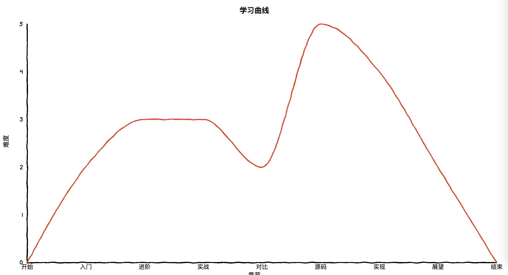

恭喜你，相信经过这段时间的刻苦学习，你又掌握了一门技艺，又在前端旅程上更近一步。

这段时间我总是如履薄冰，生怕自己写的文章会没有读者。但庆幸的是，仍有读者阅读花上自己的宝贵时间，来购买阅读这本小册，在这里鞠躬感谢。这是我写的第一本小册，本着小而精的原则，在介绍一些知识时，我尽可能地把重要的部分讲解到位，而抽离了一些过于细节繁琐的部分。《源码》和《实现》这两章，单拎出来都能写成一本小册，因此也是点到为止。所以，如果觉得小册不够完美，还请读者朋友们包涵。

对于全本小册的难易程度，我采用了螺旋前进式的方式进行讲解，让读者朋友们不会随着文章阅读的深入，渐渐觉得难度过大而力不从心。

很喜欢《山月记》里的一段话：

> 我生怕自己本非美玉，故而不敢加以刻苦琢磨，却又半信自己是块儿美玉，故而又不肯庸庸碌碌与瓦砾为伍。

我之前也不相信自己能够花时间来好好做一件事，虽然我写小册是磨洋工花了几个月，但确实是把它写完了。把心沉淀下来，比心浮气躁急功近利更为宝贵。希望当下和未来的你能够有头顶有月，心中有光！