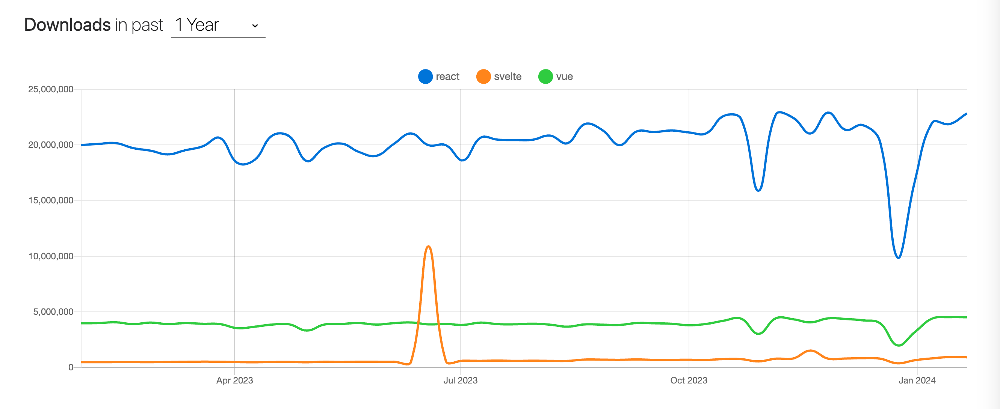

## 是什么

对于国内前端开发者来说，前端框架首选无疑是React和Vue、退而其次是Angular。从本章开始，笔者将和大家一起了解一个不同于React和Vue等以虚拟dom为核心的框架，这个框架在国外的关注程度一度超过了前端框架的龙头React，它就是——Svelte。

Svelte在英文中具有“苗条的，身材修长的”意思，对于刚接触的开发者来说，非常容易与Java的Servlet搞混。Servlet是运行在Web服务器中的小型Java程序，其是JavaWeb的三大组件之一，而Svelte则是一个前端UI框架，更准确地说，Svelte是一个编译器。

### 作者

Svelte起源于[Ractive.js](https://github.com/ractivejs/ractive)，Reactive.js也是由Svelte的创建者开发的。正如我们提到React会想到[Dan Abramov](https://github.com/gaearon)，提到Vue会想到[Evan You](https://github.com/yyx990803)，那Svelte的创建者[Rich Harris](https://github.com/Rich-Harris)，在前端业界也享誉盛名。也许有些开发者不了解Rich Harris是何人，那和webpack齐名的打包工具Rollup便是出自此人之手。除了Rollup之外，Rich Harris还开发了Reactive、Svelte等诸多流行的开源作品，人送外号“轮子哥”。

### 历史

Svelte的第一个版本基本上就是多了一个编译器的Reactive。它继承了 Ractive 的许多相同设计，原因是我们想在《卫报》上使用它，而我们当时正在使用 Ractive，拥有人们非常熟悉的东西是有意义的。Ractive 也有一个现有的社区，我希望一些使用 Ractive 的人能够加入并使用 Svelte。当 Svelte 2 发布时，我们意识到 Ractive 的一些设计决策是错误的，人们的期望发生了一些变化。

所以 Svelte 2 实际上只是一个小小的改进。例如，我们在模板语法中不再使用双花括号，而是使用单花括号，因此这更像是 JSX，并且我们还进行了一些其他类似的修饰性更改。但除此之外，它与 Svelte 1 几乎相同。

Svelte 3 是我们撕毁规则手册的时候，我们开始思考，你知道，我们有一个编译器，我们基本上可以创建我们自己的语言。如果我们要创建最优雅、最实用的方式来描述用户界面，会是什么样子？我不知道我们是否实现了这一目标，但我认为我们已经非常接近了。

  

Svelte “这个名字是由Rich Harris和他在《卫报》的同事们选择的。随着时间的推移，越来越多的开发者开始了解Svelte并对其产生兴趣。到2019年，Svelte已经成为一个成熟的工具，可以构建具有[TypeScript](https://www.wbolt.com/go?_=bc24523fcaaHR0cHM6Ly93d3cudHlwZXNjcmlwdGxhbmcub3JnLw%3D%3D)支持的开箱即用的Web应用程序。

Svelte在构建时将你的应用转换为理想的JavaScript，而不是在运行时解释你的应用代码

  

打包体积，Even You拿vue和svelte对比

  https://github.com/yyx990803/vue-svelte-size-analysis
  
https://github.com/yyx990803/vue-svelte-size-analysis?spm=a2c6h.12873639.article-detail.8.71122eacS8dYWL

https://github.com/halfnelson/svelte-it-will-scale
  

https://svelte.dev/blog/virtual-dom-is-pure-overhead

  

## 怎么样

### 优势

高性能
产物体积小

TODO: 文件大小

|框架名称|react|vue|angular|svelte|
|---|---|---|---|---|
|体积|42k|22k|89.5k|1.6k|

TODO: 重写
    从上述对比中可以看出，svelte的体积很少，虽然其业务代码在编译后会生产较多的代码。**得益于较少的运行时代码。虽然svelte代码的随着业务的编写增量速度比较快，得益于其很小的包体积1.6k，对于一般中小型项目而言，整体运行的代码（编译后的代码+包体积）还是比较小的**，所以可以说svelte项目的代码较小。不过对于大型项目而言，因为svelte随着业务的进行，运行时代码增量陡峭，大型项目体积并不会比react、vue等小,因此需要辩证看待

心智负担低
丰富的特性
上手简单
灵活

**没有虚拟DOM**。Svelte是一个编译器，不使用虚拟DOM，Svelte是一个编译器，在构建时就知道你的应用程序中的东西可能会发生变化，而不是等待在运行时做这些工作。这是Svelte相对于其他任何Web框架的一个非常重要的优势

  

**更少的模板** ：减少你必须编写的代码量是Svelte的一个明确目标。Svelte帮助你以最小的代价构建用户界面，通过实现更好的反应性、绑定和顶层元素等，提高了代码的可读性，我们将在本文后面讨论这些问题

  

容易上手，学习曲线小。如果学过html,css,javascript，即可上手

  
  https://risingstars.js.org/2023/en
  

### 劣势

  

生态不够大

  

编译后的代码逻辑冗余

Rich Harris 大佬的[virtual-dom-is-pure-overhead](https://svelte.dev/blog/virtual-dom-is-pure-overhead)一文中，指出 virtual dom 并非免费的午餐，它也会带来性能和内存上的消耗。例如一个 HelloWorld 的组件，要把 `props`的值进行修改，需要三个步骤：

  

1. 先后两次 virtual dom 要记录下来，对相同的节点进行比较

2. 需要把该节点上所有的属性进行对比，记录下变动的内容

3. 更新真实 dom

  

svelte 则是省去前面两步，直接更新 dom，它是一个 compiler，对已有的组件进行预编译，最终实现的代码。

  

尤大大发推说 vue3 能够比 svelte 更加快

编译产物代码冗余

生态不够成熟
  

npm trends

  

https://npmtrends.com/svelte

  

https://npmtrends.com/react-vs-svelte-vs-vue

关注度：

满意度：

https://github.com/sveltejs/svelte

74k
stateofjs

https://2022.stateofjs.com/zh-Hans/libraries/front-end-frameworks/

## 为什么

不同于虚拟dom的实现方式，开拓我们的视野。提升自己的技术深度。

在小型业务中的性能表现优秀

上手简单

拥抱国际化潮流

## 小结

我们从什么是Svelte，Svelte和React、Vue相比有什么优劣势，以及我们为什么需要学习Svelte这三个方面，初步认识了Svelte这股前端框架新势力。在下一篇章，我们将了解如何安装svelte相关的开发环境和简单的上手使用它。
